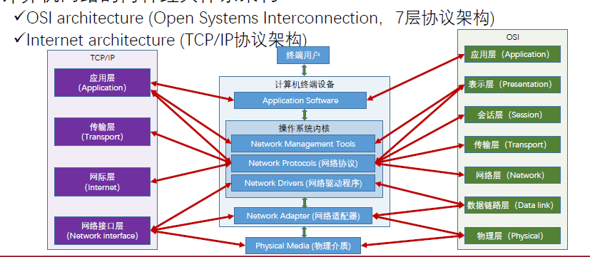
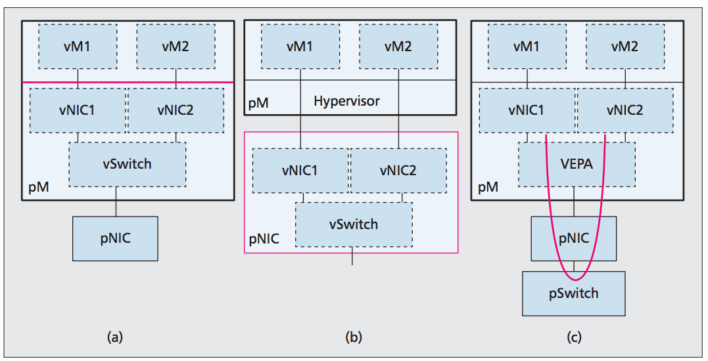

## 3.云计算网络

计算机网络是云计算平台的重要基础设施。

+ 云通过宽带网络向终端提供服务
+ 云本质是分布式系统，各个组件通过网络通信
+ 私有网路隔离实现云服务多租户

1. 计算机网络基础

   + 网络节点

     + 网络终端：位于网络边缘的通信设备
     + 集线器：连接多个终端组成计算机网络，以**广播**的方式传输数据
       + OSI架构的物理层，维护hub table，记录哪些端口连接了终端设备
       + 数据以广播形式传输到所有已经连接的网络终端
     + 交换器：连接多个终端组成计算机网络，可以向**特定终端**传输数据
       + OSI架构的链路层，维护switch table，识别并记录终端的MAC地址
       + 数据根据MAC地址被传输到指定的终端设备，全双工（通信双方可以独立收发数据）
     + 路由器：连接多个计算机网络，在不同网络之间传输数据
       + OSI架构的网络层，维护routing table，识别并记录附近连接网络的ip地址
       + 与其他网络交换数据，起到网关的作用，如果目的地是自身所链接的网络，就接收数据，否则转发数据（到本地接口）（给别的网关）

   + 网络链路

     连接相邻网络节点的物理设备

     + 双绞线：家用网线
     + 同轴电缆：远距离传输
     + 光纤：昂贵，效率距离高
     + 无线：WLAN

   + 网络类型

     网络节点+链路构成计算机网络

     集线器和交换器创建计算机网络：wan，lan

     路由器连接计算机网络：internet

     eg：internet->路由器->交换机->多个EC2

   + 子网

     ip网络的逻辑分区，构建这样逻辑分区的过程叫做子网划分。

     同一子网内的计算机直接互通

     好处：

     + 减轻网络阻塞
     + 网络安全
     + 提高传输效率

     由Network ID来标识和划分，前缀+掩码，掩码决定了子网的网络地址和主机地址，也决定了子网中最大主机数量

     子网掩码的表示方式：255.255.255.0 or /24

     子网划分，全0是子网标识，全1是广播地址

     将原始子网X.X.X.X/24划分为Subnet个子网，主机有host个，subnetMask为/x

   + 计算机网络体系结构

     + 计算机网络组件

       + 终端用户
       + 计算机终端设备
       + 操作系统内核：网络管理工具（接收数据，识别网络协议）、网络协议（打包数据，打开端口，建立连接，监控传输，加密数据）、网络驱动程序（与网络适配器通信）
       + 网络适配器：NIC将电频信号打包成帧，传输到物理介质
       + 物理介质：连接不同终端的媒介

     + 两种经典体系架构

       OSI七层协议结构

       TCP/IP协议结构

       

       每一层表示协议而不是软硬件本身

       应用层：应用/数据传输协议

       表示层：与应用层通信，数据格式转化，压缩，加密

       会话层：建立和管理应用的通信，**身份验证和授权**管理

       传输层：和管理终端之间的连接和数据传输，负责数据分段，流量控制，错误管理，TCP，UDP

       网络层：识别IP地址，组成数据包，建立传输路径，找到最佳路径

       链路层：MAC地址，错误检测

       物理层：数据帧转换为电频信号在物理介质上传输

2. 计算机网络虚拟化

   传输/网络层：（假装多个router）虚拟router，（假的网络结构）覆盖网络，虚拟数据中心/虚拟私有云（划分计算、存储、网络资源）

   链路层：虚拟交换机、bridge

   物理层：虚拟NIC（网卡）（VNIC）

   + 网络适配器的虚拟化：

     每个联网的物理主机有一个网络适配器，所以每个联网的VM要一个虚拟NIC

     + 在hypervisor中实现VNIC和VSwitch（VEB）

       Virtual Bridge

       + 通常一个交换机只有32-128端口，在一个实际的l2网络中不够，因此将多个交换机在链路层桥接，形成包含大量端口的虚拟桥。

     + 在NIC中实现VNIC和Vswitch

     + 在Switch中直接实现VM之间的交互（VEPA）
     
     L3虚拟化
     
     + 实现租户网络隔离和动态分配（覆盖网络（给每个用户假装一个独立网络），虚拟私有云）
     + 一台物理主机中的VM属于不同用户，同一用户的VM可以属于不同物理主机
     + 将不同租户网络隔离，同一用户的VM通过L3网络动态联网

3. 云计算中的虚拟化网络

   + 覆盖网络：构建在原有网络（底层网络）之上的计算机网络，目的是对底层网络逻辑重构，方便网络节点在应用中通信。最初互联网是构建在电话网络之上的覆盖网络

     + 封装：将覆盖网络的包封装在底层网络包中传输，到达目的地再解封，类似l3->l2数据封装

       eg：l2为l3的覆盖网络，给l3的数据包加上mac地址，封装成l2网络的数据帧，利用router将l2网络相互连接lan

     + 隧道协议
       + 使用一种网络协议，将另一个网络协议封装在负载部分
       + 使得数据在不兼容网络上传输，或不安全网络上提供安全路径（VPN）
       + 常见隧道协议：IPSec，GRE，SSH，SOCKS
       + 隧道协议伴随数据加密技术

     + 覆盖网络本质上是使用封装技术，在原有网络基础上构建隧道网络
     + VLAN：对l2网络（lan）逻辑划分隔离形成的虚拟局域网
       + 使用具有VLAN功能的交换机连接主机
       + 在数据包中加入VLAN tag逻辑隔离，标识这个数据包属于这个VALN

     + VXLAN
       + 虚拟隧道端点VTEP：虚拟交换机维护VM的MAC地址到另一个VM的VTEP的IP地址的映射，packet封装解封
       + MAC：主机地址
       + IP：主机地址
       + TCP
       + VXLAN network id：每个虚拟机都不一样
       + 内部：10.0.0.1

   + 软件定义网络（SDN）

     网络传输通过接口，集中动态管理

     分离控制和数据平面的功能，构建全局控制平面（中央控制器）实现整体路由决策

     应用层 控制器 基础设施

     + openSDN：中央控制器直接和数据平面交换信息，控制传输行为.效率最高，有单点失败风险，需要升级到openflow规范
     + SDN by APIs：添加RESTful API，使得传统网络设备可以使用openflow以外的标准被SDN 控制器控制。缺乏对网络流状态的感知和对数据包的检测
     + SDN by Overlays：在hypervisor中实现SDN controller功能，在l3网络上构建l2覆盖网络。效率低，手动配置
     + 云计算中的SDN：VPC，一个独立的隔离的虚拟网络。功能有子网，NAT网关，网络ACL（流量控制）。VPC本身可以被视为一个子网，通过API管理网络，可以在VPC中运行各种云资源，用户连接VPC访问其中的云资源。VPC中的资源通过覆盖网络互相连接。
       + VPC内部的资源通过覆盖网络互相连接，使用VPC encapsulation在底层物理网络上构建覆盖网络，使用mapping service构建路由规则
       + 弹性IP是公网IP，与外网直接通信。没有分配弹性IP的资源通过NAT网关（VPC的统一外网通信
       + VPC的负载均衡，可以视为NAT网关的反向流量控制。NAT网关将VPC中资源的流量汇聚，使用hash传输到外网。负载均衡器接受外网流量，均匀分配到VPC中的资源，通过sharding（分片）算法

4. 数据中心网络拓扑

   数据中心网络是连接数据中心各种资源的关键基础设施，DCN必须**高可扩展**，并且高效**连接海量计算资源**

   + 三层架构（three tier）

     从下往上分别是access layer（tor）接入层，aggregation layer聚合层（汇总流量）， core layer核心层（高性能，不同聚合层传输数据）

     缺点是aggregation层容易成为传输瓶颈，带宽利用率低

   + 胖树（fat tree）

     假设每个交换机有k个端口，每个core交换机连接k个pod，每个pod包含k/2个aggregation交换机和access交换机，(k/2)^2^个服务器，所以最多有k(k/2)^2^个服务器，需要k\*k+(k/2)^2^个交换机

   + DCell