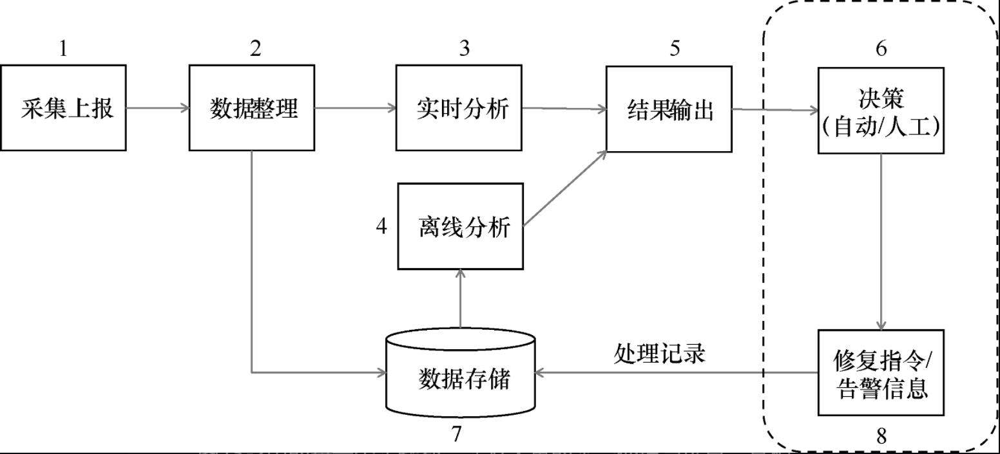

## 云原生产品研发管理

### 软件工程背景看研发管理

云原生技术是针对云上应用设计的，一系列云计算**技术体系**和**软件研发管理方法**的集合

#### 软件工程基础

软件：满足各种需求的人类制造产品。

+ 程序->应用软件->软件服务

+ 软件=程序+软件工程

+ 软件的本质特性：

  复杂性

  不可见性

  易变性

  服从性

  非连续性

+ 软件的非本质特征：

  不同的程序设计语言，软件工具，开发平台

  不同的软件开发流程

  软件团队存在许多不同的角色

  软件可以存储在不同地方

为什么要有软件开发管理？

软件开发历史进程：

1. 软件技术发展早期（1950s-1970s）：业余爱好者

2. 结构化程序和对象技术发展时期：探索阶段，软件成为独立的产品。

   写了再改

   类似硬件

   瀑布模型

3. 从90s到现在，软件工程技术发展新时期：成熟发展，软件工程管理

软件工程目标

+ 用户满意度
+ 可靠性
+ 可维护性
+ 软件流程的质量

软件开发的流程：设计 开发 测试 交付

### 软件工程目标与团队协作的价值

产品经理 项目经理+开发工程师 测试工程师 运维工程师

devops：开发和运维的**文化**，指导不同技术的人员之间沟通，协作，整合，通过**自动化测试和发布**的手段，更快更高质量生产软件。

云原生基础条件：敏捷、CI/CD，SRE，云，微服务，容器

交付流程：

+ 规划

  竞品分析、商业需求、市场需求、产品需求、产品原型、项目管理

  trella jira visualstudio mingle asana

+ 代码

  代码仓库、分支管理、持续集成、持续交付

  github git gitlab bitbucket

+ 构建

  代码提交规范、合并请求、线上编译、代码评审

  maven gradle msbuild golang

+ 测试

  单元测试、安全测试、组件测试、功能测试、系统测试、性能测试、适配性测试

  junit qunit nunit FitNesse

+ 发布

  发布策略、预发布环境、生产环境、制品管理

  puppet CHEF JUJU CFEngine archiva

+ 部署

  部署策略、部署环境

  JUJU RUNDECK ElasticBox armory puppet

+ 维护

  线上监控、舆情反馈、用户反馈

  runscope rollbar logstash vector 阿里云

### 云原生产品代码交付流水线管理

+ iaas：用户可以在云服务提供商提供的基础设施上，部署和运行任何软件，包括操作系统和应用软件。比如阿里云，amazon EC2，azure
+ paas：云服务提供商支持的编程语言，库、服务以及开发工具来创建开发应用程序，并部署在相关的基础设施上。比如GAE
+ saas：使用在云基础架构上运行的云服务提供商的应用程序，比如gmail，google workspace

云原生技术：kubernetes，容器，devops 微服务，服务网格，serverless，不可变基础设施，声明式API

云原生产品：云原生中间件，云原生存储，云原生数据库，云原生大数据，云原生安全，函数计算，容器服务，音视频服务

云原生软件工程目标：

+ 云服务厂商/云基础设施：确保长稳状态的高可用云服务，99.999%
+ 云服务用户/基于云的应用开发：充分利用云原生特性，确保**自身软件服务**高质量

云原生核心技术：

+ kubernetes
+ docker

代码交付流水线

1. 流水线管理

   CI/CD DevOps

   CI：持续集成，频繁的多次将本地代码修改合并到公共代码仓库对应的分支

   + 快速发现错误
   + 防止分支大幅偏离主干

2. PR管理

   集中式版本控制SVN->分布式版本控制git

   Create a merge commit：两个分支的贡献

   Squase and Merge：合并到一个分支当中

   Rebase and merge：搁到目标分支的最新提交之上

   版本控制系统：存储及追踪目标的修改历史，新增、修改、删除

   pull request 自动评审 人工评审 ，允许入库

3. 分支管理

   发布分支，预发布分支，开发分支

4. 质量管理

   质量建设面临的挑战：

   1. 云原生技术门槛高，体系庞大，对技术视野和深度要求高
   2. 引入开源组件多，质量把控要求高（云基础设施视角）
   3. 作为业务底层系统，对稳定性要求极高（云基础设施）

   质量管理——部署管理

   + 蓝绿部署：蓝（稳定）绿（新的）两版本之间切换流量
   + 滚动部署：逐步替代旧版本
   + 灰度（金丝雀）发布：引入新版本但只向一部分用户开放，逐渐增加开放的用户数目
   + A/B testing 测试：对用户分组，多个版本之间比较测试

   质量管理——监控管理

   + 质量的可观测性
     1. 指标metrics：一段时间的聚合数值，存储空间小，可以通过数学建模和预测的方式，观察系统状态趋势，对于问题定位缺乏细节展示。
     2. 日志logging：展现应用运行产生的时间或者程序在执行中产生的日志，可以详细解释系统的运行状态，但是存储查询消耗高。
     3. 跟踪tracing：**面向请求**，直观地看到请求通过分布式系统的整个过程，分析出请求中的异常点，可以采样
   + 监控运维
     + 后端监控
       1. 资源监控
       2. 应用监测
       3. 业务监测（实时访问量等）
     + 分发软件监控
       1. 基础监测（基础环境）
       2. 应用监测（内存使用，程序崩溃）
       3. 业务监测（用户使用时间）

service docker start

service docker stop

docker run [args] cloud_computing/static_site

|              -d               |                   将container置于后台运行                    |
| :---------------------------: | :----------------------------------------------------------: |
| -p local_port:container_port  |               将container 的某个端口映射到本地               |
|              -P               |    将container所有正在监听的端口全部映射到本地的随机端口     |
| -v local_path:contatiner_path | 将本地的local_path文件夹映射到container的container_path文件夹并保持同步 |
|            --name             |                             名字                             |
|             --rm              |                       运行结束自动删除                       |
|              -it              |                          进入shell                           |

docker build -t user-name/image-name .