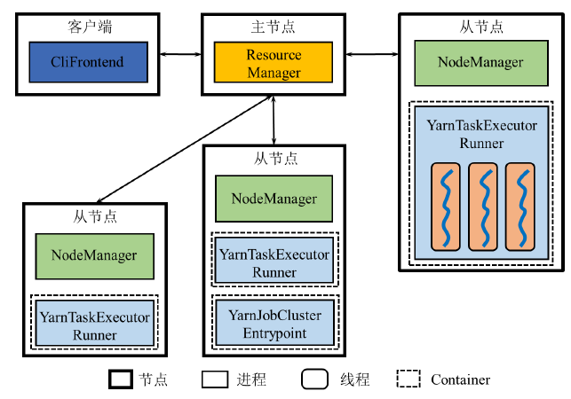

画图题、名词解释，课后题

## 3.MapReduce

### 3.1 设计思想

#### MPI和MapReduce

MPI：并行化编程接口

- 用户编程角度：需要对并行显示表达
- 系统实现角度：以多进程方式，需要用户自己进行进程的故障恢复，没有自带的容错功能

#### 数据模型

键值对

#### 计算模型

Map和Reduce两个过程

有向无环图DAG

### 3.2 体系架构

#### 架构图

JobTracker

- 资源管理：管理系统资源
- 作业管理：将作业拆分成任务，任务调度和进度跟踪

TaskTracker

- 管理本节点资源
- 执行JobTracker命令，操作Task
- 向JobTracker汇报情况

Task：任务执行

Client：提交作业

计算向数据靠拢

#### 应用程序执行流程

### 3.3 工作原理

#### 数据输入

文件按block存储，跨块记录

split：map的读取单位

#### map

为每个split创建一个map任务

#### shuffle

map任务完成率达到阈值后启动reduce

拉取的数据来自已经完成的map任务

#### reduce

reduce任务的数量：比任务槽数目稍微小一些

#### 数据输出

每个reduce任务的输出结果以一个文件形式存储在目录中

### 3.4 容错机制

主节点故障JobTracker：所有作业重新执行

从节点故障TaskTracker：JobTracker接受不到心跳，就把任务分配给其他TaskTracker

Task故障：

- map：重新执行map，从HDFS重新读取数据
- reduce：重新拉取map端的输出文件，一个map任务要将输出全部写入文件之后，reduce任务才可以读取，保证了reduce的容错

**MapReduce 容错和 HDFS 容错是两回事**

### 3.5 编程示例

### 习题

1. mapreduce相比MPI的优势？

   1. 用户方面可以不用显式的执行并行，降低编程难度
   2. 系统方面具有高容错性，提高可靠性

2. MR逻辑计算模型和物理计算模型？

   逻辑计算模型：仅有两个顶点的DAG

   物理计算模型：多个map任务x多个reduce任务并行执行

3. mapreduce的主要部件？作用？

   JobTracker：系统资源管理，分配任务和追踪任务执行情况

   TaskTracker ：节点资源管理，执行JobTracker命令（启动关闭Task），向JobTracker反馈情况

   Task ：执行任务

   Client：提交jar包，

4. 如果不考虑数据的输入和输出阶段，MapReduce工作过程可以划分为哪些阶段？每个阶段的功能？

   - map：将键值对转换为一个或多个键值对，然后按照键排序list[key,value]，partition将数据划分，交给不同的reduce任务

   - shuffle：将多个键相同的键值对写成[key,[...]]的形式，发给reduce任务

   - reduce：把[key,list]转换为[key,value]

     [k1,v1]->list[k2,v2]->[k2,list(v2)]->[k3,v3]

5. Mapreduce和HDFS的关系？

   Mapreduce是Hadoop项目下的分布式计算系统，HDFS是Hadoop下的分布式存储系统

   计算向数据靠拢

6. merge和combine的区别？

   merge是将多个文件合成一个，将溢写到磁盘上的多个文件合成一个大文件，将相同key进行排序，combine是将相同key的几个键值对按照某种规则处理成一个键值对

7. 分布式缓存机制作用？

   1. 在大表和小表自然连接的时候，将小表分布式缓存，避免shuffle的代价，直接在map阶段完成连接
   2. 单个节点宕机时，可以从别的节点获取副本

8. split 和block

   split是逻辑分块，block是物理分块

   split决定map任务的个数，输入格式提供将split中数据解析成键值对的方法

9. 如果只有一个reduce任务崩溃，重启一个reduce任务，从哪里获取数据？

   map任务保存在磁盘上的文件，，否则重启map进程

10. 如果map或reduce任务的缓冲区无限大，是否需要溢写磁盘？

    map需要，容错，reduce任务失败时需要向磁盘读取数据

    reduce不需要

## 4.Spark

### 4.1 设计思想

基于内存计算-> 内外存同时使用

#### mapreduce的局限性

1. 基础算子太少，用户编程复杂
2. map到reduce的中间结果需要先写入磁盘再拉取（因为shuffle）
3. 每一轮mapreduce的过程需要反复读写

#### 数据模型

RDD模型：分布式弹性数据集

- 分布式：数据集的各个分区分散在不同节点上
- 数据集：将文件读取成抽象的数据集
- 弹性：容错

#### 计算模型

多种操作算子

- 创建：从本地内存或外部数据源创建RDD
- 转换：对RDD进行变换
- 行动：标志着转换结束，触发DAG生成

##### 逻辑计算模型

算子角度描述：

RDD变换角度描述：

Spark系统保留 RDD Lineage 的信息，为什么？追踪每个RDD的生成过程，保证容错性

RDD

- 只读：一经创建，不能修改
- 不可变：算子操作是生成新的RDD，不改变旧的RDD

##### 物理计算模型

算子角度

下图有多少个task？每个阶段的每个分区产生一个任务

RDD变换角度

### 4.2 体系架构

#### 架构图

抽象架构图：

- Cluster Manager集群管理器

  Standalone：Master Worker

  Yarn：Resource Manager、Node Manager

- Worker Node

- Executor执行器

  - 工作节点上的一个进程
  - 启动若干个task线程或线程组taskset（mapreduce当中task是进程Child）
  - CoarseGrainedExecutorBackend

- Task

- Driver驱动器

  - 管理作业运行
  - 逻辑上独立于主节点、从节点、客户端
  - 实际上在Client方式与客户端同一进程，在Cluster方式在Worker（从节点）启动一个进程
  - 驱动器中的解析器将用户程序转换成逻辑执行图再到物理执行图（RDD->DAG->stage）

- 实现了资源管理和作业管理的分离

#### 应用程序执行流程

1. 启动driver
2. driver 创建**SparkContext**，向集群管理器申请资源，并分配任务
3. 集群管理器通知工作节点启动Executor，多线程task
4. Executor向driver注册
5. SparkContext构建DAG并进行任务划分，送给Executor-task执行任务

### 4.3 工作原理

#### Stage划分

RDD依赖关系

- 窄依赖：一个或多个父RDD的分区对应一个子RDD的分区
  - map filter union join
- 宽依赖：一个父RDD的分区对应多个子RDD的分区
  - join（使用不同划分函数进行分区的RDD） groupByKey

宽依赖划分在两个stage，窄依赖划分在一个stage。反向解析，遇到宽依赖就断开

为什么将窄依赖尽可能划分在同一个Stage？减少I/O传输成本，不需要shuffle

stage类型：

- ShuffleMapStage
  - 从外部或其他ShuffleMapStage获取输入
  - 以shuffle为输出，shuffle后的数据输入给其他ShuffleMapStage
  - 可以没有
- ResultStage
  - 一个DAG中一定有这个
  - 输出直接产生结果或存储

#### Stage内部数据传输

pipeline（流水线）方式数据传输

- 不需要物化分区到本地磁盘，不用等待其他分区的操作完成（shuffle就需要）
- 后面的操作不需要等待前面操作结束，可以直接开始

#### Stage之间数据传输

shuffle方式传输

两组ShuffleMapTask之间或一组ShuffleMapTask和一组ResultTask之间的数据传输

一组task：一个RDD的多个分区

Shuffle Write：每个task将输出的RDD记录按照分区函数partition，划分并物化到本地磁盘，形成ShuffleblockFile

Shuffle Read：不同partition的task读取相应的ShuffleblockFile（之前多个task吐出来的）

#### 应用与作业

没有shuffle依赖（横向关系）的一组任务：taskset

一个stage：多项窄依赖（纵向、箭头关系）的RDD操作

### 4.4 容错机制

客户端Client：client模式驱动器在client，重新提交；cluster模式不影响

集群管理器

- Master：zookeeper配置多个Master

- Worker：仅影响局部计算，交给别的worker执行

执行器Executor：同worker

驱动器Driver

#### RDD持久化

RDD存储机制：

- 按照置换算法将部分RDD移出内存
- 有部分RDD后续还会被使用

persist(StorageLevel)

cache()=persist(MEMORY_ONLY)

MEMORY/DISK/SER/2：序列化数据、备份到2台机器

#### 故障恢复

重新计算丢失分区

重算过程在不同节点之间可以并行

#### 检查点

前面的不足：linage可能非常长，存在大量宽依赖恢复起来慢、RDD持久化机制保存到集群内机器的磁盘，不完全可靠

检查点机制：写入外部具有容错机制的分布式文件系统

### 4.5 编程示例

#### 词频统计

map和flatMap的区别：map是一行对应一个RDD，flatMap无所谓

flatMap：将输入的词按照空格切分成单词

map：将每个单词映射为（单词，1）

groupByKey：（单词，{1,1,1}）

map：（单词，3）

combine：对每个partition的内容提前执行（单词，{1,1,1}）->（单词，3）

可以把groupByKey+map改成reduceByKey：按键值组合，对所有valueList执行func

#### 关系表自然连接及其优化

map：（key，其他内容）

cogroup：（key，{[表A其他内容]，[表B其他内容]}）

flatMap：将表A列表和表B列表两两组合

优化方案：将小表广播出去，直接在map阶段进行自然连接，避免了大表的shuffle操作

#### 网页链接排名

join：连接同一key的link元组和pagerank值

flatMap：link元组转换为pr/入度数

reduceByKey：同一节点的pr/入度数求和

mapValues：只对value进行处理，代入公式

比起mapreduce的优势：mapreduce每一轮迭代要写入HDFS，spark迭代的RDD数据在内存中

#### K均值聚类

广播聚类中心

map：根据聚类中心计算每个点类别得到（类别，坐标）

cogroup flatmap：（类别，[坐标list]）->（类别，{（横坐标，纵坐标），1}）

reduceByKey map：（类别，{（sum横坐标，sum纵坐标），点个数}）->（类别，聚类中心坐标）

#### 检查点

- 迭代次数达到%5=0时就缓存RDD（防止重复计算），然后写检查点（一个独立的作业）

### 习题

1. 与spark相比，mapreduce有哪些局限性？

   1. 编程复杂，需要用户编写算子
   2. map到reduce中间的shuffle阶段阻塞方式传输，延迟高，磁盘IO开销大
   3. 多个作业衔接IO开销高，需要反复读写HDFS文件系统

2. spark逻辑计算模型和物理计算模型的关系？

   逻辑计算模型是算子对RDD的变换，物理计算模型中每个RDD有多个分区。

3. 什么是RDD Lineage？ 当Lineage较长时，如何加快故障恢复？

   RDD Lineage：Driver中由SparkContext维护的记录RDD转换的DAG，RDD丢失时可以通过Lineage获取信息来重新计算和恢复

   较长或存在较多宽依赖，可以设置检查点，写入外部分布式文件系统

4. Standalone Client 和Standalone Cluster之间的区别？画出架构图

   Client：driver在客户端

   Cluster：driver在工作节点（Worker->DriverWrapper）

5. 如何划分DAG中的stage？

   宽依赖断开，窄依赖在同一stage

6. Spark应用和作业之间存在什么关系？

   应用由一个或多个DAG组成，一个DAG对应一个作业

7. Stage与Task的联系？

   Stage是TaskSet，是Job的基本调度单位

8. Stage内部和之间如何进行数据交换？

   pipeline shuffle

9. RDD持久化和检查点机制的异同？

   RDD持久化是缓存在内存或磁盘里，检查点是写入外部可靠分布式文件系统

   RDD持久化加快计算，检查点只能故障恢复

   RDD持久化在计算过程中，检查点是新开一个作业

10. 广播变量用在什么场景？

    kmeans，小表join大表广播小表（节约内存）

## 5.Yarn

分布式资源管理系统

### 5.1 设计思想

#### 作业与资源管理

作业管理：状态监控，信息汇总，任务调度

资源管理：客户端、主节点、从节点的资源

mapreduce 1.0的缺陷：

1. 作业与资源管理紧密耦合
2. 作业控制高度集中在JobTracker，需要与TaskTracker频繁通信

#### 平台与框架

平台：具有提供资源功能的系统（Yarn）

框架：运行在平台上的系统

运行在Yarn平台上的框架可以将应用或作业映射为Yarn的应用

### 5.2 体系架构

#### 架构图

1. Resource Manager资源管理器

   - Resource Scheduler资源调度器：分配container并调度资源
   - Application Manager应用管理器
     - 应用程序提交
     - 启动ApplicationMaster
     - 监控ApplicationMaster运行状态

2. Node Manager节点管理器

   - 向Resource Manager汇报节点情况和Container状态
   - 接受ApplicationMaster的请求，启动或停止Container

3. Application Master 应用管理（作业管理）

   用户提交应用时产生

   向Resource Manager获取资源

   指挥Node Manager启动或停止任务，监控任务运行状态

4. Container：资源的抽象表示（执行计算）

#### 应用程序执行流程

1. 客户端提交应用程序
2. RM分配container，在container中启动AM
3. AM向RM获取任务所需资源
4. RM分配给AMcontainer资源
5. AM向NM通信，在container中启动工作进程
6. 工作进程向AM汇报情况
7. AM释放资源，关闭

### 5.3 工作原理

#### 单平台多框架

一个资源管理平台运行多个框架

#### 平台资源分配

- RM维护**一个或多个应用队列**，每个队列有一定量资源，同一队列中的应用共享这些资源
- yarn的资源分配对象是应用，应用加入队列，队列中资源是应用可使用的最大资源
- 资源调度解决了如何分配给队列资源和队列中资源如何分配给应用的问题

1. FIFO（先到先得）：只有一个队列，先提交的应用占用集群中所有资源
2. Capacity（层级式队列）：多个队列，占用不同资源，每个队列FIFO
3. Fair（共享队列）：只有一个应用运行时可以占据所有，其他应用提交时可以空出部分资源给新的应用

### 5.4 容错机制

RM：从持久化存储系统中获取恢复信息，部署多个RM，通过Zookeeper协调，保证高可用性

NM：Node上的所有Container运行失败，AM向RM重新申请其他Node的资源来执行任务

AM：重启

Container：重启

### 5.5 典型示例

#### Mapreduce

所有MR任务由JobTracker管理->一个MR任务交给一个MRAppMaster，YarnChild执行map或reduce任务

#### Spark

Cluster模式下，Driver存在在某一个ApplicationMaster上，进行作业管理（生产模式下）

Client模式下，Driver在客户端，AM名为ExecutorLauncher，不管理资源和应用，只负责资源的申请和释放

#### Mapreduce和Spark框架

### 习题

1. 对于MapReduce和Spark而言，应用和作业是否存在区别？

   对于MR来说没区别，对于Spark来说一个应用可以对应多个作业，一个应用对应一个SparkContext，一个作业对应一个DAG

2. Spark架构与Yarn架构在理念设计上的共同点？

   分离应用和资源管理

3. 第二代Hadoop对于第一代的优势？

   引入Yarn，分离作业和资源管理

4. Yarn的主要部件和作用？

   1. RM：资源管理，分配container，启动并监控AM
   2. NM：管理节点资源，向RM汇报节点情况，根据AM启动停止container
   3. AM：运行应用，RM启动AM，AM向NM启动停止container
   4. container：资源的抽象表示

5. container由谁启动停止？

   AM

6. FIFO、Capacity、Fair Scheduler三种调度器的优缺点？

   - FIFO：一个进程独占资源
   - Capacity：如果只有少量进程在运行，会造成空队列资源的浪费
   - Fair：实现复杂

7. AM申请资源的过程？

   1. RM启动AM后，AM将作业切分成若干任务，向RM申请资源
   2. RM给AMcontainer
   3. AM确定任务的资源分配
   4. AM与NM通信，启动container中的任务进程

8. NM是否监控container中的任务执行情况？

   不，AM才监控container

9. AM由谁监控？容错恢复？

   AM由RM监控，Yarn平台的容错恢复是重启进程，运行过程需要由框架自行恢复

10. 为什么引入Yarn之后，MR不能独立运行？

    因为没有JobTracker和TaskTracker，MR不能独自进行作业和资源管理

11. Yarn运行Mapreduce的方式和Client更像还是Cluster更像？

    对于MR，Yarn会启动MRAppMaster管理，对于Spark Cluster，Yarn也会启动AM来管理应用，因此更像Cluster

## 10.Flink

批处理系统，扩充MapReduce算子，引入流水线方式进行数据传输

Dataflow模型，批流融合操作

### 10.1 设计思想

内置迭代算子

#### 数据模型

数据：不间断的、**无界的**连续记录序列，抽象成DataStream**记录集合**

#### 计算模型

DataStream操作算子：

- 类似RDD变换，得到DAG
- 数据源、转换、数据池
- Flink中一个应用对应一个DAG
- 一个操作算子由多个Task来执行

物理计算模型operator DAG：

没有lineage：不用将数据进行分区，流数据是不断流入的你也不知道一共有多少

#### 迭代模型

将迭代部分整体视为一个算子，计算过程仍然是DAG，整个迭代视为一个作业（Spark也是）

### 10.2 体系架构

#### 架构图

抽象架构图：

- Client 客户端

  将用户编写的DataStream程序翻译为逻辑执行图并进行优化，然后提交到JobManager

- JobManager 作业管理器

  逻辑执行图->物理执行图，协调作业执行（任务调度、协调检查点、故障恢复）

  StandaloneSessionClusterEntrypoint

  Standalone模式下还负责Flink的资源管理

- TaskManager 任务管理器

  执行JobManager分配的任务

  读取数据、缓存数据，进行数据传输

  TaskManagerRunner

  Standalone模式下还负责所在节点的资源管理（TaskSlot是资源单位）

Standalone架构图：

Yarn模式架构图：

两种模式：作业运行模式指的是一个作业映射为一个Yarn；应用运行模式指的是一个应用映射为一个Yarn

Yarn的作用：将资源管理、作业管理、任务执行进行了分离

#### 应用程序执行流程

Standalone模式下：

1. 客户端解析用户编写的程序，将作业交给JobManager
2. JobManager将任务分解交给各个TaskManager
3. TaskManager执行任务

提交方式

1. Attached：客户端和JobManager保持连接，可以获取关于应用程序执行的信息
2. Detached：客户端与JobManager断开连接，无法获取

Yarn模式下：

1. 客户端解析用户编写的程序，jar包提交给HDFS
2. 向RM申请，RM确定启动AM的节点
3. AM所在节点的NM下载jar包
4. NM启动AM
5. 客户端解析作业描述给AM
6. AM向RM注册，客户端可以通过RM查看资源使用情况，AM分解任务，向RM申请资源
7. RM以container形式向AM分配资源
8. AM确定资源分配方案，问NM要实际的资源
9. NM在container中启动工作进程
10. 工作进程向AM汇报状态

### 10.3 工作原理

#### 逻辑执行图的生成与优化

逻辑执行图=DAG

Chaining优化：将窄依赖的算子们合并成一个大算子

#### 物理执行图的生成与任务分配

根据算子的并行度将逻辑->物理

物理执行图中一个节点表示一个任务Task

一个TaskManager可以包括一个或多个任务槽

根据任务槽（TaskSlot）的容量，将存在数据传输关系的算子实例放在同一个任务槽，保证**数据传输的本地性**

#### 非迭代任务间的数据传输

Spark：不同stage任务之间进行shuffle数据传输，阻塞式

Flink：不同TaskManager任务之间采用流水线，把计算结果传入buffer，满了就向下游task发送

#### 迭代任务内部的数据传输

迭代算子：

- 嵌套在DAG中的一个整体
- 存在数据反馈的环路
- 迭代前端和迭代末端两类特殊的任务，成对处于同一个TaskManager，末端的输出可以作为前端的输入
- 流失迭代的特征：每一轮迭代**部分结果**向后传递，另一部分作为下一轮迭代的输入；迭代前端得到的数据并不依赖于上一轮的所有结果
- 流水线方式传输

### 10.4 容错机制

#### 状态管理

状态：一种特殊的数据结构，保存操作算子的计算结果

状态管理：

- 算子所在的task发生故障，内存中的算子内部数据丢失，需要将数据写入可靠存储设备
- 交给系统而不是用户程序

有状态算子：保留已经处理记录的结果，影响后续处理：window、sum

无状态算子：只考虑当前处理的记录：map

容错：

- 算子级别的容错：保存运行状态，发生故障时**重置状态**，继续处理尚未保存结果的**记录**
- DAG级别的容错：同一时刻将所有算子的状态保存为检查点，要求所有节点的物理时钟绝对同步（不可能）

#### 非迭代计算过程中的容错

已经处理完毕的记录：已经经过了所有算子

正在处理的记录

尚未处理的记录

同一时刻保存到检查点：区分已经处理完毕的和后两种

Chandy Lamport 算法 ：分布式系统中用于保存系统状态

异步屏障快照（ABS）：

- 所保存的快照就是检查点
- 在输入数据中注入屏障，异步地保存快照
- 可以使同一时刻保存所有算子状态到检查点
- 一个任务收到来自上游任务的所有标识为n的屏障后，才保存其状态
- 异步：接收到所有标识为n的屏障后（将标识为n的屏障对齐后），在快照生成的过程中可以继续接受n+1的数据。同一时刻中，系统中的不同任务可以保存不同检查点的状态
- 发生故障时，选择最近完整的检查点n，将每个算子的状态重置为检查点中保存的状态，要求**数据源**具备一定的记忆功能

#### 迭代计算过程中的容错

反馈环路中的所有记录 需要以日志形式保存起来

### 10.5 编程示例

#### 词频统计

输入：来自套接字的文本

输出：

- 每个单词的出现次数
- 每个单词和频数占一行，单词和频数空格分割

分词：

- flatMap x y->x,y 一行映射成多行
- map x->[x,1] 一行映射成一行

计数：

- keyBy 按照key分组[x,1]放在一起
- sum多个[x,1]->[x,n]
- print

Flink：每处理一条数据更新一次输出结果，直到数据源停止输入

Spark：直接输出最终结果

#### 斐波那契数列

输入：来自套接字的字符标识符（用于区分不同的数列）以及斐波那契数列的前两个数字

输出：（字符标识符，a_i）

- 计算出𝐹𝑛并给𝐹𝑛−2打上标记（flatMap）
- 将𝐹𝑛和 𝐹𝑛−1作为下一轮迭代的输入（filter）
- 将𝐹𝑛−2作为输出向后传递（filter、map）

#### 支持容错的词频统计

每秒保存一个检查点

启用检查点机制
enableCheckpointing（interval）

设置检查点的最大并发数
setMaxConcurrentCheckpoints（maxConcurrentCheckpoints）

设置状态存储的方式
setStateBackend（backend）

### 习题

1. flink采用何种方式表示数据？与mapreduce和spark有何区别？

   flink：dataStream（流数据，无界）

   mapreduce：键值对

   spark：RDD

2. standalone模式下flink架构有哪些部件，每个部件的作用？

   client：将逻辑执行图优化，交给JM

   JobManager：切分task，启动taskmanager，生成物理执行图，任务调度、检查点、故障恢复、资源管理

   TaskManager：执行task，读取数据、缓存数据，和其他节点数据传输，节点的资源管理

3. standalone模式下，JM TM的功能和spark的Master和Worker功能是否一致？

   不一致，JM和TM都是资源管理和作业管理，Master和Worker都是资源管理（ResourceManager）

   JobManager比较像Driver，TaskManager比较像Executor

4. Standalone模式下，同一TaskManager可能会同时执行不同应用的任务，会产生应用间的干扰，Yarn如何解决了这个问题？

   作业和资源管理没有分离，一个AM运行一个应用，互不干扰

5. Flink中的逻辑执行图和物理执行图如何产生？与Spark有何区别？

   Client将用户程序解析为逻辑执行图，优化是合并窄依赖的算子

   JobManager将逻辑执行图转换为物理执行图，是根据各算子的并行度来进行的

   Spark由Driver生成，划分stage

6. flink非迭代任务之间如何进行数据传输？与Spark Storm有何区别？

   流水线，非阻塞，粒度是缓冲区

7. 异步屏障快照的功能？

   给数据中添加屏障n n+1 n+2，当一个任务收到所有来自标识n的屏障后，保存状态到快照，所有任务都保存之后形成检查点n

8. flink中的迭代算子如何实现数据反馈？

   迭代前端和迭代末端，迭代末端的输出为迭代前端的输入，迭代末端一部分输入流入迭代前端，另一部分作为输出向后传递（通过tag filter来区分）

9. 如果flink系统不进行状态处理会造成哪些缺陷？

   状态是保存算子计算结果的数据结构，状态就相当于检查点，系统根据前一时刻保存的算子状态对故障进行恢复，如果不进行状态处理需要从头开始计算，因为是数据流所以无法实现。

10. MemoryStateBackend和FsStateBackend两种状态存储方式哪一种更加适合实际生产环境？

    前者写入JobManager内存，后者写入HDFS文件系统，后者更适合因为内存有限且有可能数据丢失。，HDFS相比之下更可靠

11. Flink为何无法像Spark那样利用Lineage进行数据恢复？

    spark是静态数据，故障发生时应该是计算到某一个特定节点；但是flink是动态数据，每个节点都有数据进行计算，所以无法知道发生故障时每个节点的准确状态。

所有图：

- MapReduce

  - 架构图

    client（runjar） jobtracker tasktracker task（maptask、reducetask）

- Spark

  - 架构图

    driver ResourceManager Executor task

  - operator DAG和RDD Lineage
  - shuffle write 和shuffle read
  - Standalone架构图
    - client： Master worker CoarseGrainedExecutorBackend SparkSubmit 
    - cluster： DriverWrapper

- Yarn

  - 架构图

    ResourceManager NodeManager ApplicationMaster

  - MapReduce

  - Spark

- Flink

  - 架构图
  - operator DAG
  - Standalone架构图
  - Yarn架构图

  