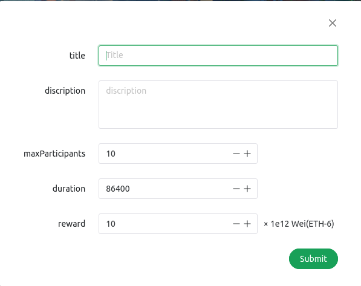
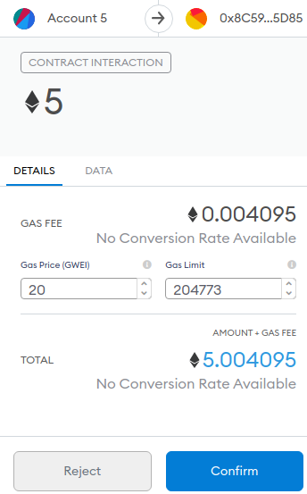

| **课程名称**：区块链与分享型数据库     | **年级**：  大三        | **上机实践成绩**：      |
| -------------------------------------- | ----------------------- | ----------------------- |
| **指导教师**：张召                     | **姓名**：  彭一珅      | **学号**：  10215501412 |
| **上机实践名称**：基于区块链的投票系统 | **实践日期**：2024.6.23 |                         |
| **上机实践编号**：                     | **组号**：              | **上机实践时间**：      |

## 一、实验目的

编写智能合约，实现基于区块链的投票系统。参考petshop实验，通过web3和ganache、truffle等工具完成前端界面、合约编写、区块链部署（前端不做过多要求，可使用vue、react等前端框架完成）

## 二、实验任务

#### 发起投票

- 发起投票会向部署合约的账户支付一定金额
- 不同用户发起的投票独立，其他用户可选择（如在前端列举出所有进行中的投票，或每个投票活动有唯一的标识，用户可通过该标识加入投票）
- 投票可设置结束规则，规则自拟，如超过一定时间结束、参与人数达到一定人数结束等
- 已结束的投票无法加入
- 设置赢取投票的奖励，如一定的币

#### 加入投票

- 加入投票需要支付一定金额给发起投票的人
- 加入投票后无法进行投票
- 赢得投票后可获得奖励

#### 投票

- 用户可投票，投票不消耗币

## 三、实验环境

Windows11

Ubuntu20.04

go1.15.7

node v14.19.0

solidity 0.8.25+commit.b61c2a91.Linux.g++

Geth Version: 1.13.14-stable

## 四、实验过程

### 1.编写智能合约

在dserver文件夹下是整个项目的后端，是基于区块链智能合约实现的。在实验给出的demo中，已经写好了Migrations.sol和ArtComission.sol，作为艺术作品出售项目的后端。

#### Voting.sol

仿照ArtCommission.sol实现Voting.sol智能合约。主要包括创建投票、参与投票、给参与者投票、结束投票四个主要功能，此外，还实现了一些方便前端获取合约状态的接口。

##### 投票信息

以下结构体表示一个投票，其中包括投票的标题、创建者、描述、结束时间、最多投票人数、实际投票人数、投票获胜者的奖励（单位是Wei）、投票是否已经结束等属性，并用一个address的数组记录参与者的id，也就是投票的所有选项。用三个映射分别记录每个候选人的得票数目、已经投过票的用户、参与投票的用户。

```solidity
struct Vote {
        string title;
        address initiator;
        string description;
        uint256 endTime;
        uint256 maxParticipants;
        uint256 reward;
        bool isEnded;
        address[] candidates;
        mapping(address => uint256) votes;//票数
        mapping(address => bool) hasVoted;//投票者
        mapping(address => bool) isCandidate;//参与者
        uint256 participantCount;
    }
```

此外，由于存在mapping映射的结构体不可以作为solidity方法的返回值，因此重新构建一个结构体VoteInfo，这个结构体不存在映射关系，可以作为后面getAllVotes方法的返回值类型。

```solidity
    struct VoteInfo {
        uint256 voteId;
        string title;
        address initiator;
        string description;
        uint256 endTime;
        uint256 maxParticipants;
        uint256 reward;
        bool isEnded;
        address[] candidates;
        uint256 participantCount;
    }
```

##### 创建投票

创建投票的功能是通过新建一个vote结构体，存储在智能合约中实现的。

```solidity
function initiateVote(string memory _title, string memory _description, uint256 _duration, uint256 _maxParticipants, uint256 _reward) external payable {
        require(msg.value == _reward, "Reward amount must be sent with the transaction");//在创建投票的时候，需要将投票将会给予的reward以比特币的方式交易给智能合约，这样合约才可以有足够的余额发放reward
        
        voteCount++;
        uint256 voteId = voteCount;//投票id就是当前合约内创建的投票数目
        
        Vote storage newVote = votes[voteId];//创建一个新的投票结构体
        newVote.title = _title;
        newVote.initiator = msg.sender;
        newVote.description = _description;
        newVote.endTime = block.timestamp + _duration;
        newVote.maxParticipants = _maxParticipants;
        newVote.reward = _reward;
        newVote.isEnded = false;
        newVote.participantCount = 0;

    }
```

##### 参与投票

参与投票的用户需要经过多重检查条件，参与投票的用户不能是曾经给别的用户投票过，并且也不能重复参与投票。此外在参与投票的时候进行一个投票是否结束的检查。如果符合条件，将用户加入到候选人列表candidates里面，并且给投票的发起者转账1 比特币

```solidity
function addCandidate(uint256 _voteId) external payable {
        Vote storage v = votes[_voteId];
        require(v.initiator != address(0), "Vote does not exist");
        require(block.timestamp < v.endTime, "Vote has ended");
        require(!v.isEnded, "Vote is already ended");
        require(v.hasVoted[msg.sender] == false, "You have already voted");
        require(!v.isCandidate[msg.sender], "You are already a candidate");
        require(msg.value == 1 ether, "1 ether is required to join as a candidate");
        if (block.timestamp >= v.endTime || v.participantCount >= v.maxParticipants) {
            endVote(_voteId);
        }
        else{
            v.candidates.push(msg.sender);
            v.isCandidate[msg.sender] = true;
            payable(v.initiator).transfer(msg.value);//转账1比特币给发起者
        }
        
    }
```

##### 给参与者投票

投票行为也要经过多重检查，require语句如果报错，可以在前端的console中显示后面的报错信息message。投票的参与者不能投票，已经投过票的用户也不能进行重复投票。投票时，给候选人的得票数+1，然后记录已经投过票的用户id。

```solidity
function vote(uint256 _voteId, address _candidate) external {
        Vote storage v = votes[_voteId];
        require(v.initiator != address(0), "Vote does not exist");
        require(block.timestamp < v.endTime, "Vote has ended");
        require(!v.isEnded, "Vote is already ended");
        require(v.hasVoted[msg.sender] == false, "You have already voted");
        require(v.isCandidate[_candidate], "Candidate does not exist");
        require(!v.isCandidate[msg.sender], "Candidates cannot vote");

        v.votes[_candidate]++;
        v.hasVoted[msg.sender] = true;//记录已经投过票的用户
        v.participantCount++;

        if (block.timestamp >= v.endTime || v.participantCount >= v.maxParticipants) {
            endVote(_voteId);//如果投票人数达到原先设置的人数，或者到达截止时间，则结束投票
        }

    }
```

##### 结束投票

结束投票方法不会在前端被直接调用，而是在加入投票和投票这两个方法执行时，根据检查条件判断是否被调用。结束投票的时候，首先确定得票数最多的用户，如果没有平票的情况，并且获胜者不是投票的创建者，则可以发放奖励。

```solidity
function endVote(uint256 _voteId) public {
        Vote storage v = votes[_voteId];
        require(v.initiator != address(0), "Vote does not exist");
        require(block.timestamp >= v.endTime || v.participantCount >= v.maxParticipants, "Vote has not ended yet");
        require(!v.isEnded, "Vote already ended");
        
        v.isEnded = true;

        address winner;
        uint256 maxVotes = 0;
        uint256 numMaxVotes = 0;

        // 确保候选人列表不为空
        require(v.candidates.length > 0, "No candidates in the vote");
				//确定得票数最多的用户
        for (uint256 i = 0; i < v.candidates.length; i++) {
            address candidate = v.candidates[i];
            if (v.votes[candidate] > maxVotes) {
                maxVotes = v.votes[candidate];
                winner = candidate;
                numMaxVotes = 1;
            } else if (v.votes[candidate] == maxVotes) {
                numMaxVotes++;
            }
        }

        //如果投票的胜者只有一个，并且胜者不是创建投票的用户，则发放奖励
        if (numMaxVotes == 1 && winner != address(0)) {
            require(address(this).balance >= v.reward, "Not enough balance in the contract");// 确保合约有足够的余额支付奖励
            payable(winner).transfer(v.reward);
        }

    }
```

##### 相关接口

getAllVotes的作用是返回给前端当前合约中存在的所有投票的信息，可以让VoteList组件将投票的信息列在页面上。这个方法给出了onlyActive选项，如果这个选项的值设为true则只列出isEnded值为false的投票信息。

```solidity
function getAllVotes(bool onlyActive) external view returns (VoteInfo[] memory) {
        uint256 count = 0;
        for (uint256 i = 1; i <= voteCount; i++) {
            if (!onlyActive || !votes[i].isEnded) {
                count++;
            }
        }

        VoteInfo[] memory voteArray = new VoteInfo[](count);
        uint256 index = 0;
        for (uint256 i = 1; i <= voteCount; i++) {
            if (!onlyActive || !votes[i].isEnded) {
                Vote storage v = votes[i];
                voteArray[index] = VoteInfo({
                    voteId: i,
                    title: v.title,
                    initiator: v.initiator,
                    description: v.description,
                    endTime: v.endTime,
                    maxParticipants: v.maxParticipants,
                    reward: v.reward,
                    isEnded: v.isEnded,
                    candidates: v.candidates,
                    participantCount: v.participantCount
                });
                index++;
            }
        }
        return voteArray;
    }

```

getVote是投票详情页VoteDetail用到的，返回特定voteID的投票信息。

```solidity
    function getVote(uint256 _voteId) external view returns (VoteInfo memory) {
        Vote storage v = votes[_voteId];
        require(v.initiator != address(0), "Vote does not exist");
        return VoteInfo({
            voteId: _voteId,
            title: v.title,
            initiator: v.initiator,
            description: v.description,
            endTime: v.endTime,
            maxParticipants: v.maxParticipants,
            reward: v.reward,
            isEnded: v.isEnded,
            candidates: v.candidates,
            participantCount: v.participantCount
        });
    }
```

此外还可以查询特定用户在特定投票中的得票数：

```solidity
function getVotes(uint256 _voteId, address _candidate) external view returns (uint256) {
	return votes[_voteId].votes[_candidate];
}
```

#### 2_deploy_voting.js

```js
const Voting = artifacts.require("Voting");

module.exports = function (deployer) {
  deployer.deploy(Voting);
};

```

执行命令`truffle migrate`，会执行2_deploy_voting.js中编写的代码逻辑，从而编译Voting.sol，在build/contracts目录生成Voting.json，`bash migrate.sh`命令则是将Migrations.json和Voting.json复制到前端的assets/contracts目录下，使得前端可以根据智能合约所部署的地址，调用智能合约里的接口。

### 2.前端代码实现

dclient目录下是整个项目的前端，是基于Vue3实现的。在src文件夹下包含前端的源码和调用的静态资源。

前端的项目结构是用App.vue调用views里面的视图组件，在`router/index.js`文件中，将路由路径修改为VoteList.vue就可以实现。此外，将投票详情页面设置为按照投票id进行跳转的路由页面。

```js
const routes = [
    {
        path: '/',
        name: 'main',
        component: VoteList
    },
    {
        path: '/vote/:id',
        name: 'vote',
        component: VoteDetail
    },
]
```

这样，在App.vue组件的路由部分就可显示VoteList.vue的内容：

```html
    <router-view v-slot="{ Component }" :key="router.currentRoute.value.fullPath">
      <keep-alive>
        <component :is="Component"></component>
      </keep-alive>
    </router-view>
```

#### VoteList.vue

按照原始ArtComission的模板编写VoteList.vue。

首先修改合约连接的部分，调用刚刚从dserver复制过来的Voting.json文件，里面包含智能合约的部署地址，二进制文件（abi、bin等）

```js
// 初始化合约以及连接MetaMask
const contract = require('@truffle/contract')
const voting = require('../assets/contracts/Voting.json')
const VotingContract = contract(voting);
VotingContract.setProvider(window.ethereum)
```

##### 获取合约状态

首先调用合约的`getAllVotes`方法，获取当前合约中存储的所有投票的信息：

```js
const votings = ref([])
const loadPostedData = () => {
  VotingContract.deployed().then((instance) => {//instance表示合约
    let res = instance.getAllVotes.call(false);//调用方法使用.call()
    return res
  }).then((response) => {//response是getAllVotes方法的返回值，一个objects的列表
    votings.value.length = 0
    for (let i = 0; i < response.length; i++) {
      let comission = response[i]
      let date = new Date(comission.endTime * 1000)
      let formattedDate = date.toISOString().slice(0, 19).replace('T', ' ')//将timestamp转换为date形式，表示投票的截至时间
      votings.value.push({
        title:comission.title,
        isEnded:comission.isEnded,
        reward:comission.reward,
        endTime:formattedDate,
        description:comission.description,
        initator:comission.initator,
        maxParticipants:comission.maxParticipants,
        voteId:comission.voteId,
        candidates:comission.candidates,
        participantCount:comission.participantCount,
        img: '../assets/logo.png',
      })
    }
  }).catch((err) => {
      console.log(err.message);
  });
}
loadPostedData()
```

loadPostedData在组件挂载时被调用，可以在网页上显示出所有投票的信息。

在template部分，用components/Card.vue来展示这些信息。

首先导入这个组件：

```js
import CardVue from '@/components/Card.vue';
```

然后将需要展示的内容以props的形式传入到子组件：

```html
<div class="content-container">
  <n-grid :x-gap="12" :y-gap="8" :cols="4">
    <n-gi v-for="comission in votings" :key="comission.voteId">
      <CardVue :title="comission.title" :endTime="comission.endTime" :reward="comission.reward"
               :img="comission.img" @click="purchase(comission)"></CardVue>
    </n-gi>
  </n-grid>
</div>
```

其中CardVue标签表示Card.vue子组件，将title、endTime、reward、img传入到子组件进行展示，而@click绑定了一个点击事件，在点击这个投票信息的时候，可以跳转到投票详情界面。此处的purchase是根据原始模板的purchase方法进行修改。最后展示效果如下：


##### 点击投票跳转

点击投票跳转的功能使用purchase方法实现，只需要调用Vue3的useRouter接口，然后进行router.push到指定页面即可，根据id跳转的流程已经在router.js当中定义完毕

```js
const router = useRouter();
const purchase = (comission) => {
    router.push({ name: 'vote', params: { id: comission.voteId }})
}
```

这样跳转到VoteDetail界面的时候，网址会进行如下变动，将投票id加入到url参数当中，此处的voteId是按照solidity中逻辑，按照从1开始的规则编号。


##### 发起投票

通过点击页面上的create a vote按钮可以发起一次投票，此处页面上会展示一个弹窗，提示用户输入投票的相关信息，其中duration指投票持续时间，以秒为单位，reward以比特币为单位。



用一个表单（form）展示这些信息。以下是其中一个表单元素（input框）的代码，`v-model:value="post_comission.title"`表示这个input框里的内容会被当做投票的title传输到后端智能合约。

```html
<n-form ref="formRef" :model="post_comission" label-placement="left" label-width="auto"
                    require-mark-placement="right-hanging">
  <n-form-item label="title" path="inputValue">
    <n-input v-model:value="post_comission.title" placeholder="Title" />
  </n-form-item>
  ......
</n-form>
```

在点击submit的时候，调用postSubmit方法：

```js
const postSubmit = () => {
    VotingContract.deployed().then(async (instance) => {
        const accounts = await ethereum.request({ method: 'eth_requestAccounts' })
        const account = await accounts[0]//获取当前MetaMask账户的id
        instance.initiateVote(//调用initiateVote方法，不需要使用call()，因为这个方法没有view修饰符
            post_comission.title, post_comission.description, post_comission.duration,
            post_comission.maxParticipants, Web3.utils.toWei(post_comission.reward.toString(), 'ether'), { from: account,value: Web3.utils.toWei(post_comission.reward.toString(), 'ether') }
        )//传输相关参数，除了solidity中方法要求的5个投票相关信息的参数以外，也要将账户的id和投票奖励的reward传递给智能合约，这样才能在投票结束时正确发放reward
    }).then((response) => {
        init_post_comission()
        loadPostedData()//重新加载
        postModalFlag.value = false
    }).catch((err) => {
        alert('error', err.message)
        console.log(err.message);
    });
}
```

#### VoteDetail.vue

VoteDetail.vue的作用是展示投票的详情，包括展示候选人、投票按键以及得票数量等


##### 展示投票信息

template部分的代码包括一个n-card，以列表的形式展示详细信息：

```html
<n-card>
  <n-space vertical>
    <n-text>Vote ID: {{ voteInfo.voteId }}</n-text>
    <n-text>Title: {{ voteInfo.title }}</n-text>
    ......
    <n-button type="primary" @click="joinVote">Join</n-button>
  </n-space>
</n-card>
```

其中，`Vote ID: {{ voteInfo.voteId }}`表示在此处展示的信息为voteInfo这个Object里的voteId这个属性。voteInfo是通过智能合约的`getVote`接口获取到的。获取流程如下：

```js
const fetchVoteInfo = async () => {
  VotingContract.deployed().then((instance) => {
    let res = instance.getVote.call(voteId);//调用getVote方法
    return res
  }).then((vote) => {
    let date = new Date(vote.endTime * 1000)
    let formattedDate = date.toISOString().slice(0, 19).replace('T', ' ')
    voteInfo.value = {
      title: vote.title,
      isEnded: vote.isEnded,
      reward: Web3.utils.fromWei(vote.reward, 'ether'),
      endTime: formattedDate,
      description: vote.description,
      initiator: vote.initiator,
      maxParticipants: vote.maxParticipants,
      voteId: vote.voteId,
      candidates: vote.candidates,
      participantCount: vote.participantCount,
      img: '../assets/logo.png',
    };
    for(let i=0;i<vote.candidates.length;i++){
      VotingContract.deployed().then((instance) => {
        let res = instance.getVotes.call(voteId, vote.candidates[i]);//调用getVotes方法，获取特定投票id下每个候选人的票数
        return res
      }).then((response) => {
        votes[vote.candidates[i]]=response
      }).catch((err) => {
        console.error("Error fetching vote info:", err);
      });
    }
    candidateVotes.value=votes
  }).catch((err) => {
    console.error("Error fetching vote info:", err);
  });
}
```

##### 投票功能

投票功能是通过调用智能合约的vote方法实现的。

```js
const vote = async (candidate) => {
  VotingContract.deployed().then(async (instance) => {
    const accounts = await ethereum.request({ method: 'eth_requestAccounts' })
    const account = await accounts[0]
//获取投票人id
    instance.vote(
      voteId, candidate, { from: account }
    )
//将投票人id传给智能合约，不需要添加value，因为投票不需要消耗比特币
  }).then((response) => {
    fetchVoteInfo();
    methodThatForcesUpdate()
  }).catch((err) => {
    // alert('error', err.message)
    console.log(err.message);
  });
};
```

##### 加入投票功能

加入投票时需要消耗比特币，调用addCandidate方法来实现。

```js
const joinVote = async () => {
  VotingContract.deployed().then(async (instance) => {
    const accounts = await ethereum.request({ method: 'eth_requestAccounts' })
    const account = await accounts[0]
//获取账户
    instance.addCandidate(
      voteId, { from: account, value: Web3.utils.toWei('1', 'ether') }
    )//加入投票需要向创建投票的人交付1比特币的价钱

  }).then((response) => {
    fetchVoteInfo();
    methodThatForcesUpdate()
  }).catch((err) => {
    console.log(err.message);
  });
```

然后给join按键和vote按键绑定两个点击事件，调用这两个方法即可。

### 3.运行方法

首先后台启动ganache，弹出窗口后点击quickstart，自动生成10个比特币余额为100的账户

```bash
./ganache-2.5.4-linux-x86_64.AppImage &
```

然后编译并将合约部署到ganache网络上，可以看到默认使用了第一个账户，消耗了一些比特币并且tx count的值变成了4（交易数）

```bash
truffle migrate
```

将部署好的合约json文件迁移到dclient文件夹下，从而使前端可以访问智能合约：

```bash
bash migrate.sh
```

在使用npm install下载好所需的包之后，可以启动前端服务器

```bash
npm run serve
```

此时打开网页localhost:8080就可以看到投票系统了

##### 使用演示

首先点击右下角create a vote按钮，弹出创建投票的表单：


输入投票的基本设置，其中maxParticipants设置为2表示当投票人数达到2人时，投票自动结束。


此时智能合约会按照reward数来要求付款，此处向设置投票的用户收取5比特币



点击confirm提交交易之后，刷新页面出现一个新的投票


点击进入投票详情页面，可以看到vote ID是2，也就是发起的第二个投票，Is ended是false，投票暂时没有结束。


点击下方的join按钮，加入两个候选人，然后给其中一个候选人投2票


投票后界面如下所示，is ended自动变成了true，并且加入投票的第二个用户获得了5比特币的奖励。


## 五、实验总结

本次实验通过编写智能合约并结合前端开发，成功实现了一个基于区块链的投票系统。实验过程中，我掌握了区块链智能合约的编写和部署方法，熟悉了使用Solidity编写合约的基础知识和注意事项。通过使用Web3、Ganache和Truffle等工具，顺利完成了智能合约的部署和与前端的集成。

在前端开发方面，Vue框架，实现了与智能合约的交互，并通过组件化的设计，使界面清晰易用。特别是通过调用智能合约的接口，完成了发起投票、加入投票、投票和结束投票等功能的实现。

实验过程中遇到的主要挑战包括智能合约中映射类型的数据结构无法直接作为返回值，以及在前端调用合约方法时需处理异步操作等问题。这些问题通过结构体重构和异步编程的学习和应用得到了解决。

本次实验增强了我对区块链技术和智能合约的理解与应用能力，为未来进一步深入研究和开发区块链相关应用奠定了坚实基础。同时，实践中也积累了处理前后端交互和调试的宝贵经验。