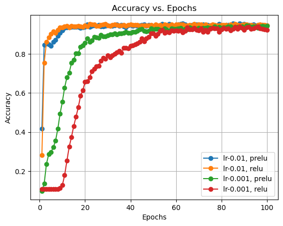

# 实验一：文本分类

*10215501412 彭一珅*

## 一、实验目的

文本分类是NLP中的一个常见任务，旨在将文本文档分为不同的预定义类别或标签。这个任务在世纪生活中有许多应用，包括情感分析、垃圾邮件过滤、新闻分类、产品评论分析、文档归档等等。

文本分类可以在监督学习的框架下完成，它涉及到两个主要的步骤：文本的向量化（或编码）和使用机器学习算法进行分类。本实验的目标是实现英文文本的10分类任务，对比文本分类的各项方法（逻辑回归/SVM/MLP/决策树），尝试通过参数调优，实现更加准确的文本分类。

**实验环境：**

+ Windows11操作系统
+ jupyter notebook
+ python3.9

## 二、实验方法

+ 将训练数据自行划分训练集和验证集，并对文本进行清洗（k折交叉验证）

  k折交叉验证是一种评估模型性能和稳定性的方法，特别是当数据量有限时。它的基本思想是将训练数据分成k个不重叠的子集，然后在k次迭代中，每次使用k-1个子集作为训练数据，而另外1个子集作为验证数据。这样，每一个子集都有一次机会作为验证集，而其他k-1次作为训练集。计算模型在每一个验证集上的表现，计算均值和方差，就可以评估模型的性能和稳定性。

  文本清洗的目标是准备干净、一致和规范的文本数据，以便机器学习模型能够更好地理解和处理。这些清洗步骤可以根据特定任务和数据集的要求进行定制，以提高文本分类任务的性能。

  **去除特殊字符和标点符号**：删除文本中的特殊字符（如@、#、$）和标点符号（如句号、逗号、括号等），因为它们通常对文本分类任务的性能没有帮助。

  **转换为小写**：将所有文本转换为小写，以确保不同大小写的单词被视为相同单词。

  **去除停用词**：停用词是在文本中频繁出现但通常不携带太多信息的词汇，例如“the”、“and”、“in”等。这些词通常被去除，因为它们对于分类任务没有帮助，同时还可以减少特征空间的维度。

  **去除多余的空格**：删除多余的空格，以确保单词之间都只有一个空格。

+ 将文本映射成向量（TF-IDF/Word2vec/Bert）

  TF-IDF：`from sklearn.feature_extraction.text import TfidfVectorizer`

  Word2Vec：`from gensim.models.doc2vec import Doc2Vec, TaggedDocument`

  Bert：`from transformers import BertTokenizer, BertModel`

+ 通过训练集训练分类器（SVM/MLP/逻辑回归/决策树）

  **逻辑回归：**

  对于多分类问题，一种常见的方法是“一对多”（One-vs-Rest, OvR）策略。在“一对多”策略中，对于K个类别，我们训练K个二分类逻辑回归模型。每一个模型针对一个特定的类别与其他所有类别进行二分类。在预测阶段，所有K个模型对于给定的输入都会给出预测，我们选择具有最高置信度（概率）的类别作为最终的预测结果。sklearn包中的LogisticRegression可以采用这种方法。

  **决策树：**

  决策树是一种树形结构，其中每个内部节点代表一个属性上的决策测试，每个分支代表一个决策结果，而每个叶节点代表一个预测的类别。通过递归地分裂数据集，决策树试图将数据集划分为尽可能纯净的子集。

  **svm：**

  支持向量机（SVM）是一种监督学习算法，它旨在找到一个最优的超平面，该超平面可以将数据集中的数据点根据其类别进行分隔。在二分类问题中，SVM寻找最优超平面使得两个类别的数据点之间的间隔最大化。对于多分类问题，SVM使用“一对一”或“一对其余”策略来进行分类。

  **mlp：**
  
  多层感知机（MLP，也称为深度前馈网络或普通前馈网络）是一种前馈人工神经网络，由三个或更多的层组成。这些层包括：输入层、输出层和一个或多个隐藏层。每个层中的神经元与下一层中的所有神经元都有连接，但同一层内的神经元之间没有连接。
  
  MLP是一个强大的模型，能够学习非线性的和复杂的模式。文本数据常常有高维度和非线性特性，这使得MLP特别适合于文本分类任务。
  
+ 实验结果分析及超参数选择

  对于以上的各种模型和方法，均有许多参数可以调整，超参数的选择依赖于模型在验证集上的表现。`GridSearchCV`是一个非常好的自动化调参工具，可以输出最优的参数选择。

## 三、实验过程

### 3.1 数据预处理

首先，观察数据的结构，对于字典型的数据，使用`eval()`函数读取，并将得到的dict加入到列表中。

```python
def readData():
    with open('train_data.txt', 'r', encoding='utf-8') as f:
        data = f.readlines()
    data_list = []
    for line in data:
        data_list.append(eval(line))
    return data_list

data_list = readData()
```

将数据划分为训练集和验证集，按照9:1的比例。其中，为了交叉验证，可以将数据划分为10个等大小的子集，并对每个模型运行10次，并分析每个验证集的预测结果。

此外，如果使用`cross_val_score()`函数也可以更加便捷地使用交叉验证。

```python
text_list_train = []
tag_list_train = []
text_list_val = []
tag_list_val = []

# 选定特定的验证集，得到text_list和tag_list
# 为了交叉验证可以运行10次
val = 8
for idx in range(10):
    if idx == val:
        for d in result['set' + str(idx)]:
            text_list_val.append(d['raw'])
            tag_list_val.append(d['label'])
    else:
        for d in result['set' + str(idx)]:
            text_list_train.append(d['raw'])
            tag_list_train.append(d['label'])
# print(len(text_list_val), len(text_list_train))
text_list_all = text_list_train + text_list_val
```

在文本分类任务中，文本的清洗是非常重要的步骤。将不必要的标点符号去除，将大写转成小写，去掉停用词，就可以得到更加干净简洁的英文文本数据。

```python
def preprocess_text(text):
    text = text.lower()
    text = re.sub(r'[^\w\s]', ' ',text)
    words = text.split()
    with open('./stopwords/english') as fp:
        stop_words=fp.readlines()
    stop_words= [x0[:-1] for x0 in stop_words]
    words = [word for word in words if word not in stop_words]
    preprocessed_text = ' '.join(words)
    
    return preprocessed_text

# print(text_list_all[0])
text_list_all = [preprocess_text(sentence) for sentence in text_list_all]
```

### 3.2 文本向量化

文本向量化的目标是根据某种规则将文本字符串转化为向量，这个向量需要保留文本的内在特征。本次实验中尝试了3种文本向量化技术，并通过分析它们的生成原理、参数等，对它们进行了比较。

#### 3.2.1 TF-IDF

TF-IDF的文本向量化方式是通过统计单词在文档中的出现频率来衡量其重要性。这种方法的优点是简单、快速，但是有可能会忽略单词的语义信息。

TF-IDF由词频 (TF)和逆文档频率 (IDF)两部分组成：词频 (TF)衡量一个词在文档中出现的频率，而逆文档频率 (IDF)衡量一个词是否常见，如果某个词比较普遍，则其IDF值较低。

sklearn包中自带TF-IDF的实现工具，需要将全部文本信息传入处理函数，即可得到每句文本的向量化表示。

```python
from sklearn.feature_extraction.text import TfidfVectorizer

def sklearn_tfidf(alist):
    transformer = TfidfVectorizer()
    tfidf = transformer.fit_transform(alist)
    return tfidf.toarray()

x_all = sklearn_tfidf(text_list_all)
y_all=tag_list_train+tag_list_val
x_train=x_all[:7200]
x_val=x_all[7200:]
```

此外，如果不调用前文的停词库而是使用TF-IDF自带的停词库，也有比较好的效果，只需要加入参数`transformer = TfidfVectorizer(stop_words='english')`

TF-IDF生成的向量维度由所有待分类文本中的有效词汇数量决定，通常是很大的维度，在本项目的数据集中达到20000以上，但生成的向量是稀疏的。

#### 3.2.2 Word2Vec

Word2Vec的作用是将每个词映射成一个向量，使得语义相近的词对应的向量在高维空间中距离相近。而Doc2Vec是基于Word2Vec实现的将文档映射成向量的函数，在本实验中更加适用。

Doc2Vec的输入是经过分词的句子，输出是句子的向量。

```python
from gensim.models.doc2vec import Doc2Vec, TaggedDocument

words=[sentence.split() for sentence in text_list_all]

document_list = []
for i, text in enumerate(words):
    document = TaggedDocument(text, tags=[i])
    document_list.append(document)

model_dm = Doc2Vec(document_list, vector_size=300, window=6, min_count=5, workers=8)
# model_dm.train(document_list, total_examples=model_dm.corpus_count, epochs=70)

x_all=[list(model_dm.dv[i]) for i in range(8000)]
```

Doc2Vec的性能受到以下参数影响：

+ vector_size 输出的特征向量的维数，一般取100-300大小
+ window 上下文窗口的大小
+ min_count 出现频数低于min_count的单词将被忽略
+ dm 表示使用的模型是否是DM（分布式记忆模型）
+ epochs 训练轮次，一般在10-100之间
+ negative 表示负采样数目，负采样是word2vec中的一项技术，对于一个单词的上下文，有些单词是可能出现的，而绝对不可能出现的单词就是负样本。
+ alpha 初始的学习率，会随着模型训练逐渐减少到min_alpha
+ workers CPU线程数，数值越大训练越快

现使用svm的性能来评估Doc2Vec参数的优劣。使用sklearn自带的5折交叉验证来确认准确率。

```python
svc=SVC(kernel='linear',random_state=42,probability=True,C=10,gamma=0.001)
cross_val_score(svc,x_all,y_all,cv=5)
```

| vector_size | window | epochs | precision |      |
| ----------- | ------ | ------ | --------- | ---- |
| 300         | 5      | 15     | 0.90375   |      |
| 300         | 5      | 20     | 0.90125   |      |
| 300         | 8      | 15     | 0.88125   |      |
| 300         | 8      | 20     | 0.8925    |      |
| 500         | 5      | 15     | 0.89625   |      |
| 500         | 5      | 20     | 0.90375   |      |
| 500         | 8      | 15     | 0.8925    |      |
| 500         | 8      | 20     | 0.9075    | √    |

经过这个简单的调参“热身”，可以看出，机器学习模型的调参是一个非常复杂的过程，任何其他参数的改变都会对某一特定参数的效果产生改变，比如，在向量维度不高的时候，训练轮数增加可能会导致过拟合，从而降低准确率；然而在向量维度达到500的时候，训练轮数多一些可以有更好的效果。

#### 3.2.3 Bert

BERT是由Google在2018年提出的一个预训练的深度学习模型。它的目标是理解文本中词语的上下文。不同于传统的NLP模型，BERT从左到右和从右到左都考虑了上下文，因此被称为“双向”的模型。Bert分词的实现可以通过调用transformer包来实现。

```python
from transformers import BertTokenizer, BertModel

def transformers_Bert(alist):
    tokenizer = BertTokenizer.from_pretrained('bert-base-uncased')
    model = BertModel.from_pretrained('bert-base-uncased').to(device)
    results = np.array([], dtype=np.float32)
    all_words = []

    count = 0
    for a in alist:
        tokens = tokenizer.tokenize(a)
        indexed_tokens = tokenizer.convert_tokens_to_ids(tokens)

        # 将tokens转为torch tensors
        tokens_tensor = torch.tensor([indexed_tokens]).to(device)
        count += 1

        # 获取隐藏状态
        with torch.no_grad():
            outputs = model(tokens_tensor)
            hidden_states = outputs.last_hidden_state
        sentence_embedding = torch.mean(hidden_states, dim=1).squeeze().cpu().numpy()
        
        if count==1:
            results=sentence_embedding
        else:
            results=np.vstack((results,sentence_embedding))
#         print(results.shape)
        
    return results


x_all = transformers_Bert(text_list_all)
x_train = x_all[:7200]
x_val = x_all[7200:]
```

上述代码中，`np.vstack((results,sentence_embedding))`的意思是将每一段文本所对应的向量合并成一个向量列表，然而Bert生成的文本向量不仅是只有第二维维度是768，第一维维度不同，而且不是向量而是多维张量，不能直接合并到列表里训练。因此采用代码`sentence_embedding = torch.mean(hidden_states, dim=1).squeeze().cpu().numpy()`实现一个最基本的池化功能，对第一维度取平均值，就可以得到维度为768的向量。

### 3.3 训练分类模型

#### 3.3.1 逻辑回归

逻辑回归是在线性回归的基础上加了一个 Sigmoid  函数（非线形）映射，可以解决分类问题，输出离散值。

```python
# 逻辑回归logical regression
from sklearn.linear_model import LogisticRegression
from sklearn.model_selection import GridSearchCV

lrmodel=LogisticRegression()
lrmodel.fit(x_train,tag_list_train)
print(lrmodel.score(x_val,tag_list_val))
```

sklearn中的逻辑回归模型有很多参数，比较重要的如下所示：

`penalty`：正则化项的种类，默认是l2，也可为l1

`dual`：求解对偶问题，一般会更快速

`C`：正则化项系数的倒数，一般取值可以为`param_grid ={'C': [1e-3, 1e-2, 1e-1, 1, 10, 100, 1000,10000]}    

`solver`：包含多种优化算法，其中默认的liblinear是二分类方法，可以通过一对多策略来求解一多分类问题，而其他的是多分类优化方法。使用newton-cg通常可以更加快速以多类的方式求解多分类问题，并且准确率差别不大。例如，在使用TF-IDF文本向量化方式时，比较Liblinear和newton-cg两种方法，准确率均是0.947左右

自动化的超参数调优通常可以提高机器学习模型的性能，而对模型性能重要的参数，可以通过GridSearch方法自动测试和调整，它系统性地搜索给定超参数的组合，并进行5折交叉验证，以找到最佳组合，从而提高模型性能。

```python
param_grid ={'C': [1e-3, 1e-2, 1e-1, 1, 10, 100, 1000,10000]}    
grid_search = GridSearchCV(lrmodel, param_grid, n_jobs = 8, verbose=1)    
grid_search.fit(x_train,tag_list_train)    
best_parameters = grid_search.best_estimator_.get_params()    
for para, val in list(best_parameters.items()):    
    print(para, val)    
lrmodel2 = LogisticRegression(C=best_parameters['C'])

lrmodel2.fit(x_train,tag_list_train)
print(lrmodel.score(x_val,tag_list_val),lrmodel2.score(x_val,tag_list_val))
```

在上面这段代码里面，搜索了C的8个取值，最后会输出如下结果：

C 0.1
penalty l2
solver lbfgs
max_iter 100
0.925 0.947

这说明超参数的取值极大影响模型的性能，并且C值作为正则化项系数的倒数，如果过大会引起过拟合，过小会限制模型的复杂度，也会增加偏差。

#### 3.3.2 决策树

决策树的作用是对数据集递归分割，每个非叶子节点都是一个特征，而每个分支表示特征的不同取值，叶子节点代表一个类别标签。虽然决策树适用于大量分类问题，但是决策树具有一些不稳定性，对噪声非常敏感，例如在bert向量化文本的分类上，决策树就表现不好，它不能关注文本的上下文信息，并且在高维度向量空间中可能变得不那么有效。

```python
from sklearn.tree import DecisionTreeClassifier
from sklearn.model_selection import GridSearchCV

dtc=DecisionTreeClassifier(random_state=42)
dtc.fit(x_train,tag_list_train)
print(dtc.score(x_val,tag_list_val))
```

决策树一般包含如下参数：

```py
param_grid = {
#     'criterion': ['gini', 'entropy'],  # 用于衡量分割的标准
#     'splitter': ['best', 'random'],  # 用于选择分割的策略
    'max_depth': [None, 10, 20, 30, 40, 50],  # 最大深度
    'min_samples_split': [2, 5, 10],  # 内部节点分割所需的最小样本数
#     'min_samples_leaf': [1, 2, 4],  # 叶节点所需的最小样本数
#     'max_features': ['auto', 'sqrt', 'log2', None]  # 寻找最佳分割时要考虑的特征数量
}  
```

在TF-IDF向量化的文本上，最大深度为50，内部节点分割所需的最小样本数为5的时候，分类效果最好，这是因为：最大深度可以控制树的复杂性，更深的数会引发过拟合；而样本数为5可以使得节点只有在多于5个样本的时候才进行分割，可以防止树在小样本集上过分拟合。

#### 3.3.3 svm

支持向量机svm的目标是在高维空间中，使用平面将各个分类的样本点分开，使得分类错误的样本点惩罚最小。svm的运行速度一般比较慢。起初，使用TF-IDF生成的高维向量在svm模型中训练时间很长，无法输出结果，加入shrinking参数解决了这个问题。

```python
from sklearn.svm import SVC
from sklearn.model_selection import GridSearchCV

# svc=SVC(kernel='linear',random_state=42,probability=True)
svc=SVC(kernel='rbf',random_state=42,probability=True,C=10,gamma=0.001,shrinking=True)
svc.fit(x_train,tag_list_train)
print(svc.score(x_val,tag_list_val))
```

SVC函数的性能会被如下参数影响，其中C和gamma格外重要。

1. `C` (float)：正则化参数，控制了决策边界的平滑程度。较小的C值会导致更宽松的决策边界，容忍一些错误分类；较大的C值会导致更严格的决策边界，试图减少错误分类样本。
2. `kernel` (string)：核函数，用于将数据映射到高维空间。常见的选项包括线性核（'linear'）、多项式核（'poly'）、径向基函数核（'rbf'）等。
3. `degree` (int)：多项式核函数的阶数，仅当`kernel`为'poly'时有效。
4. `gamma` (float)：核函数的系数。较大的gamma值会导致模型更关注训练样本的细节，可能导致过拟合；较小的gamma值会导致模型更平滑，可能导致欠拟合。
5. `shrinking` (bool)：是否启用收缩启发式算法以加速训练。
6. `probability` (bool)：是否启用概率估计。如果启用，可以使用`predict_proba`方法获取类别概率。
7. `decision_function_shape` (string)：多类别分类问题的决策函数形状，可以是'ovr'（一对多）或'ovo'（一对一）。

以上代码中的参数是gridsearch给出的最优参数。

**RBF Kernel（径向基核函数）：** 在高维度数据和文本分类问题中，RBF核允许SVC生成复杂的非线性决策边界，适应文本数据中的复杂特征和关系。

**C值（正则化参数）：** 参数C控制了SVC的正则化强度。在参数C=10的情况下，模型的正则化较弱，允许模型在训练数据上拟合较多的噪声。这对于TF-IDF文本分类问题有益，因为经过大量的处理，噪声较少。

**Gamma值：** 参数gamma控制了RBF核的宽度，较小的gamma值可以产生更宽的RBF核，有助于捕获数据中的大规模特征。在参数gamma=0.001的情况下，RBF核相对宽，适合处理文本数据中的大量特征。

#### 3.3.4 mlp

MLP是一种简单的神经网络，包括输入层，隐藏层和输出层，前馈传播是通过激活函数进行非线性变换，反向传播是对比预测值与真实值误差，并更新每一层的权重。MLP是深度学习的基础，并且每个输出神经元可以对应一个类别，非常适合多分类问题。

```python
import torch.nn as nn
import torch.optim as optim

x_train_tensor=torch.tensor(x_train, dtype=torch.float32)
y_train_tensor=torch.tensor(tag_list_train, dtype=torch.int64)
x_val_tensor=torch.tensor(x_val, dtype=torch.float32)
y_val_tensor=torch.tensor(tag_list_val, dtype=torch.int64)

class MLP(nn.Module):
    def __init__(self, input_dim, hidden_dim, output_dim):
        super(MLP,self).__init__()
        self.fc1=nn.Linear(input_dim, hidden_dim)
        self.dropout = nn.Dropout(0.2)
        self.fc2 = nn.Linear(hidden_dim, hidden_dim) 
        self.fc3 = nn.Linear(hidden_dim, hidden_dim)
        self.fc4 = nn.Linear(hidden_dim, output_dim)
        self.relu = nn.ReLU()
        
    def forward(self, x):
        x = self.relu(self.fc1(x))
        x = self.dropout(x)
#         x = self.relu(self.fc2(x)) 
#         x = self.dropout(x)
#         x = self.relu(self.fc3(x))  
#         x = self.dropout(x)
        x = self.fc4(x)
        return x
input_dim=len(x_train[0])
hidden_dim=100
output_dim=len(set(tag_list_train))
learning_rate=0.01
epochs=100

print(input_dim,hidden_dim,output_dim)

mlp=MLP(input_dim,hidden_dim,output_dim)
criterion=nn.CrossEntropyLoss()
optimizer=optim.Adam(mlp.parameters(), lr=learning_rate)

# 对于每种参数组合，保存每个epoch时模型在验证集上的accuracy在列表中
accuracy_list=[]

for epoch in range(epochs):
    optimizer.zero_grad()
    outputs=mlp(x_train_tensor)
    loss=criterion(outputs, y_train_tensor)
    loss.backward()
    optimizer.step()
    print(f"Epoch{epoch+1}/{epochs},Loss:{loss.item():.4f}")
    with torch.no_grad():# 去掉这一行准确率就会变得稳定在96%，因为在验证集上的运算会更加复杂和准确，也更加耗时
        predictions=mlp(x_val_tensor)
        _, predicted=torch.max(predictions,1)
        accuracy=(predicted==y_val_tensor).sum().item()/y_val_tensor.size(0)
        print(f"Test Accuracy:{accuracy*100:.2f}%")
    accuracy_list.append(round(accuracy,4))
```

MLP模型受到以下因素的影响：

1. 网络结构：隐藏层数、每层的神经元数

   `x = self.relu(self.fc2(x)) `

   在此处尝试增加更多网络层数，反而降低了预测准确率，推测可能是过拟合导致的。

2. 激活函数：如 ReLU、tanh、sigmoid 或其他。ReLU 和它的变体（如 LeakyReLU、PReLU）在现代的深度学习应用中很受欢迎，因为它们有助于缓解梯度消失的问题。

   `self.relu = nn.ReLU()`

3. 初始化方法: 如Xavier/Glorot、He或其他。正确的初始化方法可以加速训练并提高模型收敛的稳定性。

4. 优化器:例如 SGD、Adam、RMSprop、Adagrad 等。每种优化器都有其特点，选择合适的优化器可以大大加速训练。

   `optimizer=optim.Adam(mlp.parameters(), lr=learning_rate)`

   在这一步修改成SGD优化器，表现没有Adam好。

5. 学习率:

   初始学习率（lr）：用于更新模型权重的步长。

   学习率调整策略：如学习率衰减、学习率暖启动或使用学习率调度器。

6. 正则化:

   Dropout 率：Dropout 是一种正则化技术，它在每个训练步骤中随机“丢弃”神经元。

   `x = self.dropout(x)`

   L1 和/或 L2 正则化强度(weight_decay)：添加到损失函数的正则化项。

7. 批次大小：单次训练迭代中使用的样本数量。太小的批次可能导致训练不稳定，而太大的批次可能导致内存溢出或训练速度减慢。

8. 训练周期 (Epochs)：数据通过网络的完整轮数。太少的周期可能导致模型欠拟合，而太多的周期可能导致过拟合。

根据不同的学习率、relu函数，可以画出如下图像：



可以发现，学习率高的时候准确率上升会很快，可以加快训练速度，而prelu对于模型的学习又有很好的作用。

此外，也通过修改网络层数，加入更多的全连接层，并在每层中间随机丢失一些神经元，可以很好地防止网络层数过多产生的过拟合问题。

## 四、实验结果

5折交叉验证求平均值

| 分类模型\向量化 | TF-IDF  | Word2Vec | bert    |
| --------------- | ------- | -------- | ------- |
| 逻辑回归        | 0.947   | 0.88875  | 0.86525 |
| 决策树          | 0.73875 | 0.745    | 0.395   |
| svm             | 0.9075  | 0.89625  | 0.843   |
| mlp             | 0.9537  | 0.9087   | 0.8812  |

根据如上图准确率表格，在不同的分类模型和不同的特征表示方法下，准确率有所变化。下面对这些准确率产生的原因以及各种方法的优势和劣势进行分析：

**1. 逻辑回归：**

   - TF-IDF特征：逻辑回归在TF-IDF特征下表现最佳。
   - Word2Vec和Bert：逻辑回归在Word2Vec和Bert特征下表现较差。这可能是因为逻辑回归是线性分类器，而Word2Vec和Bert特征可能包含更多的非线性信息，逻辑回归难以捕捉。

**2. 决策树：**

   - TF-IDF特征：决策树在TF-IDF特征下表现较好。决策树可以处理非线性关系，而TF-IDF特征可能包含某种程度的非线性信息。
   - Word2Vec和Bert：决策树在Word2Vec和Bert特征下表现不佳。这可能是因为Word2Vec和Bert特征维度较高，导致决策树容易过拟合。

**3. SVM：**

   - 在TF-IDF、Word2Vec和Bert特征下，SVM都取得了相对高的准确率。
   - SVM的劣势在于对大规模数据集的训练速度较慢，因此在大规模数据集上可能不太适用。

**4. MLP（多层感知器）：**

   - MLP是一种深度学习模型，通常在大规模数据集和复杂问题上表现良好。
   - 在TF-IDF特征下，MLP表现最佳，这可能是因为TF-IDF特征的稀疏性适用于MLP的稠密层。
   - 在Word2Vec和Bert特征下，MLP表现较好，但略低于TF-IDF。

总体来讲，TF-IDF特征在传统机器学习模型中表现良好，而Word2Vec和Bert等深度学习特征在大规模数据和复杂问题上可能更有效。Bert向量的处理上，由于经过了一步平均池化过程，可能丢失了较多特征。另外，交叉验证的平均值可以提供对模型性能的更稳定估计，降低了随机性带来的影响。

## 五、总结

本实验研究了文本分类的基本方法，包括逻辑回归、SVM、MLP和决策树，以及文本向量化技术如TF-IDF、Word2Vec和BERT的应用。首先，进行了数据预处理，包括文本清洗和多折交叉验证，以确保数据质量和模型评估的稳定性。然后，尝试了不同的文本向量化方法，将文本转化为数值特征以供机器学习模型使用。使用不同的分类器进行训练和验证，评估它们在10分类任务上的性能。通过实验结果分析，可以发现超参数选择的重要性，并学习了如何自动化调参来提高模型性能。


