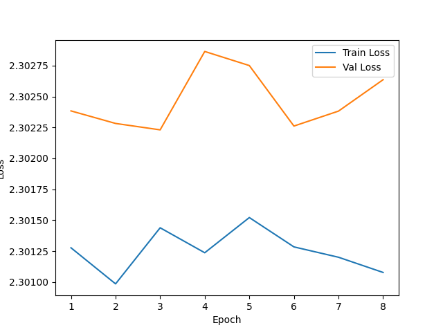
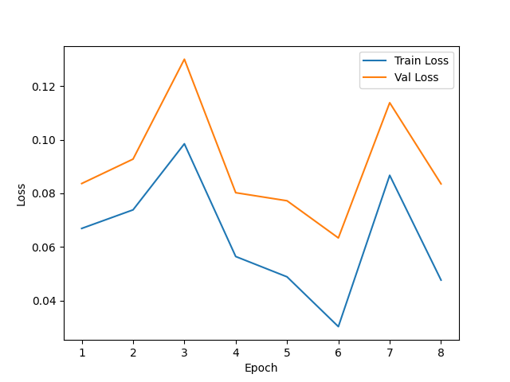

# 实验三：图片分类

1025501412 彭一珅

### 一、实验目标

使用模型实现MNIST手写数字识别，需自行划分验证集，使用多种CNN模型（至少四种）：

- 必选的三种架构：LeNet, AlexNet, ResNet

- 其它：自己挑选感兴趣的一个或多个架构实现。

### 二、实验过程

本实验使用的图片尺寸为28\*28，输出维度为10个类别。首先，为了将数据和标签都转为gpu运行，需要加上以下代码，否则会发生报错：
```python
images, labels = images.to(device), labels.to(device)  # 解决gpu问题
```

#### LeNet

lenet是深度学习中第一个成功应用于手写数字识别的卷积神经网络。它的输入层原本是32\*32的灰度图，与MNIST的数据较类似，可以不用修改网络结构。lenet的网络结构是：

第一层卷积：6个卷积核，大小为5，步长为1。池化层为2\*2

第二层卷积：16个卷积核，大小为5，步长为1。池化层为2\*2

第三层卷积：120个卷积核，大小为5，步长为1。

全连接层：在卷积之后将数据展平为(batchsize,-1)，然后添加dropout和linear层，大小为84

输出层：添加dropout层，然后添加全连接层，将数据维度转为num_classes

另外，在代码实现过程中，可以对卷积层得出的结果进行批量归一化，提高效率和泛化能力。

#### AlexNet

alexnet相比lenet，增加了网络深度，使用了5次卷积，并且增多了卷积核个数，增大了全连接层大小。

alexnet的网络原始输入的数据大小是224\*224\*3（3种颜色），这个输入尺寸对于MNIST的尺寸来说太大了，因此如果按照原始网络结构（第一层卷积核大小为11，第二层卷积核大小为5，等等），会出现以下错误：

>  RuntimeError: Given input size: (256x2x2). Calculated output size: (256x0x0). Output size is too small

对于较小的图，卷积核太大可能会导致感受野太大，丢失局部细节数据，池化时对池化核范围内的数据取均值或最大值，池化核太大可能会导致输出维度较小，报类似上面的错误。因此统一将卷积核大小改成3，最大池化的卷积核大小为2\*2

由于原始的实现是在2个gpu上运行，因此在我实现的过程中，需要对每一层的卷积核个数都增加一倍，比如原本第一层的卷积核个数是一个cpu48个，而这里需要改成共96个。

alexnet的缺点是较大（4096）的全连接层，比较难放在一个gpu中训练。

#### ResNet

在resnet出现之前，神经网路都是通过卷积层和池化层叠加来实现的，但是会出现梯度消失或爆炸问题，网络过深也会产生退化问题，resnet通过批归一化和残差网络解决了这两个问题。

残差块结构：

```python
class ResidualBlock(nn.Module):
    def __init__(self, in_channels, out_channels, stride=1):
        super(ResidualBlock, self).__init__()

        # 第一个卷积层
        self.conv1 = nn.Conv2d(in_channels, out_channels, kernel_size=3, stride=stride, padding=1, bias=False) # bias表示卷积层可学习的偏置项，最终与输出相加。BatchNormalization本身具有平移和缩放的效果，偏置项的影响可能被 BatchNormalization所替代，所以不需要bias
        self.bn1 = nn.BatchNorm2d(out_channels)
        # 第二个卷积层
        self.conv2 = nn.Conv2d(out_channels, out_channels, kernel_size=3, stride=1, padding=1, bias=False)
        self.bn2 = nn.BatchNorm2d(out_channels)
        # 直接连接
        self.shortcut = nn.Sequential()
        if stride != 1 or in_channels != out_channels:
            self.shortcut = nn.Sequential(
                nn.Conv2d(in_channels, out_channels, kernel_size=1, stride=stride, bias=False),
                nn.BatchNorm2d(out_channels)
            )

    def forward(self, x):
        residual = x
        out = F.relu(self.bn1(self.conv1(x)))
        out = self.bn2(self.conv2(out))
        out += self.shortcut(residual) # 直接连接使得第二层的输出不是完全依赖于第一层的输出，也依赖于原始的输出（residual），防止网络过深，而深层的参数没有经过足够的更新
        out = F.relu(out)
        return out
```

#### VGG

除了课程要求的3种网络，我额外选择了vgg网络来实现。vgg16是分类效果最好的网络，此处限于存储容量使用vgg13网络。vgg网络的特征是使用小卷积核和小池化核，并在alexnet基础上加深了网络深度，vgg网络的全连接层与alexnet一致。

vgg网络由vgg块组成，vgg块的特点是由若干个小卷积核的卷积层和一个最大池化层组成，vgg的作者认为，多个小卷积核相结合得到的感受野，等同于一个大卷积核，而小卷积核具有特征非线性、减少参数数量的优点。

vgg块结构：

```python
        self.vgg3= nn.Sequential(
            nn.Conv2d(128, 256, kernel_size=3, padding=1),
            nn.ReLU(inplace=True),
            nn.Conv2d(256, 256, kernel_size=3, padding=1),
            nn.ReLU(inplace=True),
            nn.MaxPool2d(kernel_size=2, stride=2),
        )
```

#### WideResNet

resnet网络存在一些问题，wideresnet是针对resnet的一种优化网络，作者搭建了16层的wide Residual Network，精度赶上了1000layer 的resNet， 并且在训练速度上提升了几倍。 

wideresnet在resnet的基础上，增加了widen_factor，可以增加卷积核的个数。

```python
class WideResNet(nn.Module):
    def __init__(self, depth=16, widen_factor=4, num_classes=10, dropout_rate=0.3):
        super(WideResNet, self).__init__()
        self.in_channels = 16
        self.conv1 = nn.Conv2d(1, 16, kernel_size=3, stride=1, padding=1, bias=False)
        self.bn1 = nn.BatchNorm2d(16)
        self.relu = nn.ReLU(inplace=True)

        n = (depth - 4) // 6
        k = widen_factor

        self.group1 = self._make_group(ResidualBlock, 16, n, 1, k, dropout_rate) # 在_make_group方法中，构造宽度为16 * k的residual block
        self.group2 = self._make_group(ResidualBlock, 32, n, 2, k, dropout_rate)
        self.group3 = self._make_group(ResidualBlock, 64, n, 2, k, dropout_rate)

        self.avg_pool = nn.AdaptiveAvgPool2d((1, 1))
        self.fc = nn.Linear(256, num_classes)
```

此外，也修改了residualblock的结构，在两层卷积过后都增加了dropout。

```python
self.dropout1 = nn.Dropout2d(p=dropout_rate)  # 在第一个卷积层后增加dropout
```

#### 遇到的问题

1.在模型对输入数据进行卷积和池化操作之后，数据需要输入到全连接层中，此时数据的维度需要和全连接层的输入匹配，如果不匹配就会遇到下面的报错：

> RuntimeError: mat1 and mat2 shapes cannot be multiplied

```python
nn.Linear(2304, 4096) # 第一个参数需要与处理后的数据维度匹配
```

2.有时模型训练完毕后，会在计算loss的时候发生报错，这是因为当数据batch大小为64的时候，模型训练过程中数据第一维需要始终保持64。

```python
outputs = trained_model(images)
loss = loss_criterion(outputs, labels) # 报错发生在这一步
```

解决问题的方式是使用以下两行代码的任意一种，将数据在接入全连接层的时候展平，且保持第一维仍然是64（batch大小）

```python
x = x.view(x.size(0), -1)
x = x.reshape(x.size(0), -1)
```

### 三、实验结果

为了测量每个模型在不同参数下的运行规律，设置参数grid如下：

```python
lrs=[1e-3,5e-3,5e-4]
dropouts=[0.5,0.25,0.3,0.75]
epochs=[8]
models=['lenet','alexnet','resnet','vggnet','wideresnet']
```

对比每个模型最优的运行结果，如下所示：

| 模型名称   | 参数组合                     | 模型参数个数 | train_accuracy | val_accuracy | test_accuracy | 运行时间/s |
| ---------- | ---------------------------- | ------------ | -------------- | ------------ | ------------- | ---------- |
| lenet      | 'lr': 0.005,'dropout': 0.3   | 61990        | 0.9961         | 0.9910       | 0.9928        | 192.88     |
| alexnet    | 'lr': 0.0005,'dropout': 0.25 | 28514378     | 0.9967         | 0.9905       | 0.9917        | 457.99     |
| resnet     | 'lr': 0.001,'dropout': 0.5   | 11172810     | 0.9966         | 0.9930       | 0.9931        | 614.06     |
| vggnet     | 'lr': 0.0005, 'dropout': 0.3 | 128806154    | 0.9950         | 0.9893       | 0.9908        | 872.76     |
| wideresnet | 'lr': 0.0005, 'dropout': 0.3 | 2748602      | 0.9962         | 0.9939       | 0.9937        | 652.82     |

可见，这些模型在足够的训练轮数后，在训练集上都达到了99.5%以上，而在测试集上，精度最高的是wideresnet。

在较短的运行时间内，lenet就达到了很高的测试精度。此外，还可以看出运行时间与模型参数个数成正比关系增加，例如vggnet模型中就有过多的需要学习的参数，运行时间也较长。

wideresnet 在相对较少的参数下取得了与其他模型相媲美的性能，同时训练时间也相对较短，显示了其在参数效率上的优势。

下面几张图将分别对比每个模型在不同参数下的表现，从而对模型的特征有更好的了解。

<div STYLE="page-break-after: always;"></div>

<div style="text-align: center; margin-bottom: 20px;">
    <h2>Parameter Combinations for LeNet</h2>
</div>
<div style="display: grid; grid-template-columns: repeat(4, 1fr); grid-gap: 5px;  margin: 0 auto;">
    <div style="position: relative; text-align: center;">
        
        <div style="position: absolute; top: 0; left: 50%; transform: translateX(-50%); background-color: (255,255,255,0.5); padding: 5px; font-size: 9px; border: 1px solid #ddd; border-radius: 5px;">
          <div>LR: 5e-3</div> 
          <div>Dropout: 0.25</div> 
        </div>
    </div>
        <div style="position: relative; text-align: center;">
        
        <div style="position: absolute; top: 0; left: 50%; transform: translateX(-50%); background-color: (255,255,255,0.5); padding: 5px; font-size: 9px; border: 1px solid #ddd; border-radius: 5px;">
          <div>LR: 5e-3</div> 
          <div>Dropout: 0.3</div> 
        </div>
    </div>
        <div style="position: relative; text-align: center;">
        
        <div style="position: absolute; top: 0; left: 50%; transform: translateX(-50%); background-color: (255,255,255,0.5); padding: 5px; font-size: 9px; border: 1px solid #ddd; border-radius: 5px;">
          <div>LR: 5e-3</div> 
          <div>Dropout: 0.5</div> 
        </div>
    </div>
        <div style="position: relative; text-align: center;">
        
        <div style="position: absolute; top: 0; left: 50%; transform: translateX(-50%); background-color: (255,255,255,0.5); padding: 5px; font-size: 9px; border: 1px solid #ddd; border-radius: 5px;">
          <div>LR: 5e-3</div> 
          <div>Dropout: 0.75</div> 
        </div>
    </div>
        <div style="position: relative; text-align: center;">
        
        <div style="position: absolute; top: 0; left: 50%; transform: translateX(-50%); background-color: (255,255,255,0.5); padding: 5px; font-size: 9px; border: 1px solid #ddd; border-radius: 5px;">
          <div>LR: 1e-3</div> 
          <div>Dropout: 0.25</div> 
        </div>
    </div>
        <div style="position: relative; text-align: center;">
        
        <div style="position: absolute; top: 0; left: 50%; transform: translateX(-50%); background-color: (255,255,255,0.5); padding: 5px; font-size: 9px; border: 1px solid #ddd; border-radius: 5px;">
          <div>LR: 1e-3</div> 
          <div>Dropout: 0.3</div> 
        </div>
    </div>
        <div style="position: relative; text-align: center;">
        
        <div style="position: absolute; top: 0; left: 50%; transform: translateX(-50%); background-color: (255,255,255,0.5); padding: 5px; font-size: 9px; border: 1px solid #ddd; border-radius: 5px;">
          <div>LR: 1e-3</div> 
          <div>Dropout: 0.5</div> 
        </div>
    </div>
        <div style="position: relative; text-align: center;">
        
        <div style="position: absolute; top: 0; left: 50%; transform: translateX(-50%); background-color: (255,255,255,0.5); padding: 5px; font-size: 9px; border: 1px solid #ddd; border-radius: 5px;">
          <div>LR: 1e-3</div> 
          <div>Dropout: 0.75</div> 
        </div>
    </div>
        <div style="position: relative; text-align: center;">
        
        <div style="position: absolute; top: 0; left: 50%; transform: translateX(-50%); background-color: (255,255,255,0.5); padding: 5px; font-size: 9px; border: 1px solid #ddd; border-radius: 5px;">
          <div>LR: 5e-4</div> 
          <div>Dropout: 0.25</div> 
        </div>
    </div>
        <div style="position: relative; text-align: center;">
        
        <div style="position: absolute; top: 0; left: 50%; transform: translateX(-50%); background-color: (255,255,255,0.5); padding: 5px; font-size: 9px; border: 1px solid #ddd; border-radius: 5px;">
          <div>LR: 5e-4</div> 
          <div>Dropout: 0.3</div> 
        </div>
    </div>
        <div style="position: relative; text-align: center;">
        
        <div style="position: absolute; top: 0; left: 50%; transform: translateX(-50%); background-color: (255,255,255,0.5); padding: 5px; font-size: 9px; border: 1px solid #ddd; border-radius: 5px;">
          <div>LR: 5e-4</div> 
          <div>Dropout: 0.5</div> 
        </div>
    </div>
        <div style="position: relative; text-align: center;">
        
        <div style="position: absolute; top: 0; left: 50%; transform: translateX(-50%); background-color: (255,255,255,0.5); padding: 5px; font-size: 9px; border: 1px solid #ddd; border-radius: 5px;">
          <div>LR: 5e-4</div> 
          <div>Dropout: 0.75</div> 
        </div>
    </div>
</div>

以lenet为例，上图可以很明显看出dropout对于模型正则化的影响。在dropout越大的时候，train曲线和val曲线就会越接近，不过在dropout=0.75的时候，因为丢失的神经元过多，模型没办法继续拟合。而learningrate对于模型训练的影响就是，过大的学习率会导致loss波动较大，但是也可能较快达到很低的loss。

从上图可以看出lenet总体来说是比较稳定的网络，并且在8轮之内有不错的表现。这可能是因为lenet本身就是为MNIST数据集设计的小型网络，识别效果较好。

<div style="text-align: center; margin-bottom: 20px;">
    <h2>Parameter Combinations for AlexNet</h2>
</div>
<div style="display: grid; grid-template-columns: repeat(4, 1fr); grid-gap: 5px;  margin: 0 auto;">
    <div style="position: relative; text-align: center;">
        
        <div style="position: absolute; top: 0; left: 50%; transform: translateX(-50%); background-color: (255,255,255,0.5); padding: 5px; font-size: 9px; border: 1px solid #ddd; border-radius: 5px;">
          <div>LR: 5e-3</div> 
          <div>Dropout: 0.25</div> 
        </div>
    </div>
        <div style="position: relative; text-align: center;">
        
        <div style="position: absolute; top: 0; left: 50%; transform: translateX(-50%); background-color: (255,255,255,0.5); padding: 5px; font-size: 9px; border: 1px solid #ddd; border-radius: 5px;">
          <div>LR: 5e-3</div> 
          <div>Dropout: 0.3</div> 
        </div>
    </div>
        <div style="position: relative; text-align: center;">
        
        <div style="position: absolute; top: 0; left: 50%; transform: translateX(-50%); background-color: (255,255,255,0.5); padding: 5px; font-size: 9px; border: 1px solid #ddd; border-radius: 5px;">
          <div>LR: 5e-3</div> 
          <div>Dropout: 0.5</div> 
        </div>
    </div>
        <div style="position: relative; text-align: center;">
        
        <div style="position: absolute; top: 0; left: 50%; transform: translateX(-50%); background-color: (255,255,255,0.5); padding: 5px; font-size: 9px; border: 1px solid #ddd; border-radius: 5px;">
          <div>LR: 5e-3</div> 
          <div>Dropout: 0.75</div> 
        </div>
    </div>
        <div style="position: relative; text-align: center;">
        
        <div style="position: absolute; top: 0; left: 50%; transform: translateX(-50%); background-color: (255,255,255,0.5); padding: 5px; font-size: 9px; border: 1px solid #ddd; border-radius: 5px;">
          <div>LR: 1e-3</div> 
          <div>Dropout: 0.25</div> 
        </div>
    </div>
        <div style="position: relative; text-align: center;">
        
        <div style="position: absolute; top: 0; left: 50%; transform: translateX(-50%); background-color: (255,255,255,0.5); padding: 5px; font-size: 9px; border: 1px solid #ddd; border-radius: 5px;">
          <div>LR: 1e-3</div> 
          <div>Dropout: 0.3</div> 
        </div>
    </div>
        <div style="position: relative; text-align: center;">
        
        <div style="position: absolute; top: 0; left: 50%; transform: translateX(-50%); background-color: (255,255,255,0.5); padding: 5px; font-size: 9px; border: 1px solid #ddd; border-radius: 5px;">
          <div>LR: 1e-3</div> 
          <div>Dropout: 0.5</div> 
        </div>
    </div>
        <div style="position: relative; text-align: center;">
        
        <div style="position: absolute; top: 0; left: 50%; transform: translateX(-50%); background-color: (255,255,255,0.5); padding: 5px; font-size: 9px; border: 1px solid #ddd; border-radius: 5px;">
          <div>LR: 1e-3</div> 
          <div>Dropout: 0.75</div> 
        </div>
    </div>
        <div style="position: relative; text-align: center;">
        
        <div style="position: absolute; top: 0; left: 50%; transform: translateX(-50%); background-color: (255,255,255,0.5); padding: 5px; font-size: 9px; border: 1px solid #ddd; border-radius: 5px;">
          <div>LR: 5e-4</div> 
          <div>Dropout: 0.25</div> 
        </div>
    </div>
        <div style="position: relative; text-align: center;">
        
        <div style="position: absolute; top: 0; left: 50%; transform: translateX(-50%); background-color: (255,255,255,0.5); padding: 5px; font-size: 9px; border: 1px solid #ddd; border-radius: 5px;">
          <div>LR: 5e-4</div> 
          <div>Dropout: 0.3</div> 
        </div>
    </div>
        <div style="position: relative; text-align: center;">
        
        <div style="position: absolute; top: 0; left: 50%; transform: translateX(-50%); background-color: (255,255,255,0.5); padding: 5px; font-size: 9px; border: 1px solid #ddd; border-radius: 5px;">
          <div>LR: 5e-4</div> 
          <div>Dropout: 0.5</div> 
        </div>
    </div>
        <div style="position: relative; text-align: center;">
        
        <div style="position: absolute; top: 0; left: 50%; transform: translateX(-50%); background-color: (255,255,255,0.5); padding: 5px; font-size: 9px; border: 1px solid #ddd; border-radius: 5px;">
          <div>LR: 5e-4</div> 
          <div>Dropout: 0.75</div> 
        </div>
    </div>
</div>

alexnet在不同的dropout和lr超参数上表现得不是很稳定，这有两个可能的原因：

1. alexnet模型比较复杂，相对于lenet需要更多的训练轮次才能看到稳定的loss下降曲线
2. alexnet对于lr和dropout的改变比较敏感，可以尝试更小的学习率和dropout比率
3. alexnet网络复杂，对于较大的数据规模（224\*224大小的图片）效果会更好，而对于本实验中经过修改的卷积核大小（11->3），可能会影响模型本身的效果

此外，alexnet的本意是在2个gpu上运行，所以实际网络的运行时间应该更快。

<div style="text-align: center; margin-bottom: 20px;">
    <h2>Parameter Combinations for ResNet</h2>
</div>
<div style="display: grid; grid-template-columns: repeat(4, 1fr); grid-gap: 5px;  margin: 0 auto;">
    <div style="position: relative; text-align: center;">
        
        <div style="position: absolute; top: 0; left: 50%; transform: translateX(-50%); background-color: (255,255,255,0.5); padding: 5px; font-size: 9px; border: 1px solid #ddd; border-radius: 5px;">
          <div>LR: 5e-3</div> 
          <div>Dropout: 0.25</div> 
        </div>
    </div>
        <div style="position: relative; text-align: center;">
        
        <div style="position: absolute; top: 0; left: 50%; transform: translateX(-50%); background-color: (255,255,255,0.5); padding: 5px; font-size: 9px; border: 1px solid #ddd; border-radius: 5px;">
          <div>LR: 5e-3</div> 
          <div>Dropout: 0.3</div> 
        </div>
    </div>
        <div style="position: relative; text-align: center;">
        
        <div style="position: absolute; top: 0; left: 50%; transform: translateX(-50%); background-color: (255,255,255,0.5); padding: 5px; font-size: 9px; border: 1px solid #ddd; border-radius: 5px;">
          <div>LR: 5e-3</div> 
          <div>Dropout: 0.5</div> 
        </div>
    </div>
        <div style="position: relative; text-align: center;">
        
        <div style="position: absolute; top: 0; left: 50%; transform: translateX(-50%); background-color: (255,255,255,0.5); padding: 5px; font-size: 9px; border: 1px solid #ddd; border-radius: 5px;">
          <div>LR: 5e-3</div> 
          <div>Dropout: 0.75</div> 
        </div>
    </div>
        <div style="position: relative; text-align: center;">
        
        <div style="position: absolute; top: 0; left: 50%; transform: translateX(-50%); background-color: (255,255,255,0.5); padding: 5px; font-size: 9px; border: 1px solid #ddd; border-radius: 5px;">
          <div>LR: 1e-3</div> 
          <div>Dropout: 0.25</div> 
        </div>
    </div>
        <div style="position: relative; text-align: center;">
        
        <div style="position: absolute; top: 0; left: 50%; transform: translateX(-50%); background-color: (255,255,255,0.5); padding: 5px; font-size: 9px; border: 1px solid #ddd; border-radius: 5px;">
          <div>LR: 1e-3</div> 
          <div>Dropout: 0.3</div> 
        </div>
    </div>
        <div style="position: relative; text-align: center;">
        
        <div style="position: absolute; top: 0; left: 50%; transform: translateX(-50%); background-color: (255,255,255,0.5); padding: 5px; font-size: 9px; border: 1px solid #ddd; border-radius: 5px;">
          <div>LR: 1e-3</div> 
          <div>Dropout: 0.5</div> 
        </div>
    </div>
        <div style="position: relative; text-align: center;">
        
        <div style="position: absolute; top: 0; left: 50%; transform: translateX(-50%); background-color: (255,255,255,0.5); padding: 5px; font-size: 9px; border: 1px solid #ddd; border-radius: 5px;">
          <div>LR: 1e-3</div> 
          <div>Dropout: 0.75</div> 
        </div>
    </div>
        <div style="position: relative; text-align: center;">
        
        <div style="position: absolute; top: 0; left: 50%; transform: translateX(-50%); background-color: (255,255,255,0.5); padding: 5px; font-size: 9px; border: 1px solid #ddd; border-radius: 5px;">
          <div>LR: 5e-4</div> 
          <div>Dropout: 0.25</div> 
        </div>
    </div>
        <div style="position: relative; text-align: center;">
        
        <div style="position: absolute; top: 0; left: 50%; transform: translateX(-50%); background-color: (255,255,255,0.5); padding: 5px; font-size: 9px; border: 1px solid #ddd; border-radius: 5px;">
          <div>LR: 5e-4</div> 
          <div>Dropout: 0.3</div> 
        </div>
    </div>
        <div style="position: relative; text-align: center;">
        
        <div style="position: absolute; top: 0; left: 50%; transform: translateX(-50%); background-color: (255,255,255,0.5); padding: 5px; font-size: 9px; border: 1px solid #ddd; border-radius: 5px;">
          <div>LR: 5e-4</div> 
          <div>Dropout: 0.5</div> 
        </div>
    </div>
        <div style="position: relative; text-align: center;">
        
        <div style="position: absolute; top: 0; left: 50%; transform: translateX(-50%); background-color: (255,255,255,0.5); padding: 5px; font-size: 9px; border: 1px solid #ddd; border-radius: 5px;">
          <div>LR: 5e-4</div> 
          <div>Dropout: 0.75</div> 
        </div>
    </div>
</div>
resnet由于引入了残差块，可以用更深层的网络拟合数据的分布。这个模型在不同参数上表现也比较稳定，其中最好的参数lr=0.001，dropout=0.5时，loss下降曲线比较稳定而且趋势向下，可能更多的网络层数和训练轮数会带来更好的结果。不过较大的参数规模会导致训练时间较长。

<div STYLE="page-break-after: always;"></div>

<div style="text-align: center; margin-bottom: 20px;">
    <h2>Parameter Combinations for VGGnet</h2>
</div>
<div style="display: grid; grid-template-columns: repeat(4, 1fr); grid-gap: 5px;  margin: 0 auto;">
    <div style="position: relative; text-align: center;">
        
        <div style="position: absolute; top: 0; left: 50%; transform: translateX(-50%); background-color: (255,255,255,0.5); padding: 5px; font-size: 9px; border: 1px solid #ddd; border-radius: 5px;">
          <div>LR: 5e-3</div> 
          <div>Dropout: 0.25</div> 
        </div>
    </div>
        <div style="position: relative; text-align: center;">
        
        <div style="position: absolute; top: 0; left: 50%; transform: translateX(-50%); background-color: (255,255,255,0.5); padding: 5px; font-size: 9px; border: 1px solid #ddd; border-radius: 5px;">
          <div>LR: 5e-3</div> 
          <div>Dropout: 0.3</div> 
        </div>
    </div>
        <div style="position: relative; text-align: center;">
        
        <div style="position: absolute; top: 0; left: 50%; transform: translateX(-50%); background-color: (255,255,255,0.5); padding: 5px; font-size: 9px; border: 1px solid #ddd; border-radius: 5px;">
          <div>LR: 5e-3</div> 
          <div>Dropout: 0.5</div> 
        </div>
    </div>
        <div style="position: relative; text-align: center;">
        
        <div style="position: absolute; top: 0; left: 50%; transform: translateX(-50%); background-color: (255,255,255,0.5); padding: 5px; font-size: 9px; border: 1px solid #ddd; border-radius: 5px;">
          <div>LR: 5e-3</div> 
          <div>Dropout: 0.75</div> 
        </div>
    </div>
        <div style="position: relative; text-align: center;">
        
        <div style="position: absolute; top: 0; left: 50%; transform: translateX(-50%); background-color: (255,255,255,0.5); padding: 5px; font-size: 9px; border: 1px solid #ddd; border-radius: 5px;">
          <div>LR: 1e-3</div> 
          <div>Dropout: 0.25</div> 
        </div>
    </div>
        <div style="position: relative; text-align: center;">
        
        <div style="position: absolute; top: 0; left: 50%; transform: translateX(-50%); background-color: (255,255,255,0.5); padding: 5px; font-size: 9px; border: 1px solid #ddd; border-radius: 5px;">
          <div>LR: 1e-3</div> 
          <div>Dropout: 0.3</div> 
        </div>
    </div>
        <div style="position: relative; text-align: center;">
        
        <div style="position: absolute; top: 0; left: 50%; transform: translateX(-50%); background-color: (255,255,255,0.5); padding: 5px; font-size: 9px; border: 1px solid #ddd; border-radius: 5px;">
          <div>LR: 1e-3</div> 
          <div>Dropout: 0.5</div> 
        </div>
    </div>
        <div style="position: relative; text-align: center;">
        
        <div style="position: absolute; top: 0; left: 50%; transform: translateX(-50%); background-color: (255,255,255,0.5); padding: 5px; font-size: 9px; border: 1px solid #ddd; border-radius: 5px;">
          <div>LR: 1e-3</div> 
          <div>Dropout: 0.75</div> 
        </div>
    </div>
        <div style="position: relative; text-align: center;">
        
        <div style="position: absolute; top: 0; left: 50%; transform: translateX(-50%); background-color: (255,255,255,0.5); padding: 5px; font-size: 9px; border: 1px solid #ddd; border-radius: 5px;">
          <div>LR: 5e-4</div> 
          <div>Dropout: 0.25</div> 
        </div>
    </div>
        <div style="position: relative; text-align: center;">
        
        <div style="position: absolute; top: 0; left: 50%; transform: translateX(-50%); background-color: (255,255,255,0.5); padding: 5px; font-size: 9px; border: 1px solid #ddd; border-radius: 5px;">
          <div>LR: 5e-4</div> 
          <div>Dropout: 0.3</div> 
        </div>
    </div>
        <div style="position: relative; text-align: center;">
        
        <div style="position: absolute; top: 0; left: 50%; transform: translateX(-50%); background-color: (255,255,255,0.5); padding: 5px; font-size: 9px; border: 1px solid #ddd; border-radius: 5px;">
          <div>LR: 5e-4</div> 
          <div>Dropout: 0.5</div> 
        </div>
    </div>
        <div style="position: relative; text-align: center;">
        
        <div style="position: absolute; top: 0; left: 50%; transform: translateX(-50%); background-color: (255,255,255,0.5); padding: 5px; font-size: 9px; border: 1px solid #ddd; border-radius: 5px;">
          <div>LR: 5e-4</div> 
          <div>Dropout: 0.75</div> 
        </div>
    </div>
</div>
vgg（13）net用于图片分类具有较好的效果，但是在本项目中表现一般，可能是因为其需要较小的学习率。且vgg网络适用的图片大小较大，vgg通过多个卷积块的叠加增加感受野大小，而本实验中数据集只有28px，因此过大的感受野可能遗漏细节信息。

<div style="text-align: center; margin-bottom: 20px;">
    <h2>Parameter Combinations for WideResNet</h2>
</div>
<div style="display: grid; grid-template-columns: repeat(4, 1fr); grid-gap: 5px;  margin: 0 auto;">
    <div style="position: relative; text-align: center;">
        
        <div style="position: absolute; top: 0; left: 50%; transform: translateX(-50%); background-color: (255,255,255,0.5); padding: 5px; font-size: 9px; border: 1px solid #ddd; border-radius: 5px;">
          <div>LR: 5e-3</div> 
          <div>Dropout: 0.25</div> 
        </div>
    </div>
        <div style="position: relative; text-align: center;">
        
        <div style="position: absolute; top: 0; left: 50%; transform: translateX(-50%); background-color: (255,255,255,0.5); padding: 5px; font-size: 9px; border: 1px solid #ddd; border-radius: 5px;">
          <div>LR: 5e-3</div> 
          <div>Dropout: 0.3</div> 
        </div>
    </div>
        <div style="position: relative; text-align: center;">
        
        <div style="position: absolute; top: 0; left: 50%; transform: translateX(-50%); background-color: (255,255,255,0.5); padding: 5px; font-size: 9px; border: 1px solid #ddd; border-radius: 5px;">
          <div>LR: 5e-3</div> 
          <div>Dropout: 0.5</div> 
        </div>
    </div>
        <div style="position: relative; text-align: center;">
        
        <div style="position: absolute; top: 0; left: 50%; transform: translateX(-50%); background-color: (255,255,255,0.5); padding: 5px; font-size: 9px; border: 1px solid #ddd; border-radius: 5px;">
          <div>LR: 5e-3</div> 
          <div>Dropout: 0.75</div> 
        </div>
    </div>
        <div style="position: relative; text-align: center;">
        
        <div style="position: absolute; top: 0; left: 50%; transform: translateX(-50%); background-color: (255,255,255,0.5); padding: 5px; font-size: 9px; border: 1px solid #ddd; border-radius: 5px;">
          <div>LR: 1e-3</div> 
          <div>Dropout: 0.25</div> 
        </div>
    </div>
        <div style="position: relative; text-align: center;">
        
        <div style="position: absolute; top: 0; left: 50%; transform: translateX(-50%); background-color: (255,255,255,0.5); padding: 5px; font-size: 9px; border: 1px solid #ddd; border-radius: 5px;">
          <div>LR: 1e-3</div> 
          <div>Dropout: 0.3</div> 
        </div>
    </div>
        <div style="position: relative; text-align: center;">
        
        <div style="position: absolute; top: 0; left: 50%; transform: translateX(-50%); background-color: (255,255,255,0.5); padding: 5px; font-size: 9px; border: 1px solid #ddd; border-radius: 5px;">
          <div>LR: 1e-3</div> 
          <div>Dropout: 0.5</div> 
        </div>
    </div>
        <div style="position: relative; text-align: center;">
        
        <div style="position: absolute; top: 0; left: 50%; transform: translateX(-50%); background-color: (255,255,255,0.5); padding: 5px; font-size: 9px; border: 1px solid #ddd; border-radius: 5px;">
          <div>LR: 1e-3</div> 
          <div>Dropout: 0.75</div> 
        </div>
    </div>
        <div style="position: relative; text-align: center;">
        
        <div style="position: absolute; top: 0; left: 50%; transform: translateX(-50%); background-color: (255,255,255,0.5); padding: 5px; font-size: 9px; border: 1px solid #ddd; border-radius: 5px;">
          <div>LR: 5e-4</div> 
          <div>Dropout: 0.25</div> 
        </div>
    </div>
        <div style="position: relative; text-align: center;">
        
        <div style="position: absolute; top: 0; left: 50%; transform: translateX(-50%); background-color: (255,255,255,0.5); padding: 5px; font-size: 9px; border: 1px solid #ddd; border-radius: 5px;">
          <div>LR: 5e-4</div> 
          <div>Dropout: 0.3</div> 
        </div>
    </div>
        <div style="position: relative; text-align: center;">
        
        <div style="position: absolute; top: 0; left: 50%; transform: translateX(-50%); background-color: (255,255,255,0.5); padding: 5px; font-size: 9px; border: 1px solid #ddd; border-radius: 5px;">
          <div>LR: 5e-4</div> 
          <div>Dropout: 0.5</div> 
        </div>
    </div>
        <div style="position: relative; text-align: center;">
        
        <div style="position: absolute; top: 0; left: 50%; transform: translateX(-50%); background-color: (255,255,255,0.5); padding: 5px; font-size: 9px; border: 1px solid #ddd; border-radius: 5px;">
          <div>LR: 5e-4</div> 
          <div>Dropout: 0.75</div> 
        </div>
    </div>
</div>
wideresnet是上述网络中表现最好的。

1. 在dropout=0.75时很好地体现了dropout对于防止过拟合起到的作用，train和val的loss曲线几乎重合了。
2. 在学习率为5e-4，dropout为0.3的时候效果最好，既可以防止过拟合，又可以在验证集上逐渐下降到较小的loss。
3. 由于wideresnet是较大规模的网络，且上述曲线都呈现下降趋势，增加训练轮次可能会得到更好的效果。

### 四、实验结论

#### LeNet vs. AlexNet vs. VGGNet：

1. LeNet是早期的卷积神经网络，相对简单，适用于小规模数据集。
2. AlexNet引入了深度和并行计算，提高了性能，但模型较大。
3. VGGNet在结构上更加统一，但参数量较大，适用于更大的数据集。

#### ResNet vs. WideResNet：

1. ResNet引入了残差连接，支持训练深层网络，但相对复杂。
2. WideResNet在ResNet的基础上引入宽度参数，减少层数，提高性能，相对容易训练。

### 参考文献

[1] Gradient-based learning applied to document recognition, 1998.

[2] Imagenet classification with deep convolutional neural networks, 2012.

[3] Deep residual learning for image recognition, 2016.

[4] Wide residual networks, 2016.