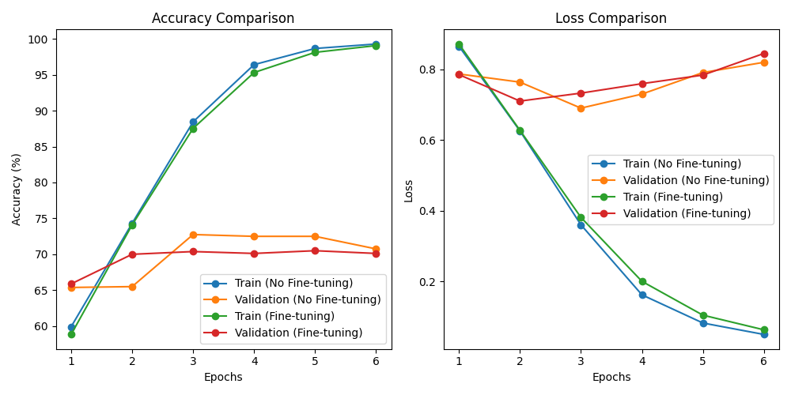

# 实验五 多模态情感分析

10215501412 彭一珅

github网址：https://github.com/tuziTZ/ai5

## 一、实验介绍

给定配对的文本和图像，预测对应的情感标签。

三分类任务：positive, neutral, negative。

匿名数据集（实验五数据.zip）

- data文件夹：包括所有的训练文本和图片，每个文件按照唯一的guid命名。

- train.txt: 数据的guid和对应的情感标签。

- test_without_label.txt：数据的guid和空的情感标签。

实验要求：设计一个多模态融合模型。自行从训练集中划分验证集，调整超参数。预测测试集（test_without_label.txt）上的情感标签。

## 二、实验方法

*你为什么会设计这样的模型？你觉得你的模型有什么亮点？*

图片情感分析：vgg16模型

文字情感分析：bert模型

融合方式：将图片和文本的嵌入表示转化成新的向量，然后在全连接层进行3分类，多模态特征融合的方法分为四种：特征级融合、决策级融合、混合级融合和模型级融合。之所以要对模态进行融合，是因为不同模态的表现方式不一样，看待事物的角度也会不一样，所以存在一些交叉（所以存在信息冗余），互补（所以比单特征更优秀）的现象，甚至模态间可能还存在多种不同的信息交互，如果能合理的处理多模态信息，就能得到丰富特征信息。即概括来说多模态的显著特点是： **冗余性 和 互补性** 。

本实验尝试了3种策略来对图片和文本的embedding进行融合分析，从而得到情感预测结果。

- 线性加权融合：将图片和文本的嵌入表示进行线性加权，通过调整权重来平衡二者的贡献。这种方法简单直观，通过权重的调整可以灵活控制模态之间的影响。
- gmu：使用门控多模态单元 (GMU) 来学习两个模态之间的交互关系。GMU能够动态地捕捉模态间的相关性，适用于处理不同模态之间复杂的信息交互。
- bilstm：使用双向长短时记忆网络 (BiLSTM) 来捕捉序列信息，用于融合文本信息。

## 三、实验过程

### 数据预处理

根据对数据集的观察，可以得知这是某社交网站的博文数据集，包含用户发表的博文和博文的配图，需要结合博文语义和配图来解读这条博文包含的用户情感倾向，有positive、negative、neutral三种情感倾向分类。

博文中包含一些无具体语义的信息，如http开头的网址链接，@开头的艾特用户，另外RT表示转发，需要单独处理这些信息：

```py
word_list = text_data.strip('\n').strip().replace("#", "").split(' ')
words_result = []

for word in word_list:
    if len(word) < 1:
        continue
    elif (len(word) >= 4 and 'http' in word) or word[0] == '@' or :
        continue
    else:
        words_result.append(word)
sequence = " ".join(words_result)
```

最后还需要将sequence这个处理后的句子，转换为bert模型可以读取的格式：

```py
self.pretrained_tokenizer = BertTokenizer.from_pretrained('./bert-base-uncased')
# ...
result = self.pretrained_tokenizer.batch_encode_plus(batch_text_or_text_pairs=[sequence], truncation=True, padding='max_length', max_length=self.max_input_len, return_tensors='pt')
token_ids = result['input_ids'][0]
attention_mask = result['attention_mask'][0]
```

这里从文件中读取了bert的tokenizer，该分词器能够将文本分解成词语，并考虑一些特殊标记，如 `[CLS]`（表示序列的开头）和 `[SEP]`（表示不同句子或文本的分隔）。将处理后的句子进行截断和填充操作，确保句子的长度符合BERT模型的要求。哪些位置是文本的原始数据，哪些位置是填充字符，需要用mask向量表示，mask的长度与文本向量相同，将填充字符位置置为0. 按照词表里的词索引将句子里的词转为数字。

另外，对于消融模型中消除文本数据对情感分析的影响，只需要将文本读取为空字符串即可：

```py
word_list = []
```

对于图片的处理，先用PIL的Image库读取图片：

```py
image_data = Image.open(img_filepath).convert('RGB')
```

然后构建了一个transform将图片转化为大小统一的向量：

```py
ImageTextTransform = transforms.Compose([
    transforms.Resize((224, 224)),  # 将图像resize为224*224
    transforms.ToTensor(),  # 将图像转换为PyTorch张量
    transforms.Normalize((0.5, 0.5, 0.5), (0.5, 0.5, 0.5))  # 标准化图像
])
```

最后将情感标签tag也按照数字编码：

```py
label = self.dataframe.iloc[idx]['tag']
if label == "positive":
    tag = 2
elif label == "negative":
    tag = 0
elif label == "neutral":
    tag = 1
else:
    tag = -1
```

以上这些操作都是在Dataset中处理，然后只需要在训练开始前，创建对应格式的数据集并加载数据即可。

```py
train_df, val_df = train_test_split(df, test_size=0.2, random_state=42)

train_dataset = CustomDataset(data_folder='data', dataframe=train_df, max_input_len=max_input_len, only=only,
                              transform=ImageTextTransform)
val_dataset = CustomDataset(data_folder='data', dataframe=val_df, max_input_len=max_input_len, only=only,
                            transform=ImageTextTransform)

train_dataloader = DataLoader(train_dataset, batch_size=batch_size, shuffle=True)
val_dataloader = DataLoader(val_dataset, batch_size=batch_size, shuffle=False)
```

预处理后的数据可视化效果类似下图（图片的异常是进行了normalization，文本后面填充的0是为了使得文本向量长度相同）：


### 模型构建

#### 1.线性加权融合

线性加权融合是很直观的一种特征融合方法，并且特征的权重不是固定的数值，而是可以学习的神经网络层，最后再通过一个全连接层将融合后的特征进行三分类。

```py
# 线性加权融合
class MultimodalFusionLayer1(nn.Module):
    def __init__(self, input_size_text, input_size_image, num_classes):
        super(MultimodalFusionLayer1, self).__init__()
        self.img_weight = nn.Linear(input_size_image, 1)
        self.txt_weight = nn.Linear(input_size_text, 1)
        self.fc = nn.Linear(input_size_text, num_classes)

    def forward(self, text, image):
        img_weight = self.img_weight(image)
        txt_weight = self.txt_weight(text)
        output = img_weight * image + txt_weight * text
        output = self.fc(output)
        return output
```

#### 2.GMU

GMU的实现参考了论文GATED MULTIMODAL UNITS FOR INFORMATION FUSION，这篇论文将GMU的实现表示如下图：


GMU 类通过门控机制实现了文本和图像两个模态的融合。分别为文本和图像引入了线性变换，得到了它们的隐藏表示（`h_text`和`h_image`）。通过一个门控线性变换（`z_gate`）学习了文本和图像的交互关系，最终通过门控机制输出了融合后的表示。

```py
class GMU(nn.Module):
    def __init__(self, input_size_text, input_size_image, hidden_size):
        super(GMU, self).__init__()
        self.hidden_size = hidden_size
        self.linear_text = nn.Linear(input_size_text, hidden_size)
        self.linear_image = nn.Linear(input_size_image, hidden_size)
        self.z_gate = nn.Linear(input_size_text + input_size_image, hidden_size)

    def forward(self, text, image):
        h_text = torch.tanh(self.linear_text(text))
        h_image = torch.tanh(self.linear_image(image))
        z = torch.sigmoid(self.z_gate(torch.cat([text, image], dim=1)))
        return z * h_text + (1 - z) * h_image


# gmu融合
class MultimodalFusionLayer(nn.Module):
    def __init__(self, input_size_text, input_size_image, num_classes, hidden_size=100):
        super(MultimodalFusionLayer, self).__init__()
        self.gmu = GMU(input_size_text, input_size_image, hidden_size)
        self.fc = nn.Linear(hidden_size, num_classes)

    def forward(self, text, image):
        combined = self.gmu(text, image)
        output = self.fc(combined)
        return output
```

#### 3.BiLSTM

双向循环神经网络可以同时利用序列信息的正向和反向信息，从而提高模型的准确度。将文本和图像的表示拼接在一起，作为BiLSTM模型的输入。BiLSTM会捕捉输入序列的上下文信息，并输出每个时间步的隐藏状态序列。本模型使用的输出结果是最后一个时间步的特征。

```py
# bilstm
class MultimodalFusionLayer2(nn.Module):
    def __init__(self, input_size_text, input_size_image, num_classes, hidden_size=100):
        super(MultimodalFusionLayer2, self).__init__()
        self.bilstm = torch.nn.LSTM(input_size=input_size_text + input_size_image, hidden_size=hidden_size,
                                    bidirectional=True)
        self.fc = nn.Linear(hidden_size * 2, num_classes)

    def forward(self, text, image):
        inputs = torch.cat([text, image], dim=1)
        outputs, (hidden, cell) = self.bilstm(inputs)
        output = self.fc(outputs)
        return output
```

### 训练过程

在每一轮训练结束时，输出总损失值和在训练集上预测的准确率。验证集的过程类似，只是不进行梯度更新。

```py
for batch in tqdm(train_dataloader, desc="Training", leave=False):
    inputs = {key: value.to(device) for key, value in batch.items() if key != 'guid'}
    optimizer.zero_grad()
    # 前向传播
    outputs = multimodal_model(inputs)
    # 计算损失
    loss = criterion(outputs, inputs['labels'])
    # 反向传播和优化
    loss.backward()
    optimizer.step()
    total_loss += loss.item()
    _, predicted = torch.max(outputs, 1)
    correct_predictions += (predicted == inputs['labels']).sum().item()
    total_samples += len(inputs['labels'])
accuracy = correct_predictions / total_samples
print(f"Train Accuracy: {accuracy * 100:.2f}%")
```

### 错误分析

*代码实现时遇到了哪些bug？如何解决的？*

 bug1：

> C:\cb\pytorch_1000000000000\work\aten\src\ATen\native\cuda\Indexing.cu:975: block: [40,0,0], thread: [95,0,0] Assertion `srcIndex < srcSelectDimSize` failed. 
>
> ...[多条相似的报错]
>
> Traceback (most recent call last):  File "D:\PycharmProjects\aip5\main.py", line 223, in \<module\> train_loss = train_epoch(model, train_dataloader, optimizer, device)  
>
> ...[traceback各文件信息]
>
> return _VF.dropout\_(input, p, training) if inplace else _VF.dropout(input, p, training) RuntimeError: CUDA error: device-side assert triggered

这个问题出现在gpu的训练过程中，因此不会写出具体的报错内容。将训练过程转换到cpu中：

```python
# device = torch.device("cuda" if torch.cuda.is_available() else "cpu")
device = torch.device("cpu")
```

这样可以出现以下错误：

> IndexError: index out of range in self

也就是说明词表大小不足以包含文本中所有的词汇，因此在文本预处理的过程中要进行修改，将词表中没有出现的词汇标识为未知词汇：

```python
tokenized_text = self.pretrained_tokenizer.encode(sequence, add_special_tokens=True)
```

其中，`add_special_tokens`表示方法会自动处理标记、添加特殊标记（如[CLS]和[SEP]），并将不存在于词表中的词替换为[UNK]的ID。

bug2：读取文本时的编码错误，出现以下报错：

> UnicodeDecodeError: 'utf-8' codec can't decode byte 0xa1 in position 71: invalid start byte

原因是图片描述中有部分异常字节是不能用utf-8成功编码的，可以忽略这些异常字符：

```py
with open(txt_filepath, 'r', encoding='utf-8', errors='ignore') as f:
    text_data = f.read()
```

bug3：

一开始使用了以下方式进行文本预处理：

```py
        sequence = ""
        for word in text_data:
            # @别的用户
            if word.startswith("@"):
                word = "[USER]"
            # 用户打的tag
            if word.startswith("#"):
                sequence += '[TAG]' + ' '
                word = word[1:]
            # 转发标识
            if word == "RT":
                word = 'retweet'

            sequence += word + ' '
        # 文本开始结束符号标注
        marked_text = "[CLS] " + sequence + " [SEP]"
        tokenized_text = self.pretrained_tokenizer.encode(sequence, add_special_tokens=True)
        indexed_tokens = self.pretrained_tokenizer.convert_tokens_to_ids(tokenized_text)

        # 如果文本长度超过模型的最大输入长度，进行截断
        pad_len = 0
        max_len = self.max_input_len
        indexed_len = max_len
        if len(indexed_tokens) > max_len:
            indexed_tokens = indexed_tokens[:max_len - 1] + [self.pretrained_tokenizer.sep_token_id]
        else:
            # 如果没有超过最大长度，使用[PAD]符号进行填充
            pad_len = max_len - len(indexed_tokens)
            indexed_len = len(indexed_tokens)
            indexed_tokens += [self.pretrained_tokenizer.pad_token_id] * pad_len

        # 创建Attention Mask
        attention_mask = [1] * indexed_len + [0] * pad_len
        attention_mask = torch.tensor(attention_mask)
        token_ids = torch.tensor(indexed_tokens)
```

用特殊符号进行文本标注同时也需要在词表中：

```py
self.special_tokens = [SpecialTokens.__dict__[k] for k in SpecialTokens.__dict__ if not re.search('^\_', k)]
        self.pretrained_tokenizer.add_special_tokens({'additional_special_tokens': self.special_tokens})
        self.special_tokens.sort()
```

但是使用这种文本预处理方式，验证集准确率较低，最高只能达到63%：

失败的预处理：

> Train Accuracy: 59.00%
> Validation Accuracy: 61.50%
> Epoch 1/10 - Train Loss: 0.8690 - Val Loss: 0.8293
> Train Accuracy: 68.31%
> Validation Accuracy: 63.00%
> Epoch 2/10 - Train Loss: 0.7244 - Val Loss: 0.8075
> Train Accuracy: 79.84%
> Validation Accuracy: 61.38%
> Epoch 3/10 - Train Loss: 0.5316 - Val Loss: 0.8362
> Train Accuracy: 91.44%
> Validation Accuracy: 61.75%
> Epoch 4/10 - Train Loss: 0.3104 - Val Loss: 0.8854
> Train Accuracy: 96.97%
> Validation Accuracy: 57.88%
> Epoch 5/10 - Train Loss: 0.1683 - Val Loss: 0.9556
> Train Accuracy: 98.94%
> Validation Accuracy: 60.75%
> Epoch 6/10 - Train Loss: 0.0991 - Val Loss: 0.9929
> Train Accuracy: 99.19%
> Validation Accuracy: 61.38%
> Epoch 7/10 - Train Loss: 0.0680 - Val Loss: 1.0429

因此更换文本预处理方式，不再手动使用特殊符号标注，并且使用batch_encode_plus方法创建mask，将验证集准确率提升到了70%以上。

## 四、实验结果

*多模态融合模型在验证集上的结果。*

*消融实验结果。即分别只输入文本或图像数据，你的多模态融合模型在验证集会获得怎样的表现。*

在gmu融合模型上进行了消融实验，以下准确率百分比是在10轮训练中，验证集上的最高准确率。可以看到，文本和图像特征的融合可以提升单独使用文本或图像训练的准确率。

| gmu融合模型 | only=text | only=image |
| ----------- | --------- | ---------- |
| 72.75%      | 70.75%    | 71.38%     |

此外，还对比了多种融合模型的效果，其中线性加权实现方式比较简单，预测能力较差，而gmu和bilstm获得了类似的分数。可能由于本实验的数据没有时序性，bilstm的预测能力没有得到更好地发挥。

| 线性加权 | gmu    | bilstm |
| -------- | ------ | ------ |
| 72%      | 72.75% | 72.88% |

另外，还尝试了是否按照给定的训练集，微调预训练好的vgg16模型和bert模型参数：

```py
        if update_parameters:
            for param in self.text_model.parameters():
                param.requires_grad = True
        if update_parameters:
            for param in self.full_model.parameters():
                param.requires_grad = True
```

实验结果如下所示：



可以从图中看到的是，不进行微调可以得到更好的验证集预测结果，这可能是因为微调参数会增强模型在训练集上的过拟合现象。微调参数会导致在验证集上更快达到loss的最低点，但是不微调的模型有助于达到更低的loss(0.69)

## 五、实验结论

本项目实现了多模态融合情感分析，使用Bert提取文本特征，使用vgg16提取图像特征，最后以不同的方式将这两个特征融合在一起，实现最终的分类任务。多模态数据的融合分析在不同领域都有着广泛的应用，在本次实验中我熟悉了多模态融合的基本方法，并尝试多种方式提升准确率。由于模型的运行需要10G以上显存，在本实验中我还实践了深度学习环境的远程租用。