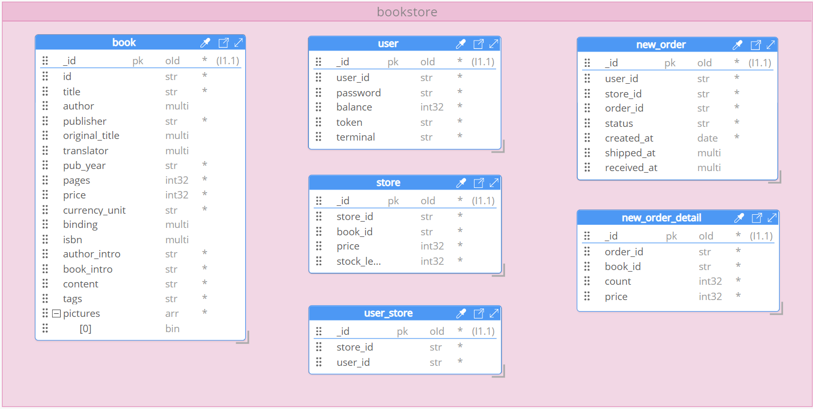
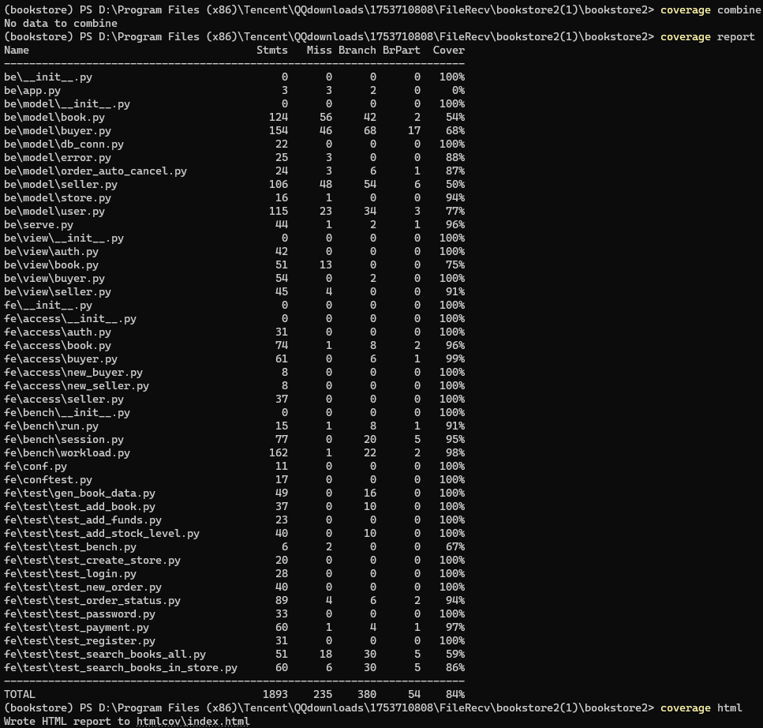
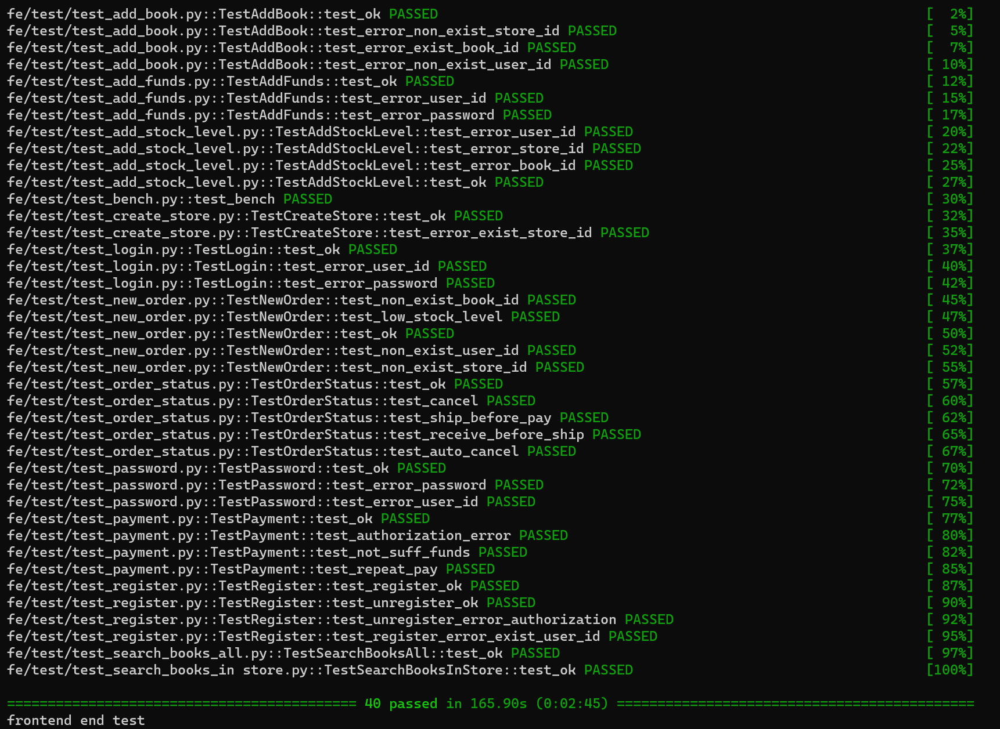
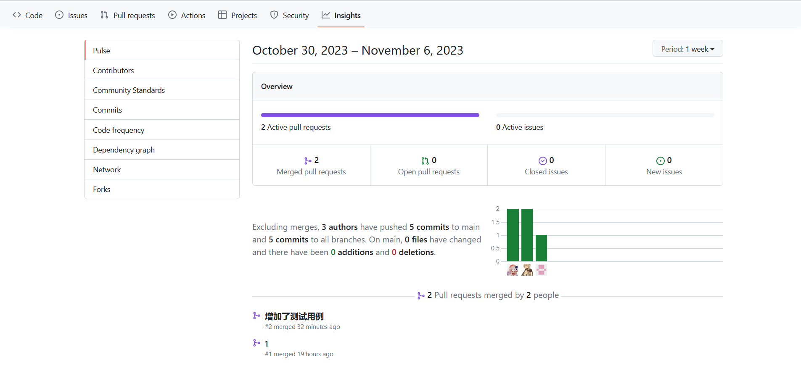

# BOOKSTORE

当代数据管理系统 第一次大作业 实验报告

| 小组成员 | 学号        | 负责工作                     |
| -------- | ----------- | ---------------------------- |
| 贺雯忆   | 10215501409 | 图书搜索功能、测试用例设计   |
| 彭一珅   | 10215501412 | 发货收货、订单功能实现       |
| 黄驰越   | 10215501449 | 用户权限、买家、卖家接口实现 |

## 一、实验目标

本次实验的目标是实现一个提供网上购书功能的网站后端。网站支持书商在上面开商店，购买者可以通过网站购买。买家和卖家都可以注册自己的账号。一个卖家可以开一个或多个网上商店，买家可以为自己的账户充值，在任意商店购买图书。

支持 下单->付款->发货->收货 流程。

## 二、数据库设计

从逻辑的角度出发，数据库包括4种对象：书book，用户user，书店store，订单new_order，这些对象间的关系可以用6张表来描述：书book，用户user，书店store，卖家-书店user_store，订单new_order，订单详情new_order_detail。

其中，书`book`与书店`store`是一对多的关系，一本书可以在多个书店中被库存，书的具体信息存在`book`表中，书的交易相关信息被存在`store`表中。用户`user`和书店`store`是一对多的关系，一个卖家可以开一个或多个网上商店，`user_store`表中记录了这种对应关系。订单`new_order`与书是一对多关系，一个订单可以订购一本或多本书，这种订购关系以订单为单位被记录在`new_order`中，以书为单位被记录在`new_order_detail`中，`new_order`和`new_order_detail`是一对多关系，一个order有多条detail分别对应多本书的书id、本数和书本的单价。

这个设计相比于原始设计的改进之处在于把书本信息独立出来，单独设置一个book表，仅在原来的store表中存放price信息，这么做既节省了空间，又不改变原来的查询效率。如果一本书在多个商店中都有售卖，原来需要在store表存储很多遍这本书的副本，尤其是作者简介与作品简介较大，这对空间来说是一种浪费，现在每本书仅存在一个副本，提升了空间效率与可管理性，并且bookstore的业务特点决定了访问图书具体信息的情况是较少见的，而在下单、付钱等过程中，对图书价格的访问是相对多见的，因此这种做法并不会减小数据库的查询效率。



## 三、代码实现

对于书店系统后端的每个功能，都包括接口、后端逻辑、数据库操作、测试用例四个实现部分。本节包含对于接口、模型的实现，并解释模型中的数据库操作。

首先分析文件结构：

> │   .coverage
> │   requirements.txt
> │   setup.py
> │
> ├───be
> │   │   app.py
> │   │   serve.py
> │   │   \_\_init\_\_.py
> │   │
> │   ├───model
> │   │        book.py
> │   │        buyer.py
> │   │        db_conn.py
> │   │        error.py
> │   │        order_auto_cancel.py
> │   │        seller.py
> │   │        store.py
> │   │        user.py
> │   │        \_\_init\_\_.py
> │   │
> │   └───view
> │              auth.py
> │              book.py
> │              buyer.py
> │              seller.py
> │              \_\_init\_\_.py
> │
> ├───doc
> │       auth.md
> │       buyer.md
> │       seller.md
> │
> ├───fe
> │   │   conf.py
> │   │   conftest.py
> │   │   \_\_init\_\_.py
> │   │
> │   ├───access
> │   │       auth.py
> │   │       book.py
> │   │       buyer.py
> │   │       new_buyer.py
> │   │       new_seller.py
> │   │       seller.py
> │   │       \_\_init\_\_.py
> │   │
> │   ├───bench
> │   │       bench.md
> │   │       run.py
> │   │       session.py
> │   │       workload.py
> │   │       \_\_init\_\_.py
> │   │
> │   ├───data
> │   │       book.db
> │   │       book_lx.db
> │   │       scraper.log
> │   │       scraper.py
> │   │
> │   └───test
> │           gen_book_data.py
> │           test.md
> │           test_add_book.py
> │           test_add_funds.py
> │           test_add_stock_level.py
> │           test_bench.py
> │           test_create_store.py
> │           test_login.py
> │           test_new_order.py
> │           test_order_status.py 
> │           test_password.py
> │           test_payment.py
> │           test_register.py
> │           test_search_books_all.py
> │           test_search_books_in_store.py
> │
> ├───htmlcov
> │
> └───script
>          test.sh

项目文件是由后端（`be`）和前端（`fe`）两部分组成的Web应用，以下是各部分的简要说明：

- `.coverage`: 代码覆盖率测试工具生成的覆盖率文件。
- `requirements.txt`: 包含项目所需的Python依赖库的清单。
- `setup.py`: Python包的安装和分发配置文件。

**`be` 目录：**

- web应用的后端。
- `app.py`: 后端Flask应用的主要入口文件，负责处理请求和路由。
- `serve.py`: 用于运行Flask应用的脚本。
- `__init__.py`: 初始化`be`模块。

**`model` 子目录：**

- 后端的数据模型和业务逻辑。
- `user.py` 、`book.py`、`buyer.py`、`seller.py` 分别处理用户认证、书籍搜索、买家和卖家的业务逻辑。
- `db_conn.py` 用于获取对数据库的连接，且定义了基础的存在判断方法。
- `error.py` 包含自定义的错误处理类和函数。
- `order_auto_cancel.py` 包含定时取消订单的逻辑。
- `store.py` 初始化索引并连接数据库。
- `__init__.py`: 初始化`model`模块。

**`view` 子目录：**

- 后端访问时的接口，对应的路由url。
- `auth.py`、`book.py`、`buyer.py`、`seller.py` 分别处理认证、书籍搜索、买家和卖家的路由和视图逻辑。

**`fe` 目录：**

- 前端访问测试的相关文件，入口是`conftest.py`

**`access` 子目录：**

- 包含用于访问后端的API的模块，包括 `auth.py`、`book.py`、`buyer.py` 等。

**`bench` 子目录：**

- 包含性能测试相关的文件和用于模拟工作负载的 `workload.py` 模块。

**`data` 子目录：**

- 包含数据文件，如 `book.db` 。
- `scraper.py` 是用于抓取数据的爬虫脚本。

**`test` 子目录：**

- 包含前端应用的测试相关文件。
- `gen_book_data.py` 用于生成书籍数据。
- `test.md` 包含测试文档。
- 其他 `.py` 文件包含不同的测试用例，如登录、新订单、付款等。

**`htmlcov` 目录：**

- 包含代码覆盖率测试工具生成的HTML报告。

**`script` 目录：**

- 包含功能测试的脚本文件 `test.sh`。

本节所介绍的内容包含`be`目录下的`model`和`views`。

model文件夹中的.py文件存在以下调用关系：

> `store.py`-> `db_conn.py` -
>                                                   |-------`user.py` 、`book.py`、`buyer.py`、`seller.py`
>                       `error.py`-----        

而视图view中的`auth.py`、`book.py`、`buyer.py`、`seller.py` 分别对应着这四个功能。因此可以看出，前三个文件是实现后续功能的基础，在这一节开始时首先进行介绍。这三个功能是通过修改原有的基于sqlite数据库的功能来实现的。

以下是`store.py`的代码，功能是连接MongoDB数据库并初始化，以及创建全文搜索索引的初始化操作。

```python
import pymongo

class Store:
    def __init__(self, host,port):
        self.client = pymongo.MongoClient(host,port) # 创建mongodb客户端
        self.db = self.client["bookstore"] # 创建bookstore数据库

    def init_tables(self): # 初始化全文索引
        self.db['book'].create_index([
            ('id', pymongo.ASCENDING),
            ('title', 'text'),
            ('author', 'text'),
            ('publisher', 'text'),
            ('isbn', 'text'),
            ('content', 'text'),
            ('tags', 'text'),
            ('book_intro', 'text'),
        ],
            default_language="chinese",
            weights={'title': 2, 'author': 2, 'isbn': 2}
        )

    # def get_db_conn(self):
    #     pass
    #     # 不需要获取数据库连接，MongoDB 是服务器端数据库

database_instance: Store = None # 全局变量，在init_database调用一次之后就会成为Store数据库实例

def init_database(host,port): # 在app启动时被调用一次，后续获取数据库连接则是使用get_db_conn
    global database_instance
    database_instance = Store(host,port)

def get_db_conn(): # 作用是获取已经初始化好的Store数据库实例
    global database_instance 
    return database_instance
```

然后，`db_conn.py`只引入了`store.py`这一个文件，并且在初始化类时使用了方法`get_db_conn`，这说明在后续的操作中，每次继承DBConn这个类都获取并操作初始化好的数据库连接。

```python
from be.model import store

class DBConn:
    def __init__(self):
        self.conn = store.get_db_conn()
        self.db = self.conn.client['bookstore']

    def user_id_exist(self, user_id): # 用户是否存在
        user_collection = self.db["user"]
        user_doc = user_collection.find_one({"user_id": user_id})
        return user_doc is not None

    def book_id_exist(self, store_id, book_id): # 书在商店里是否存在
        store_collection = self.db["store"]
        store_doc = store_collection.find_one({"store_id": store_id, "book_id": book_id})
        return store_doc is not None

    def store_id_exist(self, store_id): # 商店是否存在
        user_store_collection = self.db["user_store"]
        user_store_doc = user_store_collection.find_one({"store_id": store_id})
        return user_store_doc is not None

    def book_id_exist_in_all(self, book_id): # 书在book这张表内是否存在
        store_collection = self.db["book"]
        store_doc = store_collection.find_one({"id": book_id})
        return store_doc is not None
```

除了这两个文件之外，被其他所有model引用的还有`error.py`，这个文件主要是自定义了一些http响应码，提供了511-528多种错误码，本项目在之前的基础上增加了`520:"invalid order status {}"`，表示对订单的操作（付款、发货、收货）不符合订单当前的状态，从而引发的错误。

### 1.用户权限接口

用户权限的业务逻辑为`user.py`，接口为`view.py`。User类继承了DBConn，可以获取到数据库的连接并进行操作，而User类里的主要几个函数就实现了用户权限功能。基于原始的代码，需要修改的内容就是将操作sqlite数据库的SQL语句改成对mongodb文档型数据库的访问。

#### 注册

注册的业务逻辑通过如下代码实现。代码首先判断当前注册的用户名是否在数据库的user表中存在，由于用户名`user_id`是唯一的，如果用户名已经存在就返回相应的错误码。然后按照登录的时间戳生成终端`terminal`，再将终端和用户id一起编码成`token`。其中，`jwt_encode` 函数作用是使用 `jwt.encode` 方法对 JSON 对象进行签名，生成 JWT 令牌，再将令牌从字节字符串编码为 UTF-8 字符串，并返回。然后创建用户数据对象user_data，并插入数据表user中。

```python
def register(self, user_id: str, password: str):
    if self.user_id_exist(user_id): # 判断用户名是否重复
        return error.error_non_exist_user_id(user_id)
    try:
        terminal = "terminal_{}".format(str(time.time()))
        token = jwt_encode(user_id, terminal)
        user_collection = self.db["user"]
        user_data = { # 创建数据对象
            "user_id": user_id,
            "password": password,
            "balance": 0,
            "token": token,
            "terminal": terminal
        }
        user_collection.insert_one(user_data)
    except pymongo.errors.DuplicateKeyError:
        return error.error_exist_user_id(user_id)
    return 200, "ok"
```

注册的接口实现与原始框架相同，不需要修改。

```python
@bp_auth.route("/register", methods=["POST"])
def register():
    user_id = request.json.get("user_id", "")
    password = request.json.get("password", "")
    u = user.User()
    code, message = u.register(user_id=user_id, password=password)
    return jsonify({"message": message}), code
```

#### 登录

`login` 方法用于用户登录，此方法接受三个参数：`user_id`（用户标识）、`password`（密码）和`terminal`（终端标识），并返回一个元组 `(int, str, str)`，包括状态码、消息和令牌。首先调用 `self.check_password(user_id, password)` ，检查用户提供的密码是否与数据库中存储的密码一致，如果成功就生成一个 JWT 令牌 (`token`)。这是一个用于身份验证的令牌，标识用户的登录状态。然后更新数据库中的用户信息，将新生成的令牌 (`token`) 和终端标识 (`terminal`) 存储在数据库中，将用户的登录状态和终端信息记录下来。

```python
def login(self, user_id: str, password: str, terminal: str) -> (int, str, str):
    token = ""
    try:
        code, message = self.check_password(user_id, password) # 验证密码
        if code != 200:
            return code, message, ""

        token = jwt_encode(user_id, terminal) # 生成令牌
        user_collection = self.db["user"]
        user_collection.update_one( # 更新用户token
            {"user_id": user_id},
            {"$set": {"token": token, "terminal": terminal}}
        )
    except pymongo.errors.PyMongoError as e:
        return 528, "{}".format(str(e)), ""
    except BaseException as e:
        return 530, "{}".format(str(e)), ""
    return 200, "ok", token
```

登录的接口实现与原始框架相同，不需要修改。

```python
@bp_auth.route("/login", methods=["POST"])
def login():
    user_id = request.json.get("user_id", "")
    password = request.json.get("password", "")
    terminal = request.json.get("terminal", "")
    u = user.User()
    code, message, token = u.login(
        user_id=user_id, password=password, terminal=terminal
    )
    return jsonify({"message": message, "token": token}), code
```

#### 登出

登出的实现逻辑与登入基本相似，同样需要对数据库中的用户token进行修改，以实现身份认证的功能。

```python
def logout(self, user_id: str, token: str) -> bool:
    try:
        # 检查用户提供的token是否有效
        code, message = self.check_token(user_id, token)
        if code != 200:
            return code, message  

        # 生成一个新的终端标识，并用它生成一个新的令牌
        terminal = "terminal_{}".format(str(time.time()))
        dummy_token = jwt_encode(user_id, terminal)

        # 更新数据库中的用户信息，将令牌和终端标识替换为新的值
        user_collection = self.db["user"]
        user_collection.update_one(
            {"user_id": user_id},
            {"$set": {"token": dummy_token, "terminal": terminal}}
        )
    except pymongo.errors.PyMongoError as e:
        return 528, "{}".format(str(e)) 
    except BaseException as e:
        return 530, "{}".format(str(e))  

    return 200, "ok"

```

登出的接口实现与原始框架相同，不需要修改。

```python
@bp_auth.route("/logout", methods=["POST"])
def logout():
    user_id: str = request.json.get("user_id")
    token: str = request.headers.get("token")
    u = user.User()
    code, message = u.logout(user_id=user_id, token=token)
    return jsonify({"message": message}), code
```

#### 注销

以下代码实现了用户注销账户的逻辑。首先验证提供的密码是否与数据库中的密码匹配。如果密码匹配，将会从数据库中删除具有匹配用户ID的用户。如果成功删除用户，将返回状态码200和消息 "ok"，表示成功注销。如果未能删除用户，将返回相应的授权失败错误信息。

```python
def unregister(self, user_id: str, password: str) -> (int, str):
    try:
        # 首先，检查提供的密码是否匹配用户的密码
        code, message = self.check_password(user_id, password)
        if code != 200:
            return code, message 

        # 获取用户集合，并尝试从数据库中删除匹配用户ID的用户
        user_collection = self.db["user"]
        result = user_collection.delete_one({"user_id": user_id})

        if result.deleted_count == 1:
            return 200, "ok"  # 如果成功删除用户，返回状态码200，表示成功注销
        else:
            return error.error_authorization_fail()  # 如果未能删除用户，返回401
    except pymongo.errors.PyMongoError as e:
        return 528, "{}".format(str(e))  
    except BaseException as e:
        return 530, "{}".format(str(e))
    return 200, "ok" 
```

注销的接口实现与原始框架相同，不需要修改。

```python
@bp_auth.route("/unregister", methods=["POST"])
def unregister():
    user_id = request.json.get("user_id", "")
    password = request.json.get("password", "")
    u = user.User()
    code, message = u.unregister(user_id=user_id, password=password)
    return jsonify({"message": message}), code
```

此外附加了修改密码功能：

```python
def change_password(
    self, user_id: str, old_password: str, new_password: str
) -> bool:
    try:
        # 检查提供的旧密码是否匹配用户的当前密码
        code, message = self.check_password(user_id, old_password)
        if code != 200:
            return code, message  

        # 生成一个新的 token，以及 terminal，用于后续的身份验证
        terminal = "terminal_{}".format(str(time.time()))
        token = jwt_encode(user_id, terminal)
        
        # 获取用户集合，将用户的密码、token 和 terminal 更新为新值
        user_collection = self.db["user"]
        user_collection.update_one(
            {"user_id": user_id},
            {"$set": {"password": new_password, "token": token, "terminal": terminal}}
        )
    except pymongo.errors.PyMongoError as e:
        return 528, "{}".format(str(e)) 
    except BaseException as e:
        return 530, "{}".format(str(e)) 
    return 200, "ok"
```

```python
@bp_auth.route("/password", methods=["POST"])
def change_password():
    user_id = request.json.get("user_id", "")
    old_password = request.json.get("oldPassword", "")
    new_password = request.json.get("newPassword", "")
    u = user.User()
    code, message = u.change_password(
        user_id=user_id, old_password=old_password, new_password=new_password
    )
    return jsonify({"message": message}), code
```

### 2.买家用户接口

买家的业务逻辑实现在`buyer.py`中，这个类与User类相似，也是继承了DBConn类，并拿到了数据库的连接。

#### 充值

以下代码实现了用户添加资金的功能。首先检查用户是否存在，如果用户不存在，返回401。接着验证提供的密码是否与用户的密码匹配，如果密码不匹配，同样返回401。然后更新用户的余额，给`balance`增加指定的数值。

```python
def add_funds(self, user_id, password, add_value) -> (int, str):
    try:
        user_collection = self.db["user"]
        user_data = user_collection.find_one({"user_id": user_id})
        if user_data is None:
            return error.error_authorization_fail()  # 用户不存在，返回401

        if user_data["password"] != password:
            return error.error_authorization_fail()  # 提供的密码与用户密码不匹配，返回401

        # 更新用户的余额，用聚合表达式$inc增加指定的数值
        result = user_collection.update_one(
            {"user_id": user_id},
            {"$inc": {"balance": add_value}}
        )
        if result.modified_count == 0:
            return error.error_non_exist_user_id(user_id)
    except pymongo.errors.PyMongoError as e:
        return 528, "{}".format(str(e))
    except BaseException as e:
        return 530, "{}".format(str(e))

    return 200, "ok"
```

#### 下单

这段代码实现了用户创建新订单的功能。首先检查用户和店铺是否存在，然后，为订单生成唯一的订单ID，结合了用户ID、店铺ID和唯一标识符。接下来循环处理每个订单中的书籍，检查库存是否足够，如果库存不足，返回相应的错误状态码和消息。然后减少相应数量的库存，在`new_order_detail`表中记录订单的详细信息。最后，在新订单表中插入新订单的信息，包括用户ID、店铺ID、订单ID、订单状态、创建时间等。订单的创建时间非常重要，这是自动取消订单的依据。

```python
def new_order(
        self, user_id: str, store_id: str, id_and_count: [(str, int)]
) -> (int, str, str):
    order_id = ""
    try:
        # 检查用户是否存在
        if not self.user_id_exist(user_id):
            return error.error_non_exist_user_id(user_id) + (order_id,)
        # 检查店铺是否存在
        if not self.store_id_exist(store_id):
            return error.error_non_exist_store_id(store_id) + (order_id,)
        # 创建一个唯一的order_id，结合了用户ID、店铺ID和唯一标识符
        uid = "{}_{}_{}".format(user_id, store_id, str(uuid.uuid1()))

        for book_id, count in id_and_count:
            # 检查库存是否足够
            store_collection = self.db["store"]
            store_data = store_collection.find_one({"store_id": store_id, "book_id": book_id})
            if store_data is None:
                return error.error_non_exist_book_id(book_id) + (order_id,)

            stock_level = store_data["stock_level"]
            price = store_data["price"]

            if stock_level < count:
                return error.error_stock_level_low(book_id) + (order_id,)

            # 减少库存数目
            result = store_collection.update_one(
                {"store_id": store_id, "book_id": book_id},
                {"$inc": {"stock_level": -count}}
            )
            if result.modified_count == 0:
                return error.error_stock_level_low(book_id) + (order_id,)

            # 在new_order_detail中插入新订单的信息
            new_order_detail_collection = self.db["new_order_detail"]
            new_order_detail_collection.insert_one({
                "order_id": uid,
                "book_id": book_id,
                "count": count,
                "price": price
            })

        # 在new_order中插入新订单的信息
        new_order_collection = self.db["new_order"]
        new_order_collection.insert_one({
            "user_id": user_id,
            "store_id": store_id,
            "order_id": uid,
            "status": "unpaid",
            "created_at": datetime.now().isoformat(),
            "shipped_at": None,
            "received_at": None
        })
        order_id = uid  # order_id
    except BaseException as e:
        return 530, "{}".format(str(e)), "" 

    return 200, "ok", order_id 

```

#### 付款

买家付款的流程是使用`order_id`在`new_order`中查找订单数据，再检查订单的`user_id`是否与给定的`user_id`匹配，以确保用户有权限支付这个订单。然后，检查订单状态，只有未支付的订单（"unpaid"状态）可以支付，如果订单已支付或已发货，则会返回相应的错误状态码。然后需要检验用户、商店、卖家这三方是否存在。查找订单的详细信息，计算订单的总价格，将用户的余额扣除订单总价，将订单状态设置为"paid"，表示订单已支付。

```python
def payment(self, user_id: str, password: str, order_id: str) -> (int, str):
    try:
        new_order_collection = self.db["new_order"]
        order_data = new_order_collection.find_one({"order_id": order_id})
        if order_data is None:
            return error.error_invalid_order_id(order_id)

        if order_data["user_id"] != user_id:
          # 判断用户名是否正确
            return error.error_authorization_fail()

        if order_data["status"] == "paid": # 只有状态为unpaid的订单才可以付款
            return error.error_status_fail(order_id)

        if order_data["status"] == "shipped":
            return error.error_status_fail(order_id)

        user_collection = self.db["user"]
        user_data = user_collection.find_one({"user_id": user_id})
        if user_data is None:
            return error.error_non_exist_user_id(user_id)
        if password != user_data["password"]:
            return error.error_authorization_fail()
        balance = user_data["balance"]

        user_store_collection = self.db["user_store"]
# 查询订单的对应店铺
        user_store_data = user_store_collection.find_one({"store_id": order_data["store_id"]})
        if user_store_data is None:
            return error.error_non_exist_store_id(order_data["store_id"])

        seller_id = user_store_data["user_id"]
# 检查seller是否存在
        if not self.user_id_exist(seller_id):
            return error.error_non_exist_user_id(seller_id)

        new_order_detail_collection = self.db["new_order_detail"]
        total_price = 0
        for order_detail in new_order_detail_collection.find({"order_id": order_id}):
            count = order_detail["count"]
            price = order_detail["price"]
            total_price += price * count

        if balance < total_price:
            return error.error_not_sufficient_funds(order_id)

        # 扣款，更新用户余额
        new_balance = balance - total_price
        result = user_collection.update_one(
            {"user_id": user_id},
            {"$set": {"balance": new_balance}}
        )
        if result.modified_count == 0:
            return error.error_not_sufficient_funds(order_id)

        # 更新订单状态为 "paid"
        new_order_collection.update_one(
            {"order_id": order_id},
            {
                "$set": {
                    "status": "paid"
                }
            }
        )
    except BaseException as e:
        return 530, "{}".format(str(e))

    return 200, "ok"
```

### 3.卖家用户接口

#### 创建店铺

以下代码实现了创建店铺的功能，主要实现流程就是在user_store数据表中插入一条包含user_id和store_id的信息，标明每个店铺的所有人，在这张表中，store_id是不重复的。

```python
def create_store(self, user_id: str, store_id: str) -> (int, str):
    try:
        if not self.user_id_exist(user_id):
            return error.error_non_exist_user_id(user_id)
        if self.store_id_exist(store_id):
            return error.error_exist_store_id(store_id)

        user_store_collection = self.db["user_store"]
        user_store_data = {
            "store_id": store_id,
            "user_id": user_id
        }
        user_store_collection.insert_one(user_store_data)
    except pymongo.errors.DuplicateKeyError:
        return error.error_exist_store_id(store_id)
    except pymongo.errors.PyMongoError as e:
        return 528, "{}".format(str(e))
    except BaseException as e:
        return 530, "{}".format(str(e))
    return 200, "ok"
```

#### 添加书籍信息及描述

以下代码的功能是在特定的store中，根据书本的详细信息，将书本id插入到表store中，而将书本的详细信息与id一起插入到表book中。首先验证用户、店铺、书本的合法性。然后创建store_data，将商店、书本、价格、库存插入到store表中。然后需要将卖家添加的书本，也添加到book表中。book表的作用是记录所有店铺中存在的所有书本信息。

```python
def add_book(
            self,
            user_id: str,
            store_id: str,
            book_id: str,
            book_json_str: str,
            stock_level: int,
    ):
        try: # 检验合法性
            if not self.user_id_exist(user_id):
                return error.error_non_exist_user_id(user_id)
            if not self.store_id_exist(store_id):
                return error.error_non_exist_store_id(store_id)
            if self.book_id_exist(store_id, book_id):
                return error.error_exist_book_id(book_id)

            store_collection = self.db["store"]
            store_data = { # 在商店信息中加入price，便于计算购买需要的价格
                "store_id": store_id,
                "book_id": book_id,
                "price" : json.loads(book_json_str)['price'],
                "stock_level": stock_level
            }

            # store_data = {
            #     "store_id": store_id,
            #     "book_id": book_id,
            #     "book_info": json.loads(book_json_str), # book_info的表示重复且复杂，只保留price
            #     "stock_level": stock_level
            # }

            store_collection.insert_one(store_data)
            book_collection = self.db["book"]
            book_data = json.loads(book_json_str)
            if not self.book_id_exist_in_all(book_data['id']):
                for key in list(book_data.keys()): # 去除不合法的键名
                    if key not in ["id", "title", "author", "publisher", "original_title", "translator", "pub_year",
                                   "pages", "price", "currency_unit", "binding", "isbn", "author_intro", "book_intro",
                                   "content", "tags","pictures"]:
                        book_data.pop(key)

                    pics=[]
                    if key=='pictures':
                        for pic in book_data['pictures']:
                            pics.append(Binary(b64decode(pic))) # 将图片信息转换为二进制
                        book_data['pictures'] = pics
                book_collection.insert_one(book_data)
        except pymongo.errors.DuplicateKeyError:
            return error.error_exist_book_id(book_id)
        except pymongo.errors.PyMongoError as e:

            return 528, "{}".format(str(e))
        except BaseException as e:
            print(e)
            return 530, "{}".format(str(e))
        return 200, "ok"
```

#### 增加库存

卖家在商店里增加库存的步骤是首先检查输入的有效性，包括user_id、store_id、book_id是否存在。然后需要更新商店里的书本个数，此处store这个表中商店的id不是唯一的，而是可以同多个book_id相关联，从而表达出一个商店有多个类型的书目。

```python
def add_stock_level(
        self, user_id: str, store_id: str, book_id: str, add_stock_level: int
):
    try:
        if not self.user_id_exist(user_id):
            return error.error_non_exist_user_id(user_id)
        if not self.store_id_exist(store_id):
            return error.error_non_exist_store_id(store_id)
        if not self.book_id_exist(store_id, book_id):
            return error.error_non_exist_book_id(book_id)

        store_collection = self.db["store"]
        store_collection.update_one(
            {"store_id": store_id, "book_id": book_id},
            {"$inc": {"stock_level": add_stock_level}}
        )
    except pymongo.errors.PyMongoError as e:
        return 528, "{}".format(str(e))
    except BaseException as e:
        return 530, "{}".format(str(e))
    return 200, "ok"
```

### 4.发货收货流程

#### 卖家发货

卖家发货的流程主要就是从数据表new_order中提取出卖家所查询的订单号对应的信息记录，然后检查订单状态是否是shipped，如果是则不做任何操作，返回200并表示订单已经被发货过了，如果状态不是paid，说明该状态不支持订单发货的操作。卖家发货的操作就是将相应的订单状态设置为shipped，并记录此时的时间。

```python
    def ship_order(self, store_id: str, order_id: str) -> (int, str):
        try:
            if not self.store_id_exist(store_id):
                return error.error_exist_store_id(store_id)

            new_order_collection = self.db["new_order"]
            order_data = new_order_collection.find_one({"order_id": order_id})

            if order_data is None:
                return error.error_invalid_order_id(order_id)

            if order_data["store_id"] != store_id:
                return error.error_authorization_fail()

            if order_data["status"] == "shipped":
                return 200, "Order is already shipped."

            if order_data["status"] != "paid":
                return error.error_status_fail(order_id)

            # 更新订单状态为 "shipped" 并记录发货时间
            new_order_collection.update_one(
                {"order_id": order_id},
                {
                    "$set": {
                        "status": "shipped",
                        "shipped_at": datetime.now().isoformat()
                    }
                }
            )
        except BaseException as e:
            return 530, "{}".format(str(e))

        return 200, "ok"
```

#### 买家收货

收货的流程和发货相似，也是检查输入有效性+设置订单状态。只有在订单状态为shipped的时候，买家才可以进行收货操作。

```python
    def receive_order(self, user_id: str, order_id: str) -> (int, str):
        try:
            new_order_collection = self.db["new_order"]
            order_data = new_order_collection.find_one({"order_id": order_id})
            if order_data is None:
                return error.error_invalid_order_id(order_id)

            if order_data["user_id"] != user_id:
                return error.error_authorization_fail()
            if order_data["status"] == "received":
                return 200, "Order is already received"
            if order_data["status"] != "shipped":
                return error.error_status_fail(order_id)

            # 更新订单状态为 "received" 并记录收货时间
            new_order_collection.update_one(
                {"order_id": order_id},
                {
                    "$set": {
                        "status": "received",
                        "received_at": datetime.now().isoformat()
                    }
                }
            )
        except BaseException as e:
            return 530, "{}".format(str(e))

        return 200, "ok"
```

### 5.图书搜索功能

图书搜索功能是通过一个继承DBConn类的Book类来实现的。图书搜索功能分四个方法，在搜索方式上分类，有1. 基于关键词的参数化搜索，2. 基于全文索引的搜索；在搜索范围上分类，有1. 店铺内搜索，2. 在所有书籍中搜索（基于book表）。

```python
class Book(db_conn.DBConn):
    # ... 你现有的代码 ...
    def __init__(self):
        db_conn.DBConn.__init__(self)
```

#### 全文搜索

`search_in_store_simple`方法是基于全文搜索功能在特定商店内搜索的方法。首先函数接收输入商店id以及查询字符串，然后查询到指定商店id的书籍信息，保存在res中，res的每一个元素都是该商店的一个书本信息。用查询字符串query_str作为\$search子操作符的参数，根据在初始化数据库的时候建立的全文索引，将文本字段中包含关键词的条目返回，并根据分页参数控制返回的条目数，最后对图片的字符串进行处理，编码为字符串格式。

```python
    def search_in_store_simple(self,store_id, query_str, page=1,per_page=10):
        try:
            store_collection = self.db["store"]
            book_collection = self.db["book"]

            query = {'store_id': store_id}
            res = store_collection.find(query, {"book_id": 1, "_id": 0})
            ids = []
            for i in res:
                ids += list(i.values())

            query = {
                "$and": [
                            {"id": {"$in": ids}},
                            {"$text": {"$search": query_str}}
                        ]
            }

            # 计算分页参数
            skip = (page - 1) * per_page
            limit = per_page

            # 使用 find 方法执行查询，并限制结果数量
            result = book_collection.find(query, {'_id': 0}).skip(skip).limit(limit)
            tmp = []
            for i in result:
                pics=[]
                for picture in i['pictures']:
                    encode_str = base64.b64encode(picture).decode("utf-8")
                    pics.append(encode_str)
                i['pictures'] = pics
                # if len(i['pictures']) != 0:
                #     picture = i['picture']
                #     encode_str = base64.b64encode(picture).decode("utf-8")
                #     i['picture'] = encode_str
                tmp.append(i)
            result = tmp

        except pymongo.errors.PyMongoError as e:
            return 528, "{}".format(str(e))

        except BaseException as e:
            return 530, "{}".format(str(e))

        return 200, result
```

`search_all_simple`方法用于执行全站搜索，根据查询字符串query_str，在表book中执行文本搜索，并与上面的实现类似，使用limit限制结果数量。

```python
    def search_all_simple(self, query_str, page=1,per_page=10):
        try:
            book_collection = self.db["book"]

            query = {"$text": {"$search": query_str}}


            # 计算分页参数
            skip = (page - 1) * per_page
            limit = per_page

            # 使用 find 方法执行查询，并限制结果数量
            result = book_collection.find(query, {'_id': 0}).skip(skip).limit(limit)
            tmp = []
            for i in result:
                pics=[]
                for picture in i['pictures']:
                    encode_str = base64.b64encode(picture).decode("utf-8")
                    pics.append(encode_str)
                i['pictures'] = pics
                # if len(i['pictures']) != 0:
                #     picture = i['picture']
                #     encode_str = base64.b64encode(picture).decode("utf-8")
                #     i['picture'] = encode_str
                tmp.append(i)
            result = tmp

        except pymongo.errors.PyMongoError as e:
            return 528, "{}".format(str(e))

        except BaseException as e:
            return 530, "{}".format(str(e))

        return 200, result
```

#### 参数化搜索

参数化搜索比基于索引的搜索要复杂，需要根据用户输入的按照书名、作者、出版社、ISBN、内容、标签和书籍简介的关键词进行搜索，构造复杂的查询条件，并用\$and操作符连接，从而查到对应的结果。

```python
    def search_in_store(self, store_id, title, author, publisher, isbn, content, tags, book_intro, page=1, per_page=10):
        try:
            store_collection = self.db["store"]
            book_collection = self.db["book"]

            query = {'store_id': store_id}
            res = store_collection.find(query, {"book_id": 1, "_id": 0})
            ids = [] # 保存对应商店里的所有书籍
            for i in res:
                ids += list(i.values())

            qs_dict = { # 根据输入的参数构造查询字典
                'title': title,
                'author': author,
                'publisher': publisher,
                'isbn': isbn,
                'content': content,
                'tags': tags,
                'book_intro': book_intro
            }
            qs_dict1 = {}
            for key, value in qs_dict.items():
                if len(value) != 0: # 去除值为none的参数
                    qs_dict1[key] = value
            qs_dict = qs_dict1

            qs_list = [{key: {"$regex": value}} for key, value in qs_dict.items()]
            query = { # 构造查询条件
                "$and": [
                            {"id": {"$in": ids}},
                        ] + qs_list
            }

            # 计算分页参数
            skip = (page - 1) * per_page
            limit = per_page
            print(3)
            # 使用 find 方法执行查询，并限制结果数量
            result = book_collection.find(query, {'_id': 0}).skip(skip).limit(limit)
            tmp = []
            for i in result:
                pics=[]
                for picture in i['pictures']:
                    encode_str = base64.b64encode(picture).decode("utf-8")
                    pics.append(encode_str)
                i['pictures'] = pics
                # if len(i['pictures']) != 0:
                #     picture = i['picture']
                #     encode_str = base64.b64encode(picture).decode("utf-8")
                #     i['picture'] = encode_str
                tmp.append(i)
            result = tmp
            print(4)

        except pymongo.errors.PyMongoError as e:
            return 528, "{}".format(str(e))

        except BaseException as e:
            return 530, "{}".format(str(e))

        return 200, result
```

以下代码实现了书籍的全站搜索，首先构建了一个查询参数字典，包含用户提供的关键词，并筛选掉了其中值为空的键。然后构建为正则表达式查询条件，创建了一个查询条件列表。

```python
    def search_all(self,title,author,publisher,isbn,content,tags,book_intro,page=1,per_page=10):
        try:
            book_collection = self.db["book"]

            qs_dict={
                'title': title,
                'author': author,
                'publisher': publisher,
                'isbn': isbn,
                'content': content,
                'tags': tags,
                'book_intro': book_intro
            }
            qs_dict1={}
            for key,value in qs_dict.items():
                if len(value)!=0:
                    qs_dict1[key]=value
            qs_dict=qs_dict1
            qs_list=[{key:{"$regex": value}} for key,value in qs_dict.items()]
            if len(qs_list)==0:
                query={}
            else:
                query = {
                    "$and": qs_list
                }
            # 计算分页参数
            skip = (page - 1) * per_page
            limit = per_page

            # 使用 find 方法执行查询，并限制结果数量
            result = book_collection.find(query, {'_id': 0}).skip(skip).limit(limit)
            tmp = []
            for i in result:
                pics=[]
                for picture in i['pictures']:
                    encode_str = base64.b64encode(picture).decode("utf-8")
                    pics.append(encode_str)
                i['pictures'] = pics
                # if len(i['pictures']) != 0:
                #     picture = i['picture']
                #     encode_str = base64.b64encode(picture).decode("utf-8")
                #     i['picture'] = encode_str
                tmp.append(i)
            result = tmp

        except pymongo.errors.PyMongoError as e:
            return 528, "{}".format(str(e))

        except BaseException as e:
            return 530, "{}".format(str(e))


        return 200,result
```

### 6.订单查询与取消

本项目要求实现的功能是用户可以查询与自己有关的订单，而买家和卖家的查询方式有所不同，因此分开在两个.py文件中实现。这两个函数均是以用户输入的id为唯一的查询标准，返回用户作为买家/卖家的所有相关订单。

#### 买家订单查询

要查询买家的订单，只需要遍历表new_order，找出符合用户名的订单即可。返回的列表元素有3个键，分别是商店号`store_id`，订单号`order_id`，订单状态status。

```python
def get_buyer_orders(self, user_id: str) -> (int, str, list):
    try:
        new_order_collection = self.db["new_order"]
        buyer_orders = []
        orders = new_order_collection.find({"user_id": user_id})
        for i in orders:
            buyer_orders.append(
                {'store_id': i["store_id"],
                 'order_id': i["order_id"],
                 'status': i["status"]}
            )
        return 200, "ok", buyer_orders
    except pymongo.errors.PyMongoError as e:
        return 528, "{}".format(str(e)), []
    except BaseException as e:
        return 530, "{}".format(str(e)), []
```

#### 卖家订单查询

由于订单表中只有`store_id`可以对应卖家信息，而`user_id`对应的是买家的id，因此为了查询卖家的相关订单，需要先在关联表user_store表中查到卖家开售的一个或多个商铺，然后遍历每个商铺的`store_id`，并查询每个`store_id`对应的多个订单信息，然后将这所有的订单信息汇总起来返回给接口。

```python
    def get_seller_orders(self, user_id: str) -> (int, str, list):
        try:
            user_store_collection = self.db["user_store"]
            seller_stores = [store["store_id"] for store in user_store_collection.find({"user_id": user_id})]
            new_order_collection = self.db["new_order"]
            seller_orders = []

            for store in seller_stores:
                orders = list(
                    new_order_collection.find({"store_id": store},{"_id":0})
                )
                for i in orders:
                    seller_orders.append(
                        {'store_id': i["store_id"],
                         'order_id': i["order_id"],
                         'status': i["status"]}
                    )

            return 200, "ok", seller_orders
        except pymongo.errors.PyMongoError as e:
            return 528, "{}".format(str(e)), []
        except BaseException as e:
            return 530, "{}".format(str(e)), []
```

#### 订单取消功能

订单取消分为用户主动取消与超时自动取消两种方式。用户主动取消订单可以归类于买家自身的操作，因此将代码实现放在Buyer类当中，而超时自动取消需要开一个守护进程，实时监测表`new_order`中是否存在超时的订单，发现后便将订单状态设置为cancelled。

##### 用户主动取消订单

用户主动取消订单的代码实现如下所示。首先，读取参数用户id和订单id，然后检查订单有效性，检查订单状态是否支持这一操作。如果订单状态为unpaid，只需要将订单状态改为cancelled即可，而订单状态为paid说明用户已经在此订单上花费金钱，因此在取消订单的时候，还需要按照价格退钱给用户。

```python
def cancel_order(self, user_id: str, order_id: str) -> (int, str):
    try:
        new_order_collection = self.db["new_order"]
        order_data = new_order_collection.find_one({"order_id": order_id})

        if order_data is None:
            return error.error_invalid_order_id(order_id)
        if order_data["user_id"] != user_id:
            return error.error_authorization_fail()
        if order_data["status"] == "shipped" or order_data["status"] == "received":
            return error.error_status_fail(order_id)
        if order_data["status"] == "cancelled":
            return 200, "Order is already cancelled."
        if order_data["status"] == "paid":
            # 获取订单详细信息
            new_order_detail_collection = self.db["new_order_detail"]
            total_price = 0
            for order_detail in new_order_detail_collection.find({"order_id": order_id}):
                count = order_detail["count"]
                price = order_detail["price"]
                total_price += price * count

            # 更新用户余额，将付款退还给用户
            user_collection = self.db["user"]
            user_data = user_collection.find_one({"user_id": user_id})
            if user_data is None:
                return error.error_non_exist_user_id(user_id)

            # 计算退款金额
            refund_amount = total_price
            current_balance = user_data["balance"]
            new_balance = current_balance + refund_amount

            # 更新用户余额
            user_collection.update_one(
                {"user_id": user_id},
                {"$set": {"balance": new_balance}}
            )

        # 取消订单，更新状态为 "cancelled"
        new_order_collection.update_one(
            {"order_id": order_id},
            {
                "$set": {
                    "status": "cancelled"
                }
            }
        )
    except BaseException as e:
        return 530, "{}".format(str(e))
    return 200, "ok"
```

##### 自动取消订单

自动取消订单的代码实现在了一个新的model，`order_auto_cancel`.py当中。首先创建一个继承DBConn的新类，方便这个类可以操作数据库，然后在初始化类的时候，建立一个线程，执行方法`cancel_unpaid_orders`。

为了实现订单自动取消，`cancel_unpaid_orders`方法获取当前时间，并遍历`new_order`表，找到所有订单创建时间距离现在超过1分钟的订单，然后将状态设置为cancelled。方法结束前，还会重新建立一个线程，在60秒后再调用这个方法。这里的60秒可以改到更小的值，从而更频繁地轮询`new_order`表，更及时找出超时的订单并取消。该功能的实现也可以通过给每个订单都加一个定时器，但本项目为了效率的要求，60秒才执行一次轮询，可以保证一个超时的订单在超时2分钟之内一定会被取消。

```python
import threading
from datetime import datetime, timedelta
from be.model import error, db_conn


class OrderAutoCancel(db_conn.DBConn):
    def __init__(self):
        db_conn.DBConn.__init__(self)
        self.cancel_timer = threading.Timer(60, self.cancel_unpaid_orders)  # 如果将每分钟执行一次（60s）改为更小的时间间隔，可以更好地保证订单可以在一分钟之内被取消
        self.cancel_timer.start()

    def cancel_unpaid_orders(self):
        try:
            new_order_collection = self.db["new_order"]
            current_time = datetime.now()
            time_interval = current_time - timedelta(minutes=1) # 此处的1表示订单unpaid状态保持1分钟之后就会被取消

            unpaid_order_cursor = new_order_collection.find({"status": "unpaid"})
            for order in unpaid_order_cursor:
                order_time = datetime.fromisoformat(order["created_at"])
                if order_time < time_interval:
                    new_order_collection.update_one(
                        {"order_id": order["order_id"]},
                        {"$set": {"status": "cancelled"}}
                    )
        except Exception as e:
            print(f"Error canceling unpaid orders: {str(e)}")

        # 重新启动定时器
        self.cancel_timer = threading.Timer(60, self.cancel_unpaid_orders)
        self.cancel_timer.start()
```

## 四、测试用例

### 1.图书搜索功能

由于增加了测试用例，现有access中的文件不足以覆盖测试所需的前后端通信功能，所以首先要对其中的文件进行修改。

**修改fe\access\book.py：**

1. 修改BookDB类，根据某一版的要求，测试用的书籍数据也要从mongoDB中读取，而不是从默认的sqlite数据库，整体逻辑不变，只是连接数据库、查询数据的操作指令有所不同。

   ```python
   class BookDB:
       def __init__(self, large: bool = False):
           # 连接到数据库
           self.client = MongoClient('mongodb://localhost:27017/')
           self.db = self.client['bookstore']
           # 根据测试数据量的需求，选择具体的表
           if not large:
               self.collection = self.db['book']
           else:
               self.collection = self.db['book_lx']
   	
       # 获取总的文档数量
       def get_book_count(self):
           return self.collection.count_documents({})
   
       # 获取指定索引区间的数据
       def get_book_info(self, start, size):
           books = []
           cursor = self.collection.find({}).skip(start).limit(size)
           for row in cursor:
               book = Book()
               book.id = row['id']
               book.title = row['title']
               book.author = row['author']
               book.publisher = row['publisher']
               book.original_title = row['original_title']
               book.translator = row['translator']
               book.pub_year = row['pub_year']
               book.pages = row['pages']
               book.price = row['price']
               book.binding = row['binding']
               book.isbn = row['isbn']
               book.author_intro = row['author_intro']
               book.book_intro = row['book_intro']
               book.content = row['content']
               book.tags = row['tags']
               book.pictures = []
               pictures = row['pictures']
               # 将图片从二进制转换成str类型，方便将book数据作为json形式传递
               for picture in pictures:
                   if picture is not None:
                       encode_str = base64.b64encode(picture).decode("utf-8")
                       book.pictures.append(encode_str)
               books.append(book)
           return books
   ```

2. 增加search_in_store与search_all函数，分别用来与后端的search_in_store与search_all接口通信，即构造json，向指定地址发送post请求，并返回查询到的数据与状态码。

   ```python
   def search_in_store(store_id,title,author,publisher,isbn,content,tags,book_intro,page=1,per_page=10):
       json ={
               'store_id':store_id,
               'title': title,
               'author': author,
               'publisher': publisher,
               'isbn': isbn,
               'content': content,
               'tags': tags,
               'book_intro': book_intro,
               'page': page,
               "per_page": per_page
           }
       url = urljoin(urljoin(conf.URL, "book/"), "search_in_store")
       r = requests.post(url, json=json)
       return r.status_code,r.json()
   
   def search_all(title,author,publisher,isbn,content,tags,book_intro,page=1,per_page=10):
       json ={
               'title': title,
               'author': author,
               'publisher': publisher,
               'isbn': isbn,
               'content': content,
               'tags': tags,
               'book_intro': book_intro,
               'page': page,
               "per_page": per_page
           }
       url = urljoin(urljoin(conf.URL, "book/"), "search_all")
       r = requests.post(url, json=json)
       return r.status_code,r.json()
   ```

#### 测试参数化局部搜索功能的正确性

该测试用例在`test_search_books_in_store.py`中实现

首先需要初始化正式运行前的操作：

1）指定新的卖家对应的用户名与密码、店铺名称，创建新的卖家与店铺，并通过`assert`确保店铺创建成功

2）创建`BookDB`实例，从对应的数据库中，随机取一定数量的图书存入该商店

3）随机选择`self.books`中的一本书，对'title', 'author', 'publisher', 'isbn', 'content', 'tags', 'book_intro'几个属性，分别以20%的概率，从中这本书的对应条目中抽取连续的两个字符存入`self.json`。

4）用`yield`等待上述操作完成后再进行正式的的测试。

这种随机化搜索条目的方法可以使得正确的搜索至少可以搜索到一本图书，方便确认搜索的正确性。

```python
class TestSearchBooksInStore:
    @pytest.fixture(autouse=True)
    def pre_run_initialization(self, str_len=2):

        # 创建卖家与商店
        self.seller_id = "test_search_in_store_books_seller_id_{}".format(str(uuid.uuid1()))
        self.store_id = "test_search_in_store_books_store_id_{}".format(str(uuid.uuid1()))

        self.password = self.seller_id
        self.seller = register_new_seller(self.seller_id, self.password)

        code = self.seller.create_store(self.store_id)
        assert code == 200

        # 向商店中添加图书
        book_db = book.BookDB(conf.Use_Large_DB)
        self.books = book_db.get_book_info(0, random.randint(1, 20))
        for b in self.books:
            code = self.seller.add_book(self.store_id, 0, b)
            assert code == 200

        # 构造搜索参数
        self.json = {
            "store_id": self.store_id,
            "title": "",
            "author": "",
            "publisher": "",
            "isbn": "",
            "content": "",
            "tags": "",
            "book_intro": ""
        }
        selected_book = random.choice(self.books)

        for i in ['title', 'author', 'publisher', 'isbn', 'content', 'tags', 'book_intro']:
            text_length = len(getattr(selected_book, i))
            if random.random() > 0.8 and text_length >= str_len:
                start_index = random.randint(0, text_length - 2)
                self.json[i] = getattr(selected_book, i)[start_index:start_index + 2]

        yield
```

接下来，开始编写测试用例test_ok，来检验搜索功能的正确性。

1）利用access\book中的`search_in_store`函数发送搜索请求，获取搜索结果的id列表

2）利用`check_ok`函数在前端计算正确的结果id列表

2）计算两者长度是否一致，值是否一一对应，否则就通过assert抛出错误。

```python
    def test_ok(self):
		# 获得搜索结果
        json_list = list(self.json.values())
        code, res = book.search_in_store(json_list[0], json_list[1], json_list[2], json_list[3], json_list[4],
                                         json_list[5], json_list[6], json_list[7],1,10000000)
        assert code == 200

        res = [i['id'] for i in res['data']]
        print('搜索结果',res)

        # 获得真实结果
        right_answer = check_ok()
        print('真实结果', right_answer)
        # 比较两者是否相等
        assert len(right_answer) == len(res)
        for i in res:
            if i not in right_answer:

                assert False  # 搜索结果不正确

```

其中`check_ok`的实现如下，简单的来说就是，先获得有效搜索参数`processed_json`，再遍历`self.books`中是否有每个属性都含有对应字符串的书本，将其id加入`res`

```python
def check_ok():
    res = []
    processed_json = {}
    # 获得有效参数
    for key, value in self.json.items():
        if len(value) != 0 and key != 'store_id':
            processed_json[key] = value

    if len(processed_json.keys()) == 0:
        return [book.id for book in self.books]

    # 遍历图书查看是否有满足要求的书本
    for book in self.books:
        flag = 0
        for key, value in processed_json.items():
            if value not in getattr(book, key):
                flag=1
        if flag==0:
            res.append(book.id)
    return res
```

#### 测试参数化全局搜索功能的正确性

该测试用例在`test_search_books_all.py`中实现

首先需要初始化正式运行前的操作。操作与局部搜索相似，与局部搜索不同的是，由于全局搜索时直接在book表中搜索全网存在的图书，因此不再需要创建卖家与店铺。

```python
class TestSearchBooksAll:
    @pytest.fixture(autouse=True)
    def pre_run_initialization(self, str_len=2):

        # 测试的时候要用已有的数据，已有的数据存在book里，不应该添加conf.Use_Large_DB
        book_db = book.BookDB()
        self.books = book_db.get_book_info(0, book_db.get_book_count())
        self.json = {
            "title": "",
            "author": "",
            "publisher": "",
            "isbn": "",
            "content": "",
            "tags": "",
            "book_intro": ""
        }
        selected_book = random.choice(self.books)
        for i in ['title', 'author', 'publisher', 'isbn', 'content', 'tags', 'book_intro']:
            # if getattr(selected_book, i) is not None:
            text_length = len(getattr(selected_book, i))
            if random.random() > 0.8 and text_length >= str_len:
                start_index = random.randint(0, text_length - 2)
                self.json[i] = getattr(selected_book, i)[start_index:start_index + 2]
        yield
```

测试用例`test_ok`用来检验搜索功能的正确性，其实现与局部搜索基本一致：

```python
def test_ok(self):
    def check_ok():
        processed_json = {}
        for key, value in self.json.items():
            if len(value) != 0 :
                processed_json[key] = value
        print('pro',processed_json)
        if len(processed_json.keys()) == 0:
            return [book.id for book in self.books]

        res = []
        for d in self.books:
            flag = 0
            for key, substring in processed_json.items():
                if getattr(d, key) is not None:
                    if getattr(d, key).find(substring) == -1:
                        flag=1
                else:
                    flag=1
            if flag==0:
                res.append(d.id)

        return res

    json_list = list(self.json.values())

    code, res = book.search_all(json_list[0], json_list[1], json_list[2], json_list[3], json_list[4],
                                     json_list[5], json_list[6],1,100000000)
    assert code == 200
    res = [i['id'] for i in res['data']]
    print('搜索结果',len(res), res)
    right_answer = check_ok()
    print('真实结果',len(right_answer), right_answer)
    assert len(right_answer) == len(res)
    for i in res:
        if i not in right_answer:
            assert False  # 搜索结果不正确
```

### 2.订单状态

订单状态的检测是通过类`TestOrderStatus`来实现的。这个类用于测试订单的正常流程（下单->付款->发货->收货）和各种可能的异常情况。这个类里的每个测试方法包含多个断言，用于检查不同步骤的预期结果是否正确。

```python
class TestOrderStatus:
    seller_id: str
    store_id: str
    buyer_id: str
    password: str
    buy_book_info_list: [Book]
    total_price: int
    order_id: str
    buyer: Buyer
```
`TestOrderStatus`方法基于在access目录下实现各个方法，包括`buyer.py`和`seller.py`。

#### buyer.py

`get_order_info`方法的功能是根据订单号查询到订单信息，这个功能对实现的接口`buyer_orders`发送post请求，以获取相应用户的所有id，然后再比对这些订单号与传入需要查询的订单号，最终得到相应订单号的信息。

```python
def get_order_info(self, order_id):
    json = {
        "user_id": self.user_id,
        "order_id": order_id,
    }
    url = urljoin(self.url_prefix, "buyer_orders")
    headers = {"token": self.token}
    r = requests.post(url, headers=headers, json=json)
    assert r.status_code == 200
    orders_info = r.json()
    order_info = {}
    for o in orders_info['orders']:
        if o['order_id'] == order_id:
            order_info = o
    assert len(order_info.keys()) != 0
    return order_info
```

`receive_order`方法是对`receive_order`接口发送post请求，并获取状态码，是对收货流程的测试。

```python
    def receive_order(self, order_id):
        json = {
            "user_id": self.user_id,
            "order_id": order_id,
        }
        url = urljoin(self.url_prefix, "receive_order")
        headers = {"token": self.token}
        r = requests.post(url, headers=headers, json=json)
        return r.status_code
```

`cancel_order`方法是对`cancel_order`接口发送post请求，用于测试取消订单的流程是否成功。

```python
def cancel_order(self, order_id):
    json = {
        "user_id": self.user_id,
        "order_id": order_id,
    }
    url = urljoin(self.url_prefix, "cancel_order")
    headers = {"token": self.token}
    r = requests.post(url, headers=headers, json=json)
    return r.status_code
```

#### seller.py

`ship_order`是对seller的`ship_order`接口的检验，发送post请求查看发货流程是否成功。

```python
def ship_order(store_id, order_id):
    json = {
        "store_id": store_id,
        "order_id": order_id
    }
    url = urljoin(urljoin(conf.URL, "seller/"), "ship_order")
    r = requests.post(url, json=json)
    return r.status_code
```

#### TestOrderStatus类的各方法

`pre_run_initialization `方法的目的是在数据库中提前插入好订单流程测试所需要的前提，它在每个测试方法之前都会运行。首先为卖家、店铺和买家生成唯一的ID，然后使用卖家创建书籍，使用买家创建并购买订单。

```python
    @pytest.fixture(autouse=True)
    def pre_run_initialization(self):
        # do before test
        self.seller_id = "test_order_status_seller_id_{}".format(str(uuid.uuid1()))
        self.store_id = "test_order_status_store_id_{}".format(str(uuid.uuid1()))
        self.buyer_id = "test_order_status_buyer_id_{}".format(str(uuid.uuid1()))
        self.password = self.seller_id
        print(self.store_id,self.seller_id)
        gen_book = GenBook(self.seller_id, self.store_id)
        ok, buy_book_id_list = gen_book.gen(
            non_exist_book_id=False, low_stock_level=False, max_book_count=5
        )
        self.buy_book_info_list = gen_book.buy_book_info_list
        # print(self.buy_book_info_list)
        print(gen_book.buy_book_id_list)
        assert ok
        self.b = register_new_buyer(self.buyer_id, self.password)
        self.buyer = self.b
        code, self.order_id = self.b.new_order(self.store_id, buy_book_id_list)
        assert code == 200

        order_info=self.b.get_order_info(self.order_id)
        assert order_info['status'] == 'unpaid'

        self.total_price = 0
        for item in self.buy_book_info_list:
            book: Book = item[0]
            num = item[1]
            if book.price is None:
                continue
            else:
                self.total_price = self.total_price + book.price * num
        yield
```
以下方法的功能是测试正常的订单流程是否可以顺利完成。包括买家充值、付款、发货、收货，最后断言订单状态符合预期。

```python
    # 正常订单流程
    def test_ok(self):
        # 买家充值
        code = self.buyer.add_funds(self.total_price)
        assert code == 200

        # 买家付钱
        code = self.buyer.payment(self.order_id)
        assert code == 200
        order_info=self.b.get_order_info(self.order_id)
        assert order_info['status'] == 'paid'

        # 卖家发货
        code = ship_order(self.store_id,self.order_id)
        assert code == 200
        order_info=self.b.get_order_info(self.order_id)
        assert order_info['status'] == 'shipped'

        # 买家收货
        code = self.b.receive_order(self.order_id)
        assert code == 200
        order_info=self.b.get_order_info(self.order_id)
        assert order_info['status'] == 'received'
```
买家可以实现自己主动取消订单。以下方法测试了买家取消订单流程，包括买家取消订单、卖家发货，以及买家收货，此时应该无法收发货成功。

```python
    # 买家取消订单流程
    def test_cancel(self):
        # 买家取消订单
        code = self.b.cancel_order(self.order_id)
        assert code == 200
        order_info=self.b.get_order_info(self.order_id)
        assert order_info['status'] == 'cancelled'

        # 卖家发货
        code = ship_order(self.store_id,self.order_id)
        assert code != 200

        # 买家收货
        code = self.b.receive_order(self.order_id)
        assert code != 200
```
测试卖家在买家付款前发货，预期收发货操作都会失败。

```python
    def test_ship_before_pay(self):
        # 卖家发货
        code = ship_order(self.store_id,self.order_id)
        assert code != 200

        # 买家收货
        code = self.b.receive_order(self.order_id)
        assert code != 200
```
测试买家在卖家发货前收货，预期收货操作会失败。

```python
    def test_receive_before_ship(self):
        # 买家充值
        code = self.buyer.add_funds(self.total_price)
        assert code == 200

        # 买家付钱
        code = self.buyer.payment(self.order_id)
        assert code == 200
        order_info=self.b.get_order_info(self.order_id)
        assert order_info['status'] == 'paid'

        # 买家收货
        code = self.b.receive_order(self.order_id)
        assert code != 200
```
测试订单自动取消功能，需要等待一段时间（120秒），然后检查订单状态是否已自动设置为"cancelled"，以验证自动取消的功能。

```python
    def test_auto_cancel(self):
        time.sleep(120)

        order_info=self.b.get_order_info(self.order_id)
        assert order_info['status'] == 'cancelled'
```

### 3.性能测试

性能测试部分在fe\bench中实现，用于**评估系统在并发负载下的表现**，在原有的基础上增加发货与收货的过程，并评估这对现有功能的影响与这两个功能本身的性能，包含以下几个部分。

- `run.py`：主程序，初始化工作负载对象，并创建和启动多个会话对象以模拟并发用户操作
- `session.py`：模拟用户会话，生成订单请求、执行订单创建、支付、发货、收货等操作，并且更新性能统计信息。
- ``workload.py`：管理工作负载和测试数据，生成测试数据、管理性能统计、生成新订单对象，并更新性能统计信息。

其工作流程如下：首先运行主函数是`run_bench` 函数中，创建了一个 `Workload` 类的实例 `wl`，用于管理测试工作负载和性能统计。然后，通过循环创建了多个 `Session` 类的实例 `ss`，每个 `Session` 表示一个用户会话，其中包含了一系列的新订单请求和支付操作。接下来，依次启动每个 `Session`，每个 `Session` 将在独立的线程中运行，每个 `Session` 的运行将模拟用户在系统中执行一系列的订单创建和支付操作，并且测量每个操作的执行时间，并更新性能统计信息。一旦所有 `Session` 启动，程序将等待它们完成，确保所有会话都执行完毕。

主函数的实现与原有程序相同：

```python
from fe.bench.workload import Workload
from fe.bench.session import Session

def run_bench():
    # 创建Workload实例
    wl = Workload()
    # 准备数据
    wl.gen_database()

    sessions = []
    # 创建会话
    for i in range(0, wl.session):
        ss = Session(wl)
        sessions.append(ss)

    # 并发运行
    for ss in sessions:
        ss.start()

    # 等待结束
    for ss in sessions:
        ss.join()


if __name__ == "__main__":
   run_bench()

```

workload.py的实现：

1）仿照`NewOrder`与`Payment`增加了新的操作类`ShipOrder`、`ReceiveOrder`，定义了他们的运行方法，

- `ShipOrder` 类表示发货操作，用于模拟卖家发货操作，并返回发货结果。
- `ReceiveOrder` 类表示接收订单操作，用于模拟买家接收订单操作，并返回接收结果。

```python
# 发货类
class ShipOrder:
    def __init__(self, store_id, order_id):
        self.store_id = store_id
        self.order_id = order_id

    def run(self):
        code = ship_order(self.store_id, self.order_id)
        return code == 200

# 收货类
class ReceiveOrder:
    def __init__(self, buyer: Buyer, order_id):
        self.buyer = buyer
        self.order_id = order_id

    def run(self):
        code = self.buyer.receive_order(order_id=self.order_id)
        return code == 200
```

2）仿照跟踪记录Payment的方法，添加了新的属性和方法，用于跟踪发货和接收订单的数量和性能统计，例如`self.n_shipment`, `self.n_shipment_ok`, ` self.n_shipment_past`, `self.n_shipment_ok_past`。

```python
class Workload:
    def __init__(self):
		...
        # 记录当前各类操作进行的次数
        self.n_new_order = 0
        self.n_payment = 0
        self.n_shipment = 0
        self.n_receive = 0
        # 记录当前各类操作成功的次数
        self.n_new_order_ok = 0
        self.n_payment_ok = 0
        self.n_shipment_ok = 0
        self.n_receive_ok = 0
        # 记录当前各类操作所需的时间
        self.time_new_order = 0
        self.time_payment = 0
        self.time_shipment = 0
        self.time_receive = 0
        self.lock = threading.Lock()
        # 存储上一次的值，用于两次做差
        # 记录上一次各类操作进行的次数
        self.n_new_order_past = 0
        self.n_payment_past = 0
        self.n_shipment_past = 0
        self.n_receive_past = 0
        # 记录上一次各类操作成功的次数
        self.n_new_order_ok_past = 0
        self.n_payment_ok_past = 0
        self.n_shipment_ok_past = 0
        self.n_receive_ok_past = 0
```

3）仿照Payment的写法，修改了 `update_stat` 方法，以便更新发货和接收订单相关的性能统计信息。

```python
def update_stat(
    self,
    n_new_order,
    n_payment,
    n_shipment,
    n_receive,
    n_new_order_ok,
    n_payment_ok,
    n_shipment_ok,
    n_receive_ok,
    time_new_order,
    time_payment,
    time_shipment,
    time_receive,
):
    # 获取当前并发数
    thread_num = len(threading.enumerate())
    # 加索
    self.lock.acquire()
    self.n_new_order = self.n_new_order + n_new_order
    self.n_payment = self.n_payment + n_payment
    self.n_shipment = self.n_shipment + n_shipment
    self.n_receive = self.n_receive + n_receive
    self.n_new_order_ok = self.n_new_order_ok + n_new_order_ok
    self.n_payment_ok = self.n_payment_ok + n_payment_ok
    self.n_shipment_ok = self.n_shipment_ok + n_shipment_ok
    self.n_receive_ok = self.n_receive_ok + n_receive_ok
    self.time_new_order = self.time_new_order + time_new_order
    self.time_payment = self.time_payment + time_payment
    self.time_shipment = self.time_shipment + time_shipment
    self.time_receive = self.time_receive + time_receive
    # 计算这段时间内新创建订单的总数目
    n_new_order_diff = self.n_new_order - self.n_new_order_past
    # 计算这段时间内新付款订单的总数目
    n_payment_diff = self.n_payment - self.n_payment_past
    n_shipment_diff = self.n_shipment - self.n_shipment_past
    n_receive_diff = self.n_receive - self.n_receive_ok

    if (
        self.n_payment != 0
        and self.n_new_order != 0
        and self.n_shipment != 0
        and self.n_receive != 0
        and (self.time_payment + self.time_new_order + self.time_shipment + self.time_receive)
    ):
        # TPS_C(吞吐量):成功创建订单数量/(提交订单时间/提交订单并发数 + 提交付款订单时间/提交付款订单并发数)
        # NO=OK:新创建订单数量
        # Thread_num:以新提交订单的数量作为并发数(这一次的TOTAL-上一次的TOTAL)
        # TOTAL:总提交订单数量
        # LATENCY:提交订单时间/处理订单笔数(只考虑该线程延迟，未考虑并发)
        #
        # P=OK:新创建付款订单数量
        # Thread_num:以新提交付款订单的数量作为并发数(这一次的TOTAL-上一次的TOTAL)
        # TOTAL:总付款提交订单数量
        # LATENCY:提交付款订单时间/处理付款订单笔数(只考虑该线程延迟，未考虑并发)
        #
        # S=OK:新创建发货订单数量
        # TOTAL:总发货提交订单数量
        # LATENCY:提交发货订单时间/处理发货订单笔数(只考虑该线程延迟，未考虑并发)
        #
        # R=OK:新创建收货订单数量
        # TOTAL:总收货提交订单数量
        # LATENCY:提交收货订单时间/处理收货订单笔数(只考虑该线程延迟，未考虑并发)

        print(
            "TPS_C={}, NO=OK:{} Thread_num:{} TOTAL:{} LATENCY:{} , P=OK:{} Thread_num:{} TOTAL:{} LATENCY:{} , S=OK:{} Thread_num:{} TOTAL:{} LATENCY:{} , R=OK:{} Thread_num:{} TOTAL:{} LATENCY:{}".format(
                int(
                    self.n_new_order_ok
                    / (
                        self.time_payment / n_payment_diff
                        + self.time_new_order / n_new_order_diff
                        + self.time_shipment / n_shipment_diff
                        + self.time_receive / n_receive_diff
                    )
                ),  # 吞吐量:完成订单数/((付款所用时间+订单所用时间)/并发数)
                self.n_new_order_ok,
                n_new_order_diff,
                self.n_new_order,
                self.time_new_order
                / self.n_new_order,  # 订单延迟:(创建订单所用时间/并发数)/新创建订单数
                self.n_payment_ok,   # P=OK
                n_payment_diff,
                self.n_payment,
                self.time_payment / self.n_payment,  # 付款延迟:(付款所用时间/并发数)/付款订单数
                self.n_shipment_ok, # S=OK
                n_shipment_diff,
                self.n_shipment,
                self.time_shipment / self.n_shipment,
                self.n_receive_ok,  # R=OK
                n_receive_diff,
                self.n_receive,
                self.time_receive / self.n_receive
            )
        )
    self.lock.release()
    # 旧值更新为新值，便于下一轮计算
    self.n_new_order_past = self.n_new_order
    self.n_payment_past = self.n_payment
    self.n_shipment_past = self.n_shipment
    self.n_receive_past = self.n_receive
    self.n_new_order_ok_past = self.n_new_order_ok
    self.n_payment_ok_past = self.n_payment_ok
    self.n_shipment_ok_past = self.n_shipment_ok
    self.n_receive_ok_past = self.n_receive_ok
```

性能测试结果如下：

```
TPS_C=3471, NO=OK:10100 Thread_num:100 TOTAL:10100 LATENCY:0.01466710395152026 , P=OK:9900 Thread_num:99 TOTAL:9900 LATENCY:0.006094859657865582 , S=OK:9900 Thread_num:99 TOTAL:9900 LATENCY:0.004272483286231455 , R=OK:9900 Thread_num:99 TOTAL:9900 LATENCY:0.003911418746216129
```

总吞吐量为3471

|      | 总数  | 成功总数 | 延迟   |
| ---- | ----- | -------- | ------ |
| 建立 | 10100 | 10100    | 0.0147 |
| 付款 | 9900  | 9900     | 0.0061 |
| 发货 | 9900  | 9900     | 0.0043 |
| 收货 | 9900  | 9900     | 0.0039 |

可以看出测试中的所有情况都能够顺利完成，并且建立订单的时延较大，而付款、发货、收货的时延较小，这可能是导致约200订单停留在'unpaid'状态无法进入后续步骤的原因。

### 4.覆盖率测试

从book_lx.db中抽取部分数据，运行覆盖率测试，得到如下结果：



可以看到，由于测试用例覆盖了较为全面的流程，测试覆盖率较高。

## 五、实验总结

经过以上后端逻辑、接口和测试用例的实现，再次执行测试命令，得到以下结果，可以看到所有的测试用例都通过。



- 在代码管理中使用了git工具，可以在仓库https://github.com/AmaumiA/data-management-system-hw1中查看。

  
  
  
