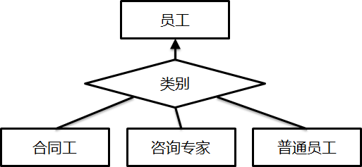

### 第一章 预备知识

#### 1.1 什么是系统

软件模块化：将总体功能分成多个子功能，系统是应用软件的一个模块

模块化的标准：信息隐藏

KWIC索引问题：滚动单词，将单词行的首个单词取出放到末尾，将所有位移进行穷举并按字母顺序输出。

每个模块提供接口（简单：传递的东西要少），将信息隐藏在模块内部，降低耦合度（优点：改起来方便，只改一部分）

功能、性能、易用性不能同时

1.2 系统的特性

#### 1.3 什么是数据管理系统

数据管理系统是具备**通用性**的系统软件

数据的功能：信息载体，事实凭据

数据管理功能：

+ 数据持久性：经常备份
+ 数据可用：组织起来方便查询
+ 数据真实性
+ 数据处理平台：排序、累加等
+ 信息安全

数据管理系统的目的：

找到不同应用的共同**数据管理**需求

1.4 课程内容安排

关系数据库 文档数据库的基本功能、内部实现原理、设计方法。事务处理场景、数据分析场景

1.5 程序的模块化设计

课后习题

### 第二章 文档数据库

#### 2.1 数据库系统基本概念

数据的组织结构（数据模型）：

+ 键值对
+ 实体-属性

#### 2.2 文档模型

文档数据库：json文档，属性值为字符串、数字、日期等，也可以嵌套文档（属性值为object），也可以是数组。两个文档属性取值可以完全相同，通过ID（\_id）来唯一识别，12bytes

文档的匹配

+ 如果文档A中所有属性都在B中出现，而且属性取值一致，那么就说明B是A的一个匹配。
+ 如果B是A的匹配，那么A一定可以通过对B剪枝得到
+ 范围条件也可以形成匹配

$$文档(Document) \in 文档集(Collection) \in 数据库(Database)$$

#### 2.3 文档数据库基本功能

+ 切换数据库：use myDB
+ 创建文档集（如果没有）并插入数据（文档）：db.myNewCollection.**insertOne**({x:1})
+ 只创建文档集：db.createCollection("myBook",{max:5000})（这个文档集最多能容纳5000条文档）
+ 插入多条数据：insertMany({},{},{})
+ 文档查询（文档匹配，以与的形式）：db.person.**find**({})
  + 多值匹配："city":{$in:["",""]} 
  + 多值匹配：$or:[{"city":"shanghai"},{}]
  + 范围匹配lt lte gt gte："city":{\$gt:2000,\$lgt:2002}
  + 指定需要返回的属性：find({查询句子},{返回属性}) 返回属性的格式："name":1,"city":1
  + 更新一个文档，只有第一个被查到的会更新：updateOne({查询句子},{$set:{属性+值}})
  + 更新多个文档：updateMany
  + 文档删除：deleteMany({查询句子}) deleteOne

#### 2.4 文档是如何存储的

存储体系结构：

+ CPU寄存器
+ 高速缓存cache
+ 内存DRAM
+ 磁盘disk

热数据：经常被访问的数据

硬盘：连续地址的存储空间，文档防止浪费，如果逐个写入，修改删除麻烦，需要重新分配一个空间，原来的空间形成空洞

硬盘划分成多个数据块，每个数据块存储空间单独管理

数据块：

- 文档存储空间和硬盘空间管理的最小单元
- 页头（数据库基本信息，文档数量，空闲空间），文档存储空间，指针列表（每个文档的存放位置）

#### 2.5 文档集的物理组织

文档集存在.wt文件，以inode方式组织

目录项（数据库名.文档集名对应inode编号），inode编号，inode指针，数据块

inode结构对插入比较友好（写入最后一个数据块），对查询更新删除不友好（需要查询到所有数据块写回硬盘）

#### 2.6 B树索引

索引是对文档的某一个属性值或多个属性值进行排序，快速搜索属性值，定位文件块

常用索引有B树，B+树，hash表和跳表

B+树结构：

+ 根节点：单个节点
+ 中间节点：key值和指向下一层节点的指针
+ 叶子节点：对所有key值（文档的属性值，最常用id）进行排序。
  + key值
  + key值对应的文档数据块地址
  + 指向下一个叶子节点的指针
+ 根节点和中间节点称为非叶子节点或索引节点，用于检索叶子节点
+ 索引节点可以包含多个key值，每个key值指向一个孩子节点（多路特性，m路表示索引节点最多有m个孩子节点）

#### 2.7 B树索引的特性

m阶B+树的特征：

+ 从根节点到叶子节点所有路径等长
+ 索引节点的key值对应其指向的孩子节点的max或min
+ 叶子节点从左到右升序
+ 根节点至少两个孩子节点，其他索引节点至少m/2个孩子节点

B+树中只有叶子节点含有指向数据块的指针，因此每次查询都需要检索到叶子节点。

支持范围查询

#### 2.8 B树索引的插入与删除

自底向上的构建过程

叶子结点键值小于最大值m，大于最小值的时候，直接插入。

叶子节点的键值多于m的时候，新增一个叶子节点，在上面新增一个key，递归更新

直接删除，更新key值，可能会失去一个叶子节点

#### 2.9 索引的创建和使用

创建索引指令：createIndex({要创建的属性字段：1（升序排列），（可以多个字段复合）})

如果要用复合索引实现快速查询，需要在查询语句中包含索引的第一个属性

默认每个文档集一个索引，自动在ID属性创建索引，代替Inode结构，构建B树（主键索引），在主键索引结构中，叶子节点的值唯一指向一个数据块地址，基于非主键构建的索引为辅助（二级）索引，叶子节点的键值可以指向多个数据块地址（因为值不唯一）

索引的缺点：

+ 耗费存储空间
+ 增减更新操作的代价

创建索引的原则：

- 常用，经常被当做查询条件的属性
- 稳定，不会经常修改的属性
- 区分度高，值相同很少的属性

#### 课后习题

第*1*题(本题2分)：一个文档数据库里面有两类对象，书（book）和人（person）。书和人之间存在一种写作的关系，即某个人是某本书的作者。请问这种写作关系的信息应该如何存放？    

------

A：在描述书的文档中增加一个“作者（author）”属性，取值为其作者的名字。

B：在描述人的文档中增加一个“著作（writing）”属性，取值为其著作的标题。

**C：在描述书的文档中增加一个“作者（author）”属性，取值为其作者的ID。**

D：A和B均可。

第*2*题(本题2分)：文档数据库允许一个属性有多个取值，比如{...colors: ["red", "blank"] ...} 或者 {...hobbies: ["red", "blank"]  ...}。那么，哪些文档满足以下查询db.inventory.find( { tags: ["computer", "music"] } )？    

------

**A：仅{... tags: ["computer", "music"]... }**

B：{... tags: ["computer"]... }和{... tags: ["music"]... }

C：{... tags: ["computer", "music"]... }和{... tags: ["computer", "music", "movie"]... }

D：{... tags: ["computer"]... }和{... tags: ["music"]... }和{... tags:  ["computer", "music"]... }和{... tags: ["computer", "music", "movie"]... }

第*3*题(本题2分)：数据库系统的增、删、改、查操作中的改操作（update）通常可以由一个删操作（delete）和一个增操作（create）实现。那么为什么我们不把“增、删、改、查”（CRUD）简化为“增、删、查”（CRD）？以下哪个理由不成立？    

------

A：先删后增虽然可以代替改，但其性能可能比改差。

B：先删后增的程序写起来比较复杂，没有一个单独的改操作简洁。

C：先删后增是两个独立的操作。如果中间出现状况（比如掉电或者bug），会出现只删未增的情况，导致数据正确性问题。

**D：这只是一种习俗，二者并没有什么本质区别。**

第*4*题(本题2分)：大部分系统都是对存储空间进行分页管理的。请问，分页模式的优势不包括？    

------

A：有利于减少存储空间的碎片化，提升空间利用率。

B：有利于提升数据访问的性能。

**C：有利于提升内存缓存的效率。**（内存速度是定了的）

D：有利于减少空间管理的成本（即减少空间管理对CPU和内存资源的消耗）。

第*5*题(本题2分)：课程中提到，内存由于比较昂贵且无法持久地保存数据，通常只作为数据缓存。那么，什么数据不适合被放在缓存中？    

------

A：经常被修改的数据

B：像Inode这样的组织结构数据

C：刚被插入的数据

**D：刚被删除的数据**

第*1*题(本题2分)：以下哪个因素不会显著影响B树的访问性能？    

------

A：树的高度

B：树的阶

C：节点的空间大小（通常一个节点为存储空间中的一页，因此可理解为页的大小）

**D：节点内部的数据充满度**

第*2*题(本题2分)：B树的平衡性主要由哪条性质保证？    

------

A：每个节点的大小固定

**B：每个节点的充满度都超过1/2**

C：叶子节点上的数据是有序的

D：以上性质都不能

第*3*题(本题2分)：如果我们在属性price上创建一个索引（比如使用指令db.myColl.createIndex( { price: 1 }) ），那么以下哪个查询可以无法从这个索引获益？    

------

A：db.myColl.findone({ category:"apple", price:20 })

**B：db.myColl.findone({ category:"apple" })**

C：db.myColl.findone({ price:{$gte:20, $lte:30} })

D：db.myColl.findone({  category:"apple", price:{$gte:20, $lte:30}  })

第*4*题(本题2分)：如果我在多个属性上创建一个复合索引，例如db.myColl.createIndex({ score: 1, price: 1, category: 1 })，那么以下哪个查询无法从索引获益？    

------

A：db.myColl.find({ category:"apple", price:20, score:5 })

B：db.myColl.find({ score:{$gte:4} })

**C：db.myColl.find({ category:"apple", price:{$gte:20, $lte:30} })**

D：db.myColl.find({ category:"apple", score:{$gte:4} })

第*5*题(本题2分)：请问以下哪种情况最适合使用索引？    

------

**A：属性a常用作查询条件，属性b频繁被修改。在a上创建索引。**

B：属性a常用作查询条件，属性b频繁被修改。在b上创建索引。

C：属性a常用作查询条件，文档频繁被插入和删除。在a上创建索引。

D：属性a常用作查询条件，属性a频繁被修改。在a上创建索引。

**思考题1：**当我们对存储空间进行分页管理的时候，页的大小通常是一个设计要点。有的数据管理系统选择使用比较小的页，如2KB或4KB。而另一些系统会使用比较大的页，比如4MB或8MB。请问：小页面对什么情况有利？大页又对什么情况有利？我们确定页的大小时应该考虑哪些因素？

 

**思考题2：**如课程中提到的，内存通常被数据管理系统作为缓存使用。缓存的数据单元可以有不同的选择；可以是页，即当访问完一页后，将整个页继续保留在内存中，以期后面再次访问该页就无需再从硬盘获取；也可以是文档，即当访问完一页中的某个文档后，将这个文档继续保留在内存中，而将页移除，以期后面再次访问该文档时无需再从硬盘获取。请问：页缓存和文档缓存各自的优势和劣势是什么？什么情况下，我们可以考虑使用文档缓存？

lab1 mongodb的操作

### 第三章 文档数据库设计

#### 3.1 数据库设计基本概念

数据库设计的定义：对于给定的应用环境，设计数据库逻辑模式和物理结构，建立数据库，用户需求包括信息管理和数据操作

- 存什么：存储哪些数据对象
- 怎么存：数据对象怎么组织
- 如何访问：应用程序如何访问数据对象

设计基本步骤：

- 需求分析：应用软件基本功能
- 概念结构设计：对象和对象之间的联系，（信息结构）概念模型
- 逻辑结构设计：概念模型转换成数据管理系统所支持的数据模型，确定数据对象和逻辑组织方式
- 物理结构设计：物理存储结构、索引
- 数据库实施：创建数据库，编写程序
- 数据库运行与维护

#### 3.2 文档数据库设计实例：需求分析

eg：博客网站业务流程

概念模型：er图（实体、属性、联系）

- 实体：矩形框
- 属性：椭圆框
- 联系：菱形框，1:1,1:n，m:n

实体：博主 博客 评论

实体和属性划分原则：

- 属性不可再分
- 属性不可与其他实体有联系，联系只能存在于实体和实体之间
- 自底向上设计各个子系统er图，消除冗余

#### 3.3 文档数据库设计实例：概念设计

#### 3.4 不同文档结构设计的比较

将er图转换为文档模式的规则：

- 一个实体转换为一个文档集，属性转换为文档的属性，实体的1:1联系与任意一端对应的文档模式合并，合并端文档模式中加入另一端实体型的唯一性属性（ID）和联系本身的属性，m:n关系转化为独立的文档模式，联系两端实体的唯一性属性和联系本身的属性构成这个文档模式的属性
- 多个实体转为一个文档，嵌套文档，一个文档集包含多个实体型，一对n的n端文档嵌入1端文档。
- 某种文档组织方式使得实现应用功能更加简单，性能更高，那么该文档组织方式则更优。
- 模式三中的Doc文档集冗余存储了博主名name，其原因是（1） 博客网站的应用需求总是同时查询博客内容和博主名，评论内容和点评人名。在Doc和comment中存储博主名可以避免读取User文档集，从而减少磁盘IO操作；（2）博客网站中博主名是不经常更改的，因此冗余存储不会增加额外的维护开销。

#### 3.5 文档数据库设计实例：结构设计

物理组织方式包括基于Inode的文档集组织和基于B+树索引结构的文档集组织

#### 3.6 文档数据库设计的方法

第*1*题(本题2分)：在数据库设计中加入冗余属性可以有什么好处？    

------

**A：有利于提升数据查询的性能**

B：有利于提升数据更新的性能

C：有利于数据库的维护

D：有利于降低软件开发的复杂度

第*2*题(本题2分)：我们在描述人的文档中记录他以导演、演员或编剧的身份参与过的影片。一种方式是按照身份对影片进行分类 {导演的影片[{...}], 演员的影片[{...}], 编剧的影片[{...}]}。另一种方式是在每一部影片中对参与方式进行标注  {影片[{..., 参与方式:(导演/演员/编剧)...}]}。对这两种方式的优缺点描述正确的是：    

------

A：前一种方式便于统计一个人参与影片的个数

B：前一种方式便于查找一个人是否参与过某部影片

**C：前一种方式便于统计一个人导演过影片的个数**

D：前一种方式比后一种方式几乎没有优势

第*3*题(本题2分)：什么时候适合将一种对象嵌入到另一种对象中存储？    

------

A：子对象对父对象有明确的依附关系，比如一个书中的章节或者一个账户中的优惠券。

B：应用总是通过父对象去访问子对象（这很重要），比如一篇文章的评论

C：一个子对象只属于唯一一个父对象，否则子对象会被多次存储

**D：以上皆是**

请针对以下需求设计一个文档数据库的模式：
一个关于电影、制作人员和演员的网站（类似一个简易的IMDB网站）。用户可以浏览每一部电影的简介和相关信息（出品年份、电影类型、时长、评级），以及其导演、编剧和演员的列表。用户还可以浏览每一位导演、编剧或演员的信息（姓名、性别、年龄、简介），以及他们参与过哪些电影作品。导演、编剧或演员只是职位，一个人可以身兼数职。用户登录后还可以针对每一部电影、每一位导演、编剧或演员进行评价和打分，供别人参考。


请在上一次作业中关于电影网站的数据库设计基础上进行追加设计，实现以下功能：

每一位演员在其参演的电影中都扮演一定的角色。用户在浏览电影时，除了能看到演员信息，还能看到每位演员扮演了什么角色。用户在浏览演员时，除了能看到他（或她）参演的电影，还能看到他（或她）在每一部电影中扮演的角色。

注意：一位演员可以在一部电影中扮演多个角色。同一个角色也可能由多名演员扮演，比如，年少时由一位演员扮演，年老时由另一位演员扮演。

#### lab2 mongodb CRUD操作

排序：sort('列名', 升序或降序)

偏移：.skip(2)   .limit(2)指定要取的结果数量

\$set \$inc:{列名:数字}

.distinct(列名)

### 第四章 关系数据库

#### 4.1 关系数据库简介

建立在关系模型基础上，借助集合代数处理数据

最早出现的数据模型：层次模型、网状模型->关系模型

#### 4.2 网状模型的问题

层次模型使用树形结构表示实体联系，无法表示多对多

网状模型使用有向图结构，可以描述多对多，但是根据数据的组织结构定义了数据的存取路径和处理逻辑，面向过程

这两种需要了解数据库内部组织形式并设计程序逻辑，耦合紧

#### 4.3 关系数据库构建思想

好的数据管理系统特征：

- 数据库和应用独立
- 数据访问语言简洁（关系代数，结构化查询语言SQL）
- 数据模型表达实体和实体联系

#### 4.4 关系模型

1. 关系数据结构

   关系是二维表

   表头：关系模式

   列：属性

   表内记录每一行：元组

   所有记录统称为关系

   如果某一属性组的值可以唯一标识一个元组，而且子集不可以的（这一行里的一个或多个属性）：候选码。候选码的属性称为主属性，不包含在内的为非主属性或非码属性

   主码是关系中的某一个候选码（primary key）

   关系是元组的集合，元组中的属性提前定义，并且每个元组必须包含所有属性，属性遵守数据类型和长度

2. 关系操作

   CRUD操作，查询操作分为选择（select）、投影（project）、连接（join）、除（divide）、并（union）、交（intersection）、差（except）、笛卡尔积，操作对象和结果都是关系

   关系代数、关系演算和SQL统称为关系数据语言

   关系完备性

3. 关系完整性约束

   关系遵守约束条件：

   - 实体完整性：主码属性值不能重复，不能空（PRIMARY KEY）
   - 参照完整性：外码约束，主码和外码的引用约束，参照关系中的外码取值必须来自于被参照关系中主码的取值。（FOREIGN KEY、REFERENCES）
   - 用户定义完整性：某属性不能为空，需要大于0，需要唯一等用户要求（NOT NULL、CHECK、UNIQUE）

#### 4.5 关系代数的概念

关系代数是抽象的查询语言，关系运算来表达访问需求，查询语言的理论基础

- 集合运算
- 关系运算：选择 投影 连接 除
- 比较运算
- 逻辑运算

#### 4.6 选择和投影操作

选择（sigma）：一元算子，从关系R中选择满足条件的所有元组

投影（大pai）：一元算子，从关系R中选择出若干属性**列**组成新关系，投影之后的结果不能包含重复的元组

#### 4.7 连接操作

连接（$\Join$）：从两个关系的笛卡尔积中选取满足给定条件的元组，有一个连接条件，连接条件对应两个表的两个属性组，这两个属性组列数相等，属性值具有可比性。根据连接条件，对两个表的笛卡尔积做过滤。

笛卡尔积指的是表A有k行，表B有j行，那么笛卡尔积就是jxk行

- 内连接：等值连接就是比较运算符为=的连接运算
- 自然连接：特殊的等值连接，进行比较的属性组同名，并在连接后去掉重复的属性列，不用写连接条件
- 外连接：保留悬浮元组，左外连接就是保留左边关系R中的悬浮元组，没有与右边相连接的元组，因此在S关系的属性上填空值，R=$\Join$S

#### 4.8 关系代数表达式

由关系代数运算有限次复合而成的式子是关系代数表达式。

假设我们有三个关系（同课程中使用的例子一样），其模式分别为

```
Student(s_no, s_name, birthday, gender)
Course(c_no, c_name, credit)
SC(s_no, c_no, grade)
```

请写出可获得以下信息的关系代数表达式：

1. 在数学课上成绩超过90分的男生姓名；

   选择course的数学

   选择SC的grade>90

   按照课程号连接两个表

   选择student的male

   按照学号连接两个表

   投影到姓名列

2. 数学课成绩超过历史课成绩的女生姓名。

   分别选择出数学和历史，按照课程号连接course和sc，这个连接后的表里有每一个学生每一课的成绩

   然后将这两个表比较，数学表大于历史表为连接条件

   按照学号连接student，选择female，投影到name

第*1*题(本题2分)：声明式编程语言的优势有哪些？(1) 程序简单；(2) 程序运行效率高；(3) 程序运行过程可控。    

------

A：(1) (2) (3)

B：(1) (2)

**C：(1)** 

D：都不是

第*2*题(本题2分)：关于关系代数的描述，不正确的有：    

------

A：关系代数的计算对象是集合

B：关系代数的计算结果是集合

C：一个关系也是一个集合

**D：关系代数的计算符号有且仅有：选择、投影、连接**

第*3*题(本题2分)：请思考，索引可以用于加速关系代数中的哪些计算？    

------

A：仅选择

B：选择和投影

C：选择和连接

**D：选择、投影和连接**

第*4*题(本题2分)：关于在表A和表B上实施的连接操作，哪种说法不对？    

------

A：连接结果的元组个数可能比表A和表B的元组个数都多。

B：连接结果的元组个数可能比表A和表B的元组个数都少。

**C：连接结果的元组个数不可能比表A和表B的元组个数都少。**

D：如果连接条件为A.x=B.x，且属性x在表A中没有重复取值，那么连接结果的元组个数不可能比表B的元组个数多

#### lab3 mongodb聚合和索引

聚合操作：通过对数据分组后做一些简单的运算（平均，求和，最值）

表名.aggregate([{聚合操作名：{操作参数}},{},{}])

### 第五章 SQL

#### 5.1 SQL语言从何而来

结构化查询语言SQL是关系数据库的标准语言

产生：关系代数表达式

#### 5.2 SQL语言概览

基本功能：

- 数据定义：create drop alter（修改表，加入列，删除列，修改约束条件） truncate（删除表中所有行）
  - cascade级联删除，删除列的时候，引用列的对象也删除
  - restrict表示如果被引用就不能删除
- 数据查询：select
- 数据操纵：insert update
- 数据控制：grant deny revoke
- 事务控制

建立索引：create index 索引名 on 表名（列，列）

#### 5.3 SQL语言中的DDL

DDL数据定义语言，用于处理数据的命令为数据操纵语言：DML

#### 5.4 SQL数据插入

插入元组、子查询结果

insert into 表 [列，列] values （值1，值2）

字符串常数要用单引号（英文符号）括起来

update 表 set  [列=表达式，列=表达式] where 条件

delete from 表 where 条件

#### 5.5 SQL单表查询

查询语句主要是select（要查询的列） from（表名） where（查询条件）group by（分组聚集查询） order by（排序）

select distinct去重

#### 5.6 SQL多表查询

连接查询

WHERE Student.Sno = SC.Sno扫描|student|次sc表

where包含多个连接（表的一个属性等于另一个表的另一个属性）和选择条件（表的属性和某个值比较），多个条件用and连接，先执行选择再执行连接

#### 5.7 SQL聚集查询

聚集是指统计的函数，查询成为聚集查询。

distinct去重，all不去重

select 列-> select count(\*)

#### 5.8 SQL分组聚集

group by 引导的分组聚集是一种复杂的聚集查询：

- 先将查询结果按某列或多列分组，值相等为一组
- 对每一分组聚集函数计算统计结果

在分组聚集查询中，select的目标表达式只能是分组属性列或聚集函数，不能是其他属性列。

having再筛选出select出的内容里符合要求的元组（having作用于分组，子句是聚集函数）

#### 5.9 SQL嵌套查询

外层查询 in 内层查询

首先执行子查询，父查询将子查询的结果视为一张表

子查询不能使用order by

比较运算符的子查询、带有ANY（SOME）或ALL谓词的子查询以及带有EXISTS谓词的子查询

#### 5.10 SQL相关子查询

父查询表（x）出现在子查询的选择条件中（y.sno=x.sno），需要从父查询的表中取出每个元组，分别将值代入子查询，执行子查询，计算出这个学生的平均成绩，然后查找这个学生成绩大于平均成绩的的课，重复若干次。

#### 5.11 SQL的函数-视图

视图是重复使用的查询结果，是从一个或几个表导出的表。只存放视图定义，不存放数据，首先执行视图的sql查询语句，然后在视图结果上进行查询

create view 视图名 （列，列） as 子查询

把视图定义中的子查询和此查询结合起来，转换成等价的对基本表的新查询，然后执行新查询。

对视图的更新最终是转换成对基本表的增、删、改

#### 5.12 SQL的更新和删除


第*1*题(本题2分)：外键约束起哪些作用？（1）告诉数据库系统数据中的引用关系；（2）明确外键所在元组存在依赖于它指向的主键的存在；（3）告诉数据库系统外键指向的主键不能被随意删除。    

------

**A：（1）（2）（3）**

B：（1）（2）

C：（1）（3）

D：（2）（3）

第*2*题(本题2分)：对于一张学生表Student (s_no, s_name, birthday, gender)，我们可以将主键定义在单个属性s_no上，也可以将定义在复合属性 (s_no,s_name) 上。请问那种方式更优？    

------

**A：s_no作为主键更优**

B：(s_no,s_name)作为主键更优

C：两者各有优势

D：以上说法均不对

第*3*题(本题2分)：你觉得在什么样的属性上适合使用Not Null这样的约束？    

------

A：一个人的住址

B：学生选课表中的成绩

**C：一本出版物的出版社**

D：一门课的教材

第*4*题(本题2分)：关于SQL查询和关系代数之间的关系，以下哪个说法是不正确的？    

------

A：一个SQL查询的结果不一定是一个关系

**B：求表T在属性a,b上的投影，应使用查询 Select a,b From T**（投影必须去重）

C：求表T在属性a,b上的投影，应使用查询 Select Distinct a,b From T

D：求条件a>10在表T上的选择结果，应使用查询 Select * From T Where a>10

第*1*题(本题2分)：考虑以下4个查询 

Q1: Select a,b From T1, T2 Where T1.c=T2.c And T1.c=100; 

Q2: Select a,b From T1, T2 Where T1.c=100 And T2.c=100; 

Q3: Select a,b From T1, T2  Where T1.c=T2.c And T1.c>100;

Q4: Select a,b From T1, T2 Where  T1.c>100 And T2.c>100; 说法正确的是：    

------

**A：Q1和Q2结果相同；Q3和Q4结果不同；**

B：Q1和Q2结果不同；Q3和Q4结果相同；

C：Q1和Q2结果相同；Q3和Q4结果相同；

D：4个查询结果均不同。

第*2*题(本题2分)：在学生表Student(s_no, s_name, birthday, gender)和学生选课表SC(s_no, c_no, grade)中求**每个学生的姓名和平均成绩**。哪个查询表达正确？    

------

A：Select s_name, AVG(grade) From Student, SC Where Student.s_no=SC.s_no Group By Student.s_no 

B：Select s_name, AVG(grade) From Student, SC Where Student.s_no=SC.s_no Group By SC.s_no

C：Select s_name, AVG(grade) From Student, SC Group By SC.s_no

**D：Select s_name, AVG(grade) From Student, SC Where Student.s_no=SC.s_no Group By SC.s_no, s_name**（因为要查询s_name的话，必须要在group by里出现一次）

第*3*题(本题2分)：以下哪些查询是等价的？    （count(\*)表示计算行数）

------

A：Select Count(\*) From T Where b>100 Group By a 和 Select Count(\*) From T Group By a 

B：Select Count(\*) From T Where b>100 Group By a 和 Select Count(\*) From T Group By a  Having AVG(b)>100

**C：Select AVG(a) From T Where a<10 Group By a 和 Select AVG(a) From T Group By a Having AVG(a)<10**（演我是吧，本来avg也没什么用）

D：Select a,AVG(b) From T Where b>100 Group By a 和 Select a,AVG(b) From T Group By a Having AVG(b)>10（where是先筛选，having在groupby之后执行）

第*1*题(本题2分)：以下查询将得到什么结果？

SELECT COUNT(*) FROM Student 

WHERE Sno IN (SELECT Sno FROM SC 

WHERE Cno IN  (SELECT Cno FROM Course 

WHERE Cname= '数学' ) AND grade > 60 ) AND  gender = 'F';    

------

A：选修了数学课的学生人数

B：选修了数学课的女生人数

**C：在数学课上成绩超过60分的女生人数**

D：选修了数学课并且在所有课程中成绩都超过60分的女生人数

第*2*题(本题2分)：以下查询将得到什么结果？

SELECT Sno FROM SC 

Group By Sno Having AVG(grade) > (SELECT AVG(grade) FROM SC Where Cno = 'C001' );    

------

A：在C001课程上超过平均成绩的学生学号

B：平均成绩超过在C001课程上成绩的学生学号

**C：平均成绩超过C001课程平均成绩的学生学号**

D：选修了平均成绩超过C001课程平均成绩的课程的学生学号

第*3*题(本题2分)：以下查询将得到什么结果？

SELECT Sno, Count(Cno) FROM SC x 

WHERE Grade >= (SELECT AVG(Grade)  FROM SC y WHERE y.Cno = x.Cno ) Group By Sno;    

------

A：在每门课上的成绩都超过该门课平均成绩的学生

**B：每个学生在多少门课程上的成绩超过了课程平均成绩**

C：每个学生在多少门课程上的成绩超过了他所有选修课程的平均成绩

D：每个学生在多少门课程上的成绩超过了所有人的平均成绩

第*4*题(本题2分)：以下对视图的说法正确的是：    

------

A：视图的使用可以提升查询的性能

B：视图是虚拟的，因此不能在视图上实施数据的增删改

C：视图之上不能构建新的视图

**D：视图的使用可以增加软件开发的效率**

\1. 关系数据库让用户自行定义每一张表的Primary Key（主键），用于唯一识别表中的每一行数据。例如学生表student(sno, sname, birthday, gender)的主键可定义为为sno，宿舍表rooms(dorm_no, room_no, size, floor)的主键可定义为(dorm_no,  room_no)（由宿舍号和房间号组成的复合主键）。在文档数据库中，用户无需定义主键，每一个文档都可以由系统自动产生的省缺ID进行识别。换句话说，文档数据库的ID属性起到了Primary Key的作用。请思考：关系数据库的Primary Key机制和文档数据库的ID机制有什么不同，各自的优缺点是什么？

 关系数据库人为指定，有含义

可以复合

文档数据库的id不能从逻辑上对数据唯一标注

\2.  关系数据库要求用户在使用一张表之前用DDL对表进行事先定义，并且给出表需满足的各种约束（比如主键、外键等）。文档数据库则不同，它通常不要求用户对文档集的结构做事先定义，甚至允许用户往文档集中插入任意结构的文档。请思考：关系数据库和文档数据库为什么使用了两种不同的功能设计？背后的原因是什么？

 按行存储

\3. 如果我们在属性A上定义了Primary  Key或Unique这样的约束，那么数据库将要求表中的任何一个元组在A上的取值都是唯一的。也就是说，当我们往表中重复插入A值时，数据库将立即感知到，并禁止我们这样做。请问：数据库是如何感知我们往表中重复插入A值的？

A值可以建立索引，快速比较表中的所有A值

假设我们有三个关系（同课程中使用的例子一样），其模式分别为

```
Student(s_no, s_name, birthday, gender)
Course(c_no, c_name, credit)
SC(s_no, c_no, grade)
```

请写出以下信息需求的SQL查询：

1. 在数学课上成绩超过90分的男生姓名；

   select s_name from student,course,sc where student.sno=sc.sno and sc.cno=course.cno and cname='数学' and grade>90 and gender='male'

2. 数学课成绩超过历史课成绩的女生姓名；

   Select s_name

   From Student, SC SC_1, SC SC_2, Course C_1, Course C_2

   Where Student.gender = “female”

   AND C_1.c_name=“Math” AND C_2.c_name=“History”

   AND Student.s_no = SC_1.s_no AND Student.s_no = SC_2.s_no

   AND SC_1.c_no = C_1.c_no AND SC_2.c_no = C_2.c_no

   And SC_1.grade > SC_2.grade

3. 平均成绩超过90分的女生姓名。

   Select s_name
    From Student, SC
    Where Student.s_no = SC.s_no And gender=”female”
    Group By SC.s_no, s_name
    Having AVG(grade) > 90

假设我们有三个关系（同课程中使用的例子一样），其模式分别为

```
Student(s_no, s_name, birthday, gender)
Course(c_no, c_name, credit)
SC(s_no, c_no, grade)
```

请写出满足以下访问需求的SQL语句：

1. 删除所有平均成绩小于70分的课程；
2. 找到在所有课程上的成绩都超过课程平均成绩的学生。

#### lab4 postgreSQL的安装和操作

### 第六章 查询处理实现技术

#### 6.1 关系数据库基本架构

- 存储层：组织和存储数据，数据存取
- 计算层：根据查询读取数据，在存储层读取的数据上，执行sql计算语句
- 事务层：处理事务

表的存储方式是按行或列存放在物理页中，每个物理页多个元组，再通过表头将所有物理页串联起来，inode或索引

#### 6.2 SQL查询执行过程

1. sql解析：将sql语句转换成关系代数表达式，语法检查，语义分析，语法分析树
2. 查询优化
   - 代数优化：对语句的关系代数表达式等价变换，改变操作次序
     - 选择运算先做，可以减少中间结果
     - 投影和选择同时进行，避免重复读取
     - 笛卡尔积转变为连接运算（等值连接）
     - 公共子表达式先计算，并写入中间文件
   - 物理优化：选择合适的存取路径、关系运算的实现算法（连接：哈希连接，选择：索引扫描）
     - 选择：全表扫描，索引扫描
     - 连接：嵌套循环，排序合并，散列连接，索引连接
     - 小关系全表扫描，大关系如果索引占整个关系的比例较小，索引扫描
     - 连接的两个表已经按照连接属性排序，则使用排序合并；如果属性有索引就索引连接；如果一个表较小就散列连接；嵌套循环时左表为较小的表（多次遍历）
     - 根据数据字典的统计信息，选择操作算法：定量选择
3. 查询执行：代码生成器执行查询计划的代码

查询处理代价=IO代价+CPU代价+内存代价

#### 6.3 数据处理的性能问题

#### 6.4 选择算子的实现

- 全表扫描：基于inode读取 表的第一个物理页，检查每个元组，如果满足条件就输出，重复B次，表占用B个物理页。cost=B
- 索引扫描：基于B+树找到值所在的叶子节点，直接找到物理页，需要B+树从根节点到叶子节点共L个物理块，执行代价为L+S。

对于大表，选择基数S较小的时候，可以使用索引扫描

#### 6.5 投影算子的实现

投影需要对属性列的值进行去重，先要排序（外排序算法）

1. 生成归并段，在每个归并段采用内排序算法，数据占用B个物理页，则cost=2B
2. 多路归并排序，所有数据访问一遍，执行代价为B，顺便去重

#### 6.6 连接算子的实现-嵌套循环

读取左表的一个元组，与右表所有元组等值检查，双层嵌套循环，较小的表作为左表，减少IO代价

#### 6.7 连接算子的实现-散列连接

利用相同的hash散列函数，将两个表划分为多个小表，S和R每个对应小表Sno的取值范围一致，对小表做连接

#### 6.8 连接算子的实现-索引连接

读取S表的第一个物理页，获取内存中S表的每个元组的sno，然后根据R的索引找到R中具有相同Sno值的元组，之后将S表的元组和R表的元组串接，再读取S的下一个物理页。。。

#### lab5 SQL复杂查询

### 第七章 关系数据库设计

#### 7.1 关系数据库设计

概念结构设计：用er图描述

属性：

- 唯一属性，唯一识别一个实体的属性，双向箭头
- 单值属性：针对某个对象，只有一个值的属性，单向箭头
- 多值属性：单向双箭头

逻辑结构设计：转换规则不同，关系数据库不支持数组和表嵌套。

实体转换规则：

- 一个实体转换为一个关系
- 唯一属性和单值属性构成关系的属性，唯一属性作为主码
- 多值属性转换为关系，唯一属性和多值属性是属性，也是主码
- 1:1联系与任意一端的关系合并，合并的关系模式中加入联系自身的属性和另一端的主码
- 1：n的联系与n端的关系合并，n端的关系中加入联系自身属性和另一端的主码
- 多对多关系转换为一个关系，两端的唯一属性和联系自身的属性作为该关系的属性

#### 7.2 博客实例的关系模式设计

#### 7.3 er图

#### 7.4 从er图到关系模式设计

#### 7.5 er图在博客实例中的应用

#### 7.6 关系数据库中的冗余

同一表中，某个属性的值重复出现，出现次数与另一个属性的值次数相同

关系模式中包含不由主码唯一确定的属性，就会造成数据冗余

完全函数依赖（依赖主码）才不会产生冗余

缺点：浪费存储空间，更新操作代价增加

#### 7.7 数据库设计的规范化

不存在冗余的数据库设计为规范化设计

#### 7.8 冗余带来的好处

对于经常查询销售额大于1000的商品名和用户名，可以有这种冗余->多表连接代价更高

- 存储空间不大
- 不会经常更新
- 经常查询

#### 7.9 如何利用冗余

#### 7.10 网上购物实例：概念设计

#### 7.11 网上购物实例：从er图到关系模式

#### 7.12 网上购物实例：从er图到文档模式

1. 下图所示的ER图刻画了四类实体，对“员工”而言，另三类实体（合同工、咨询专家和普通员工）都是它的子类。也就是说，员工拥有的属性，另三类实体都拥有；而子类拥有的属性父类未必拥有。请尝试设计这四类实体对应的关系表。



1. 请针对以下需求设计ER图，并构建相应的关系模式：
    一个关于电影、制作人员和演员的网站（类似一个简易的IMDB网站）。用户可以浏览每一部电影的简介和相关信息（出品年份、电影类型、时长、评级），以及其导演、编剧和演员的列表。用户还可以浏览每一位导演、编剧或演员的信息（姓名、性别、年龄、简介），以及他们参与过哪些电影作品。导演、编剧或演员只是职位，一个人可以身兼数职。
    每一位演员在其参演的电影中都扮演一定的角色。用户在浏览电影时，除了能看到演员信息，还能看到每位演员扮演了什么角色。用户在浏览演员时，除了能看到他（或她）参演的电影，还能看到他（或她）在每一部电影中扮演的角色。（注意：一位演员可以在一部电影中扮演多个角色。同一个角色也可能由多名演员扮演，比如，年少时由一位演员扮演，年老时由另一位演员扮演。）
    用户登录后还可以针对每一部电影、每一位导演、编剧或演员进行评价和打分，供别人参考。

一个校园学术活动网站。所有学生和老师都可以成为网站的用户，将自己组织的学术活动在网站上发布，比如学术讲座、读书会等等。发布活动时需要指定活动的标题、时间、地点、类别和内容。一旦活动发布，其他用户就可以浏览活动的内容并报名。通常活动有人数限制，活动发起人可以选择部分报名者成为活动参与人，也可以开放给所有报名者参与。活动结束后，参与人可以给活动打分，并写评论记录活动内容。每位用户发起的所有活动将永久被网站记录，其他用户可以随时查看他发起活动的历史，以及平均得分。

请先用ER图为以上场景设计数据库模式，然后再根据应用访问数据库的方式对模式进行优化。（提示：需考虑索引的使用。）

第*1*题(本题2分)：在ER图中有一个叫Person的实体类，它的属性分别为：ID（唯一属性）、Name（单值属性）、Hobby（多值属性）、Skills（多值属性）。对该实体类进行关系模式设计，得到的结果应该是：    

------

A：Person ( ID, Name, Hobby, Skills )

B：Person ( ID, Name ) 、PersonHS ( ID, Hobby, Skills )

**C：Person ( ID, Name ) 、PersonH ( ID, Hobby ) 、PersonS ( ID, Skill )**

D：Person ( ID ) 、Person ( ID, Name ) 、PersonH ( ID, Hobby ) 、PersonS ( ID, Skill )

第*2*题(本题2分)：一个ER图中有学生和课程两类实体。假设一门课每学期都可以开一个班，而学校规定一个学生可以重复多次选修同一门课，并获得多次不同的成绩。以下关于“学生选课”的ER图设计，说法最正确的是：    

------

A：将“选课”作为学生和课程之间的一类联系，该类联系对应的关系表的主码包括两个属性：学号和课程号。

B：需增加“开课班”这一个新的实体类，它与课程之间是多对一的联系。而将“选课”作为学生和开课班之间的一类联系，该类联系对应的关系表的主码包括两个属性：学号和开课班ID。

C：需增加“学期”这一个新的实体类。而将“选课”作为学生、课程和学期三者之间的一类联系，该类联系对应的关系表的主码包括三个属性：学号、课程号和学期编号

**D：B和C均合理**

第*3*题(本题2分)：在ER图表示的世界中，每个实体都应该有一个ID，这个ID可以是它的一个唯一属性，比如身份证号，也可以由它的多个单值属性组成，比如电影票上的场次和座位号。如果没有这样的ID，该类实体对应的关系表就缺少主键。但对于联系，是否也应该有这样的ID？如果有，这个ID是什么？    

------

**A：一个联系的ID应该由参与联系的所有实体ID共同组成**

B：一个联系的ID应该由它的属性构成

C：一个联系的ID可以由它的属性以及参与联系的实体ID共同构成

D：一个联系不需要有ID

第*1*题(本题2分)：假设有一个员工表 Employee(ID, Name, Address,  Phone#)（其中ID为主键）。最初电话号码Phone#是一个单值属性，即每个人只有一个电话。后来发现，有少量员工有两个电话号码，且都需要记录。你会如何对数据库的结构设计进行调整？    

------

A：将Phone#的数据类型变成字符串，将两个电话号码用分号隔开，一起存在同一个字段中。

B：将主键变为 (ID, Phone#)，将有两个电话号码的人在表中存两份。

C：将模式修改为 Employee(ID, Name, Address)，Phone(ID, Phone#)。

**D：将模式修改为 Employee(ID, Name, Address, Phone#, Phone#Alt)，其中Phone#Alt用于记录另一个电话号码。**

第*2*题(本题2分)：关于数据冗余的说法，哪一项是不正确的？    

------

A：冗余会增加数据更新的代价

B：冗余会增加数据删除的代价

**C：冗余不会增加数据查询的代价**

D：冗余会增加软件开发的复杂度

第*3*题(本题2分)：对一张属性很多的表（通常称为“宽表”），为了提升表访问的性能，我们可以选择将表拆成两份或多份。比如，将 Employee (ID, name, salary, tax, mgr#, dept#) 拆成 Employee (ID, name,  salary) 和 Employee (ID, tax, mgr#, dept#)。请问做表拆分的原则应该是什么？    

------

**A：让同时被使用到的属性（即出现在同一个SQL中的属性）尽可能位于分拆后的同一张表中。**

B：让经常被更新的属性尽可能位于分拆后的同一张表中

C：让被索引的属性尽可能位于分拆后的同一张表中。

D：让可能为空的属性尽可能位于分拆后的同一张表中。

第*4*题(本题2分)：假设有一张表：行程表（旅客号码，导游号码，打卡景点），记录了哪些旅客被哪些导游带领去了哪些地方。我们发现了很多如下形式的规律：不同的旅客在同一位导游的带领下，如果去了景点A，那么必定也会去景点B。请问数据库中是否存在冗余信息，可以如何处理？    

------

A：没有冗余

B：有冗余，但无法通过结构设计去除

**C：有冗余，适当改变结构设计后可去除**

D：以上说法均不对

#### lab6 7 8 postgreSQL查询优化与执行，ORM，程序访问

### 第八章 数据正确性与事务处理

事务指用户定义的数据库操作系列，描述应用业务的逻辑，一个事务可以是一条SQL语句或一组，由BEGIN TRANSACTION和COMMIT/ROLLBACK之间的所有SQL语句组成

ROLLBACK表示事务回滚，即在执行过程中事务因某种故障不能继续执行，那么撤销已经完成的操作，使数据库回滚到事务开始之前的状态。

#### 8.1 OLTP和OLAP

#### 8.2 数据的正确性问题

#### 8.3 数据库操作原子性

#### 8.4 日志机制

数据库系统的故障

- 事务内部故障

- 系统故障

  - 没有执行COMMIT/ROLLBACK语句的事务称为未提交事务，事务撤销（UNDO）
  - 没有写回磁盘，事务重做（REDO）

  在提交和操作前，先写日志文件，按照时间次序

- 介质故障

#### 8.5 undo和redo日志

#### 8.6 并发控制

#### 8.7 应用层面的数据正确性

#### 8.8 用标志位防止数据异常

#### 8.9 用消息队列防止数据异常

#### 8.10 事务处理的概念

#### 8.11 事务的功能和性质

#### 8.12 合理使用事务

lab9 事务处理

### 第九章 如何选择系统

#### 9.1 OLAP与数据科学

#### 9.2 文档数据库vs关系数据库：易用性

#### 9.3 文档数据库vs关系数据库：可控性

#### 9.4 不同数据库系统的构建思路

#### 9.5 如何选择系统

