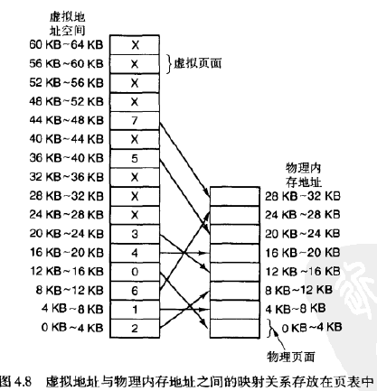

## 《操作系统设计与实现》 第四章

**2.在一个使用交换技术的系统中，按地址顺序排列的内存中的空闲块大小是10KB，4KB，20KB，18KB，7KB，9KB，12KB，15KB。对于连续的段请求：**
**a)12KB**
**b)10KB**
**c)9KB**
**使用最先匹配算法，哪个空闲块将被选中？对最佳匹配法、最坏匹配法和下次匹配法回答同样的问题。**

| 匹配算法     | a    | b    | c    |
| ------------ | ---- | ---- | ---- |
| 最先匹配算法 | 20   | 10   | 18   |
| 最佳匹配算法 | 12   | 10   | 9    |
| 最坏匹配算法 | 20   | 18   | 15   |
| 下次匹配算法 | 20   | 18   | 9    |

**6.使用图4.8中的页表，计算出下列虚拟地址所对应的物理地址：
 a)20
 b)4100
 c)8300**

a.8192+20=8212

b.4100

c.24576+(8300-8192)=24684

**11.一台32位地址的计算机使用了两级页表。虚拟地址被划分为三部分：9位的顶级页表字段、11位的二级页表字段和页内偏移。请问页面的大小是多少？在地址空间中总共有多少个页面？**

页面大小为$2^{12}=4KB$

页面数为$2^{20}$

**12.以下是一小段汇编语言程序（用文字来描述），用在一台页面大小为512字节的计算机上。该程序位于地址1020，它的栈指针位于8192（向0的方向增长）。请给出这个程序所产生的页面访问序列。假设每条指令占用4个字节（1个字），对指令和数据的访问都应该包含在访问序列之中。**

**将地址为6144的字装入寄存器0**
**把寄存器0压入栈中**
**调用起始地址为5120的函数，把返回地址入栈**
**5120把栈指针的值减去16**
**5124将实参与常量4进行比较**
**5126如果相等，跳转到5152**

程序访问的页面号序列：

1（指令），12（数据）

2（指令），15（数据）

2（指令），15（数据）

10（指令）

10（指令），15（数据）

10（指令）

**14.在一台计算机上，进程的地址空间有1024个页面，页表被保存在内存中。从页表中读取一个字的开销是500ns。为了减小开销，这台计算机使用了TLB，它能存放32对（虚拟页面号，物理页面号），查找时间为100ns。为了把页表的平均访问开销降到200ns，需要的TLB命中率是多少？**

$100\times x+500\times(1-x)=200$

$x=75\%$

**18.一台计算机有4个物理页面，每个页面的装入时间、最后访问时间、R位和M位如下所示（时间以时钟节拍为单位）：**

| 页面 | 装入时间 | 最后访问时间 | R    | M    |
| ---- | -------- | ------------ | ---- | ---- |
| 0    | 126      | 279          | 0    | 0    |
| 1    | 230      | 260          | 1    | 0    |
| 2    | 120      | 272          | 1    | 1    |
| 3    | 160      | 280          | 1    | 1    |

**a)NRU将替换哪个页面？
b)FIFO将替换哪个页面？
c)LRU将替换哪个页面？
d)第二次机会算法将替换哪个页面？**

a.最近未使用，淘汰RM编号最小的页面，替换0

b.先进先出，淘汰最早装入的页面，替换2

c.最近最久未使用，淘汰最后访问时间最早的页面，替换1

d.第二次机会寻找最老的页面2，由于R=1，给它第二次机会，替换0

**23.一台小型计算机有4个物理页面。在第一个时钟节拍时R位是0111（页面0是0，其他是1）。在随后的时钟节拍，这个值分别是1011，1010，1101，0010，1010，1100和0001。如果使用老化算法，计数器的长度为8位，请给出在最后一个时钟节拍后，这4个计数器的值。**

|       | 0111     | 1011     | 1010     | 1101     | 0010     | 1010     | 1100     | 0001     |
| ----- | -------- | -------- | -------- | -------- | -------- | -------- | -------- | -------- |
| 页面0 | 00000000 | 10000000 | 11000000 | 11100000 | 01110000 | 10111000 | 11011100 | 01101110 |
| 页面1 | 10000000 | 01000000 | 00100000 | 10010000 | 01001000 | 00100100 | 10010010 | 01001001 |
| 页面2 | 10000000 | 11000000 | 11100000 | 01110000 | 10111000 | 11011100 | 01101110 | 00110111 |
| 页面3 | 10000000 | 11000000 | 01100000 | 10110000 | 01011000 | 00101100 | 00010110 | 10001011 |

在最后一个时钟节拍后，这4个计数器的值分别是：01101110、01001001、00110111、10001011。

**24.在一个计算机系统上，磁盘的平均寻道时间为10ms，旋转时间为8ms，每道的容量为1MB。如果要把一个64KB的程序装入内存，这需要多长的时间？
 a)页面长度为2KB时。
 b)页面长度为4KB时。
 c)页面长度为64KB时。
 假设页面随机地分布在磁盘上。**

a.页面总数为32，时间为$32\times (8+10)=576ms$

b.页面总数为16，时间为$16\times (8+10)=288ms$

c.页面总数为1，时间为$1\times (8+10)=18ms$

**27.一台嵌入式计算机为每个进程提供了65536个字节的地址空间，并将它们划分为4096字节的页面。有一个程序，它的代码段为32768个字节、数据段为16386个字节、栈段为15870字节。请问，这个程序能被装入地址空间吗？如果页面大小为512字节，结果又如何？注意，在一个页面中，不能同时包含两个不同段的内容。**

页面大小为4096字节时：

代码段8个页面，数据段5个页面，栈段4个页面。进程总页面数最多为16个

不能放入地址空间。

页面大小为512字节时：

代码段64个页面，数据段33个页面，栈段31个页面。进程总页面数最多为128个

正好能放入地址空间。

**30.解释内碎片和外碎片的区别。哪一个发生在页式存储管理系统中？哪一个发生在段式管理系统中？**

内碎片和外碎片是指在内存空间分配时可能出现的浪费现象。

内碎片是指已经被分配给某个进程的内存空间中，由于内存分配单位的固定大小而导致未能完全利用的空间。例如，如果一个进程需要分配 7KB 的内存，而内存分配单位为 8KB，则最终实际分配给这个进程的空间是 8KB，其中有 1KB 的空间无法被利用，这就是内碎片。

外碎片则是指空闲链表中无法被任何进程使用的未分配内存空间。例如，如果系统中存在很多小块的未分配内存空间，而没有足够大的空间可以分配给某个进程，那么这些小块的空间就会形成外碎片。

在页式存储管理系统中，主要发生内碎片，因为页（或帧）的大小是固定的，并且进程所需的内存空间大小可能不是页的整数倍，因此会导致一定量的内碎片。

在段式管理系统中，主要发生外碎片，因为段的大小可以动态调整，所以内碎片相对较少，而由于不同进程的段的大小不一定相同，并且段之间存在空隙，因此容易产生大量的外碎片。
