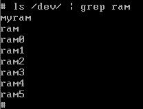
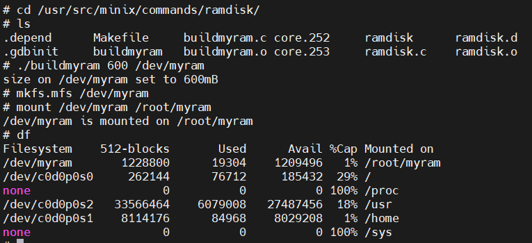
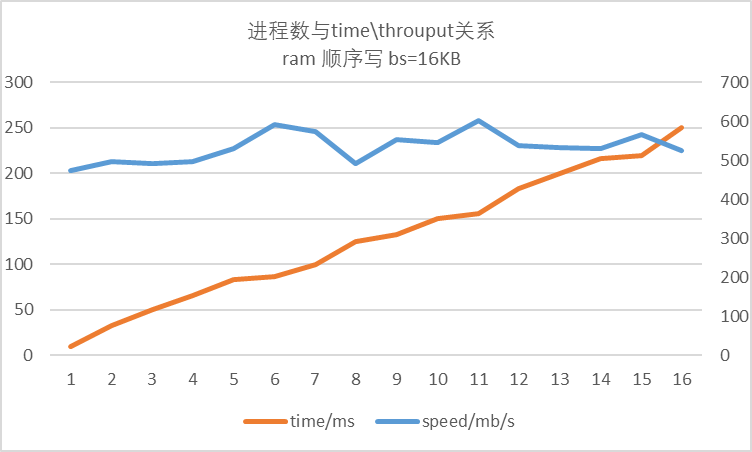
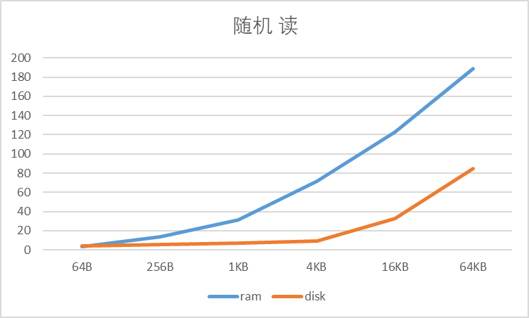
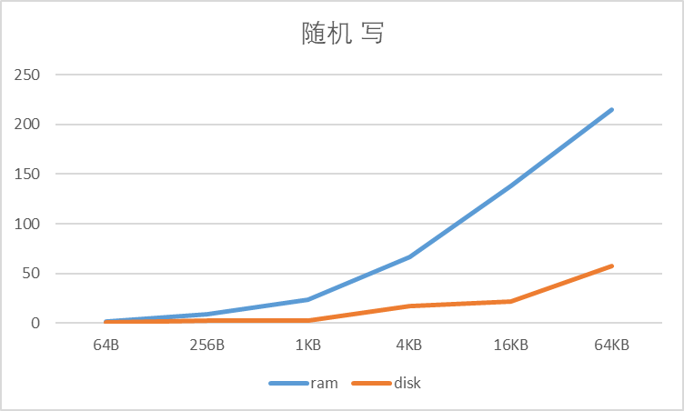
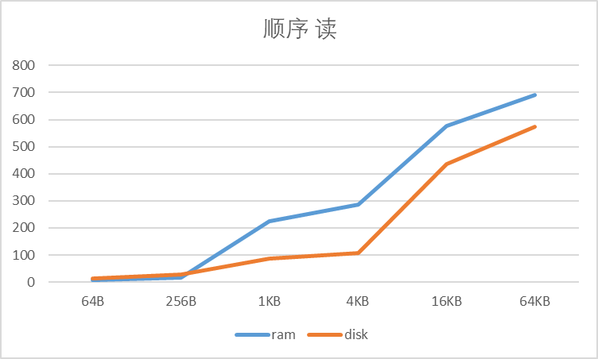
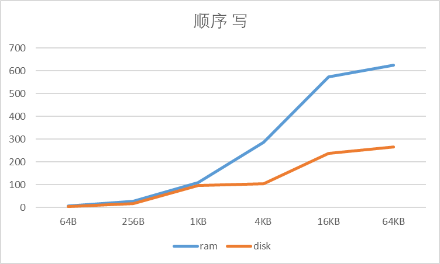

# 《操作系统》实验三 I/O子系统

*——比较RAM和磁盘的读写速度*

10215501412 彭一珅

### 一、实验目标

1. 熟悉类UNIX系统的I/O设备管理

2. 熟悉MINIX块设备驱动

3. 熟悉MINIX RAM盘

### 二、实验任务

1. 在MINIX3中安装一块X MB大小的RAM盘（minix中已有6块用户可用RAM盘，7块系统保留RAM盘），可以挂载并且存取文件操作。
2. 测试RAM盘和DISK盘的文件读写速度，分析其读写速度差异原因（可用图表形式体现在实验报告中）。

### 三、使用环境

虚拟机：MINIX3.3.0

物理机：Windows11

虚拟机软件：Vmware

文件传输：FileZilla

代码阅读和编辑：VScode、Source Insight

### 四、实验过程

#### 增加RAM盘

1. 修改/usr/src/minix/drivers/storage/memory/memory.c，增加默认的用户RAM盘数：RAMDISKS=7。

   ```c
   #define RAMDISKS     7
   ```

2. 重新编译内核，重启reboot。

3. 创建设备mknod /dev/myram b 1 13，查看设备是否创建成功输入ls /dev/ | grep ram。

   

4. 实现buildmyram初始化工具（用于分配容量）。

   1. 参考/usr/src/minix/commands/ramdisk/ramdisk.c，实现buildmyram.c，但是需要将KB单位修改成MB。

      阅读ramdisk.c中的代码，可以看出该文件实现一条指令，读取第一个参数，使用atol函数转换成数字，以kB为单位，用ioctl函数给dev目录下ram盘分配内存，并对各种指令输入的情况进行错误处理。

      ioctl函数的作用是使文件系统通过MIOCRAMSIZE操作设置RAM盘的大小，进程管理器处理这个过程，找到一个可变的存储区域，最后再使用一个内核调用sys_segctl，便于进一步对RAM盘访问操作、

      ```c
          fprintf(stderr, "usage: %s <size in mB> [device]\n",
                argv[0]);
      /*......*/
      #define KFACTOR 1024*1024
      /*......*/
      	fprintf(stderr, "size on %s set to %ldmB\n", d, atol(argv[1]));
      ```

   2. 编译buildmyram.c文件，然后执行命令： buildmyram \<size in MB> /dev/myram。创建一个RAM盘。

      通过指令 clang buildmyram.c -o buildmyram 获取到可执行文件，并执行指令 ./buildmyram 600 /dev/myram 给RAM盘分配空间

      此处在makefile中加入buildmyram，并编译内核，就可以去掉./直接执行指令

      

5. 在ram盘上创建内存文件系统，mkfs.mfs /dev/myram。
6. 将ram盘挂载到用户目录下，mount /dev/myram /root/myram,查看是否挂载成功：输入df。

#### 测试代码实现

##### 1. 宏定义及全局变量

```c
#define times 500//随机or顺序读写的次数
#define filesize (300*1024*1024)//文件大小300MB
#define readsize (1024*1024*1024)

char *filePathDisk[17]={"/usr/file1.txt","/usr/file2.txt","/usr/file3.txt","/usr/file4.txt","/usr/file5.txt","/usr/file6.txt","/usr/file7.txt","/usr/file8.txt","/usr/file9.txt","/usr/file10.txt","/usr/file11.txt","/usr/file12.txt","/usr/file13.txt","/usr/file14.txt","/usr/file15.txt","/usr/file16.txt","/usr/file17.txt"};
char *filePathRam[17]={"/root/myram/file1.txt","/root/myram/file2.txt","/root/myram/file3.txt","/root/myram/file4.txt","/root/myram/file5.txt","/root/myram/file6.txt","/root/myram/file7.txt","/root/myram/file8.txt","/root/myram/file9.txt","/root/myram/file10.txt","/root/myram/file11.txt","/root/myram/file12.txt","/root/myram/file13.txt","/root/myram/file14.txt","/root/myram/file15.txt","/root/myram/file16.txt","/root/myram/file17.txt"};
int bs[6]={64,256,1024,4096,16384,65536};
char buf[65536];
char readbuf[readsize];
```

times表示反复读写文件的次数，防止运行时间太短，计时困难。

filesize表示读写程序运行在特定大小的文件上，虽然在实践中，每个进程占用一个文件，但是为了控制实验变量，需要使每个进程读写的都是整个程序运行所在的“大文件”的一部分，从而模拟并发读写。

readsize表示读文件缓冲区的大小，程序将读到的字符放在readbuf中。

filePathDisk和filePathRam表示每个进程读写文件所在的位置。

bs数组表示所要测试的块大小，单位是B。

buf数组置为0，作为写缓冲区，size至少是最大块的大小。

##### 2. 读写文件

```c
void write_file(int blocksize, bool isrand, char *filepath, int fs){
  int fp=open(filepath, O_WRONLY|O_SYNC|O_CREAT);
  int res;
  if(fp == -1){
    printf("open file error\n");
    return;
  }
  for(int i=0;i<times;i++){
    if((res=write(fp, buf, blocksize))!=blocksize){
      printf("write file error num %d, finished %d times\n",res,i+1);
      // perror("error:");
      return;
    }
    if(isrand){
      // printf("fs=%d,blocksize=%d\n",fs,blocksize);
      lseek(fp, rand()%(fs-blocksize), SEEK_SET);
    }
  }
  lseek(fp, 0, SEEK_SET);
  close(fp);
}
```

write_file函数首先以写的方式打开文件，O_CREAT参数的功能是如果文件不存在可以自动创建，O_SYNC参数可以使文件读写同步。检查open函数返回值。

将缓冲区内容写入指定文件，检查write函数的返回值，如果是随机写，则写完每个块就将指针定位到随机位置，如果顺序写，就使文件指针顺序移动即可。

一个进程写结束后，将指针定位到文件头，关闭。

read_file的实现方式与write_file类似。

```c
void read_file(int blocksize, bool isrand, char *filepath, int fs){
  int fp=open(filepath, O_RDONLY|O_SYNC|O_CREAT);
  int res;
  if(fp == -1){
    printf("open file error\n");
    return;
  }
  for(int i=0;i<times;i++){
    if((res=read(fp, readbuf, blocksize))!=blocksize){
      printf("read file error num %d\n",res);
      return;
    }
    if(isrand){
      // printf("fs=%d,blocksize=%d\n",fs,blocksize);
      lseek(fp, rand()%(fs-blocksize), SEEK_SET);
    }
  }
  lseek(fp, 0, SEEK_SET);
  close(fp);

}
```

##### 3. 计算程序运行时间

本实验使用了gettimeofday函数计时，将时间数据传入到地址里，因此不采用题目中给出的返回值为long的get_time_left函数，直接在主函数中进行计时。

```c
struct timeval st,et;
/*......*/
	gettimeofday(&st,NULL);
	/*......*/
  gettimeofday(&et,NULL);
  long spendtime=(et.tv_sec-st.tv_sec)*1000+(et.tv_usec-st.tv_usec)/1000;//ms
  double speed=blocksize*concurrency*times/(spendtime*1000.0);
  printf("speed=%.2fMB/s,spendtime=%ldms,concurrency=%d\n",speed,spendtime,concurrency);
```

首先将当前时间的秒数和微秒数存在timeval结构体st和et中，然后spendtime变量保存毫秒数。

先计算所有进程读写的总字节数=进程数\*块大小*重复次数，换算为KB，然后除以毫秒数，得到单位为MB/s的速度。

##### 4. 主函数实现

```c
int main(){
  // printf("ram 顺序 写\n");
  // printf("ram 顺序 读\n");
  // printf("ram 随机 写\n");
  // printf("ram 随机 读\n");
  // printf("disk 顺序 写\n");
  printf("disk 顺序 读\n");
  // printf("disk 随机 写\n");
  // printf("disk 随机 读\n");
  int concurrency=7;
  memset(buf,0,sizeof(buf));
  struct timeval st,et;
  //测试concurrency对读写速度的影响（使用ram,顺序写,块大小固定为1024）
  for(int j=0;j<6;j++){
    // int j=3;
    int blocksize=bs[j];
    printf("blocksize=%d\n",blocksize);
    // for(concurrency=1;concurrency<=16;concurrency++){
      gettimeofday(&st,NULL);
      for(int i=0;i<concurrency;i++){
        if(fork()==0){
          // write_file(blocksize,false,filePathRam[i],filesize/concurrency);
          // read_file(blocksize,false,filePathRam[i],filesize/concurrency);
          // write_file(blocksize,true,filePathRam[i],filesize/concurrency);
          // read_file(blocksize,true,filePathRam[i],filesize/concurrency);
          // write_file(blocksize,false,filePathDisk[i],filesize/concurrency);
          read_file(blocksize,false,filePathDisk[i],filesize/concurrency);
          // write_file(blocksize,true,filePathDisk[i],filesize/concurrency);
          // read_file(blocksize,true,filePathDisk[i],filesize/concurrency);
          exit(0);
        }
      }
      while(wait(NULL)!=-1){

      }
    /*......*/
  }
  return 0;
}
```

为了完成两个性能测试，主函数实现了两个循环：遍历不同块大小、遍历不同进程数。在上文的代码中为了测试块大小对读写速度的影响，将遍历进程数注释掉了。

使用fork函数创建子进程，每个进程都执行一次读写函数，然后等待所有子进程结束后，计算花费时间。

实验涉及到的变量有ram/disk、顺序/随机、读/写三对，所以测试程序以不同的读写方式编译8次，分别测量运行用时。

#### 性能测试

1. RAM盘和Disk盘的性能测试中，需要采用多进程并发的同步读写，并发数要增加到设备接近“饱和”状态（吞吐量难以继续提升，但是I/O延时恶化）。在出现饱和前，总吞吐量随着并发数线性增长。



​	图中蓝色折线表示程序运行速度speed，但是分母使用每个进程的运行时间来计算，因此不能表示I/O设备的吞吐率。随着进程数增多，进程等待别的进程使用IO设备而阻塞的时间也变长，而图中计算的是每个进程的运行时间，也不能正确地表示IO延时。

2. 性能测试的二个变量为“块大小”（推荐64B/256B/1KB/4KB/16KB/64KB）和“块扫描方式”（顺序/随机）。可以画四张曲线图对比RAM盘和Disk盘性能（随机读，随机写，顺序读，顺序写）。实验结果预计为RAM盘性能高于DISK盘，特别是随机读写性能。

   为了获得较好的I/O使用率，将进程数concurrency设为7，画出如下图表。

   | 随机 读     |      |       |        |        |        |        |
   | ----------- | ---- | ----- | ------ | ------ | ------ | ------ |
   | 块大小      | 64B  | 256B  | 1KB    | 4KB    | 16KB   | 64KB   |
   | ram         | 3.39 | 13.58 | 30.9   | 71.68  | 122.79 | 188.63 |
   | disk        | 4.48 | 5.4   | 7.17   | 9.25   | 32.77  | 84.42  |
   | **随机 写** |      |       |        |        |        |        |
   | 块大小      | 64B  | 256B  | 1KB    | 4KB    | 16KB   | 64KB   |
   | ram         | 1.68 | 8.96  | 23.89  | 66.37  | 137.85 | 215.17 |
   | disk        | 0.5  | 2.07  | 2.44   | 17.19  | 21.37  | 57.82  |
   | **顺序 读** |      |       |        |        |        |        |
   | 块大小      | 64B  | 256B  | 1KB    | 4KB    | 16KB   | 64KB   |
   | ram         | 6.79 | 17.92 | 224    | 286.72 | 576.9  | 690.89 |
   | disk        | 14   | 27.15 | 86.36  | 108.61 | 434.42 | 573.44 |
   | **顺序 写** |      |       |        |        |        |        |
   | 块大小      | 64B  | 256B  | 1KB    | 4KB    | 16KB   | 64KB   |
   | ram         | 6.79 | 27.15 | 108.61 | 286.72 | 573.44 | 625    |
   | disk        | 4.48 | 17.92 | 95.57  | 105.41 | 237.2  | 265.48 |

   

   

   

   

​	可以看到，比较ram和disk，ram的读写性能优于disk，尤其是随机读写时，这是由于ram盘是内存分配的一段区域，没有寻道和旋转延迟。比较读写性能，读一般比写块。比较随机与顺序读写，随机读写一般速度较慢，因为随机读写每次都需要重新寻道。

### 五、总结

在实验过程中，我了解了I/O子系统的基本原理和相关的API函数，如open()、read()、write()等。然后，为了实现RAM盘的挂载和使用，我们需要掌握MINIX块设备驱动的开发和使用，以及对RAM盘的格式化和挂载。

我对于不同进程的I/O阻塞和延时有了更深刻的理解，为了提高I/O设备的利用率，适当的增多进程数可以使其他进程在计算时，始终有进程在使用I/O设备，相比较只使用一个进程可能会在计算时使I/O设备空闲，使用多个进程可以使I/O设备处在不间断的使用中。但是，使用过多进程可能会引起多个进程同时进入I/O期，从而增加I/O等待时间。

在实验过程中，我遇到了write函数返回-1的报错，经过perror输出如下报错：


通过增加ram盘存储空间，解决了这个问题。

另外，磁盘读写会被缓存，因此每次测试代码都要在冷启动的情况下执行，才能得到更好的实验数据。