### 2.进程

#### 2.1进程介绍

多道程序、伪并行

##### 2.2.1 进程模型

进程是*正在执行的程序*，包括程序计数器、寄存器和变量当前值。

##### 2.1.2 进程的创建

四个主要原因：1.系统初始化 2.正在运行的一个进程执行了创建进程的系统调用 3.用户请求 4.批处理作业的初始化

进程：前台进程（同用户交互）、后台进程 （处理网页、打印的守护进程）

启动之后创建进程

1. 用make调用c编译器把源文件转换成目标代码，调用install将程序复制到目标地址，设置所有者和访问权限。

2. 在交互式系统中用户键入命令启动程序，切换一个终端去启动新的程序
3. 提交批处理作业，有资源运行另一个作业时，创建新的进程，运行输入队列中的另一个作业。

fork创建副本-> execve运行新的程序

##### 2.1.3 进程的终止

原因：

1. 正常退出---exit、ctrl+C
2. 出错退出---文件不存在
3. 严重错误---/0、引用不存在内存
4. 被其他进程杀死---kill

##### 2.1.4 进程的层次结构

*进程和它所有子进程及其后裔组成一个进程组*

minix启动初始化：

1. 两个特殊进程：再生服务器、init
2. 再生服务器启动或重启*驱动*和*服务器*
3. init进程执行/ect/rc脚本
4. init进程读取配置文件/etc/ttytab中的内容，查看存在哪个终端和虚拟终端，为每个终端fork一个getty进程，显示登录提示符
5. 以输入为参数运行login进程，成功后运行shell进程

##### 2.1.5 进程的状态

1. 运行态（Running 在该时刻实际占有处理机）
2. 就绪态（Ready 可运行，因为其他进程正在运行而暂时被挂起）进程调度器决定
3. 阻塞态（Blocked 除非某种外部事件发生，否则不能运行）系统调用*block*和*pause*/minix3自动

​		管道读取如果没有可用的输入，自动转换为阻塞态

##### 2.1.6 进程的实现

**进程表**：一个结构数组 每个进程占用一个进程表项（进程控制块）

**进程控制块**：包含进程的状态、PC、栈指针、内存分配情况、打开文件状态、统计和调度信息、定时器、其他信号

进程通信、内存管理、文件管理分成几个独立模块

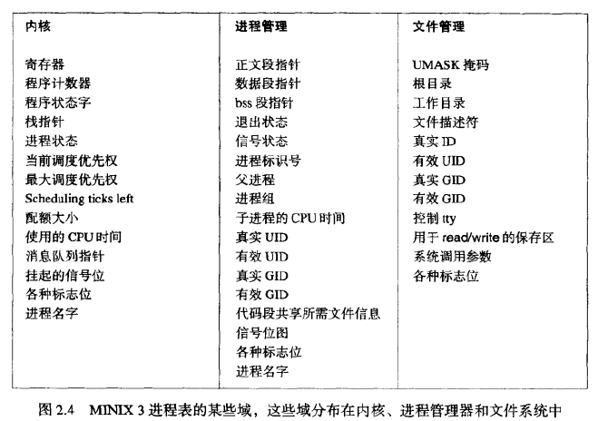

每类io设备*（软盘、硬盘、定时器、终端）*都有一个靠近内存底部的位置，称为*中断向量*

**中断向量**：包含中断服务器的入口地址，在中断发生时，将程序计数器、状态字及寄存器压入当前堆栈，计算机跳转到磁盘中断向量所指的地址处。将中断存入的信息从堆栈中删除，将栈指针指向一个被进程处理程度所使用的临时堆栈（C、汇编）

然后构造一条发给磁盘进程的消息——此时磁盘进程正在被阻塞，并等待该消息——通知说发生了一条中断，磁盘进程由B转为R。中断服务器调用调度器

##### 2.1.7 线程

*相同的地址空间中有多个控制流并行地运行*

进程：一组相关资源的集合/执行流

进程与线程的区别：

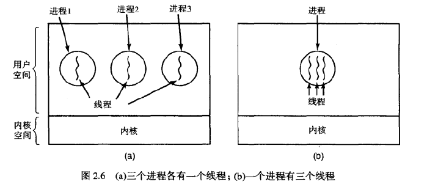

#### 2.2进程间通信（IPC）

在shell管道中，一个进程的输出必须传送到第二个进程

1. 如何传送信息
2. 保证多个进程在临界活动（夺取最后100kb内存）时不会彼此影响
3. 存在依赖关系时确定适当的次序

##### 2.2.1 竞争条件

公用存储区（主存中内核数据结构、共享文件）

> 假脱机打印程序：当一个进程需要打印文件时，将文件名放在特殊的**打印机假脱机系统**目录下，另一个**打印机守护进程**周期性检车是否有文件需要打印，如果有就将文件名删掉

##### 2.2.2 临界区

*找出某种途径防止多个进程同时访问共享数据*——**互斥**

##### 2.2.3 忙等待形式的互斥

**1.关闭中断**

使每个进程在进入临界区后先关中断，在离开之前再开中断。关中断之后CPU不会被切换到其他进程（禁止了抢占）

> 引起调度（任务切换）的原因有两个：
>
> 1. 任务进入阻塞状态
> 2. 中断服务程序改变了任务状态，使某个比当前任务优先级高的人物进入了ready状态，内核调用了切换函数（异步调度）

缺点：交给用户进程，不再开中断；内核在执行更新变量或列表的几条指令期间，将中断关掉很方便。

**2. 锁变量**

共享变量被访问时，如果锁的值为0，那么进程将其置为1然后进入临界区，如果锁已经为1，进程一直等待到值变成0

缺点：非原子性

**3. 严格交替法**

*持续检查某一个变量直到它具有某一特定值称为**忙等待***——浪费CPU时间

*一个使用忙等待的锁称为**自旋锁***

**4. Peterson解决方案**

**5. TSL指令**

##### 2.2.4 睡眠和唤醒

sleep使调用进程阻塞，wakeup唤醒

##### 2.2.5 信号量

up操作递增信号量的值，如果有在该信号量上睡眠的进程，则选择一个，允许他完成down操作

##### 2.2.6 互斥

解锁和加锁

##### 2.2.7 管程

#### 2.3 经典IPC问题

#### 2.4 进程调度

在多道程序设计系统中，多个进程竞争CPU，多个进程为就绪状态时，使用调度器、调度算法来决定运行哪一个

##### 2.4.1 调度介绍

最早：依次运行磁带上的下一个作业

分时系统：多个用户等待服务

1. 进程行为 几乎所有的进程交替地突发（磁盘）io请求，**计算密集型**->**io密集型**

2. 什么时候调度 

   1.一个进程退出时

   2.一个进程在io或信号量上阻塞时    

   ---

   1.当一个新进程创建时--重新评估优先级

   2.当一个io中断发生时--io设备完成了他们的工作，那么被阻塞进程可能转为就绪态

   3.当一个时钟中断发生时--当前运行进程运行了足够长的时间  

   **非抢占式调度算法**挑选一个进程运行，直到阻塞（等待io，等待进程）或自愿退出

   **抢占式调度算法**挑选一个进程运行，所运行的最大时间是固定的。如果到了这个最大时间仍在运行，就会被挂起（较长时间间隔）

3. 调度算法的分类

   1.批处理

   2.交互式

   3.实时

 4. 调度算法的目标

    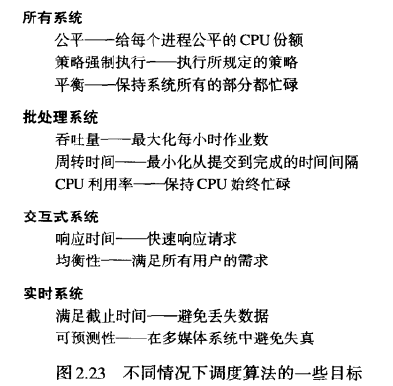

##### 2.4.2 批处理系统中的调度

#### 2.5 MINIX 3进程概述

*UNIX内核是一个部分模块的单块程序，而MINIX 3 本身就是一组进程的集合*

##### 2.5 1 MINIX 3的内部结构

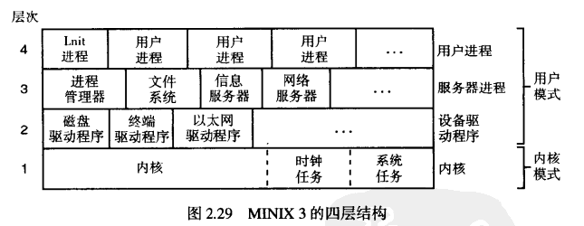

内核层：**内核**进程调度、进程状态转换、进程间消息、io断口和中断的访问，**时钟任务**是io设备驱动程序，只提供内核接口

1层功能：为上层驱动程序和服务器提供一组特权内核调用（读写io端口，跨地址空间复制数据），由系统任务实现

汇编语言负责内核直接与硬件交互的最底层部分（负责中断处理、进程切换的底层上下文管理机制、mmu硬件的底层操作部分）

##### 2.5.2 MINIX 3中的进程管理

*整个系统中所有用户进程都属于以init为根节点的一棵进程树*

1. 启动

   第一个硬盘作为启动盘

   硬盘被分成若干分区，第一扇区包括磁盘分区表，主引导记录

   在硬盘或软盘上找到一个包含多个部分的文件，将各个部分装到内存适当位置，这个文件叫做**引导映像**，包括*内核、进程管理器、文件系统*

2. 进程树初始化

   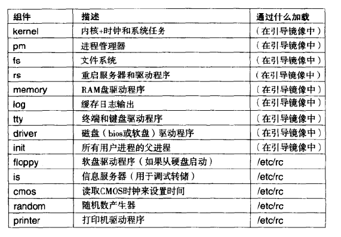

   init是第一个用户进程，也是作为引导映像的一部分加载的最后一个进程。在内核中运行的**时钟任务**和**系统任务**在内核外不可见，没有PID，也不作为任何进程树的一部分。进程管理器PID=0。再生服务器作为其他所有在引导映像中启动的进程的父进程。init进程首先执行/etc/rc脚本。

   **服务**是再生服务器的用户接口。再生服务器把所有系统进程作为子进程（进程管理器除外）启动floppy、cmos、is

   cmos设备驱动程序启动之后，rc初始化实时时钟。需要的驱动程序和服务器在/sbin目录下，其他命令在/bin下。当初始启动完成后加载/usr文件系统。rc脚本可以检查可能由上次系统崩溃引起的系统错误。如果执行shutdown时，在登录历史文件/usr/adm/wtmp中记录一条信息。如果最后信息是不是关闭信息，就执行fsck以检查所有文件系统。/etc/rc最后一项任务是启动守护进程（updat、usyslogd），可以通过辅助脚本命令完成。ps axl命令显示进程的PID以及父进程的PID。

   最后，init读取/etc/ttytab文件，列出所有可能的终端设备。为每个终端创建一个子进程，每个子进程执行/usr/bin/getty打印出一条信息，等待输入用户名。

   输入用户名登录时，/usr/bin/login被调用，输入密码，执行/bin/sh的shell，为每条命令创建一个新的进程。

   用于进程管理：fork，exec

   

##### 2.5.3 MINIX 3中的进程通信

send(dest, &message)用来向进程dest发送一条消息

receive(source, &message)接受一条信息

sendrec(src_dst, &message)发送一条消息，等待同一个进程的应答。

&message是消息数据的本地地址。

当一个进程发送消息到目标进程，发送进程阻塞，直到目标仅此调用receive

不阻塞信息发送notify(dest)

##### 2.5.4 MINIX 3中的进程调度

中断系统：当进程请求输入时，阻塞以允许其他进程执行；当输入可用时，当前运行进程被磁盘、硬盘、其他硬件中断，时钟也产生中断，使未请求输入的用户进程最终放弃CPU，其他进程允许。

**软中断**指令使进程马上阻塞，内核被激活来处理中断。

每当一个进程被中断或软中断，都有机会重新确定哪个进程最需要运行机会。

MINIX 3调度器使用多级排队系统，一共定义16个队列，最低优先级*IDLE*进程，系统和时钟任务>驱动程序进程>服务器进程>用户

#### 2.6 MINIX 3中进程的实现

过程=函数=例程

变量名、过程名、文件名斜体

被编译到内核的任务以大写表明，系统调用小写。

##### 2.6.1 MINIX 3源代码的组织

/usr/src

src/include/存放了所有主要C头文件的副本，包含sys/ minix/ ibm/

每个目录都包含Makefile，控制所在目录中文件的编译

操作系统源代码：kernel/ drivers/ servers/

src/lib/库例程的源代码

src/tools/用于构建makefile和脚本

src/boot/引导安装MINIX3代码

src/command/放置命令

##### 2.6.2 编译及运行MINIX 3

在src/tools目录下运行make image编译

##### 2.6.3 公共头文件

ansi.h 测试编译器是否符合标准C要求

limits.h 定义数据类型所占位数等大小值

errno.h 系统调用失败时从全局变量errno返回的错误码

unistd.h 定义常量、C函数原型（系统调用）

string.h

signal.h 信号

fcntl.h 文件控制操作所用的许多参数

##### 2.6.4 MINIX 3头文件

*include/minix/  include/ibm/*

config.h

sys_config.h 所有名字以下划线开头

const.h 常量定义，编译新内核时不会改变。src/kernel/const.h包含只在内核中使用的定义，等等

ipc.h 定义进程间通信

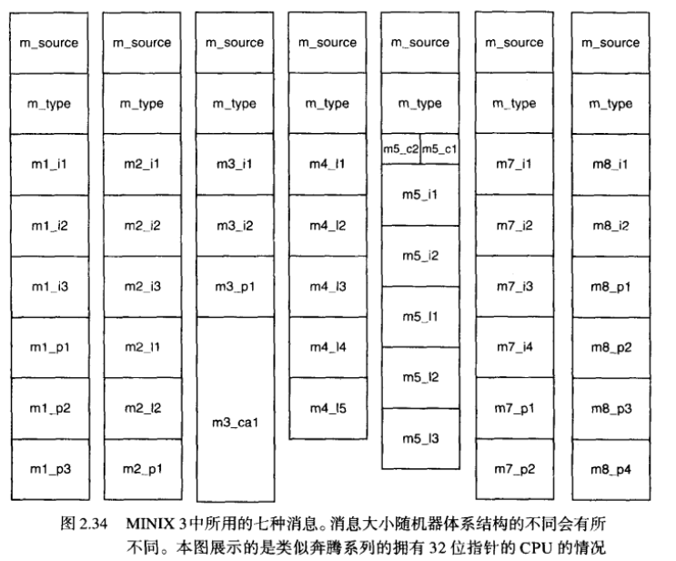

syslib.h 引用的c函数特定于MINIX 3 printf定义域sysutil.h kputc

**当一个进程需要执行一条MINIX 3系统调用时，向进程管理器PM或文件系统FS发送一条消息，消息中含有所要求的系统调用序号（在callnr.h中定义）**

com.h 定义任务序号jid（负数）、引导映像所需要的进程在进程表中的号。定义消息m_type

devio.h 定义了支持用户访问io端口的类型和常量

dmap.h 定义了一个结构及其数组dmap

keymap.h 实现不同语言字符集对应的特殊键盘布局

bitmap.h 提供了一些宏（置位）

patition.h定义了磁盘分区信息

##### 2.6.5 进程数据结构和头文件

*sec/kernel下的代码*

定义了三个宏：

_POSIX_SOURCE 是POSIX 标准自行定义的一个特性测试宏，必须以下划线开头。作用是保证所有POSIX要求的符号和那些显式的允许但不要求的符号课件，隐藏掉属于非官方扩展的附加符号

_MINIX 将为MINIX 3定义的扩展而重载前者的效果

_SYSTEM 编译系统代码时，做与用户代码不同的事情。

kernel.h引用了很多本地头文件：

config.h const.h type.h --include/minix/

proto.h glo.h 不在include中

ipc.h 进程间通信 3020-3032 message

---

config.h 4717-4743行系统调用

const.h 虚拟地址->物理地址

type.h memory唯一标识一块内存区域。kmessage用于来自内核诊断的消息。randomness用于随机数发生器。stackframe_s结构体定义了寄存器值如何被保存到占中。segdesc_s防止进程访问不属于它的内存区域。

proto.h 提供了函数原型，使用了_PROTOTYPE宏

glo.h 包含了内核的全局变量 aout（5321行）保存数组地址，存储着系统映像组件的头信息。kinfo定义在type.h 保存内核信息。还包括了与进程控制和内核执行有关的一些变量。prev_ptr, proc_ptr, next_ptr分别指向之前、当前、之后的进程表项。bill_ptr指向当前被审计其使用的时钟节拍。

> 当一个用户进程调用文件系统且文件系统正在运行时，proc_ptr指向该文件系统进程，bill_ptr指向进行调用的用户进程。

​	k_reenter用于对内核代码的嵌套次数计数。

ipc.h ->proc.c

proc.h 定义了内核进程表。当一个进程没有执行时CPU寄存器内容就存储在此。每一个进程都有一个指向其副本的指针，用户的权限与指向同一副本的用户进程的指针相同。在一组标志位p_rts\_flags中还有一个字节大小的域，任何一个位置1表示一个进程不可运行。

​	进程表每一项为内核所需信息提供了存储空间。

> p_max\_priority表示一个进程首次处于就绪待运行时，需要放入哪个调度队列。因为如果某进程阻碍了其他进程运行，那么它的优先级就会降低。
>
> p_priority被初始化为与前者相同。

​	每个进程所用时间在5532和5533行处的clock_t中记录，p_nextready（5535行）用于将进程和调度队列连接起来。

​	当进程由于目标未在等待而不能完成send时，发送者将被放置在目标的p_caller\_q指针指向队列中（5536行），这样当目标receive时找到发送消息的进程。p_q\_link将队列成员连接在一起。

​	5538-5540保留的存储空间使得传递消息的rendezvous成为可能，当一个进程执行了receive但没被接受的消息时将阻塞，而它想要接收信息的进程号被存储在p_getfrom中。当一个进程执行了send但没有被receive时，p_sendto将存储目标进程号，消息缓存在p_messbuf中。p_pending使用一个位映射来跟踪没有被发送给进程管理器的信号。

​	p_name用来存储进程名称。

​	p_rts\_flags （5548-5555）如果某项未被使用，SLOT_FREE被置位。fork之后，NO_MAP被置位，防止子进程还未建立内存映射就开始运行。SENDING和RECEIVING表示进程在发送或者接受消息时阻塞。SIGNALED和SIG_PENDING表示信号已被接受。P_STOP为追踪提供支持。NO_PRIV用来防止新系统进程还未完全建立就开始执行。

​	5562-5567行定义了调度队列 和p_priority的允许值。

​	proc[0]指优先级最低的任务。

​	进程表本身定义为一个proc结构体数组proc[NR_TASKS + NR_PROCS] NR_TASKS在include/minix/com.h中定义，NR_PROCS在include/minix/config.h中定义，共同设置进程表大小。

​	指向进程表的数组pproc_addr。 rdy_head和rdy_tail这两个数组维护调度队列。

sconst.h 定义了用于汇编代码的一些常量，以汇编器所使用的的形式进行表达，都是相对进程表项对于stackframe_s部分的偏移。必须与proc.h保持同步。

##### 2.6.6 引导MINIX 3

##### 2.6.7 系统初始化

##### 2.6.8 MINIX的中断处理

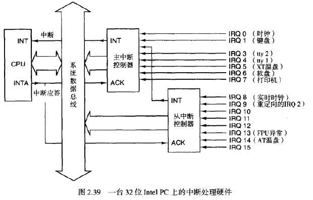

当CPU在一个进程运行期间接收到一个中断，它

1. 建立一个新堆栈供终端服务器使用。该堆栈位置由**任务状态段**的一项决定，每个中断创建的新堆栈都从被中断进程的proc->stackframe_s结构的结尾处开始。
2. 将关键寄存器值压入新堆栈，包括用来恢复被中断进程*堆栈*和*程序计数器*的寄存器

中断处理例程会将这个区域作为自己的堆栈，将其余寄存器压栈，然后切换到内核提供的堆栈。中断处理结束时，会从内核栈切换到进程表项中的堆栈，然后弹出寄存器值，执行iretd指令

1. 恢复被硬件压栈的寄存器
2. 切换回中断前使用的堆栈（将堆栈指针指向该进程的栈帧结构）

中断结束后启动的进程可能不是当时被停止的那个进程，也可能不是最近被停止的进程。

当接收到一个中断时，CPU关掉中断，保证了进程表项中的栈帧不会溢出。关中断用的汇编指令，使用内核栈的时候也关着中断。这个时候使用异常来处理程序，异常和中断不同在于异常是不可屏蔽的。所以内核运行时如果发生异常，直接崩溃。

当执行内核代码时，遇到iretd指令，处理器检查从堆栈弹出的代码段选择符，确定要执行的操作

1. 被中断代码的特权级和中断后即将执行代码特权级相同时，使用较简单的机制
2. 比中断服务器特权级低，使用较复杂的机制，用到TSS和一个新堆栈

**硬件**检查并保证新堆栈起码能装得下最小的信息集合。

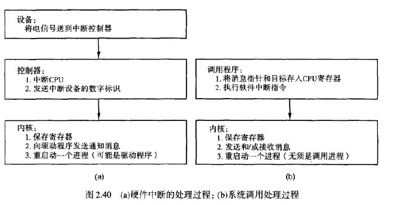

##### 2.6.9 MINIX 3的进程通信

使用消息进行通信——**进程聚合**rendezvous

当一个进程执行send操作时，内核最底层检查目标进程是否在等待从发出者发来的消息。如果是，就将该消息从发送者的缓冲区复制到接受者的缓冲区，同时将这两个进程标记为就绪态；如果否，将发送者标记为阻塞，被挂入一个等待消息发送到接收进程的进程队列中。

当一个进程receive时，内核检查该队列是否存在向它发送消息的进程。若无就接收进程被阻塞，直到一条消息到达。

操作系统各个部分作为独立的进程运行，notify发送的通知将先于普通消息处理。大多数情况下，通知仅仅把它的发起者告诉接收者，目标进程在发送消息请求更多信息。

内核的任务是将一个硬件中断或者软件中断转换为一条消息，前者由硬件产生，后者是一个对系统服务的请求向内核传递的途径。

proc.c开头的宏定义操作链表，广泛使用了指向指针的指针。BuildMess用来构造notify用到的消息，调用的唯一函数是get_uptime，读取时钟任务维持的一个变量。对一个名为priv的函数显示调用是priv.h中定义的一个宏的展开。CopyMess是对汇编语言例程cp_mess编程者友好的接口。

宏priv用于两种情形，如果通知发起者是HARDWARE，则携带一个负载，即目标进程挂起中断位图的副本。如果发起者是SYSTEM，则负载是挂起信号的位图，这些位图都位于目标进程的priv表中，用于存储未交付处理的消息。

proc.c中第一个函数是sys_call，将一个软中断转化为消息。对消息做检查后，调用mini_send mini_receive mini_notify。

mini_send 有三个参数：调用进程、目标进程、指向消息的指针。检查目标进程是否阻塞在receive上。

1. 如果正在等待发送进程的消息，则用CopyMess复制消息，接收进程复位RECEIVING位取消阻塞，然后调用enqueue使接收进程运行。
2. 如果接收进程没有阻塞，或阻塞了但在等待来自另一个进程的消息，则阻塞发送进程并将发送进程移出队列。*所有等待向同一进程发送消息的进程用链表连接在一起*，目标中的p_callerq域指向位于链表头的进程（的进程表项）。

当函数sys_call的参数是RECEIVE或BOTH时，将调用mini_receive。检查SENDREC_BUSY是否置位，如果挂起，则标记为不再挂起，并进行通知交付处理。

##### 2.6.10 MINIX的进程调度

*MINIX3使用一种多级调度算法*

调度器维护16个可运行的进程队列，但是任一时刻不一定所有队列都在使用。

当内核完成初始化并开始运行时，即在main.c文件中调用restart函数时，优先级队列与进程情况：

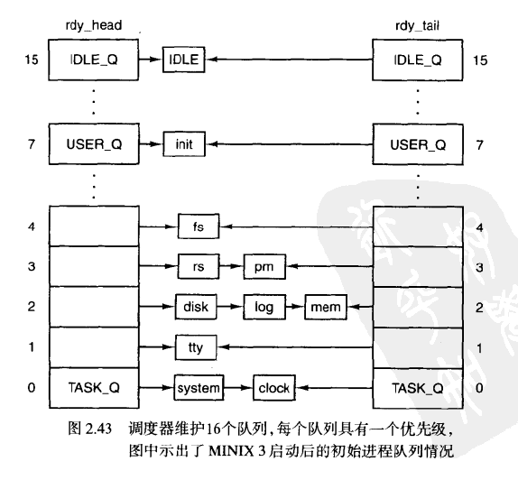

rdy_head数组中的每一项对应一个队列，指向相应队列头的进程。rdy_tail数组每一项对应队列尾的进程。这两个函数都使用EXTERN宏在proc.h中定义。

在系统初始化过程中，初始进程的排队情况由table.c中的image表决定。

每个队列内部采用**时间片轮转调度算法**。如果一个进程运行完了时间片，就被移到队列尾部，并分配一个新的时间片。如果一个进程*从阻塞被唤醒*，如果在阻塞前有没用完的时间片，就会被放到队首。当一个运行的进程被阻塞或者被信号杀死就移出队列。

调度算法：*找到最高非空优先级队列，选取队列首部的进程*

在最后一部分可以看到许多对于enqueue和dequeue的引用。enqueue使用一个指向进程表项的指针作为参数调用，使用一个指向变量的指针作为参数调用函数sched，该参数说明这个进程应该位于哪个队列，放在队首还是队尾。

1. 如果队列为空，则数组rdy_head和rdy_tail中各添加一个指针指向该进程，链接域p_nextready获取一个表示后面没有其他进程的特殊指针值：NIL_PROC。
2. 如果进程需要加入队列首，则p_nextready获得当前rdy_head的当前值，然后rdy_head指向新进程。
3. 如果进程需要加入队列尾，则当前队列尾的进程p_nextready指向新进程，新进程作为队列尾，它的p_nextready指向NIL_PROC

最后，调用pick_proc来选择下一个要运行的进程。

当需要把一个进程转为非就绪态时，调用dequeue函数。将被阻塞的进程一定位于所在队列的*首端*，而被信号杀死的进程需要遍历队列来找到。

*内核中运行的任务共享一个硬件定义的堆栈区域*，因此dequeue偶尔检查这个堆栈的完整性。在dequeue函数开头检查将移出的进程是否运行在内核空间。

sched函数决定新就绪的进程放在哪个优先级队列上，以及放在首端还是尾端。

pick_proc函数检查每一个队列，首先检查TASK_Q（优先级为0）如果这个队列有进程就绪，那么设置proc_ptr指针并立即返回，否则检查下一个优先级队列。改变bill_ptr的值对赋予进程的CPU时间收费。

##### 2.6.11 与硬件相关的内核支持

##### 2.6.12 实用程序与内核库

#### 2.7 MINIX 3的系统任务

独立于主系统部件的内核外部进程被禁止执行实际的IO操作，也不能改动系统表等。

> fork系统调用由进程管理器处理，当一个新的进程被创建后，内核必须感知它以便调度。

为了让*进程管理器通知内核*，让内核为驱动程序和服务器提供一组服务：系统任务。

系统任务接收所有来自驱动程序和服务器对这些服务的调用请求，调度并使用它们。

---

在传统的 使用单体内核的操作系统中，**系统调用**指对所有内核提供服务的调用，而在现代类UNIX操作系统中，POSIX标准描述对进程可用的系统调用，引用那些在C库中定义的函数。

在MINIX 3中，然而，操作系统的组件在用户空间中运行。用户进程发出的系统调用将被转换为发往服务器进程的消息。服务器进程相互之间，与驱动程序、与内核之间通过消息进程通信。系统任务将接收所有对于内核服务的请求——**内核调用**

*很多情况下，用户进程首创的系统调用引起服务器进程生成一个同该系统调用类似名字的内核调用*

> 用户调用fork，被发送到进程管理器，要求改变进程表的内核部分，为此进程管理器将发送sys_fork调用给系统任务，而它可以操作内核空间的数据。

并非所有内核调用都仅跟一个系统调用有如此清晰的对应关系。

> 来自设备驱动器的程序读写IO端口，会激活一个设备驱动程序从而产生一个或多个sys_devio调用。

进程间通信的send，receive，notify等消息原语被认为是类系统调用/IPC原语/陷阱。

##### 2.7.1 系统任务综述

系统任务接收28种消息，分别可被视为一个内核调用。

系统任务的主程序进入了一个循环，获取一条消息，然后将其分派给适当的服务进程，最后发送一条回复消息。主循环体分派给了kernel/system/文件夹中的 一个独立文件的一个进程，以负责处理每一个内核调用。

##### 2.7.2 系统任务的实现

系统任务是由kernel/主目录中的一个头文件system.h和system.c编译而成的，另外还有kernel/system/子目录源文件创建的库。

system.h提供了内核调用的函数原型，以及消息类型的宏定义。

call_vec是一个函数指针的数组，通过使用消息类型作为数组索引的方法提供分派函数服务特定消息的机制。

系统任务的顶层是sys_task进程，进入一个循环等待消息，然后对消息做一些有效性验证，**将消息分派给相应的函数**，由这个函数处理该消息对应的调用，并有可能产生回复消息。

验证过程包括对该调用者核对priv表的项，来确定是否有权调用。call_vec数组内的索引值即调用号，被调用的函数地址存放于数组内的该单元。函数接收的参数是指向该消息的指针，返回值是状态编号。

当MINIX 3启动时，系统任务处于最高优先级队列头部，所以系统任务初始化中断钩子数组和alarm定时器列表。

*当有其他进程请求同步alarm时，系统任务将建立定时器*

接下来，call_vec数组中所有的项都被do_unused所填充，这样当发生不被支持的内核调用时就会调用这个函数。

system.c文件剩余部分由被声明为PUBLIC的函数组成，并且这些函数有可能被多个内核调用的程序或者内核的其他部分使用

> 当第一个函数get_priv被支撑系统调用**sys_privctl**的函数do_privctl使用，同时构造一个启动映像的进程表项时，它又会被内核本身调用。
>
> get_priv查找到一个priv结构并将其分配给调用者。有两种情况。
>
> 1. 每个系统进程在priv表中均有它们自己的项。
> 2. 如果其中之一失效，那么进程将不再成为一个系统进程。所有用户进程都共享表中同样的项。

get_randomness被用作随机数发生器生成种子数字。

在**将要用信号通知的进程**的位图s_sig\_pending的某位置位之后，send_sig向该进程发送一个通知，该进程只能是系统进程。*所有用户进程共享一个公共的priv表项。*

cause_sig用来向用户进程发送信号。当sys_kill以一个用户进程为目标时，该函数将被调用。

接下来三个函数是关于sys_umap内核调用的。

1. 针对进程的文本段、数据段、栈段，调用umap_local，由虚拟内存向物理内存转换

2. 针对除此以外的内存区域，调用umap_remote

   > 显卡和网卡需要映射从0xa0000到0xfffff的io设备保留地址的内存。
   >
   > 内存驱动程序管理RAM盘并且通过/dev/mem和/dev/kmem设备可以提供任何内存部分的项。

3. 有关被BIOS使用的内存，包括最低处的2KB内存，低于MINIX 3加载的地址。使用umap_bios

virtual_copy的绝大部分是switch，用来决定使用以上三个函数哪一个。实际的复制由phys_copy来完成。

##### 2.7.3 系统库的实现

每一个名字为do_的函数源代码在kernel/system/do\_中。kernel/路径下的Makefile中包含一行代码：

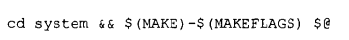

将kernel/system/内所有文件编译到kernel/system.a

> 系统任务提供了两类通用的支持。
>
> 1. 任何需要此类支持的用户空间系统进程的内核数据结构的访问。system/do_setalarm.c
> 2. 对于特殊的系统调用（由用户空间进程管理，但是要在内核执行一些操作），system/do_exec.c

sys_setalarm为一个需要接收同步alarm的进程初始化一个定时器，并提供了一个函数，在定时器到期时被调用以通知进程。还可以通过在请求消息的终止时间位传输一个0来要求取消一个先前调度的alarm。

定时器需要知道逝去的时间以及当前时间。每一个系统进程在priv表中都有自己的定时器结构，并加入了进程号和定时器终止时需要执行的函数cause_alarm的地址。

如果定时器被激活，则sys_setalarm在回复消息中返回剩余时间，如果0则表示尚未被激活。

cause_alarm函数的地址存储在每一个定时器里，所以定时器到期时调用它。它向进程发送一个通知，这样内核里的同步alarm被转换为一个消息发送给请求alarm的系统进程。

-----

exec绝大部分工作由进程管理器完成，为包含参数和环境信息的进程设置一个栈，并通过do_exec将栈指针通过sys_exec传送给内核，phys_memset擦除附加段内存区域中的残留数据。

调用exec的进程发送一个消息给进程管理器，然后阻塞，但exec没有回复消息，因此do_exec要自己为进程解除阻塞态。

----

当一个用户执行了read调用后，文件系统检查缓冲区是否有一个数据块，如果没有，就向磁盘驱动程序发送一条消息，将数据块载入到缓冲区。然后文件系统再发送一条消息给系统任务，通知将该数据块复制到用户进程。

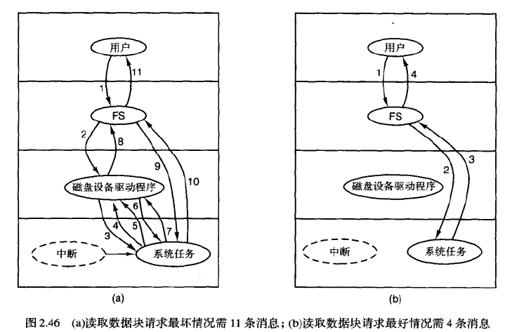

#### 2.8 MINIX 3的时钟任务

*时钟维护每天的计时，防止一个进程独占CPU*

##### 2.8.1 时钟硬件

##### 2.8.2 计时程序

作用：

1. 维护日常时间
2. 控制进程运行时间 一个进程启动运行时，调度器初始化一个计数器，计算节拍数值，每来一个时钟中断，该值-1，减为零时就启动另一个进程。
3. 审计CPU使用 当一个进程启动时，启动非系统主定时器，可以读出该进程运行了多久。在每次中断发生时保存该值并恢复。
4. alarm *进程可以要求操作系统在间隔一定时间后给它一个alarm*。
5. 看门狗时钟
6. 测试统计

##### 2.8.3 MINIX 3中的时钟驱动程序总览

时钟驱动程序在kernel/clock.c文件中。

1. 任务管理机制 循环运行，等待消息，将消息分派到子程序执行。
2. 每秒被激活60次的中断处理程序，提供当前节拍数，来辅助真实时间的计算（系统启动时间记录在其他地方）
3. 支持作用子程序，初始化时钟，将中断处理程序的地址放在合适的地方。

*怎样为用户空间进程提供看门狗时钟？*

**同步警报**将内核与用户空间联系起来。

看门狗时钟使用priv表中timer_t类型变量s_alarm\_timer。每一个系统进程在priv表中都有对应的项。为了设置定时器，用户空间的系统进程进行sys_setalarm调用，初始化定时器，将定时器到期时所要执行的进程的地址放入正确的区域，将定时器插入定时器列表中。

当用户进程产生一个alarm系统调用时，会被进程管理器处理：设置一个定时器并将其插入定时器列表中。这个用户进程发送一个信号，将定时器列表的链头改变。

##### 2.8.4 MINIX 3中时钟驱动程序的应用

#### 课后习题

1. 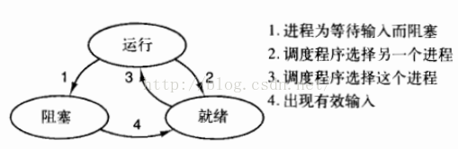 

​	从阻塞可以转换成运行。IO阻塞的进程，如果CPU空闲，IO设备使用完毕时就可以直接转为运行。就绪转为阻塞是不可能的，因为只有运行时的进程才能做某些事，比如调用IO，然后被阻塞。

2. 进程切换时需要的上下文包含：进程表项的信息，进程所使用的堆栈的信息。因此用寄存器保存指向进程表项的指针。
3. 汇编语言才能操作寄存器、PC、新的堆栈，而且快。
4. 内核栈，数据安全可以得到保护，可以有足够的堆栈空间。
5. 五个都阻塞，CPU才会被浪费，所以$0.5^5$
6. 14个进程，$1-P^{14}=0.99$
7. use=0.75
8. $use=1-0.4^6$
9. 主线程向服务器发送n个请求， 每个下载文件的一部分；读线程创建m个线程读取数据长度、数据内容、起始字节；写线程写到相应的字节位置
10. 不能有自己的缓存，要保证资源volatile可见性
11. 单线程进程不能同时fork和等待键盘
12. 内核级，可以感知到哪些线程是阻塞，哪些线程就绪，但是用户态阻塞一个就会全阻塞
13. 多线程服务器可以在一个线程阻塞时挑选另一个线程运行，有效利用CPU资源，但是如果服务器是完全CPU绑定的，不需要多线程。
14. 每个线程的PC，寄存器值等等是不一样的，需要分别保存

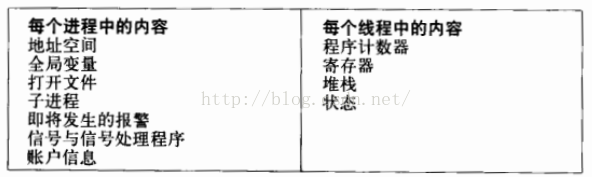 

15. 用户级线程执行一段之后，必须要让渡给内核
16. 用户级线程：当进程的时间片用完时会发生抢占，但用户无法随意调度进程中的线程，因此在下一个时间片，仍然是前一个线程继续运行，除非它自己将 CPU 让渡给其他线程。
    内核级线程：当进程的时间片用完时会发生抢占，内核也可以随意调度进程中的任意线程使用CPU。

18. 优点：线程切换不涉及系统调用，效率更高。

    缺点：一个线程被阻塞，所有线程均被阻塞。

26. 不会

27. 每个线程一个栈

40. 可以分到更多时间片
41. 可以将进程的运行时长和使用的CPU时间比较，看IO等待时间有多长。PS：CPU密集型，几乎没有IO阻塞，使用多进程，IO密集型使用多线程，充分利用CPU时间
42. 时间片长度必须是上下文切换时间的若干倍
43. 最短作业优先可以使得平均响应时间最短

