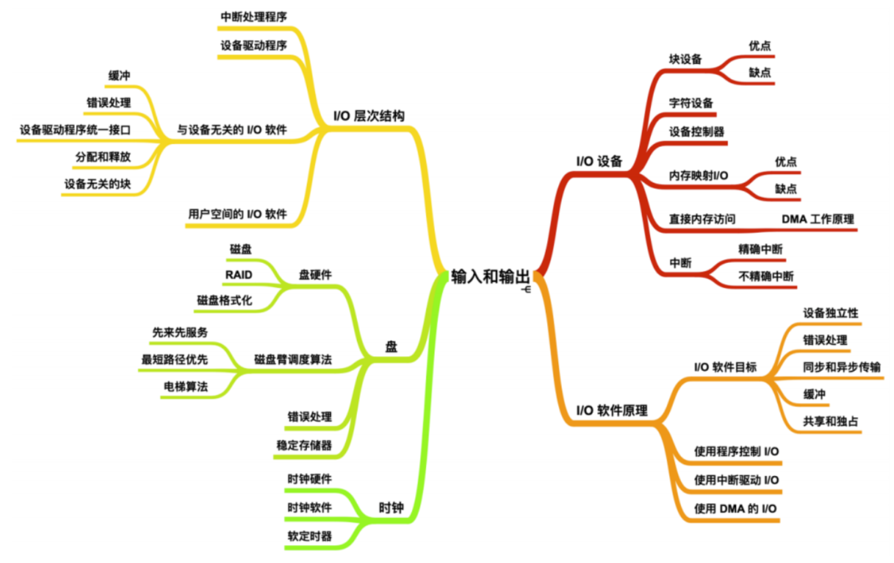
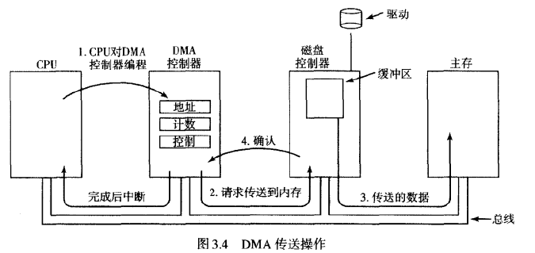
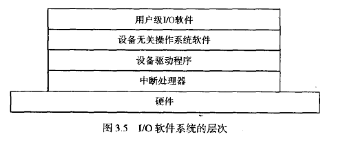
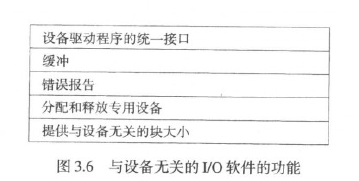
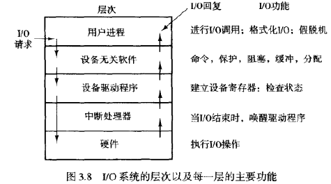
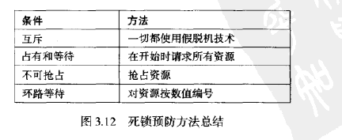
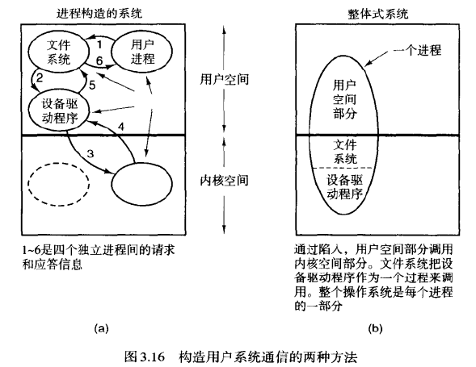
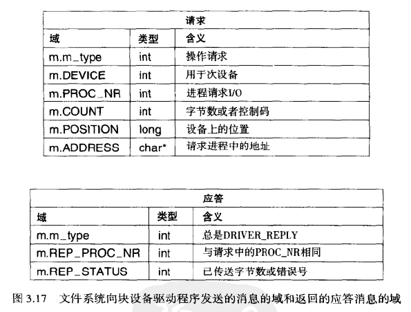
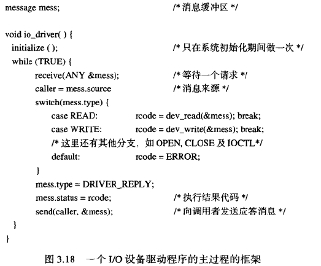
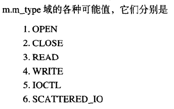

## 3. 输入/输出系统

操作系统主要功能是控制IO设备

1. 向设备发出命令
2. 捕获中断并进行错误处理
3. 提供一个设备与系统其余部分之间简单易用的接口



### 3.1 IO硬件原理

*硬件提供给软件的接口*

#### 3.1.1 I/O设备

**块设备**和**字符设备**

块设备将信息存储到固定大小的块中，每个块有自己的地址，大小在512byte到32678byte之间，特征是每个块能够独立于其他块而读写。eg：磁盘

字符设备发送接收字节流，无法编址，不存在寻址操作，eg：打印机、网络接口、鼠标

例外：时钟，无法寻址，不产生接受字节流，只按照预先定义的时间间隔发出中断

#### 3.1.2 设备控制器

I/O设备通常有一个**机械部件**和一个**电子部件**组成，电子部件成为**设备控制器/适配器**，一块印刷电路板。

控制器上有连接器，连接多个相同的设备本身（机械部件），

>控制器和设备之间的接口：从磁盘驱动器读出来的是一串比特流，以一个**前导符**开始，随后是一个扇区的内容，然后是一个**纠错码**。前导符包括柱面数、扇区数、扇区大小、同步信息。

控制器将比特流转换成字节块，纠错，校验后复制到主存里。

>  CRT终端控制器是**比特串行设备**，从内存中读取要显示的字节流，调制电子束信号，水平回扫。控制器设定每行的字符数等

#### 3.1.3 内存映射IO

*每个控制器都有一些用来与CPU通信的寄存器，许多设备还有一个操作系统可以读写的数据缓冲区*

控制寄存器和设备的数据缓冲区通信：

1. 每个控制寄存器分配一个IO端口号，8/16位int

   ```assembly
   IN REG,PORT
   ```

   读取控制寄存器PORT的内容，将结果存入到CPU寄存器REG中。

​		在这种方案中，内存和I/O地址空间不同。

2. I/O寄存器是内存地址空间的一部分：**内存映射I/O**

   CPU想要读入一个字时，将地址放到总线的地址线上，然后在控制线上设置读信号，还要用第二条信号线来表明需要的是IO空间还是内存空间。内存每个模块和每个IO设备都会与*它所服务的地址范围进行比较*

#### 3.1.4 中断

*控制寄存器有一个或多个状态标志位，测试确定输出操作是否完成、输入设备是否有新数据可用*

CPU循环测试标志位：**轮询检测**/**忙等待** 

在读完写完寄存器后，IO控制器用中断通知CPU

#### 3.1.5 直接存储器存取

*DMA独立于CPU访问系统总线*



未使用DMA读磁盘：

1. 控制器从驱动器串行地按位读取一个块，直到整个块被读入控制器的内部缓冲区。
2. 控制器计算校验错误
3. 控制器产生一个中断
4. 操作系统执行一个循环，从控制器的缓冲区每次一个字节或一个字地读取磁盘块，存进内存

使用DMA读磁盘：

1. CPU通过设置DMA控制器的寄存器对它编程，DMA控制器知道将数据传送到什么地方
2. DMA控制器向磁盘控制器发出命令，要求其从磁盘读取数据到内部缓冲区并校验
3. 当数据存在在磁盘控制器的缓冲区里时，DMA通过在总线上发送一个读请求到磁盘控制器，开始传送。**要写入的**内存地址在总线地址线上。
4. 写完成时，磁盘控制器向DMA控制器发送一个应答信号
5. DMA增加要使用的内存地址，减少字节计数，字节数多于0重复
6. DMA产生中断

内部缓冲区的作用：

1. **磁盘控制器**能在开始传送之前验证校验和。
2. 一旦传输开始，从磁盘流出的位恒定速率，不管控制器是否准备好接收。其他设备使用导致**总线繁忙** ，控制器只能等待

CPU快于DMA，但是DMA节省CPU时间

### 3.2 IO软件的原理

#### 3.2.1 IO软件的目标

*设备无关性：能够写出可以访问任意IO设备而不需要事先指定是哪个设备*

> 读取文件的IO软件，可以在软盘、硬盘、CD-ROM上共用。

**统一命名法**：文件或设备名是一个字符串或一个整数，完全不依赖于设备。磁盘集成到文件系统层次结构中去

> 软盘挂装到/uer/ast/backup，则复制一个文件到这个目录下就是把文件复制到软盘上。寻址方式：路径

**错误处理**：错误在尽可能硬件的地方处理。控制器>设备驱动程序>高层软件

**同步与异步**：大多数物理IO是异步传输——CPU在启动传输后就转向其他工作，直到中断到达。如果IO操作阻塞——receive系统调用后程序挂起直到缓冲区数据准备好

**缓冲**：消除缓冲区填满速率和缓冲区清空速率之间的相互影响——大量复制工作，IO性能

**共享设备与独占设备**：一个或多个用户——死锁



#### 3.2.2 中断处理器

*隐藏中断*

驱动程序阻塞：down信号、wait条件变量、receive消息

中断处理器>启动中断的驱动程序解除阻塞（up、条件变量signal、向驱动程序发送消息）

#### 3.2.3 设备驱动程序

每个设备控制器都有给他命令或读取他状态的的寄存器

*每个连接到计算机上的IO设备，控制他们的特定代码是设备驱动程序*

刻录在CD-ROM，每个操作系统不同，只处理一种类型的设备

MINIX 3每个设备驱动程序是一个单独的用户模式的进程

操作系统把驱动器分为**块设备**（磁盘）和**字符设备**（键盘打印机），每种一个标准接口

设备驱动程序接收一个来自其上方和设备无关的软件抽象请求，负责执行。

> 磁盘读取数据块n，驱动器空闲立即执行，否则加入未处理请求队列

执行IO请求

1. 检查输入参数是否有效
2. 抽象值转换成具体形式（请求块位于磁盘上什么地方，驱动器电机是否运行，磁盘臂是否定位在合适的柱面
3. 驱动程序向控制器发送命令，写入控制器*设备寄存器*
4. 控制器自己执行这些命令
   1. 设备驱动程序等待直到控制器能做某些事情，所以驱动程序阻塞
   2. 不阻塞（滚动屏幕，不需要机械运行）

功能：处理读写、启动、初始化设备、管理电源需求

#### 3.2.4 与设备无关的IO软件

*大部分，属于文件系统*



> /dev/disk0 唯一确定了一个特殊文件的i节点，包含了**主设备号**，可找到相应的设备驱动程序；**次设备号**作为参数传给驱动程序，制定要读写的具体单元。

命名->每个设备合理权限

缓冲：用户写数据速度快于设备输出速度

错误：读取用户文件时发生错误>驱动程序报告给调用者/关键错误操作系统终止

> 磁盘已经被损坏不能再读

open设备文件

#### 3.2.5 用户空间的IO软件

*小部分，如系统调用*

```c
count=write(fd,buffer,nbytes);
```

**库过程**write将与程序链接在一起，为系统调用把参数放在合适的位置。printf调用write输出这个串

**假脱机**处理专用IO设备——打印机。一个进程打开它，很长时间不使用，其他进程也不能打印任何东西

进程将需要打印的文件放在假脱机目录里，守护进程打印文件，守护进程是唯一可以使用打印机的。

电子邮件发送不到目的地时，放在假脱机目录里，标记一段时间后重新尝试发送。在操作系统外运行。



### 3.3 死锁



### 3.4 MINIX3中的IO概述

#### 3.4.1 MINIX3中的中断处理器和IO访问

*让中断处理器做更多工作，推迟向驱动程序发送消息*

> 时钟和内核一起编译，能够拥有自己的完成额外工作的中断处理器，无须在每次时钟中断时都向时钟任务发送消息。时钟中端处理器变量realtime校正，对用户时间和系统时间做一些附加的简单算术递增计数，对当前进程递减ticks_left计数器，检查定时器是否到期，只有当前进程时间片用完或者定时器到期才会给时钟任务发送消息。

**时钟是唯一运行在内核空间的中断驱动设备**

用户空间的设备驱动程序需要的IO访问：

1. 访问正常数据空间以外的**内存** 内存驱动程序能够访问作为RAM盘使用的保留区域以及其他指定的专用访问区域；终端驱动程序访问视频显示适配器上的内存

2. 读写IO端口——仅内核态可用->内核调用，由系统任务来完成IO。轮询检测->getuptime函数通过内核调用来获取由时钟任务维护的自从系统启动以来的时钟节拍计数器，跟踪一次循环所用的时间代价/系统人物看门狗定时器，阻塞receive操作从定时器获取通知

3. 驱动程序向控制器发送命令后，导致在需要的操作完成后发生中断。generic_handler把中断转换对中断所代表的的进程通知消息，设备驱动程序：

   内核调用向**控制器**发出命令>**初始化receive操作**>接到通知后继续中断服务

4. 响应不可预测中断（eg键盘>缓冲区）

#### 3.4.2 MINIX3的设备驱动程序

*设备驱动程序采用标准消息传递机制与文件系统通信*

块设备通用例程：driver.c drvlib.c driver.h

终端驱动程序（串口）：tty.c tty.h



MINIX3（a）进程>文件系统>磁盘驱动程序>内核调用系统任务

UNIX（b）所有进程都有两个部分：用户空间、内核空间

设备驱动程序被内核空间调用，唤醒用户部分



驱动程序：获取请求消息、执行、应答。**串行** 

当一个驱动设备正在运行时，发出一个receive表示只接受中断消息，不接受其他请求。

1. 系统启动，驱动程序轮流进行内部数据结构初始化，等待请求（被阻塞=不再运行）
2. 驱动程序获得一条消息时，保存调用者
3. 执行请求
4. 应答，继续等待下一个请求。



dev_表示操作，返回状态码，包含在应答消息的REP_STATUS，正值是传输的字节数，负值是错误码。可能和请求的字节数不等eg文件尾

rcode表示间接函数调用，每个驱动程序调用不同的dev_read函数，相同的close操作

#### 3.4.3 MINIX3中与设备无关的IO软件

*包含在文件系统进程中*

#### 3.4.4 MINIX3中的用户级IO软件

库过程eg printf scanf

假脱机守护进程lpd，处理所有通过lp命令提交的打印文件

#### 3.4.5 MINIX3的死锁处理

使用隐含的共享资源eg进程表项、i节点表项（非显式请求资源）

/usr/spool/locks/创建加锁文件，标识正在使用的资源

### 3.5 MINIX3中的块设备

*包括RAM盘、硬盘、软盘*

#### 3.5.1 MINIX3中的块设备驱动程序概述

各驱动程序进程调用的公共主循环在drivers/libdriver/driver.c被编译时编译，driver.o连接到每个驱动程序的可执行文件中，向各驱动程序传递一个指向具体操作的函数表的指针参数，使驱动程序可以调用这些函数。

drvlib.c也包含很多驱动程序用的函数

可请求操作类型：



read在数据传送完成后才向调用进程返回，但是write将数据暂存在缓冲区里然后传送到设备，系统调用利己向调用进程返回。open验证设备是否可用，close确保缓冲区已经完全传输。

ioctl检查操作参数

> 改变通信线路的传输速率和奇偶校验方式，检查或者改变磁盘设备的分区

scattered_io允许文件系统请求读写多个块，减少了发送消息的数量

#### 3.5.2 通用块设备驱动程序软件

定义放在drivers/libdriver/driver.h中，driver结构保存各驱动程序执行具体IO操作的函数地址。device结构保存了分区相关的最主要信息：**基地址和大小**，以字节为单位。

共享主循环在driver.c中，初始化完调用driver_task，传入一个driver结构作为调用参数，获得一个供DMA操作使用的缓冲区地址后进入主循环


### 3.6 RAM盘

### 3.7 磁盘

### 3.8 终端

*键盘+显示器*->字符设备


