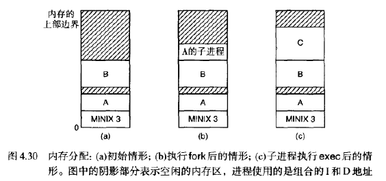

## 4. 存储管理

**存储器层次结构：**

CPU寄存器 

高速缓存

 主存储器（内存）

 磁盘

管理存储器的层次结构：**存储管理器**

1. 记录存储器的使用情况
2. 分配给进程存储空间，收回
3. 将内存中容不下的进程放到磁盘里

### 4.1 基本的存储管理

两类存储管理系统：

1. 在内存和磁盘之间转换进程——由于内存不足造成
2. 不用这种操作

#### 4.1.1 单道程序存储管理

*每一次只能运行一个程序，一般用于嵌入式*

将内存划分为**系统区**和**用户区**

存放在内存高端的ROM中的系统内容被称为**基本输入输出系统**BIOS

#### 4.1.2 固定分区的多道程序系统

*当一个进程由于IO等待被阻塞时，另一个进程可以去使用CPU*

把内存划分成n个分区，根据进程大小放到相应大小的分区的输入队列中。

问题：小分区的输入队列是满的，大分区的输入队列是空的

解决：搜索整个队列，从中选择能装入该分区的最大进程，减少浪费空间。

问题：小进程容易被忽略

解决：规定一个进程不能被忽略超过k次。至少保留一个小分区

手工划分若干分区，确定起始位置和大小：**固定数量任务的多道程序**

#### 4.1.3 重定位和存储保护

*链接器必须直到程序在内存的什么地址开始运行*

> 如果程序被装入分区1，那么就把它的每个地址加上100KB；如果被装入分区2，那么就把每个地址加上200KB。链接器在可执行文件中包含一个链表或位图，列出各个需要重定位的地址单元的位置。没有解决存储保护问题

两个特殊的硬件寄存器：**基地址**和**边界**

当一个进程开始运行，就把进程所在分区的起始地址作为基地址，把分区长度放在边界寄存器中

每一次内存访问时，将内存地址加上基地址。每次将访问地址与边界寄存器值比较，防止访问分区以外。

缺点：额外的比较操作和加法

### 4.2 交换技术

批处理系统中，采用固定分区

分时系统或面向图形的个人计算机，内存可能不够用，必须把多出来的内存保存在磁盘上。

硬件条件的不同，采用两种不同的存储管理方法：

1. 交换。把各个进程完整的调入内存，运行一段时间，再放回磁盘上
2. 虚拟存储器。进程只有一部分内容在内存里，也能运行

*包含的地址需要重定位，换入时软件完成，或程序运行时硬件完成*

提高了内存的利用率，但是使内存分配管理回收变得复杂。会形成较小的不连续的空闲分区

解决：**内存紧缩**，把所有进程尽可能往内存地址低端移动，从而在地址高端形成较大的空闲分区。耗费大量CPU时间。

进程的数据段需要增长。堆（数据段）：动态分配和释放的变量。栈：普通的局部变量和返回地址

#### 4.2.1 基于位图的存储管理

用于记录内存的使用情况：

1. 位图法
2. 空闲链表法

在位图法中，内存被划分为很多分配单元，每个单元对应位图中的一个数据位，0表示空闲，1表示占用

#### 4.2.2 基于链表的存储管理

链表每一个节点，描述一个内存分区，包括起始地址、长度、指向下一个节点的指针、分区当前状态。H表示空闲，P表示被占用

双向链表，方便合并

当一个进程到来时，需要为它寻找空闲分区，大于等于进程大小。

1. 最先匹配法。查找节点少，速度快
2. 下次匹配法。每次找到合适的空闲节点，就记录这里，为下一个进程再次分配的时候，从这里往下找。因为大概率之前的节点还是占用的。速度快，较大空闲分区不容易保留
3. 最佳匹配法。遍历找到最小。速度慢，空间利用率也差
4. 最坏匹配法。每次分配都将最大的空闲区切去一部分。对大的进程效果不佳。

分离进程链表和空闲链表。

空闲链表从小到大排序

空闲分区本身存储链表信息

5. 快速匹配法。对常用的请求大小（比如4KB，8KB，12KB）找的很快。缺点是当一个金晨哥运行结束时，合并的开销很大。

### 4.3 虚拟存储管理

*如果程序太大放不进内存怎么办？*

1. 覆盖块。把程序划分成若干个部分，把当前需要用到的指令和数据保存在内存中，其余的保存在磁盘里。
2. 虚拟存储器。程序的代码、数据、栈的总大小可以超过实际可用的物理内存大小，把当前要用的放在内存中。

#### 4.3.1 虚拟页式存储管理

*分页，虚拟地址放在存储管理单元MMU中，映射为物理地址*

1. 将物理内存划分成多个固定大小的内存块——物理页/页框
2. 将虚拟地址空间划分成大小相同的块——虚拟页面/页面。大小2的幂
3. 用户程序以页面为单位，在内存和磁盘之间换进换出
4. 有效位描述虚拟页面是否在内存里

#### 4.3.2 页表

### 4.4 页面置换算法

#### 4.4.1 最优页面置换算法

*当一个缺页中断发生时，计算内存中每一个页面的下次访问之前还有多少条指令，把很久很久以后才会被访问到的页面替换掉*

无法实现。

#### 4.4.2 最近未使用页面置换算法

每个页面两个标志位：访问位R和修改位M。当一个页面被访问R=1，当一个页面被写入数据M=1

1. 启动时将两个位设为0
2. 运行时R定期清0
3. M位不清0，因为M位决定了磁盘是否将这个页写回
4. RM作为编号，编号最小的淘汰

#### 4.4.3 先进先出页面置换算法（FIFO）

链表记录所有位于内存中的虚拟页面，链首淘汰，新的页面加到链尾（队列）

缺点：有可能淘汰掉经常访问的页面

#### 4.4.4 第二次机会页面置换算法

同FIFO一样，寻找最老的页面，如果R=1，就给它第二次机会，把R清零，装到链表尾端，然后继续从头往下搜索。

如果所有页面都在这段时间内被访问过，就会所有的R都=1，退化为FIFO

缺点：需要在链表中经常移动页面

#### 4.4.5 时钟页面置换算法

环形链表，指针指向最古老的页面。第二次机会的改进。

#### 4.4.6 最近最久未使用算法（LRU）

1. 把最近刚使用过的页面作为首节点，最久没使用的页面作为尾节点
2. 每次**内存访问**都更新链表，找到此次访问的页面移动到链表开头
3. 每个页表项都有一个足够大的字段来存放计数器的值，计数器计数此时内存访问指令执行的条数，因此记录了最小的数就是很久没被访问的页面。

1. 初始化时全部置位0
2. 如果有一个页被访问了，那么就把这一行置位1，再把这一列置位0
3. 二进制值最小的一行就是最近最久未使用的

**最不经常使用算法（NFU）**

1. 每个页面计数器初始为0
2. 每次把每个页面的R位加到计数器上
3. 计数器值最小的访问最不频繁

**老化算法**

1. 将当前时钟节拍的R位的值插入计数器的最左端。
2. 有限位，以前的访问直接丢掉。8位

### 4.5 页式存储管理中的设计问题

#### 4.5.1 工作集模型

预先调页。每个进程都有局部性的工作集。

使用老化算法判断工作集，如果n个时钟周期还没被访问，就把它从工作集中删除。

#### 4.5.2 局部与全局分配策略

#### 4.5.3 页面大小

#### 4.5.4 虚拟存储器接口

### 4.6 段式存储管理

### 4.7 MINIX3进程管理器概述

进程管理器/存储管理器处理与进程管理有关的系统调用，其中有些与存储密切相关：fork，exec，brk

PM维护一个空闲空间链表，内存地址从低到高排列。如果执行了fork或exec，就用最先匹配法找到一个空闲区。不支持交换和分页

#### 4.7.1 内存布局

组合的I和D空间：进程各个部分共用一个内存块，作为整体申请和释放。

分配内存的情况：fork，为子进程分配内存。exec，旧的映像释放，新的映像分配内存空间。系统进程请求内存，存储驱动程序为RAM申请内存空间（一般在系统初始化时）

独立的I和D空间：共用代码。

数据段的边界通过brk修改，检查新的数据段是否超过了当前的栈指针。如果新的数据段闯入了栈空间就寄

#### 4.7.2 消息处理

进程管理器接收两种消息：

1. 系统通知消息。内核与系统之间的
2. 系统调用。由用户进程发来

有些调用的内容只是提供了一个接口，转而去执行内核调用（就像chrt）

库函数sbrk把数据段当前长度加上函数参数所指定的增量，然后调用brk

table.c call_vec表包含函数指针，指向不同类型消息的处理函数。当消息到达PM，主循环将消息放在全局变量call_nr中，访问call_vec，找到相应的消息处理函数。

#### 4.7.3 进程管理的数据结构和算法

内核、PM、文件系统的三个表项是对应的。

CLOCK和SYSTEM IDLE和KERNEL只在内核进程表出现，是负数

进程表在src/servers/pm/mproc.h中，mp_seg数组分别用于代码段、数据段、栈段，每个数组元素是结构体，包含虚拟地址、物理地址、段长，单位是click

代码段是空的，数据代表了代码段和数据段。栈的起始地址取决于分配给进程的内存总量。使用chmem修改文件头，栈就从更高的虚拟地址开始。栈的起始地址会更高（数字更小）

共享代码段：搜索np_dev,mp_ino,mp_ctime字段，看执行的程序的设备号，i节点号和修改时间，如果完全相同就直接映射为这个已装载的代码段的起始地址，再为栈段和数据段分配内存即可。

空闲链表定义在src/servers/pm/alloc.c，按照地址递增顺序列出内存中各个空闲区域。每个表项有三个字段：空闲区起始地址，长度，next指针。

#### 4.7.4 FORK，EXIT和WAIT系统调用

pm保存当前存在的进程个数

### 4.8 MINIX3进程管理器的实现

#### 4.8.1 头文件和数据结构

#### 4.8.2 主程序

main.c 调用pm_init初始化，进入循环，get_work等待消息，call_vec调用处理消息的函数

**初始化**

初始化空闲链表和进程表。

BIOS，空闲区，上部内存区域，扩展内存

