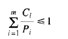

## 操作系统homework2

10215501412 彭一珅

##### 2. 进程的三种状态各是什么？分别简要描述。

运行态表示进程在该时刻实际占用处理机；就绪态表示进程可运行，因为其他进程正在运行而暂时被挂起；阻塞态表示进程除非某种外部事件发生，否则不能运行。

##### 4. 目前的计算机上，中断处理程序至少有一小部分用汇编语言编写，为什么？

1. 中断处理程序中直接对于硬件的操作，例如开中断、关中断、保存寄存器的值、设置栈指针等无法用高级语言描述。
2. 中断处理程序运行频率高，因此需要执行快。汇编语言执行更快。

##### 7. 进程和线程的本质区别是什么？

不同进程之间不共享地址空间，而一个进程中的不同线程共享着这一进程的内存地址空间。

##### 8. 在使用线程的系统中，是每个线程有一个堆栈还是每个进程有一个堆栈？说明原因。

每个线程有各自独立的栈，堆属于进程的内存地址空间，为本进程中所有线程共享。

##### 9. 什么是竞争条件？

两个或多个进程读写某些共享数据，而最后的结果取决于进程运行的精确时序，就称为竞争条件。

##### 17. 在2.2.4节中描述了一个高优先级进程H和低优先级进程L的情况。它最终导致H陷入死循环。若采用时间片调度而不是优先级调度，还能发生这种情况吗？请进行讨论。

不会，因为采用优先级调度时，H进程忙等待过程中L进程没有运行的机会，但是如果使用时间片调度，H进程在时间片用完之后就换成L进程运行，这使L进程有了运行的机会，也有了退出临界区的机会，使H进程可以继续运行下去。

##### 23. 从何种类型的进程可以在何时被启动的角度来看，读者-写者问题可以通过几种方式进行形式化。根据优先哪几类进程的不同，请详细描述该问题的三种变体。对每种变体，请说明当一个读者或写者能够访问数据库时情况将会怎样，以及当一个进程对数据库访问结束后又将会怎样。

1. 读者优先

   当有读者在访问数据库过程中，则写者需要等待至所有读者都阅读完毕，才能开始写数据，在此过程中读者不需要排队等待，随时可以再加入读。

2. 写者优先

   当有读者在访问数据库过程中，如果一个写者请求写数据，写者进入等待，此后要读数据的读者也进入等待，直到原先的读者阅读完毕，写者写数据结束，这些新的读者才能加入读，而如果有其他写者要写数据，那么写者不用排队等待。

3. 读写公平

   一旦开始读，就一直读到没有读者为止，一旦开始写，直到所有写者写完才能开始读。

##### 26. 对某系统进行监测后表明平均每个进程在I/O阻塞之前的运行时间为T。一次进程切换需要的时间为S，这里S实际上为开销。对于采用时间片长度为Q的时间片调度法，对以下各种情况给出CPU利用率的计算公式：

(a) $Q=\infty$

系统运行总时间是进程的运行时间+进程切换的时间。

则CPU利用率是 $\frac{T}{S+T}$

(b) $Q>T$

系统运行总时间是进程的运行时间+进程切换的时间。

则CPU利用率是 $\frac{T}{S+T}$

(c) $S<Q<T$

在这种情况下，进程运行Q时间后就会进行切换，所以进程的运行时间为Q

则CPU利用率是 $\frac{Q}{S+Q}$

(d) $Q=S$

在这种情况下，进程运行Q时间后就会进行切换，所以进程的运行时间为Q

则CPU利用率是 $\frac{Q}{S+Q}$

因为$Q=S$ 所以CPU利用率是50%

(e) $Q趋近于0$

CPU时间都花费在进程切换上，CPU利用率趋近于0

##### 27. 有5个待运行任务，各自的预计运行时间分别是9,6,3,5和X。采用哪种运行次序将使平均响应时间最短？（答案取决于X）

最短作业优先调度。
当 x$\leq$3时，运行次序为x,3,5,6,9；
当 3 < x $\leq$ 5时，运行次序为3,x,5,6,9；
当 5 < x $\leq$ 6时，运行次序为3,5,x,6,9；
当 6 < x $\leq$ 9时，运行次序为3,5,6,x,9；
当 x > 9时，运行次序为3,5,6,9,x。

##### 28. 有5个批处理任务A到E几乎同时到达一个计算中心。其预计运行时间分别为10min，6min，2min，4min和8min。其优先级（由外部设定）分别为3,5,2,1,4，这里5为最高优先级。对于下列每种调度算法，计算其平均进程周转时间，进程切换开销可忽略：

(a)时间片轮转

0~10min 每个作业各运行2min，C结束；

10~18min 每个作业各运行2min，D结束；

18~24min 每个作业各运行2min，B结束；

24~28min 每个作业各运行2min，E结束；

28~30min 作业A运行2min，结束

因此进程A运行了30min，进程B运行了24min，进程C运行了10min，进程D运行了18min，进程E运行了28min

平均时间为22min

(b)优先级调度

调度次序：BEACD

进程A运行了24min，进程B运行了6min，进程C运行了26min，进程D运行了30min，进程E运行了14min

平均时间为20min

(c)先来先服务（按照次序10,6,2,4,8）

进程A运行了10min，进程B运行了16min，进程C运行了18min，进程D运行了22min，进程E运行了30min

平均时间为19.2min

(d)最短作业优先

进程A运行了30min，进程B运行了12min，进程C运行了2min，进程D运行了6min，进程E运行了20min

平均时间为14min

对于(a)，假设系统具有多道处理能力，每个作业均获得公平的CPU份额；对于(b)到(d)，假设某一时刻只有一个作业运行，直到结束。所有的作业都是完全的CPU密集型作业。

##### 33. 一个软实时系统有4个周期性事件，其周期分别为50ms,100ms,300ms,250ms。假设其处理分别需要35ms,20ms,10ms,xms,则该系统可调度所允许的x值最大是多少？

软实时系统调度需要满足如下条件：

若$\frac{35}{30}+\frac{20}{100}+\frac{10}{300}+\frac{x}{250} \leq 1$ 则系统可调度

$x\leq \frac{50}{3}$ 

##### 38. MINIX 3使用图2.43所示的调度方法，其中不同类型的进程有不同的优先级。优先级最低的进程（用户进程）使用时间片调度法，而系统任务和服务器进程则允许一直运行到阻塞。请问优先级最低的进程是否会发生饥饿？为什么？ 

不会发生饥饿。系统任务和服务器进程优先级高，分配的时间片多，通常这些高优先级进程由于时间片用不完，常常处于阻塞状态。而用户进程的时间片分配得少，当时间片用完后被移动到队列尾部。并且MINIX是一个抢占式操作系统，可以修改进程的优先级。