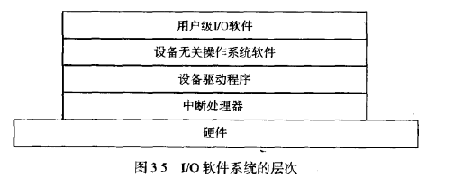
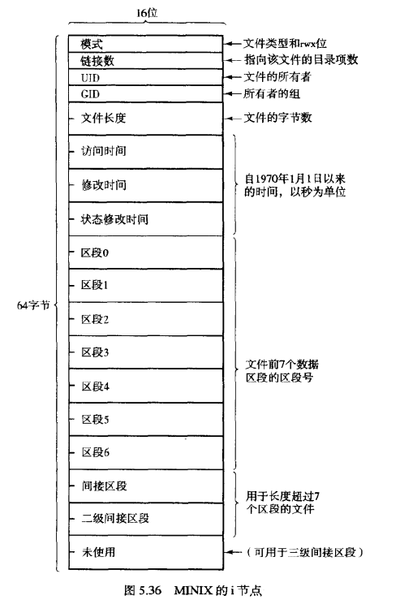

考试题型：

判断题、名词解释、简答题、计算题、原理题

## 第一章

虚拟机、操作系统、并发、异步性、微内核结构、核心态与用户态、系统调用、中断

虚拟机：通过软件模拟一个运行在完全隔离环境中的完整计算机系统

操作系统：管理计算机硬件、给用户提供抽象服务的软件

并发：多个任务同一时间段执行

异步性：任务之间没有固定时间顺序，不需要等待上一个任务结束再开始

微内核结构：将操作系统分为一个小的内核，将**服务程序**以用户态运行在内核外

核心态与用户态：核心态是特权级别最高的运行状态，是操作系统运行的状态，可以访问硬件。用户态是用户进程运行的方式，不能直接访问硬件资源。

系统调用：通过操作系统的接口，调用**服务过程**，转为内核态，使用户进程可以完成一些特权操作

中断：遇到某些事件或满足条件时，暂停当前任务，执行一个**中断处理程序**，完成后回到源程序继续执行。硬件中断。软件中断：软中断指令切换CPU到内核态，被用作实现系统调用

### 1.1 什么是操作系统

在硬件基础上安装一层软件，任务是为用户程序提供一个更好、更简单、更清晰的计算机模型，这种软件称之为操作系统。

操作系统目标：

+ 有效性：合理分配资源，组织工作流程
+ 方便性：不同的硬件有相同的抽象，不必了解底层
+ 可扩充性：增加硬件类型、功能、多个系统共享

### 1.2 操作系统的发展历史

+ 电子管时代

+ 晶体管时代

+ 集成电路时代

  多道批处理，宏观上并行，微观上串行

多道程序，**内存**布局有多个空间，执行序列分时系统。时间片分配

+ 微处理器时代

  人机交互性好，共享主机，用户独立性

### 1.3 操作系统基本概念

文件系统：非易失性。进程、内存：易失性

系统调用：

与进程相关的系统调用：创建进程、进程间通信、终止进程

与文件系统相关的系统调用：mount文件系统、读写文件等

进程：正在执行的程序

+ 地址空间：代码、数据、栈
+ 进程表项：寄存器、PC、堆栈指针
+ 子进程
+ 进程间通信

文件

Shell命令解释器

操作系统的特征：

1. 并发——多个事件在同一时间段内发生。进程。多道程序宏观上并发

   并行：同一时刻发生

2. 共享——互斥共享，资源使用到释放过程中不准其他进程使用

3. 虚拟——存储器->地址空间

4. 异步性——程序执行顺序和执行时间的不确定性

   分时系统多个进程并发执行，不可预知快慢，难以重现系统在某个时刻的状态。

   无论快慢，应当结果相同。

### 1.4 操作系统系统调用

操作系统提供了两种功能：为用户提供**应用程序抽象**和**管理计算机资源**。

操作系统提供服务。

1. 服务类型：程序执行终止、I/O操作、文件系统操作、进程通信、配置管理、差错检测
2. 服务方式：系统命令和系统调用

系统调用：特殊**过程调用**，只有系统调用能进入内核态，而普通过程调用不能进入内核态。

陷入指令只能在用户态执行，不能在内核态执行。访管指令

1. 进程管理

   代码、数据、栈

2. 信号管理

   软件中断，处理异步事件的方法：键入中断键，发送信号停止正在运行的程序

3. 文件管理

   所有打开文件都以文件描述符（非负整数）引用

   打开/创建文件时，内核向进程返回文件描述符，读写时用open返回的文件描述符作为参数传递给read

   **文件描述符**0标准输入，1标准输出，2标准出错输出

   进程表项中的文件指针指向文件表，文件表中的v节点指针指向v节点表

   fd=dup(1)复制出来的文件描述符是当前可用文件描述符中的最小数值（打印(int)fd）

   管道：fd[0]从管道接收，fd[1]输入到管道

   对于一个进程，要先关闭不需要的管道口close(fd[0])，然后将标准输出映射为管道的输入口dup(fd[1])，然后关闭这个管道close(fd[1])

4. 目录管理

   LINK允许同一文件以不同路径名出现，i-node相同

   

   mount将两个文件系统合并成一个。

   在dev下存储着硬件设备（光盘）的信息，使用mount将其上的文件系统安装到根文件系统下

   

5. 安全管理

   每个文件11位的保护码，9位分别3文件所有者3同组用户3其他用户，这3位是rwx。另外两位是设置组标识位和设置用户标识位例如passwd

6. 时间管理

   time返回当前距离1970.1.1的秒数

   stime设置系统时间

   utime修改文件时间 touch命令将文件时间设为当前时间

   times返回进程的计账信息

### 1.5 操作系统组织结构

整体式系统：操作系统是一堆**过程**的集合，每个过程可以调用其他过程

每一个过程都有接口（入口参数和返回值）

CPU的两种状态：

+ 核心态：供操作系统使用，该状态下可以执行机器的所有指令
+ 用户态：供用户程序使用，I/O操作和某些其他操作不能执行

系统调用：先将参数放在堆栈或者寄存器里，再调用kernel call陷入内核，寻找子程序入口，运行系统子程序

基本结构组成：

一个用来调用被请求服务例程的主程序
一组执行系统调用的服务例程
一组支持服务例程的实用过程

虚拟机：

全虚拟化技术
半虚拟化技术
基于容器的虚拟化技术——不虚拟任何硬件设备

微内核：将操作系统功能放在核心之外，以用户进程的方式，作为独立的服务进程运行（服务器进程，用户进程）

本地过程调用：进程之间请求-应答式的消息传递机制。

消息：发起消息，处理消息，送出回答消息，整理回答消息，返回结果

### 1.6 常用操作系统简介

### 习题

1. 操作系统的两个主要功能

   管理硬件资源、给用户提供底层硬件的扩展

2. 内核态和用户态的区别？为什么要有这种区别？

   内核态可以执行特权指令，可以访问所有内存空间，内核态的程序一般是操作系统的组成部分。用户态不能执行特权指令，不能访问受保护的内存空间或其他进程的内存空间。

   可以保护操作系统，防止用户修改

   2.1 用户态和核心态是如何切换的？

   用户态**通过中断进入核心态**，核心态执行特权指令，将进程的PSW设为用户态

3. 什么是多道程序？

   多个程序并发执行，宏观上并行，微观上串行

4. 什么是假脱机？

   将独占设备转换成共享设备（输出井）

   脱机：脱离主机控制的I/O

5. 每一个字节数据的读写都是由CPU直接处理，有什么坏处？

   浪费CPU时间，CPU这个时候可以去为别的进程进行计算

6. 没有硬件保护，分时系统危险

7. 哪个只能在内核态执行？134

   1. 屏蔽所有中断
   2. 读时钟日期
   3. 设置时钟日期
   4. 改变内存映像图

8. 个人计算机os和大型主机os的不同之处？

   个人交互式，大型批处理、分时系统

9. windows与linux比较

10. 文件权限码是UID GID 所有用户的rwx

11. 为什么要有超级用户？

12. 绝对路径和相对路径？

13. 进程表：存储进程状态。单进程系统不需要

14. 块设备文件是以块为输入输出单位，可以寻找块来进行读取写入

15. 有。i-node还在

16. 没有管道的话，可以直接写入读取文件。管道节省磁盘空间

17. 终端shell

18. fork+exec

19. 不能让用户随意修改根目录，可能修改密码

20. getpid

21. 500000

22. 取消链接i-node就没了

23. update的作用是每30s发出一次sync系统调用，将缓存中的脏块写入磁盘

24. 无

25. 能，消息传递

26. 

## 第二章 进程管理

单道程序、多道程序、运行态、就绪态、阻塞态、新建态、僵死态、进程、进程模型、线程、线程模型、进程控制块(PCB)、陷入、抢占、FCFS进程调度、时间片轮转调度、优先级调度、多重队列调度、最短进程优先调度、两级调度、同步、互斥竞争条件、临界区、忙等算法、锁变量、原子操作、信号量、管程、消息、饿死、经典IPC问题、两阶段加锁、MINIX3进程管理机制

单道程序：计算机系统中只有一个进程执行

多道程序：把多个程序放在内存中，并使他们交替进行，共享软硬件资源。宏观上看，多道程序是并行的，因为多道程序都在运行之中。从微观上看，多道程序是串行的，因为CPU每次只处理一个程序，交替执行。

运行态：进程正在使用CPU时间

就绪态：进程准备好运行了，等待CPU时间片

阻塞态：进程由于I/O阻塞等而暂停运行，等待被唤醒

新建态：操作系统已经准备好了pid，创建好了进程表，但是资源还有限，不能运行

僵死态：进程已经终止，但是占有的资源还没被释放

进程：正在执行的程序，由程序段、数据段、PCB组成。PCB是进程存在的唯一标志

进程模型

线程：一个进程内，共享资源但是有独立的栈、寄存器、PC、状态信息的执行路径

线程模型

进程控制块(PCB)：描述进程运行状态，管理进程的数据结构

陷入：指应用程序通过**系统调用接口**请求操作系统内核执行某些特权操作的过程（陷入内核）

抢占：一个进程被中断，处理中断后**调度程序选择了另一个**要运行的进程

FCFS进程调度：先来先服务，按照进程到达的先后顺序

时间片轮转调度：每个进程运行固定的最大时间，运行完毕后强制等待并运行下一个

优先级调度：优先级高的先运行，低的就绪一直等待到高的运行完

多重队列调度：队列之间优先级不同，每个队列按照时间片轮转调度

最短进程优先调度：最短的先运行，新来的不抢占

两级调度：内存调度（换进内存换出磁盘）和CPU调度（是否执行）

同步：多个进程或线程协调执行，保证资源互斥访问和数据一致性

互斥竞争条件：两个或多个进程读写某些共享数据，而最后的结果取决于进程运行的精确时序，就称为竞争条件。

临界区：进程访问共享资源的代码段

忙等算法：进程进入死循环，出循环的判断条件是直到资源不再被访问

锁变量：锁变量为0时，加锁并进入访问共享资源，此时为1，其他进程无法访问这个资源。访问完毕后释放

原子操作：无法被中断的指令序列，确保执行过程中不被其他进程打断

信号量：对信号量的操作是原子性的，如果为0进程就sleep，通过对信号量的加减来控制进程对资源的访问

管程：协调多个进程或线程访问共享资源的高级抽象，包含了一组数据和对数据执行的操作，通过函数调用来实现对共享资源的访问。

消息：进程间通信，

饿死：进程由于无法获得资源，一直处于等待状态

经典IPC问题：经典IPC问题是指在进程间通信中经常出现的三个问题，包括生产者-消费者问题、读者-写者问题和哲学家就餐问题。

两阶段加锁：等待所有的资源都被这个进程锁定之后再进入临界区

MINIX3进程管理机制：MINIX3是一个小型的操作系统，其进程管理采用了类 Unix 的设计思想，使用进程控制块（PCB）来描述进程状态和属性，并通过信号量、管程等机制来实现进程间通信和同步。同时，MINIX3支持多线程，可以在单个进程内创建多个线程。

### 2.1 进程

#### 1. 进程模型

进程：一个正在执行的程序

代码、数据、栈

逻辑上有自己的CPU，物理上与其他进程通过上下文切换共享CPU。如何共享？调度算法

逻辑上有自己的PC（控制流），物理上共享，进程切换时，将进程的逻辑计数器值放进物理程序计数器中。

上下文切换：保存旧进程的状态，载入被保存的新进程的状态。硬件决定处理时间，而非操作系统。断点内容存在PCB里。

模式切换：非上下文切换的中断。用户通过中断处理器切换到内核模式。用户态不能直接访问受保护的OS代码，核心态可以执行OS代码，并访问全部进程空间。

进程和程序的不同：

+ 进程是动态的，是程序的执行，不能复制；程序是静态的，有序代码的集合，可以作为文件在不同计算机之间迁移
+ 进程是暂时的，程序时永久的
+ 进程包括程序、数据、**PCB（进程控制块）**
+ 一个程序可对应多个进程（多次执行），一个进程可包括多个程序（调用关系）

#### 2. 进程的创建与终止

创建进程的原则：

+ 系统初始化

  前台进程与用户交互，后台进程（守护进程）如e-mail，web网页，打印等

+ 系统调用创建

  运行在不同CPU可以更快

+ 用户请求创建

  交互式系统，用户通过命令切换进程、与进程交互

+ 批处理创建

  大型机的批处理系统。操作系统有资源运行下一个任务就创建新进程，运行用户提交的下一个批处理作业

fork新创建的进程：

1. 有独立的地址空间
2. 修改对于原进程不可见
3. 与原进程并发执行

进程终止原因：

+ 正常退出：调用exit
+ 出错退出：给出错误参数，告知用户
+ 严重错误（非自愿退出）：执行非法指令，内存引用错误或者/0，可能会中断或者终止
+ 被其他进程终止（非自愿）：调用kill

#### 3. 进程层次结构

每个进程只能有一个父进程，可以有多个子进程

以init为根的进程树

#### 4. 进程状态及转换

+ 运行态

  正在被CPU执行，占用CPU时间片

+ 就绪态

  准备好执行

+ 阻塞态

  不能运行，直到一些事件发生，如I/O完成
  
  阻塞队列有好几个，分别等待不同的事件

运行态通过超时、高优先级**中断**转换成就绪态

就绪态通过进程调度转换成运行态

运行态通过事件阻塞（等待操作系统服务，I/O等待，缺页（资源等待），等待程序输入）转换成阻塞态

阻塞态通过等待的事件完成转换成就绪态

新建态：操作系统已经初始化了pid，创建好了进程控制块PCB，但是资源还有限，不能运行

僵死态：进程遇到不可修复的错误，终止，但是操作系统还需要撤销进程，撤销PCB，回收内存空间。信息暂时被辅助程序保管，如果不需要了就删除了。

最底层：中断、调度；上层：串行程序

进入阻塞态是进程主动要求的，这必须要进程在运行中才能完成。

因为是从就绪队列中调度进程开始运行，因此不可能直接从阻塞态到运行态。

#### 5. 进程的实现

进程控制块PCB（进程表）：OS记录进程相关信息的内存。每个进程都有登记，在核心段内存，通过系统调用访问

内容：

+ 进程描述信息

  pid，进程名（可执行文件名），用户名，进程组

+ 进程控制信息

  当前状态，优先级，外存地址，执行入口地址，运行统计信息

+ 资源占用信息

  打开文件，虚拟地址空间的现状

+ **CPU信息**

  寄存器值（PC，栈指针）

组织方式：

+ 链表：同一状态的进程形成一个链表
+ 索引表：同一状态的进程归入一个index表，index里包含指向进程表（结构体数组，每个元素代表一个PCB）的指针

中断处理步骤：

1. 硬件压栈PC值
2. 从中断向量读取PC
3. 汇编存储寄存器值，保存进程的当前信息
4. 设置新的栈，为运行处理程序作准备
5. 运行C语言中断处理程序，发送消息
6. 标识程序状态，确定哪些就绪
7. 调度器选择一个开始运行
8. C语言中断处理程序返回汇编
9. 载入相关数据，运行新的当前进程

中断向量：包含中断服务器的入口地址

中断类型：信号、陷阱、故障、终止

异步调度：中断处理程序使得某个优先级高的任务进入就绪状态

#### 6. 线程及实现

一个进程只有一个地址空间和控制流

一个进程在一个地址空间（代码、数据、打开文件）中有多个控制流（栈和寄存器）——线程

线程是程序执行流的最小单位

+ 线程是CPU调度单位，进程是其他资源分配单位
+ 线程通信直接读写进程数据段（全局变量，但是需要进程同步），进程间通信IPC
+ 线程上下文切换比进程更快

线程优点：减少并发执行的时间空间开销（创建、终止、切换时间短，之间通信不需要经过内核）

多线程例子：web服务器。调度线程读入请求，选择空闲线程处理请求（将消息指针写入线程，然后唤醒，将工作线程从阻塞变为就绪），工作线程读取web页面数据，如果要从磁盘中I/O出来，那么可以挑选另一个线程。将页面返回给客户之后，工作线程阻塞，等待新的请求。

线程独立：PC，寄存器，栈，状态

线程共享：地址空间，全局变量，打开文件，子进程，定时器，信号与信号处理程序，账户信息等

线程实现方式：

1. 内核线程

   内核创建撤销，执行指定函数

   内核维护进程和线程的上下文信息，切换线程，一个阻塞不会影响其他线程

   多线程的进程获得更多的CPU时间

2. 用户线程

   不依赖操作系统核心，利用**线程库**提供创建、同步、调度、管理线程的函数

   调度在软件内部执行，内核不了解它们的存在，切换不需要内核特权

   一个线程阻塞，整个进程都等待。

   时间片分配给进程的是固定的，因此每个线程会慢

   可以根据应用程序的需要对调度算法进行优化

3. 混合方案

   多个用户线程多路复用（对应）一个内核线程

   在用户空间内创建、大量调度和同步

   可以调整KLT（内核线程）的数量

thread_create创建线程

thread_exit退出线程

thread_join一个线程等待另一个退出

thread_yield允许线程放弃CPU让另一个运行

每个进程一个线程表

### 2.2 进程间通信

进程控制的五种原语：创建、终止、唤醒、阻塞、切换

进程间通信的三个关键问题：

1. 进程如何传递消息给另一个进程（线程：共享地址空间）
2. 如何确保多个进程访问同一资源时，不相互干扰
3. 相互依存的进程如何保证正确的执行顺序

#### 1. 竞争条件

竞态条件：两个或多个协作的进程共享公共资源（内存、文件）时，同时对数据进行修改，最后的结果取决于进程运行（指令）的**精确时序**，从而影响程序的正确性

原因：执行顺序：一个进程将值读取到缓冲区、时间片耗尽去运行下一个进程，下一个进程读取到相同的值，然后都认为这个值可用。例子：需要打印机假脱机程序，而不是进程直接访问I/O设备

#### 2. 临界区

临界区：**对共享内存进行访问的程序片段**

避免竞争条件的方法：

1. 任何两个进程不能同时处于临界区
2. 不能使进程永远在临界区外等候
3. 不对CPU的运行做任何假设
4. 临界区外的进程不能阻塞其他进程

#### 3. 忙等待形式互斥

可能的方法：

1. 关中断

   使每个进程进入临界区后关中断（CPU不准去执行别的程序了，禁止了时钟和其他中断造成的抢占），离开之后再开中断。

   缺点：用户关中断后不再开，坏

2. 锁变量

   共享锁变量，初值为0，锁置为1进入临界区，如果锁为1就等待进入。

   缺点：读取并改写锁变量的过程没有原子性

3. 严格交替

   确保两个进程严格轮流进入临界区

   用于忙等待的锁，称为**自旋锁**

   缺点：位于临界区外的进程会阻塞其他进程。在一个进程执行速度慢了很多的情况下，轮流进入临界区不好。

忙等待形式互斥：当一个进程想进入临界区，那么就检查是否允许进入，如果不允许，就进行忙等待直到许可。

+ Peterson解法

  一个值设为进程号，进入循环的时候重新查询这个值，因此只有最后保存进去的进程号有效，因此写入turn的进程无限循环直到另一个不再interested

+ TSL解法

  将存储器值读到寄存器中，然后在该指令结束之前不准读取内存，锁住内存总线禁止其他CPU访问内存

  `TSL RX,LOCK`将LOCK复制到寄存器，并设为1

  进程进入临界区之前，调用enter_region，判断是否进行循环，如果LOCK值不等于0，那么就说明已经加锁，进入无限循环

  `MOVE LOCK,#0`将锁设为0，临界区使用完毕

#### 4. 睡眠与唤醒

忙等待浪费了CPU时间，还会产生优先级反转问题：低优先级占据资源就绪，然而高优先级运行，因此高优先级忙等待低优先级——需要把忙等待改为阻塞（让权等待）

sleep使调用进程阻塞，wakeup唤醒指定进程

但是用来解决生产消费者问题会产生：唤醒尚未进行睡眠状态的进程会导致唤醒丢失

​	解决方法：增加唤醒等待位，wakeup信号发给还未睡眠的进程，就将等待位设为1，然后如果这个进程想要sleep了就被立刻唤醒。但是不能从根本上解决问题。

#### 5. 信号量

原语：数条指令组成的原子操作。原语是通过开关中断来实现的。

系统调用不全是原语，比如read，可以阻塞转入其他进程

信号量：整型变量，累计唤醒次数，取值可以是0和任意整数。（有几个设备可用就初始化为几）

对信号量的两个操作：

+ down检查是否大于0，如果大于0就-1；如果此时为0就sleep
+ up使信号量值+1，如果多个进程在睡眠就选取一个完成down操作，不再睡眠
+ 对于信号量的操作都是原子性的，使用TSL防止几个CPU同时访问一个信号量

生产消费者问题：

+ mutex确保两者不会同时进入缓冲区，初始化为1，二进制信号量
+ full初始化为0
+ empty初始化为缓冲区中插槽数
+ 每个进程在进入关键区域之前down，离开之后up

#### 6. 互斥

成对使用P(mutex)（down）和V(mutex)（up）原语，加锁和解锁

mutex与TSL的最大不同是忙等待改为阻塞运行其他进程

互斥、同步（一前一后）、前驱关系

#### 7. 管程

管程：把共享变量以及对共享变量的操作集中在一个模块中

提出原因：信号量同步操作分散，易读性差

管程特性：模块化，抽象数据类型（包括对数据操作的代码），信息封装

实现要素：

+ 共享变量不可见，只能调用函数来间接访问
+ 管程互斥进入
+ 进程等待队列，等待唤醒操作。**条件变量**表示一种等待原因，每个原因代表一个队列
+ monitor统一管理进程

#### 8. 消息传递

原语send和receive是系统调用（库函数）

要点：

+ 为了防止消息丢失，一旦信息被接收到就应答，未收到应答就重发
+ 消息有序号
+ 消息有进程命名

生产消费者问题：如果所有的消息被填满，生产者将被阻塞，等待返回一条空消息

### 2.3 经典并发问题

1. 哲学家进餐问题

   哲学家同时拿起左右两边的叉子才能吃饭

   饥饿：先拿起左叉，等一段时间再重复整个过程，但是某一个瞬间，所有哲学家同时启动，就会如此重复下去。

   一个信号量：同时只允许一个哲学家进餐

2. 读者写者问题

   任何时刻写者最多允许一个，读者允许多个

   写者到来时就不再允许新的读者进入，这样等旧的读者走光之后就可以让写者进入了

### 2.4 进程调度

#### 1. 调度简介

进程需要CPU计算，需要I/O操作

计算密集型，I/O密集型

调度时机：进程退出、阻塞（I/O，信号量）、创建新进程、I/O中断发生、时钟中断

抢占式：选择一个进程，最大固定时间内运行，然后选择其他就绪进程

非抢占式：进程一直运行到被阻塞或者自动释放CPU，时钟中断时不会进行调度

调度算法的分类：

+ 批处理

  商业领域，一般非抢占，减少切换，增加性能，最大化吞吐量，最小化周转时间，最大化CPU利用率

+ 交互式

  抢占式，最小化响应时间，均衡性

+ 实时

  实时系统只运行用来推进现有应用的程序，而交互式系统是通用的。满足截止时间、可预测性

性能指标：

+ 用户：周转时间，响应时间，截至时间，公平性
+ 系统：吞吐量，CPU利用率，各种设备均衡利用

#### 2. 批处理系统调度

1. 先来先服务FCFS：非抢占，利于长作业，CPU繁忙的作业
2. 短作业优先SJF：对预计执行时间短的进程优先分派CPU，后来的短作业不抢占。提高吞吐率
3. 最短剩余时间优先SRT：后来的短作业抢占
4. 最高响应比优先：响应比R = (等待时间+ 要求执行时间) / 要求执行时间

挂起：将内存映像调到外存

三级调度：

+ 准入调度器：允许任务进入系统/保存在输入队列
+ 内存调度器：保存在内存/磁盘
+ CPU调度器：就绪/运行

#### 3. 交互式系统调度

1. 时间片轮转RR（轮询）：按照先来先服务排成队列，每次取队首，执行完时间片中断，暂停放到就绪队列的末尾，也可以未用完一个时间片就阻塞

   时间片过长退化为FCFS，过短上下文切换浪费CPU时间

   **响应时间=进程数目*时间片长度**

   时间片长度的影响因素：就绪进程的数目、系统的处理能力

2. 优先级调度：优先调度运行优先级最高的就绪进程。静态、动态（等待时间延长优先级提高，每执行一个时间片优先级降低）。

3. 多类优先级调度：各类之间优先级，各类内部时间片轮转。低优先级容易饥饿

4. 彩票调度：随机，加权

5. 公平分享调度：用户的资源比例确定用户进程的CPU时间比例

#### 4. 实时系统调度

硬实时：必须满足时间限制

软实时：偶尔可以超过时间限制

周期性事件m个，事件i的周期为Pi，事件i需要Ci秒CPU时间处理，因此

不可调度的实时系统：需要的CPU时间总和大于CPU能提供的时间

#### 5. 调度策略和机制

调度机制：调度算法参数化

调度策略：用户进程设置参数

#### 6. 线程调度

两个层次的并行性：进程级和线程级

**用户级线程阻塞**会引起整个进程的阻塞

### 2.5 MINIX3进程概述

1. 系统结构：微内核结构，通过IPC进程间通信

   内核，设备驱动，服务器，用户

2. 进程管理：

   启动顺序：bootstrap，boot（引导映像，每个部分都是独立的程序），kernel，系统任务，时钟任务，系统进程（设备驱动器和服务器层的进程），init进程，其他用户进程

3. 进程间通信：send，receive，notify

4. 进程调度：16个队列，IDLE最低优先级15，系统任务时钟任务最高优先级0，不同优先级队列时间片长度不一。

   改进的时间片轮转：非就绪时间片没有用完，I/O阻塞，则下次就绪时放在队首。用完时间片就直接放在队尾。

### 2.6 MINIX3进程实现

默认头文件目录<>，当前目录下头文件“”

bootblock引导块

消息通信：

send检查目标进程是否在等待，如果在等待就放到接受者缓冲区，让两进程就绪；如果不在等待就让发送者阻塞，消息放到接收队列

receive时检查队列中是否有消息，如果没有就阻塞直到一条消息到达

### 2.7 MINIX3系统任务

系统任务作为一个进程被独立调度，接收所有来自驱动程序和服务器层进程的相关服务请求，如：读写I/O端口，跨地址空间复制数据

用户进程->系统调用->发给服务器进程->消息sys\_发给系统任务进程->接收内核调用sys_->内核服务

### 2.8 MINIX3时钟任务

分时操作

单触发，方波

一个物理时钟模拟多个虚拟定时器：所有时钟请求放在链表里，

### 习题

1. 为什么多进程？

   多个I/O和用户进程同时运行

2. 进程的三种状态

   阻塞，就绪，运行

3. 寄存器保存进程信息，CPU转到中断向量，获取进程信息并实现切换

4. 高级语言不支持对CPU硬件的访问

5.  

6. 为什么不能每个进程都有自己的高速缓存？因为不利于**数据访问的一致性**

7. 进程和线程的本质区别？

   进程是资源，线程是执行单元

8. 每个线程一个堆栈

9. 竞争条件：两个或多个进程同时访问共享资源。

14. 1放入寄存器，交换内存和寄存器，如果交换后寄存器为0，则可以访问，如果是1，则访问拒绝。当进程用完资源之后，在内存中标志0
15. 先禁用中断，然后读取信号量的值，如果DOWN并且信号量为0，则进程阻塞，如果UP，检查有没有进程被阻塞，如果有就随机一个唤醒，如果没有就增加信号量的值，最后启用中断
16. 两个二进制信息量，M，B，计数器
17. 不会
18. 每次都要检查要不要唤醒，还是signal好，只检查一次
19. 传递消息。管道连接
20. 不会，但是忙等待
21. 稍后可以检查

22. 那如果他拿着左边或者右边的叉子，他test还有屁用，肯定是被他拿着不能进餐啊。对于3位就会一直阻塞，对于100位就是一点点损失

23. 读者优先：读者可以随时进入。写者优先：写者在等待后，读者不能进入。读写对称：一旦开始读，就读到没有读者为止，如果开始写，就写到没有写者为止。

24. nT秒

25. 可以为重要的进程分配更多的时间片

26. 运行时间为T，进程切换时间为S，时间片长度为Q，计算CPU利用率：

    1. Q=无穷	T/(S+T)
    2. Q>T    T/(S+T)
    3. S<Q<T    Q/(S+Q)
    4. Q=S    50%
    5. Q趋近于0    0

27. **响应时间**是指进程在发出请求到接收完响应之间的总耗时。周转时间是平均的。如果按照3 5 6 9的顺序排，那么响应时间分别是3 8 14 23。

    所以如果所有进程同时开始，那么最小化响应时间的方法是最短作业优先

28. 平均进程周转时间（对于批处理任务）。响应时间是对于交互式系统。

    1. 时间片轮转

       8 4 0 2 6——5*2

       6 2 0 0 4——4*2

       4 0 0 0 2——3*2

       2 0 0 0 0——2*2

       0 0 0 0 0——2

       平均：(5+9+12+14+15)\*2\*/5=22min

    2. 优先级调度

       6 8 10 2 4

       6 14 24 26 30

       100/5=20min

    3. 先来先服务

       10 6 2 4 8

       10 16 18 22 30

       96/5=19.2min

    4. 最短作业优先

       2 4 6 8 10

       2 6 12 20 30

       70/5=14min

29. 2 4 8 15

31. 内存太小两级调度，一些进程放入内存，并从这些中选择一个运行

33. 35/50+0.2+10/300+x/250=1 x=50/3
34. 一个指向当前进程表项的指针，是为了方便进程切换

## 第三章 I/O系统

I/O 的各种控制方式、设备驱动程序、设备无关软件的设计目标、设备无关性、SPOOLing、死锁、死锁预防、死锁检测、死锁避免、银行家算法、RAM盘、磁盘、磁盘调度算法、时钟、终端设备

I/O 的各种控制方式：程序控制（CPU发出指令等待操作完成），中断驱动方式（CPU接收I/O操作完成的中断信号），DMA（直接内存访问，DMA控制器接管总线，直接与设备数据传输），通道（对多个设备进行调控，无需CPU参与）

设备驱动程序：一组在操作系统**内核**中运行的软件模块，用于管理硬件设备和操作系统的交互。功能：隐藏底层硬件细节，提供标准化接口

设备无关软件的设计目标：是使得操作系统可以在**不同的硬件设备**上运行，而无需对操作系统进行修改。

设备无关性：软件能在不同的硬件上运行，标准化接口协议

SPOOLing：假脱机系统，放在spooling目录中，由一个守护进程统一管理并打印

死锁：每个进程都在等待别的进程所拥有的资源

死锁预防：限制进程的资源请求，避免死锁的发生

死锁检测：检测死锁，通过剥夺资源或者撤销进程来解除死锁

死锁避免：分析请求序列是否会产生死锁，决定是否允许

银行家算法：

RAM盘：内存中的连续空间，模拟磁盘的读写操作

磁盘：圆形盘片，两个盘面，磁道扇区

磁盘调度算法：磁盘头运行的方式，FCFS，最短寻道时间优先SSTF，电梯算法SCAN

时钟：时钟是计算机中的一个硬件设备，用于记录时间和日期。在操作系统中，时钟通常被用来控制进程调度和事件管理等。

终端设备：用户与操作系统交互用的设备，输入指令、查看数据等

### 3.1 I/O硬件原理

I/O硬件分类

1. 按交互对象分类
   + 人机交互：键盘、鼠标、显示器、打印机
   + 与计算机、电子设备：磁带、磁盘、传感器
   + 计算机之间通信：网卡、调制解调器
2. 按交互方向分类
   + 输入：键盘、扫描仪
   + 输出：显示器、打印机
   + 输入/输出：磁盘、网卡
3. 按外设特性分类
   + 使用特征：存储、输入/输出、终端
   + 数据传输率：低速（键盘）、中速（打印机）、高速（磁盘）
   + 信息组织特征：字符、块

I/O硬件特点：种类多，差异大

块设备：将信息存储在可寻址的固定大小数据块中（磁盘）

字符设备：接收字符流，而不是块结构（打印机、网络接口、鼠标）

设备控制器：I/O设备包含一个机械部件和一个电子部件，电子为设备控制器/适配器（印刷电路板）

​	功能：将驱动器读入的比特流放在缓冲区中，汇集成字节块，纠错，然后拷贝到主存中

**I/O控制技术：**

+ 程序控制I/O

  I/O操作由程序发起，每次读写经过CPU，因此设备控制器需要与CPU通信，操作系统通过写入设备控制器的寄存器，来命令设备发送接收数据、开启关闭。设备控制器的数据缓冲区供操作系统读写数据。

  设备编址方式：

  1. I/O端口：设备寄存器单独编址，即I/O端口号。内存和I/O地址空间不同
  2. 内存映射I/O：设备的数据缓冲区按照计算机内存地址空间进行统一编址。此时只有内存空间，每个内存模块和每个I/O设备都要比较这个地址是否是它所服务的地址，不会有地址既分配给内存又分配给I/O

+ 中断驱动方式

  检查I/O操作是否可以开始或完成的方法：

  1. 检测设备控制寄存器中的状态标志位
  2. 使用中断方式通知CPU

  中断驱动方式：I/O操作由程序发起，操作完成时，设备控制器向CPU发出中断，通知该程序

  ​	优点：在外设进行数据处理时，CPU不必等待

  ​	缺点：CPU每次处理的数据量少

+ 直接存储访问方式（直接内存访问  /  直接存储器存取）（DMA）

  程序设置DMA控制器的寄存器值，发起I/O操作，DMA完成内存与I/O设备的数据交换，DMA向CPU发送中断

  ​	优点：CPU只需要干预I/O操作的开始和结束，节省CPU时间

+ 通道控制方式

  通道控制器有自己的专用存储器，执行通道程序，进行复杂的I/O控制

  位置：内存里

  优点：执行一个通道程序可以完成几批I/O操作

  选择通道：连接多个外设，一次只能访问一个

  多路通道：可以并发访问多个外设，分为字节多路和数组多路

### 3.2 I/O软件原理

#### 1. I/O软件目标

+ 设备无关性：用户写出的读文件应用程序可以运行在所有相关设备（硬盘、软盘、CD-ROM）上
+ 统一命名：不管硬件叫什么，都可以集成到统一的文件系统里，用户不必知道哪个名字对应哪个硬件
+ 容错功能：尽可能底层，错误可以在接近硬件的地方处理
+ 协同同步和异步传输：I/O是异步传输，用户进程会被阻塞
+ 设备共享：有些设备只能一个用户，有些设备可以多个用户同时使用

#### 2. 中断处理器

在操作系统底层处理，别影响其他的。方法：

1. 将每一个进行I/O操作的进程挂起，直到I/O操作结束，发生一个中断
2. 进程自己阻塞自己：信号量down，条件变量wait，接收消息

解除阻塞：

条件变量SIGMAL，向阻塞进程发消息

#### 3. 设备驱动程序

所有与设备相关的代码，每个设备驱动程序只处理一种设备，或者一类紧密相关的设备

设备驱动程序的功能：从与设备无关的I/O软件中接收抽象的请求，负责**执行该请求**

放在系统内核中会影响系统可靠性

工作流程：

1. 将**I/O请求**转换成**更具体**的形式：计算出请求块的物理地址，检查驱动器、磁头臂，翻译成命令
2. 驱动程序向设备控制**寄存器**中写入命令
3. 驱动程序**阻塞等待控制器**完成操作 or 没有延迟

#### 4. 设备无关I/O软件

将所有设备整合成统一的用户接口：一个设备名唯一确定一个i-node文件，主设备号可以指定具体物理设备。

缓冲：中断服务程序将字符放到缓冲区，**填满之后再唤醒用户进程**。对于块设备，用户进程写半个块，操作系统保留这些数据，一个块到齐后一起写入磁盘。对于字符设备，用户向软件超前的输入需要缓冲，这样程序才来得及把数据写入I/O设备。

错误报告：错误处理由驱动程序完成，向调用者报错

分配释放**专用设备**：有的设备同一时刻只能一个进程使用

提供与设备无关的**块大小**：不同磁盘扇区大小不同，但是软件提供一个统一的块大小

#### 5. 用户空间I/O软件

I/O相关库例程，提供参数给系统调用

SPOOling假脱机系统：多道程序中处理I/O设备的一种方法

1. 创建守护进程和特殊目录，成为spooling目录
2. 用户进程要想打印文件，只能把文件放在spooling目录中
3. 只有守护进程可以从spooling目录中取文件并打印

### 3.3 死锁

死锁：指系统中的多个进程无限制地等待永远不会发生的条件

#### 1. 资源

资源：需要排他使用的设备、文件等

可抢占（剥夺）资源：可从拥有它的进程剥夺，没有副作用（内存）

不可抢占（剥夺）资源：剥夺会导致异常（打印机）

请求资源->使用资源->释放资源

#### 2. 死锁原理

死锁发生的必要条件：

+ 互斥：资源不能同时被两个进程访问
+ 请求和保持：在进程获取到其他资源之前，不会自动释放之前占有的资源
+ 非剥夺：已经被占用的资源不能从别的进程强制剥夺过来。
+ 环路等待

处理死锁的方法：

1. 预防

   保守，宁可资源闲置

   一次请求所有资源、剥夺、按序请求

   效率低，剥夺次数太多

2. 避免

   寻找可能的安全顺序

   必须**提前知道**需要哪些资源

3. 检测

   定期检查死锁是否发生，通过剥夺解除死锁

#### 3. 鸵鸟算法

视而不见

#### 4. 死锁检测与恢复

死锁检测算法：检查是否有循环等待

恢复方法：

1. 撤销代价最小的进程（优先级、运行代价）
2. 阻塞死锁进程，抢占资源

#### 5. 死锁预防

从根本上消除死锁。例子：

+ 假脱机打印：打印机守护进程
+ 全局编号：所有资源一个全局编号，进程申请资源必须按照编号顺序；不允许在**占有了编号较高的资源后再申请编号较低**的

#### 6. 死锁避免

单种资源的银行家算法

检测剩余的资源数量够不够满足其中一个用户，并让他释放资源，如果够就说明是安全状态

多种资源的银行家算法

检查一个状态是否安全：

1. 查找右边矩阵有没有一行可以通过向量A满足（小于等于向量A）
2. 假设这一行资源可以释放掉，然后重复这个过程，直到所有进程都结束，如果不能结束说明会死锁。

两阶段加锁：

1. 第一阶段进程将需要的全部资源加锁，如果成功就开始第二阶段
2. 如果第一阶段中有些资源已经被锁，就将已经上锁的资源解锁，并重新开始第一阶段

如果一段时间没有获得资源，那么进程会产生饥饿，这些进程会永远得不到服务。

### 3.4 MINIX3 I/O概述

### 3.5 MINIX3 块设备

### 3.6 RAM盘

RAM盘：在内存中保留一部分存储区域，使其像磁盘一样使用

RAM盘功能：不提供永久存储，但可以快速访问

RAM盘分块：块大小与磁盘相同

读写的时候只计算被请求的块在RAM盘存储区的位置，并读取或写入该块

一个RAM盘驱动程序可以支持多个RAM盘

### 3.7 磁盘

柱面：一组上下堆叠的磁盘中，直径一样大的磁道的集合

寻道时间：找到柱面

旋转延迟：扇区转到磁头底下（随机存取按照每次都转一圈来算？）

传输时间：传输数据（跟数据大小有关）

磁盘臂调度算法：

1. FCFS：哪个请求先到，就先转到哪去
2. 最短寻道算法：选择与当前磁头臂位置最近的柱面请求
3. 电梯算法：磁头臂保持往一个方向运动，直到没有更远的请求（翻转方向位）

磁盘驱动程序需尽可能地处理如下错误：

+ 程序性错误（例如请求读写不存在的扇区）。
+ 暂时性校验和错（例如由磁头上的灰尘引起）。
+ 永久性校验和错（例如磁盘块的物理损坏）。
+ 寻道出错（例如磁盘臂应定位在第6柱面，但却到了第7柱面）。
+ 控制器错（例如控制器拒绝接受命令）。

### 3.8 终端

终端：用户和计算机的交互工具，包括键盘和显示器

内存映射终端：视频RAM是计算机内存空间的一部分，视频控制器从内存中拿出字符，产生视频信号

字符映射显示模式、位图模式（每个像素独立控制）

RS-232终端：

+ 包括一个键盘和一个显示器，通过串行口和计算机通信
+ 向这个终端法一个字符，计算机一次传输一位，在字符前面加起始位，后接终止位

终端软件

1. 输入软件：键盘驱动程序的工作模式

   生模式，仅接收输入，退格前的内容和重新的输入都被记录

   熟模式（规范模式），处理行内编辑

2. 输出软件

   输入拷贝到缓冲，每一字符传输到终端

   内存映像：需要打印的字符放入视频RAm中，跟踪视频RAM，以便打印字符，向前移动输出位置

终端输入过程：（以处理字符输入为例）

1. 用户传输消息到文件系统（fd，缓冲地址，字节数）
2. 文件系统确定实际的硬件TTY编号，给TTY发消息
3. TTY应答，使文件系统解锁，文件系统记录TTY，表示它等待输入
4. 中断当前进程并进入TTY
5. 6。 7。内核调用读写I/O端口

8.9. 当字符在内核缓冲区里足够多，就将字符复制到用户空间

10 11 输入操作结束消息，返回用户进程

### 习题

3. 什么情况使用内存映射I/O？

   把设备管理寄存器和其他内存放在一起编址，可以受到内存访问保护

4. DMA（直接内存访问），节省CPU时间，CPU只参与IO的开始和结束
5. 设备产生数据的速度、总线速度、内存速度

7. 在中断非常频繁情况下，轮询比中断更有效

9. 系统调用驱动程序读取、写入数据库；驱动程序遇到输入时，调用系统获取用于缓冲数据的内存

10. 兼容所有设备

11. 

    驱动程序、设备无关软件、驱动程序、设备无关软件、用户进程

12. 只打印几个字符

14. 不会
15. 会，不会

21. 全局编号
22. 遍历整个矩阵来检查是否有一个进程可以释放，要遍历所有进程

25. 512000字节/ms，持续80ms

27. 字符设备不需要POSITION，因为不能随机寻址

28. 寻道时间：
    1. 10+12+2+18+38+34+32
    2. 0+2+12+4+4+36+2
    3. 0+2+16+2+30+4+4
29. 单进程不能反映读写的调度顺序

31. 60*2

33. 内存映射终端马上就可以接受字符，所以不用中断

## 第四章 内存管理

虚拟存储器、地址重定位、地址映射、逻辑地址、物理地址、固定分区、可变分区（动态分区）、交换、内碎片、外碎片、首次适配法、下次适配法、最佳适配法、最差适配法、分页、分段、页表、页表项、虚页、页框、多级页表、TLBs，翻译后援存储器（快表）、逆向页表、最近未使用页面替换算法（NRU）、先进先出页面替换算法（FIFO）、第二次机会页面替换算法、时钟页面替换算法、最久未使用页面替换算法（LRU）、软件模拟LRU算法（NFU）、老化算法、系统抖动、工作集模型、工作集、MINIX3进程管理器概述

虚拟存储器：允许程序使用的部分空间在内存中，部分在磁盘中，从而虚拟内存可以比物理内存更大，可以运行更大的程序

地址重定位：由于每个程序中的指令地址都是虚拟地址，需要根据进程所装入的不同位置来确定实际的物理地址

地址映射：将逻辑地址（程序中使用的地址）转换成对应的物理地址（存储器中实际的地址），由地址映射表完成

逻辑地址：程序运行时使用的地址

物理地址：实际的存储器地址

固定分区：内存分区大小和位置固定，容易产生浪费

可变分区（动态分区）：内存分成大小不一的分区，根据进程的需要可以动态分配和释放

交换：将进程需要的块在内存和磁盘之间换进换出，在进程挂起的时候可以把数据放在磁盘里

内碎片：已经分配给进程但是没有被利用

外碎片：由于小而不连续，无法被分配给进程的内存空间

首次适配法：从最低地址搜索空闲分区，找到第一个能满足需求的分区就进行分配

下次适配法：记录上次找到的能满足需求的分区位置，从这个位置开始搜索第一个

最佳适配法：遍历所有空闲分区，找到能满足需求的最小分区

最差适配法：每次都切割最大的分区

分页：将物理内存划分成固定大小的页框，将虚拟内存划分成相同大小的页面，虚拟页面映射到物理页面中

分段：进程的代码段、数据段、共享段等，适应不同进程的需求

页表：记录虚拟页面与物理页面之间映射关系的数据结构

页表项：记录虚拟页面和物理页面之间的映射关系（页号，物理块号）

虚页：虚拟页面

页框：实际的物理页面

多级页表：将页表分为多个等级，可以使部分没有被映射的虚拟页面的页表项不用放在内存里，减少了页表的大小，减少了访问时间

TLBs：由最近访问页的页表项组成，位于地址翻译器MMU中。如果一个虚拟地址可以直接在TLB中找到，就不用去查询页表了。

翻译后援存储器（快表）：用高速缓冲存储器存放常用的页表项

逆向页表：记录每个物理地址对应的虚拟地址，可以减少存储开销，但是查找需要遍历

最近未使用页面替换算法（NRU）：R位被访问，定时清除，M位被修改，根据RM值最小找到替换页面

先进先出页面替换算法（FIFO）：最早进入的页面

第二次机会页面替换算法：最早进入的页面如果R=1就放链表尾部

时钟页面替换算法：环形链表

最久未使用页面替换算法（LRU）：根据最近未被使用的时间来选择要被置换的页面

软件模拟LRU算法（NFU）：页面访问次数计数器

老化算法：周期性将每个页面计数器值减半，将最近的R位加到最高位

系统抖动：物理内存不足放下工作集时，操作系统会将正在使用的页面不停的从内存和磁盘之间换进换出

工作集模型：将进程所使用的内存空间划分成多干不同工作集，每个工作集包含相关联的一些页面

工作集：当前进程正在使用的一组页面的集合

MINIX3进程管理器概述：pm服务器进程，消息传递

操作系统的工作是通过存储管理器，协调存储器的使用。

**记录**存储使用情况，**分配回收**存储资源，将数据**写入磁盘**

### 4.1 基本的内存管理

需要/不需要进程在内存和磁盘之间换进换出

不需要的两种情况：

1. 没有交换和分页的单道程序
2. 固定分区的多道程序

基本的存储管理：

1. 单道程序存储管理（没有交换或分页）

   同一时刻只运行一道程序，应用程序和操作系统共享存储器

   操作系统把程序拷贝到存储中执行，结束后等待新的命令

   将内存划分为系统区和用户区，操作系统在RAM中

2. 多道程序存储管理（固定分区）

   内存分为n个分区，每个分区分别有一个输入队列（一个作业到达时，放在能容纳它的最小分区的输入队列中），各分区共享一个输入队列

3. 重定位和存储保护

   重定位：指令跳转的内存位置，会因程序装入的不同分区而不同

   设置两个专门的寄存器，基址和界限（边界）寄存器

   ​	分区起始地址是基址，分区长度是界限

   ​	每次内存访问，将内存地址加上基地址，每次将访问地址和界限相比较

### 4.2 交换技术

交换技术：把各个进程完整调入内存，运行一段时间，再放回磁盘

内存整理（紧缩）：当交换使主存中出现很多空洞时，将所有进程向下移动到紧靠，将空洞合成一个较大的。

虚拟内存：允许程序部分运行在内存中，部分在磁盘中

操作系统记录内存的使用情况：

1. 基于位图的存储管理

   连续0串：连续几个空的块

2. 基于链表的存储管理

   链表中每一项：是否空闲（H/P）、开始地址、长度、指向下一个表项的指针

   内存释放：根据两侧是否是空闲来进行合并

   内存分配算法：

   + 首次适配：每次都从头开始搜索，找到第一个能满足要求的块就切
   + 下次适配：记录上次切割的那个块，从那里开始搜索
   + 最佳适配：找到最小能满足请求的
   + 最坏适配：每次都切掉最大的空闲区的一部分
   + 快速适配：给一些经常用到长度的空洞设置单独的链表

   内存分配算法的比较：

   + 空闲链表单独分出来可以加快最佳适配
   + 由小到大排列空闲链表
   + 排列链表中，下次适配无意义

### 4.3 虚拟存储管理

虚拟存储器（虚拟内存）：把程序当前使用的部分保留在内存中，不用的部分放在磁盘里，需要时交换内存和磁盘中的程序片段

#### 1. 分页技术

用户程序以页面为单位，在内存和磁盘之间换进换出

虚拟地址不是直接被送到内存总线上，而是送到MMU，把虚拟地址映射成物理地址

缺页：程序访问没有映射到内存中的页面，引发陷入。操作系统将一个页框中的页面换出，并把需要的页面放入这个页框。

#### 2. 页表

页表的作用：把虚拟地址映射成物理地址

虚拟地址可以划分成多级页表的映射。多级页表：PT1，PT2

+ 优点：避免将所有页表项都保存在内存中
+ 需要多次访问内存

页表项的结构：物理页面号，有效位，保护位，修改位，访问位（正在被使用），禁止缓存位（映射到设备寄存器）

#### 3. 关联存储器TLB

TLB：由最近访问页的页表项组成，位于地址翻译器MMU中。如果一个虚拟地址可以直接在TLB中找到，就不用去查询页表了。

#### 4. 反置页表

每个物理页框对应一个页表项，可以节省页表的内存占用，但是查找过程复杂（引用虚拟页p时，要遍历整个反置页表，查找value为虚拟页p的项）

### 4.4 页面替换算法

#### 1. 最优页面置换算法

计算出多少条指令之后才会使用，置换需要更多条指令才会用到的页面

无法实现

#### 2. 最近未使用页面置换算法（NRU）

设置R位和M位，每次访问（读或者写）都会置R位，R位定时清空。M位不会被清空，只要页面被修改了就会置位。

当需要替换页面的时候，找到RM值最小的页面替换掉

#### 3. 先进先出页面置换算法（FIFO）

先进入的放在链表头，后进入的页面放在链表尾部，每次替换页面的时候先把链表头替换掉

#### 4. 第二次机会页面置换算法

在FIFO的基础上，每次替换的时候检验链表头的R位，如果为0就替换掉，如果为1就清空R位并放在链表尾部，再从链表头部开始

如果每个页面都在最近一段时间内访问过，那么就会退化为普通的FIFO

#### 5. 时钟页面置换算法

针对第二次机会页面置换算法的改进，将链表连成环状，指针指向链表头，如果链表头R位是1，那么就R位清空并且指针向后移动一位（next），检查新的链表头

#### 6. 最近最久未使用页面置换算法（LRU）

基本思想是记录每个页面的使用时间，计算出至今为止最久没被使用的页面，替换掉。

硬件实现1：计数器

+ 将页面上次被访问的时间戳保存，时间戳随时间增大
+ 替换的时候，找时间戳最小的（最久未使用）

硬件实现2：矩阵

+ 初始矩阵所有位都为0
+ 如果一个页面被访问了，那么把页面号对应的行全部置为1，再将页面号对应的列置为0
+ 需要查找最近最久未用的页面，只需要找到二进制值最小的那行

软件模拟：

+ NFU：将R值计数得到页面被访问次数，置换访问次数最少（最不频繁）的页面
+ 老化算法aging：每个计数器都将所有位右移，然后再将最左边一位置为当前R值
+ 好处：较近的访问获得较大的权值，可以丢掉时间过远的访问

### 4.5 页式存储管理的设计问题

#### 1. 工作集模型

+ 访问的局部性：在进程运行过程中，只访问其页面中较少的一部分
+ 工作集：一个页面当前使用页的集合
+ 抖动：分配给进程的物理页面太少，无法将工作集全部放进去，导致进程需要不停的在内存和磁盘之间置换页面
+ 工作集模型：跟踪进程的工作集，保证进程运行前，将进程的工作集调入到内存里（**预先调页**）

#### 2. 分配策略

页面置换算法的**作用范围**：

1. 局部页面置换算法
   + 每个进程被分配固定大小的页面空间
   + 替换页面的时候从进程被分配的页面范围内选取
2. 全局页面置换算法
   + 在内存中所有页面范围内选取被置换的页面
   + 所有进程动态共享系统所有的物理页面

物理页面分配原则：

1. 阻止抖动、避免内存空间的浪费
2. 缺页率：一秒钟内出现的缺页次数
3. 定义上下界，使进程的缺页率在范围之内（既不要发生抖动；也不要一直不置换页面，产生空间的浪费）

#### 3. 页面大小

设置页面大小需要考虑的问题：

1. 内碎片、空间利用率

   内碎片大小一般是半个页面

   内存被分配n个页面，页面大小为p，那么总内碎片大小平均为np/2

2. 页表项数、页表装入时间

   同一程序，页面大小越小，页表数越多

   传送不同大小页面的时间差不多，所以页面越多，页面传送时间越长

平均进程s字节，页面p字节，每个页表项e字节

页表+内碎片占用的空间=se/p+p/2（内碎片只在最后一页浪费）

p=根(2se)

#### 4. 虚拟存储接口

+ 允许实现两个或多个进程共享同一段内存空间（页面共享）
+ 页面共享可以高性能传递消息
+ 分布式共享：网络上进程共享页面

### 4.6 段式存储管理

将程序地址空间划分成段，程序划分成代码段、数据段、共享段

优点：没有内碎片、便于改变进程占用内存空间大小、易于实现共享（动态链接）

存在外碎片，需要内存压缩

起始地址、边界寄存器

段表记录段号 - 每个段的起始地址

## 第五章 文件系统

文件系统、文件、目录文件、字符设备文件、块设备文件、硬链接、符号链接、目录项、i-node、超级块、打开文件表、文件系统安装、块高速缓存、文件系统的性能、一致性检查、文件系统安全性与保护机制、MINIX3文件系统概述

文件系统：操作系统处理文件的部分

文件：一种信息单元，存储在磁盘等存储介质上

目录文件：一种文件，包含许多目录项，用于记录文件

字符设备文件：在 Linux 中，以字符流的形式进行数据传输的设备文件称为字符设备文件。如键盘、鼠标等。

块设备文件：在 Linux 中，以块的形式进行数据传输的设备文件称为块设备文件。如硬盘、U 盘等。

硬链接：两个文件名在目录项中指向同一个i-node，从而实现文件共享

符号链接：创建一个指向另一个文件的特殊文件LINK，这个文件中包含指向文件的路径信息

目录项：在目录中有几条目录项，每个目录项代表一个文件，以一个ASCII码字符串组成的文件名对应一个指针，指针指向这个文件的属性和在磁盘中的块地址

i-node：一个数组数据结构，每个i-node对应一个文件，存储文件的属性和磁盘块地址

超级块：在引导块后，存储了文件系统的关键参数（如磁盘块的总数、空闲块的数量等），在计算机启动或文件系统初次使用时会被读入内存

打开文件表：在内存中，维护所有打开文件的状态的数据结构，包括文件描述符、读写指针

**文件系统安装**：mount调用，将不同次设备上独立的文件系统黏连在一起，形成无缝的目录树。通过把**被挂装文件系统**的根目录**i-node和超级块**读入内存，在超级块中设置两个指针，一个指向目标挂装点的i-node，一个指向被挂装文件系统的根目录i-node

块高速缓存：将磁盘块的数据存在内存中，以减少磁盘访问次数，加快访问速度

文件系统的性能：访问磁盘慢，所以要提高性能。高速缓存、块预读、减少磁头臂移动

一致性检查：备份数据读取到一半时终止，可能会使文件系统异常。检查块和文件两者的一致性。**块**要么被文件占用，要么空闲；**文件**的链接数应当与i-node中记录的一致。

文件系统安全性与保护机制：保密性、完整性、可用性

MINIX3文件系统概述：MINIX3 是一个小型的 Unix-like 系统，其文件系统采用了类似于 Unix 文件系统的 i-node 结构。它支持硬链接、符号链接等特性，并采用了块高速缓存和一致性检查等技术来提高文件系统的性能和稳定性。

要求：

1. 存储大量信息
2. 使用信息的进程终止后，信息被保存
3. 多个进程并发读取——将这些信息分别保存在各自进程里

将信息以文件（一种信息单元）形式存储在硬盘（介质）上，通过操作系统中的**文件系统**来管理

一个磁盘包含多个文件，每个文件是一个独立的地址空间

### 5.1 文件

#### 1. 文件命名

+ 文件是一种抽象机制，将信息保存在磁盘上，便于以后读取
+ 合法文件名：1-8个字母组成的字符串
+ UNIX区分大小写，MS-DOS大小写指向相同文件
+ 两部分，扩展名（可以多个），UNIX操作系统不关注，Windows选择启动对应的应用程序

#### 2. 文件结构

1. 字节序列（UNIX，Windows）
2. 记录序列——读操作返回一个记录，写操作重写或追加一个记录
3. 记录树 每个记录固定位置包含key字段，可按照key排序，（首字母序）

#### 3. 文件类型

1. 常规文件（可执行文件、文本文件、图像文件）——用户信息
   + ASCII文件：多行文本组成，原样显示打印，通用文本编辑器
   + 二进制文件：无法直接查看，程序结构

2. 目录——位于分层文件系统，管理文件系统结构，显示所有的本地和子目录
3. 字符设备文件——处理IO设备
4. 块设备文件——处理磁盘

#### 4. 文件访问

1. 顺序访问，可以重绕，主要用于磁带
2. 非顺序读取，根据关键字（seek），主要用于磁盘

#### 5. 文件属性

文件创建日期、长度等，文件保护

每个属性都有设置、清除两个状态

#### 6. 文件操作

一些系统调用：

+ CREATE 创建没有任何数据的文件
+ DELETE 删除文件，释放磁盘空间
+ OPEN 进程在使用文件前，必须打开文件（将文件的属性和磁盘的地址表载入到主存，便于系统调用的快速存取）
+ CLOSE 从主存中删除文件属性和磁盘地址表
+ READ 从文件中读取数据。调用进程需要提供读取数据量和存放的缓冲区
+ WRITE 从当前位置写，如果是文件尾则追加，否则覆盖
+ APPEND 从末尾追加
+ SEEK 将文件的当前位置指针指向特定位置
+ GET ATTRIBUTES 读取文件的特定属性
+ SET ATTRIBUTES 在文件创建后修改文件的属性
+ RENAME 改变现有的文件名

### 5.2 目录

为了记录文件而使用目录。目录本身也是文件。每个目录项代表一个文件。

文件名  文件属性  文件数据存储地址/指向另一个数据结构的指针

1. 打开文件时，查找目录找到文件名。
2. 从指向的数据结构中取出文件属性和磁盘地址，放入主存中
3. 进程访问文件时可以方便存取

#### 1. 简单目录系统

根目录——只有一个，一个用户。底下包含全部文件

​	或者每个用户在根目录下创建一个自己的目录

#### 2. 层状目录系统

也叫目录树，用户可以创建很多子目录

#### 3. 路径名

绝对路径名：从根目录到文件，唯一

相对路径名：和工作目录（当前目录）一起使用，方便简洁

`.`指当前目录，`..`指父目录，cp命令复制可以直接用

#### 4. 目录操作

CREATE 创建目录，空的

DELETE 删除空目录，但是不能删除`.`和`..`

OPENDIR 读取目录内容

CLOSEDIR 关闭目录，释放内部表空间

READDIR 返回目录的下一个目录项

RENAME 目录作为文件，被重命名

LINK 将一个文件关联到一个路径，同一文件可以出现在多个目录中——硬链接

UNLINK 解链。如果这个文件只出现在一个目录里，就删掉。如果出现了多次，只删除指定的路径名，其他路径名保留。在UNIX中，删除文件的调用就是UNLINK

### 5.3 文件系统的实现

用户：文件命名，文件可以进行哪些操作，目录树是什么样的

实现者：文件和目录如何存储在磁盘上，磁盘空间如何管理，文件系统如何可靠工作

#### 1. 文件系统布局

MBR（主引导记录，0号分区） 磁盘分区

缺点：很难调整分区大小

当计算机开始boot时，BIOS读入并执行MBR中的代码。MBR确定活动分区active

+ boot block 引导块。分区的第一个块，加载分区中的操作系统，占据文件系统前4096个字节
+ Super block 超级块。从4096偏移开始，大小为4096字节。包含文件系统的参数：大小、数据块数、文件系统状态、分配组大小。当文件系统第一次被加载时装入内存
+ Free space mgmt 空闲空间管理。记录文件系统中空闲物理块信息。位图（0表示已分配，1表示空闲块）或指针链表（空闲链表）
+ i-nodes 索引节点。每个索引节点对应一个文件，存储文件的属性和磁盘块地址。
+ Root dir 根目录
+ Files and directories

#### 2. 文件实现

文件分布在多个磁盘块上，如何记录这种分布情况？

主要思想：有效利用文件空间、快速访问文件。

1. 连续分配法

   块大小一定，每个文件顺序地占用磁盘上几个块。

   实现简单，高性能，但是磁盘碎片（删除文件）

   应用：CD-ROM只读光盘

2. **链表**分配法

   每个块的第一个字是指向下一块的指针

   每个磁盘块被利用（无磁盘碎片），目录只需要记录起始块号

   **随机存取慢**，实际存储数据不再是2的整数次幂，影响效率

3. 文件分配表法FAT

   取出每个磁盘块的指针字，放在内存的表或索引中

   整个磁盘块充分利用，随机存取容易，目录项只需记录起始块号

   但是必须把整个链表放在内存中

4. **索引**节点法

   给每个文件i-node（索引节点）的数据结构，列出文件属性和**各块在磁盘上的地址**

   只有文件被打开，其i-node才会出现在内存里——占用空间小

   如果文件非常大，i-node只能记录有限个块，则将最后一个块地址指向间接块，里面有更多的块地址（一级、二级...间接块）

#### 3. 目录实现

读文件时要打开文件，打开时，操作系统需要通过路径来找到所需的文件的目录项，目录项提供了磁盘块的地址。（磁盘地址、第一个块号、i-node号）

目录系统主要功能：把ASCII文件名映射成查找（磁盘上）文件数据所需要的信息。

属性的存放方式：

1. 放在目录项中
2. 放在目录项指向的链表中

文件共享（别名）：

1. 基于**i-node（硬链接）**

   在目录项中，多个文件名对应同一个i-node

   i-node记录链接计数，如果链接计数减为0，文件被删除

   限制：不能跨越卷

2. 基于**符号链接**

   建立一个类型为LINK的新文件，放在用户的目录下。读文件时先发现这个LINK文件，然后再到对应的路径底下去读对应的文件。

   不改变所有关系。如果所有者删除了这个文件，那么另一个用户会找不到该文件

   问题是需要额外开销，读取包含路径的文件并扫描磁盘。上下级关系可能成为环状

UNIX目录：

每个目录项包含i-node号和文件名。打开文件时根据文件名映射到磁盘块。

例：/usr/ast/mbox

1. 找到根目录的i-node，找到根目录
2. 根据根目录的表项，找到usr的i-node号，找到usr的i-node，找到usr文件（在磁盘上的块），找到usr目录
3. 根据usr目录的表项，找到ast的i-node，找到ast......

#### 4. 磁盘空间管理

连续/非连续

连续存储，当文件扩大时，需要在磁盘上移动文件，开销太大

因此将文件切割成固定大小的块来存储，各块不必相邻

1. 块大小

   考虑问题：分配太大浪费空间（小的文件占一个大块），分配太小浪费时间（大的文件跨越多个块，多次搜索和旋转）

2. 空闲块

   + 链接表

     链表每个节点包含一个磁盘块号。

     计算链接表需要的存储空间：

     ​	1KB大小的块，每个节点都存储一个32位的磁盘块号，每个块能保存1024/4-1（需要一个项来存储指向**下一个块的指针**）=255个节点

     ​	对于1TB的硬盘，包含十亿个磁盘块，为了存储所有块号，需要400w个块

   + 位图

     n个块的磁盘需要n位位图，如果被占用就置位0，空闲为1

     ​     200M的磁盘需要200K位来记录所有的块，只需要25个块

#### 5. 文件系统可靠性

+ 备份

  物理转储：从0块按顺序将磁盘块写到磁带中。简单快捷，备份了无用信息（空闲块），不支持**增量备份**，不能恢复特定数据

  逻辑转储：指定目录或指定时间节点备份。支持增量备份，能回复特定数据。需要避免引入错误。

+ 文件系统一致性

  问题：读取并写回备份数据过程中崩溃。如果尚未被写回的是i-node块、目录块或包含空闲链表的块，就会有严重问题。

  1. 块的一致性检查

     建立两张表，每个块对应一个计数器，初始值为0。

     第一张表记录在文件中出现的次数，第二张表记录块在空闲链表（或位图）中出现的次数

     检查所有文件的i-node，读到一个块就计数器++

     检查空闲链表或位图，读到一个块就计数器++

     两张表应当要么上面为1要么下面为1

     

  2. 文件的一致性检查

     计数器表，一个文件对应一个计数器。遍历每个目录，检查文件个数，符号链接不算，硬链接算。

     计数器表与i-node中的链接数目做对比，应当相同。

     1. 实际文件多于目录项个数

        如果i-node被删除而文件还没有，那么会导致文件数据丢失

     2. 实际文件少于目录项个数

        即使所有文件都被删掉，i-node也会保留，浪费了磁盘空间

     措施：将i-node的文件链接数修改成正确的值

  3. 防止误操作

     缓存删除文件，引入安全问题

#### 6. 文件系统性能

+ 高速缓存技术

  在内存里缓存一些属于磁盘的块

  1. 查找：哈希表法
  2. 置换：页式存储管理，如LRU
  3. 向磁盘写入：直写（被修改就直接写），写回（被换出时再写到磁盘）

+ 块预读技术

  块被访问之前就读入高速缓存

  适用于顺序访问文件

+ 减少磁头臂移动技术

  1. 将可能顺序访问的块放在同一个柱面上

     位图法：分配新的数据块时，找顺序访问时前一个块最临近的块

     链表法：分配新的块时尽量在磁盘上连续

  2. 控制信息（i-node）和数据信息的存放位置

     + **i-node信息放在磁盘中部**
     + 磁盘每个柱面都有自己的i-node，数据块和空闲表，这样创建文件时选取i-node，然后在这个i-node所在的柱面上查找文件存储的块

### 5.4 文件系统安全性

1. 数据机密性

   未被授权的用户不能读

2. 数据完整性

   未被授权的用户不能写

3. 系统可用性

攻击一个操作系统的方式：

+ 请求内存页，当中可能存有以前用户写入的信息，而操作系统初始化时不删除
+ 非法的系统调用
+ 登录键入DEL等

安全性设计原则：

+ 系统设计公开
+ 缺省属性不可访问
+ 检查权限
+ 进程权限最小
+ 保护机制底层

用户认证

### 5.6 MINIX3文件系统概述

功能：管理文件释放分配空间、记录磁盘块和空闲空间、防止文件被未授权访问

运行在用户空间中，独立修改调试测试

#### 1. 消息

主循环等待消息，接收到消息，提取类型，查找文件系统中各类消息的**过程**的指针表，随后调用过程，处理返回状态值，把回答消息发送给调用进程。

#### 2. 文件系统布局

引导块，超级块，位图，i-node，数据

引导块——可执行代码

超级块——描述文件系统布局

磁盘存储为区段，使同一文件的磁盘块尽量在同一柱面上

创建文件系统：mkfs 创建一些块大小的空文件系统，在超级块写入魔数，表示是有效的文件系统。

#### 3. 位图

两个位图记录空闲inode和空闲区段

创建文件：查找一个空闲的i-node，分配给文件

不用查找。超级块在内存的拷贝中有一个指针指向i-node空闲链表头

i-node被释放后，检查是否位于第一个空闲i-node前面

空闲区段也一样

#### 4. i-node

文件打开时，i-node被装入内存的i-node表中

i-node计数器，打开+1，关闭-1，只有为0（不被任何进程打开）才从内存中把拷贝删除

主要功能：给出文件数据块在磁盘的地址

前7个块号放在i-node中，因此不用间接块

#### 5. 块高速缓存

缓冲数组，每个元素包含指针、计数器、标志的头、磁盘块

未使用的缓存双向链表，按照最近使用时间相连

迅速判断块是否在内存中：哈希表

文件系统需要块时：

​	调用get_block，设备号和块号，找到缓冲区，使用次数+1，返回指针。否则使用LRU链中第一个空闲缓冲区

调出内存——写回，向磁盘发送读入新块，文件系统被挂起，直到块读入再继续运行，将指向该块的指针返回给调用进程

put_block计数器-1

写回——到达LRU链前端并被换出、执行SYNC调用

#### 6. 目录和路径

目录项4个节点i-node号，60字节文件名

将目录挂装到文件系统中

#### 7. 文件描述符

进程表：根目录i-node的指针，指向工作目录i-node的指针，以文件描述符为下标的数组

#### 8. 文件锁

加锁进程的进程号，被锁文件i-node的指针，

#### 9. 管道和设备文件

读管道为空，读进程阻塞

检测到读写管道，检查操作能否完成

读写管道可以执行，文件系统设置标志

读写设备文件，调用驱动程序

#### 10. READ系统调用

读文件过程：消息传给文件系统，文件系统解析消息类型，调用处理过程，提取文件描述符，找到i-node，定位文件所在的磁盘数据块。在高速缓存中查找数据块，如果不存在就从磁盘中调入。库函数返回。

### 5.7 MINIX3文件系统实现

