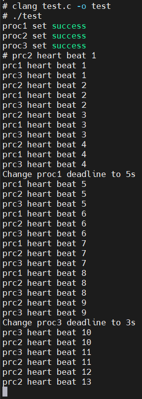

# 《操作系统》实验二 进程管理

*——在MINIX 3中实现Earliest-Deadline-First近似实时调度功能*

10215501412 彭一珅

### 一、实验目标

1. 巩固操作系统的进程调度机制和策略
2. 熟悉MINIX系统调用和MINIX调度器的实现

### 二、实验任务

1. 提供设置进程执行期限的系统调度chrt (long deadline)，用于将调用该系统调用的进程设为实时进程，其执行的期限为：从调用处开始deadline秒。例如：

   ```c
   #include <unistd.h>
    /*......*/
   chrt(10);/* 该程序将可以运行的最长时间为10秒，若没有运行结束，则
   强制结束*/
    /*......*/
   ```

   ```c
   /*chrt的定义：*/
   int chrt(long deadline);
   /*deadline 是最后期限值(秒)，返回值1表示成功，返回值0表示该调用出错*/
   ```

2. 在内核进程表中需要增加一个条目，用于表示进程的实时属性；修改相关代码，新增一个系统调用chrt，用于设置其进程表中的实时属性。

3. 修改proc.c和proc.h中相关的调度代码，实现最早deadline的用户进程相对于其它用户进程具有更高的优先级，从而被优先调度运行。

4. 在用户程序中，可以在不同位置调用多次chrt系统调用，在未到deadline之前，调用chrt将会改变该程序的deadline。

5. 未调用chrt的程序将以普通的用户进程(非实时进程)在系统中运行。

### 三、使用环境

虚拟机：MINIX3.3.0

物理机：Windows11

虚拟机软件：Vmware

文件传输：FileZilla

代码阅读和编辑：VScode、Source Insight

### 四、实验过程

*MINIX3中的系统调用结构分成三个层次：应用层，服务层，内核层。在这三层中分别进行代码修改，实现系统调用chrt的信息传递。从应用层用_syscall将信息传递到服务层，在服务层用_kernel_call将信息传递到内核层，在内核层对进程结构体增加deadline成员。*

#### 实验准备

1. 虚拟机中通过命令 git clone git://git.minix3.org/minix src 下载minix3.3.0源码。
2. make build 命令编译源码并安装，make build MKUPDATE=yes命令进行增量式编译。
3. 以 output.txt 作为串口输出目标，向 /dev/tty00 文件中写入字符对内核进行调试。

#### 1. 应用层

1. 仿照其他库函数的定义方法，只保留参数数据类型，在/usr/src/include/unistd.h中添加chrt函数定义

   ```c
   int chrt(long );
   ```

2. 在/usr/src/minix/lib/libc/sys/chrt.c中添加chrt函数实现。

   + 首先排除掉输入负值deadline的调用，直接返回。

   + 如果deadline为0，那么就不再重新设置结束时间，直接把deadline=0传入服务层。一个进程如果不调用chrt函数，默认deadline也应当为0。因此，deadline为0的进程行为不应当是马上停止，而是没有特定的结束时间。

   + alarm函数可以设置一个定时器，在指定秒数后产生一个SIGALRM信号，默认操作是终止该进程。如果在deadline之前再次设定alarm定时器，那么计时可以重新开始。

   + gettimeofday函数可以将当前时间相对于1970-1-1 00:00时刻经过的秒数传入到timeval结构体的tv_sec成员中，因此，这个秒数+deadline可以表示进程结束的时间点，用于比较进程到期的早晚。早到期的进程将会增加其优先级。

   + 在MINIX3中，应用层向服务层传递消息通过message结构体，这个结构体定义在ipc.h中。当发送一条消息其中包含长整型数据deadline时，选用第二种格式中第一个long数据域。

     ```c
     typedef struct {
     	int64_t m2ll1;
     	int m2i1, m2i2, m2i3;
     	long m2l1, m2l2;
     	char *m2p1;
     	sigset_t sigset;
     	short m2s1;
     	uint8_t padding[6];
     } mess_2;//第二种消息格式的定义
     ```

     ```c
     typedef struct {
     	endpoint_t m_source;		/* who sent the message */
     	int m_type;			/* what kind of message is it */
     	union {
     		/*······*/
     		mess_2			m_m2;
         /*······*/
       };
     }
     ```

     为了方便访问，以短一点的名字访问结构体中的成员。

     ```c
     #define m2_l1  m_m2.m2l1
     ```

   + 参照fork.c函数的实现，函数返回时以如下格式调用_syscall函数。其中，PM_PROC_NR表示进程号为0的进程管理器pm，PM_CHRT是对进程管理器的调用，将会添加在callnr.h中。

   ```c
   #include <sys/cdefs.h>
   #include "namespace.h"
   #include <lib.h>
   
   #include <string.h>
   #include <unistd.h>
   #include <time.h>
   
   int chrt(long deadline){
     struct timeval tv;
     message m;
     memset(&m, 0, sizeof(m));
     if(deadline<0){//deadline<0 防止溢出，参数值错误，返回0表示调用失败
       return 0;
     }
     
     if(deadline!=0){//如果deadline=0就直接赋为0，作为普通进程
       alarm((unsigned int)deadline);//unistd.h 89行 使进程到期退出
       gettimeofday(&tv,NULL);//包括tv_sec,tv_usec，表示从1970-1-1 00:00到当前的秒数和微秒数
       deadline=tv.tv_sec+deadline;//调用时的时间加上deadline，获取到期时的时间，用于比较进程到期的早晚
     }
     
     m.m2_l1 = deadline;//书p98；文件ipc.h 2026行message结构体的定义、mess_2的定义、访问信息体中内容的宏定义
     return(_syscall(PM_PROC_NR, PM_CHRT, &m));//参考fork.c
   }
   ```

3. 在/usr/src/minix/lib/libc/sys中Makefile.inc文件添加chrt.c条目（添加C文件后，需在同目录下的Makefile/Makefile.inc中添加条目）

   ```makefile
   SRCS+=
   /*······*/
   getrusage.c setrlimit.c setpgid.c chrt.c
   ```

#### 2. 服务层

1. 参照do_fork等函数的定义，在/usr/src/minix/servers/pm/proto.h中添加do_chrt函数定义

   ```c
   /* chrt.c */
   int do_chrt(void);
   ```

2. 在/usr/src/minix/servers/pm/chrt.c中添加chrt函数实现，调用sys_chrt()。其中，who_p定义在glo.h中，表示发送message进行系统调用的进程，m_in表示发送的消息。宏OK被定义为0，作为调用成功的标识。

   ```c
   int do_chrt()
   {
     sys_chrt(who_p, m_in);//glo.h 16、17行 who_p,消息结构体
     return (OK);
   }
   ```

3. 在/usr/src/minix/include/minix/callnr.h中定义PM_CHRT编号，系统调用的总数也要+1。

   ```c
   #define PM_CHRT		(PM_BASE + 48)
   
   #define NR_PM_CALLS		49
   ```

4. 在/usr/src/minix/servers/pm/Makefile中添加chrt.c条目

   ```makefile
   SRCS=
   /*······*/
   profile.c mcontext.c schedule.c chrt.c
   ```

5. 参照fork的定义，在/usr/src/minix/servers/pm/table.c中调用映射表

   ```c
   CALL(PM_CHRT)	= do_chrt
   ```

6. 在/usr/src/minix/include/minix/syslib.h中添加sys_ chrt ()定义，参照同文件中其他函数的声明，可以发现进程用endpoint_t表示。

   ```c
   int sys_chrt(endpoint_t endpt, message m1);
   ```

7. 在/usr/src/minix/lib/libsys/sys_chrt.c中添加sys_chrt ()实现

   + 参照sys_fork.c文件，引入头文件，并且将参数类型写在下方。
   + 重新定义一个消息结构体，将进程号（int型）和deadline放入消息中，用_kernel_call函数传入内核层。

   ```c
   #include "syslib.h"
   
   int sys_chrt(endpt,m1)
   endpoint_t endpt;
   message m1;
   {
     message m;
     int r;
     m.m2_i1=endpt;//将进程号和deadline放入消息结构体，通过kernelcall传递到内核层
     m.m2_l1=m1.m2_l1;
     r = _kernel_call(SYS_CHRT, &m);
     return r;
   }
   ```

8. 在/usr/src/minix/lib/libsys中的Makefile中添加sys_chrt.c条目

   ```makefile
   SRCS+=  \
   /*······*/
    sys_chrt.c
   ```

#### 3. 内核层

1. 参照其他函数的定义，在/usr/src/minix/kernel/system.h中添加do_chrt函数定义

   ```c
   int do_chrt(struct proc * caller, message *m_ptr);
   ```

2. 在/usr/src/minix/kernel/system/do_ chrt.c中添加do_chrt函数实现

   + 参照do_fork函数的实现，引入相同头文件，返回值OK。

   + proc_addr函数定义在proc.h中，可以通过进程号获取进程信息记录的地址。

     ```c
     #define proc_addr(n)      (&(proc[NR_TASKS + (n)]))
     ```

     通过指针rp获取进程结构体的地址。

   + 将deadline的值赋给进程结构体的p_deadline成员。进程结构体proc定义在proc.h中，后面将会在其中添加这个成员。

   ```c
   /*===========================================================================*
    *				do_chrt					     *
    *===========================================================================*/
   int do_chrt(struct proc * caller, message * m_ptr)
   {
     //用消息结构体中的进程号，通过proc_addr定位内核中进程地址，然后将deadline赋值给该进程的p_deadline
     struct proc *rp;
     long deadline;
     deadline=m_ptr->m2_l1;
     rp=proc_addr(m_ptr->m2_i1);
     rp->p_deadline=deadline;
     return OK;
   }
   ```

3. 在/usr/src/minix/kernel/system/中Makefile.inc文件添加do_chrt.c条目

   ```makefile
   SRCS+= 	\
   /*······*/
    do_chrt.c

4. 在/usr/src/minix/include/minix/com.h中定义SYS_CHRT编号，因为MINIX是微内核结构，因此系统调用和内核调用不同，此时添加的是内核调用。

   ```c
   #  define SYS_CHRT (KERNEL_CALL + 58)
   
   /* Total */
   #define NR_SYS_CALLS	59	/* number of kernel calls */
   ```

5. 在/usr/src/minix/kernel/system.c中添加SYS_CHRT编号到do_chrt的映射

   ```c
   void system_init(void)
   {
     /*······*/
   	map(SYS_CHRT, do_chrt);
     
   }
   ```

6. 在/usr/src/minix/commands/service/parse.c的system_tab中添加名称编号对，需要在尾部添加逗号

   ```c
   } system_tab[]=
   {
   	/*······*/
     { "CHRT",		SYS_CHRT },
     { NULL,		0 }
   };
   ```

#### 4. 进程调度

*进程调度模块位于/usr/src/minix/kernel/下的proc.h和proc.c，修改影响进程调度顺序的部分。*

1. struct proc 维护每个进程的信息，用于调度决策。添加deadline成员

   ```c
   struct proc {
     /*······*/
   	long p_deadline;
   };
   ```

2. switch_to_user() 选择进程进行切换

3. enqueue_head() 按优先级将进程加入列队首。实验中需要将实时进程的优先级设置成合适的优先级，经过尝试，将有deadline的进程加入5或6优先级队列都是可以的。

   ```c
   if (rp->p_deadline >0)//如果进程被设置了deadline，就将优先级队列设为6
     {
       rp->p_priority = 6;
     }
   ```

4. enqueue() 按优先级将进程加入列队尾。同上

5. pick_proc() 从队列中返回一个可调度的进程。遍历设置的优先级队列，返回剩余时间最小并可运行的进程。

   + MINIX中共有16个优先级的队列，最低为IDLE进程。NR_SCHED_QUEUES被定义为16。
   + 在没有加入if判断前，所有进程的调度规则就是从头部取出一个可运行进程，运行到时间片结束后再换下一个。
   + 当进程设置了deadline之后，进程的调度规则是遍历设置的优先级队列，返回剩余时间最小并可运行的进程。

   ```c
   for (q=0; q < NR_SCHED_QUEUES; q++) {	
       if(!(rp = rdy_head[q])) {
         TRACE(VF_PICKPROC, printf("cpu %d queue %d empty\n", cpuid, q););
         continue;
       }
       rp=rdy_head[q];
       tmp=rp->p_nextready;
       if(q==6){//设置了deadline的进程只会在第六个队列
         while(tmp!=NULL){//遍历整个队列，选取出deadline最小的进程
           if(tmp->p_deadline>0){
             if(rp->p_deadline==0||tmp->p_deadline<rp->p_deadline){//如果是普通进程或者deadline更早
               if(proc_is_runnable(tmp)){
                 rp=tmp;
               }
             }
           }
           tmp=tmp->p_nextready;
         }
       }
       assert(proc_is_runnable(rp));
       if (priv(rp)->s_flags & BILLABLE)	 	
         get_cpulocal_var(bill_ptr) = rp; /* bill for system time */
       return rp;
     }
   ```

#### 测试

在虚拟机中编译如下测试代码。

```c
void proc(int id);
int main(void)
{
  int status;
  //创建三个子进程，并赋予子进程id
  for (int i = 1; i < 4; i++)
  {
    if (fork() == 0)
    {
      proc(i);
    }
  }
  return 0;
}
void proc(int id)
{
  int loop;
  switch (id)
  {
  case 1: //子进程1，设置deadline=20
    chrt(20);
    printf("proc1 set success\n");
    sleep(1);
    break;
  case 2: //子进程2，设置deadline=15
    chrt(15);
    printf("proc2 set success\n");
    sleep(1);
    break;
  case 3: //子进程3，普通进程
    chrt(0);
    printf("proc3 set success\n");
    sleep(1);//加入sleep使三个进程的循环轮数同步
    break;
  }
  for (loop = 1; loop < 40; loop++)
  {
    //子进程1在5s后设置deadline=5
    if (id == 1 && loop == 5)
    {
      chrt(5);
      printf("Change proc1 deadline to 5s\n");
    }
    //子进程3在10s后设置deadline=3
    if (id == 3 && loop == 10)
    {
      chrt(3);
      printf("Change proc3 deadline to 3s\n");
    }
    sleep(1); //睡眠，否则会打印很多信息
    printf("prc%d heart beat %d\n", id, loop);
  }
  exit(0);
}

```

运行结果如图所示：



可以看到，主程序在创建子进程结束后退出，因此终端显示"#"，然后三个进程进入循环，以2、3、1的顺序执行，这是因为此时进程1deadline为20s，进程2deadline为15s，deadline先到期的进程有更高的执行优先级。然后在第5个循环把进程1的deadline设置为5s，此时进程1已经执行了5秒（加上进程创建时sleep的1秒）。此时deadline更早的进程为1，因此进程以1、2、3的顺序执行。进程1继续heart beat四次后，在sleep1秒的过程中终止。然后设置普通进程3的deadline为3秒，此时进程2还有5秒的执行时间，因此优先级是进程3更高，以3、2的顺序执行。

### 五、总结

在本次实验中，我在MINIX 3.3.0系统中通过修改应用层、服务层、内核层三部分代码，实现了系统调用chrt，用来给进程设置deadline，并且通过修改进程调度方式，实现了EDF近似实时进程调度功能。

在微内核的MINIX系统中，不同服务模块和内核运行在不同进程中，只能使用基于消息的进程间系统调用或内核调用来传递信息，而不能像宏内核操作系统一样通过函数调用。通过本次实验对于message结构体的应用和SYS_CHRT、PM_CHRT等宏定义的添加，我对于这种消息传递方式有了更深刻的理解。同时，在修改proc.c和proc.h相关代码时，我阅读了用结构体记录进程相关信息的相关代码，以及MINIX操作系统所用的优先级队列、时间片轮转的进程调度方法的具体代码实现，对于操作系统进程调度的概念认识更加深入。

我对于Source Insight的全局搜索功能运用更加熟练，学会利用git diff检查代码修改，在内核中使用串口调试输出进程号、优先级来判断应当放置的优先级队列。

本次实验中我也遇到了一些问题，并通过代码调试和查阅资料独立解决了它们：

+ server\pm文件夹中，对于chrt.c文件的编写中，不知道引入什么头文件，先引入了glo.h，发生报错，之后参考alarm.c的头文件进行删改，使代码尽量不要冗余。
+ 在给deadline赋值的时候，一开始只使用了用户输入的数据（如进程deadline为15秒后），但是忽略了chrt调用的时间差别，比如进程1deadline为15秒，但在还剩2秒时，在进程2中调用chrt(10)，此时进程1剩余时间更少，但仍然是进程2先执行。所以经过查阅资料，选择使用了time.h中包含gettimeofday函数，获取特定时间点到当前时间的秒数，可以正确表示进程结束的客观时间点。
+ 由于deadline=0的进程为普通进程，因此不需要再使用gettimeofday函数获取的当前时间对deadline值进行处理，否则在测试代码中进程的执行顺序会发生错误。同时，alarm(0)函数会直接返回，不会发送信号，因此可以放在deadline!=0的条件判断外部。
+ 通过阅读enqueue代码，学习了遍历进程队列（链表）的方式是指向p_nextready。起初忽略了普通进程deadline为0的情况，只挑选出deadline最小的进程。后面加上对于普通进程的排除。
+ 在src文件夹中曾经通过git add .提交过代码，导致git diff失效，最终使用git diff HEAD命令。

在以上实践过程中，我熟练运用了相关课本知识，在解决问题的过程中提升了代码阅读和编写能力。
