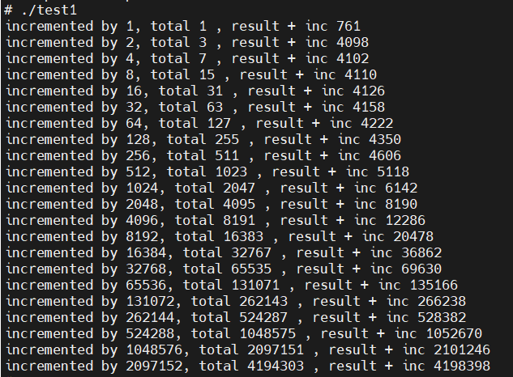

# 《操作系统》实验四 内存管理

*——修改Minix3.1.2a的进程管理器，改进brk系统调用的实现，使得分配给进程的数据段+栈段空间耗尽时，brk系统调用给该进程分配一个更大的内存空间，并将原来空间中的数据复制至新分配的内存空间，释放原来的内存空间，并通知内核映射新分配的内存段。*

10215501412 彭一珅

### 一、实验目标

1. 熟悉Minix操作系统的进程管理
2. 学习Unix风格的内存管理

### 二、实验任务

1. 修改/usr/src/servers/pm/alloc.c中的alloc_mem函数，把first-fit修改成best-fit，即分配内存之前，先遍历整个空闲内存块列表，找到最佳匹配的空闲块。
2. 修改/usr/src/servers/pm/break.c中的adjust函数，并增加了一个allocate_new_mem局部函数在adjust函数中调用。
3. 编译MINIX。

### 三、使用环境

虚拟机：MINIX3.3.0

物理机：Windows11

虚拟机软件：Vmware

文件传输：FileZilla

代码阅读和编辑：VScode、Source Insight

### 四、实验过程

#### 实验准备

1. 创建虚拟机，选择3.1.2版本的镜像。
2. 完成创建后，修改VMware兼容性。Windows系统如下设置，选择5.x版本；mac OS系统在兼容性中选择6版本。
3. 启动虚拟机时，在setup步骤中，网卡选择AMD LANCE，否则无法获得IP地址，其他可选择默认设置。安装完之后，输入shutdown，然后输入boot d0p0重启，后续关机都需输入shutdown，否则可能导致磁盘错误。
4. 输入mv /etc/rc.daemons.dist /etc/rc.daemons。在网络模式为NAT模式时，这样在重启后可以看到IP地址。
5. 在虚拟机终端输入packman可以安装额外的软件包（不能移除iso镜像），为了方便，可以选择全部安装（大概400MB）。安装完之后，open-ssh，vim等已经安装。输入passwd root为root用户创建密码，在重启后可用ftp连接虚拟机（仍然是NAT模式）。

#### alloc.c

文件alloc.c用来记录内存的使用情况，哪些地方已经被占用，哪些地方还处于空闲。

1. alloc_mem请求一块指定大小的内存
2. free_mem归还不再需要的内存
3. mem_init在PM开始运行时初始化空闲链表

为了将首次适配的内存分配算法改为最佳适配算法，需要修改alloc_mem函数中遍历空闲链表的方式。

```c
register struct hole *hp, *prev_ptr, *new_hp, *new_prev_hp;
//使用new_hp记录目前最佳适配的块，使用new_prev_hp记录适配块的前一个块
phys_clicks old_base;
unsigned int min_size=2147483647;//记录适配块的大小。由于h_len的类型是phys_clicks，被定义为unsigned int，因此取最大的click数，作为初始值

do {
  prev_ptr = NIL_HOLE;
  hp = hole_head;
  new_hp=NIL_HOLE;//将两个指针初始化为NULL
  new_prev_hp=NIL_HOLE;
  while (hp != NIL_HOLE && hp->h_base < swap_base) {//遍历所有块
    if (hp->h_len >= clicks && hp->h_len < min_size) {//如果块的大小大于要分配的大小clicks，同时又小于上一个适配块的大小min_size，则将这个块设为适配块
      new_hp=hp;
      new_prev_hp=prev_ptr;
    }
    prev_ptr = hp;
    hp = hp->h_next;
  }
  if(new_hp!=NIL_HOLE){
    old_base = new_hp->h_base;//记录块的起始处
    new_hp->h_base += clicks;//从空闲块上切割掉一部分，起始地址向前clicks
    new_hp->h_len -= clicks;//长度减少clicks
    //记录内存用量
    if(new_hp->h_base > high_watermark)
      high_watermark = new_hp->h_base;
    //如果空闲块被用光了，就将前一个块与后一个块在链表中相连，删除这个块
    if (new_hp->h_len == 0) del_slot(new_prev_hp, new_hp);
    //返回分配后的内存空间的起始地址
    return(old_base);
  }
} while (swap_out());	
return(NO_MEM);//如果找不到适合的块，就返回内存不足
```

#### break.c

在_brk.c中，实现了sbrk和brk两个函数，其中sbrk的作用是将堆增量传递给brk，

```c
PUBLIC int brk(addr)
char *addr;
{
  message m;

  if (addr != _brksize) {
	m.m1_p1 = addr;//通过消息结构体把增长后的堆大小传进消息结构体里，其中在param.h中，成员变量m1_p1被定义为addr,从而方便访问
	if (_syscall(MM, BRK, &m) < 0) return(-1);
	_brksize = m.m2_p1;
  }
  return(0);
}

PUBLIC char *sbrk(incr)
int incr;
{
  char *newsize, *oldsize;

  oldsize = _brksize;//堆大小
  newsize = _brksize + incr;//增长后的堆大小
  if ((incr > 0 && newsize < oldsize) || (incr < 0 && newsize > oldsize))
	return( (char *) -1);
  if (brk(newsize) == 0)
	return(oldsize);
  else
	return( (char *) -1);
}
```

break.c实现了brk调用，顶层的函数是do_brk，在这个函数中调用了adjust，用来检查数据段和栈段是否冲突，如果是，brk调用就不能执行。

```c
PUBLIC int do_brk()
{
  register struct mproc *rmp; //进程表
  int r;
  vir_bytes v, new_sp; //unsigned long
  vir_clicks new_clicks;

  rmp = mp; //当前进程
  v = (vir_bytes) m_in.addr; //消息中的m1_i3，扩展后的堆大小，byte为单位
  new_clicks = (vir_clicks) ( ((long) v + CLICK_SIZE - 1) >> CLICK_SHIFT); //CLICK_SIZE=4096，CLICK_SHIFT=12，4096=2^12。向上取整方便对齐
  //new_clicks是扩展后的数据段大小，click为单位
  if (new_clicks < rmp->mp_seg[D].mem_vir) { //扩展后的数据段大小还不如当前数据段的大小，报错
	rmp->mp_reply.reply_ptr = (char *) -1;
	return(ENOMEM); 
  }
  new_clicks -= rmp->mp_seg[D].mem_vir;//计算出虚拟地址的增量
  if ((r=get_stack_ptr(who_e, &new_sp)) != OK) //获取栈指针rsp
  	panic(__FILE__,"couldn't get stack pointer", r);
  r = adjust(rmp, new_clicks, new_sp); //调用adjust判断栈和堆是否相撞
  rmp->mp_reply.reply_ptr = (r == OK ? m_in.addr : (char *) -1); //如果adjust分配堆空间成功，就返回增长后的空间大小
  return(r);
}
```

接下来，再阅读adjust的源码。adjust计算了堆和栈的长度、起始地址、栈指针的地址，从而综合判断堆和栈是否发生了相撞，如果没有，则扩展堆内存。

```c
PUBLIC int adjust(rmp, data_clicks, sp)
register struct mproc *rmp;//指向当前进程
vir_clicks data_clicks;//虚拟地址的增量
vir_bytes sp;//栈指针
{
  register struct mem_map *mem_sp, *mem_dp;//mp_seg是mproc中的一个结构体，作为一个长度为3的数组，分别表示代码段、数据段和栈段。mp_seg的类型就是mem_map
  vir_clicks sp_click, gap_base, lower, old_clicks;
  int changed, r, ft;
  long base_of_stack, delta;

  mem_dp = &rmp->mp_seg[D];//D表示数据段
  mem_sp = &rmp->mp_seg[S];//S表示栈段
  changed = 0;
  
  if (mem_sp->mem_len == 0) return(OK);//栈还没初始化，长度为0

  base_of_stack = (long) mem_sp->mem_vir + (long) mem_sp->mem_len;//虚拟地址的起始加上长度=栈的开始位置。栈往地址小的方向增长
  sp_click = sp >> CLICK_SHIFT;//把栈指针bytes单位换算成click
  if (sp_click >= base_of_stack) return(ENOMEM);//rsp没有指向栈里头

  delta = (long) mem_sp->mem_vir - (long) sp_click;//计算栈的虚拟起始地址和栈指针之间的差值
  lower = (delta > 0 ? sp_click : mem_sp->mem_vir);//取rsp指针和栈虚拟地址中，较靠近堆（数值较小）的那一个

#define SAFETY_BYTES  (384 * sizeof(char *)) //安全因子，使报错的时候，栈和堆之间依然有一段空间
#define SAFETY_CLICKS ((SAFETY_BYTES + CLICK_SIZE - 1) / CLICK_SIZE) //向上取整，换算为click
  gap_base = mem_dp->mem_vir + data_clicks + SAFETY_CLICKS;//堆顶+安全因子
  if (lower < gap_base) return(ENOMEM);//栈和堆相撞了。实验要求实现在这种情况下，给进程分配一块更大的内存区域

  //更新堆的长度为data_clicks
  old_clicks = mem_dp->mem_len;
  if (data_clicks != mem_dp->mem_len) {
	mem_dp->mem_len = data_clicks;
	changed |= DATA_CHANGED;
  }

  //更新栈，如果栈指针与map计算出的值不符合
  if (delta > 0) {
	mem_sp->mem_vir -= delta;
	mem_sp->mem_phys -= delta;
	mem_sp->mem_len += delta;
	changed |= STACK_CHANGED;
  }

  //检查新分配的堆和栈是否合法
  ft = (rmp->mp_flags & SEPARATE);//flag中的SEPARATE位记录进程是否是独立的I与D空间
#if (CHIP == INTEL && _WORD_SIZE == 2)
  r = size_ok(ft, rmp->mp_seg[T].mem_len, rmp->mp_seg[D].mem_len, 
       rmp->mp_seg[S].mem_len, rmp->mp_seg[D].mem_vir, rmp->mp_seg[S].mem_vir);
#else
  r = (rmp->mp_seg[D].mem_vir + rmp->mp_seg[D].mem_len > 
          rmp->mp_seg[S].mem_vir) ? ENOMEM : OK;
#endif
  if (r == OK) {
	int r2;
  //调用sys_newmap，通知内核，注册内存段
	if (changed && (r2=sys_newmap(rmp->mp_endpoint, rmp->mp_seg)) != OK)
  		panic(__FILE__,"couldn't sys_newmap in adjust", r2);
	return(OK);
  }

  //不合法的情况
  if (changed & DATA_CHANGED) mem_dp->mem_len = old_clicks;
  if (changed & STACK_CHANGED) {
	mem_sp->mem_vir += delta;
	mem_sp->mem_phys += delta;
	mem_sp->mem_len -= delta;
  }
  return(ENOMEM);
}
```

通过阅读上面的代码，可以发现，实验要求修改27行堆栈相撞的处理方式。将这一行修改，调用`allocate_new_mem`，传入的参数分别是当前进程、堆扩展后的长度、delta值用于最后的合法性检查、计算出的整个进程的大小，click为单位。

```c
if (lower < gap_base){
  r=allocate_new_mem(rmp,data_clicks,delta,(phys_clicks)(rmp->mp_seg[S].mem_vir - rmp->mp_seg[D].mem_vir + rmp->mp_seg[S].mem_len));
  return r;
}
```

然后实现allocate_new_mem函数。这个函数的主要步骤是：

1. 调用alloc_mem分配新的内存，将新的起始地址赋给new_address_data
2. 计算出以byte为单位的堆和栈新地址、旧地址、分配长度，调用sys_abscopy，拷贝内存内容
3. 在新的空间里更新堆和栈的大小，然后释放原地址的内存

```c
PUBLIC int allocate_new_mem(rmp,data_clicks,delta,clicks)
register struct mproc *rmp;
phys_clicks data_clicks;
long delta;
phys_clicks clicks;
{
	//用于保存mem_map数组中栈段、堆段的相关数据（虚拟地址、物理地址、段长度）
  register struct mem_map *mem_sp, *mem_dp;
  //保存新的进程内存大小、旧的数据段大小
  phys_clicks new_clicks, old_clicks;
  //保存以click为单位的栈和堆地址
  phys_clicks new_address_data, new_address_stack, old_address_data, old_address_stack;
  //保存以byte为单位的栈和堆地址
  phys_bytes new_address_data_byte, new_address_stack_byte, old_address_data_byte, old_address_stack_byte;
  //保存以byte为单位的栈和堆长度
  phys_bytes databytes, stackbytes;
  int changed, r, ft;

  mem_dp = &rmp->mp_seg[D];
  mem_sp = &rmp->mp_seg[S];
  changed = 0;
	//为进程分配的空间是原来的两倍大
  new_clicks = clicks*2;
  if((new_address_data=alloc_mem(new_clicks)) == NO_MEM){
    return(ENOMEM);
  }
	//计算原来的堆和栈大小，将click换算成byte
  databytes=(phys_bytes)mem_dp->mem_len << CLICK_SHIFT;
  stackbytes=(phys_bytes)mem_sp->mem_len << CLICK_SHIFT;
	//计算原来的栈和堆的物理地址。计算新分配的栈顶位置。此时地址是click
  old_address_data=mem_dp->mem_phys;
  old_address_stack=mem_sp->mem_phys;
  new_address_stack=new_address_data+new_clicks-mem_sp->mem_len;
	//地址单位换算为byte
  new_address_data_byte=(phys_bytes)new_address_data << CLICK_SHIFT;
  new_address_stack_byte=(phys_bytes)new_address_stack << CLICK_SHIFT;
  old_address_data_byte=(phys_bytes)old_address_data << CLICK_SHIFT;
  old_address_stack_byte=(phys_bytes)old_address_stack << CLICK_SHIFT;
	//分别复制栈和堆的内容到新分配的内存空间里
  if((r=sys_abscopy(old_address_data_byte, new_address_data_byte, databytes))!=(OK)){
    printf("warning, sys_abscopy failed: %d\n", r);
  }
  if((r=sys_abscopy(old_address_stack_byte, new_address_stack_byte, stackbytes))!=(OK)){
    printf("warning, sys_abscopy failed: %d\n", r);
  }
	//更新map中的堆和栈物理地址、栈虚拟地址
  mem_dp->mem_phys=new_address_data;
  mem_sp->mem_phys=new_address_stack;
  mem_sp->mem_vir = mem_dp->mem_vir+new_clicks -mem_sp->mem_len;
	//以下内容与adjust函数基本相同，更新堆的长度

  old_clicks=mem_dp->mem_len;
  if (data_clicks != mem_dp->mem_len) {
	mem_dp->mem_len = data_clicks;
	changed |= DATA_CHANGED;
  }

  if (delta > 0) {
	mem_sp->mem_vir -= delta;
	mem_sp->mem_phys -= delta;
	mem_sp->mem_len += delta;
	changed |= STACK_CHANGED;
  }

  ft = (rmp->mp_flags & SEPARATE);
#if (CHIP == INTEL && _WORD_SIZE == 2)
  r = size_ok(ft, rmp->mp_seg[T].mem_len, rmp->mp_seg[D].mem_len, 
       rmp->mp_seg[S].mem_len, rmp->mp_seg[D].mem_vir, rmp->mp_seg[S].mem_vir);
#else
  r = (rmp->mp_seg[D].mem_vir + rmp->mp_seg[D].mem_len > 
          rmp->mp_seg[S].mem_vir) ? ENOMEM : OK;
#endif
  if (r == OK) {
	int r2;
	if (changed && (r2=sys_newmap(rmp->mp_endpoint, rmp->mp_seg)) != OK)
  		panic(__FILE__,"couldn't sys_newmap in adjust", r2);
    //释放原空间内存
	  free_mem(old_address_data, clicks);
    return(OK);
  }

  if (changed & DATA_CHANGED) mem_dp->mem_len = old_clicks;
  if (changed & STACK_CHANGED) {
	mem_sp->mem_vir += delta;
	mem_sp->mem_phys += delta;
	mem_sp->mem_len -= delta;
  }
  return(ENOMEM);
}
```

#### 编译

1. 进入/usr/src/servers目录，输入make image, 等编译成功之后输入make install 安装新的PM程序。
2. 进入/usr/src/tools目录，输入make hdboot, 成功之后再键入make install命令安装新的内核程序。
3. 键入shutdown 命令关闭虚拟机，进入boot monitor界面。设置启动新内核的选项，在提示符键入：`newminix(5,start new kernel) {image=/boot/image/3.1.2ar1;boot;}`，其中ar后面的数字是make install后生成的内核版本号。
4. 然后回车，键入save命令保存设置。5为启动菜单中的选择内核版本的键(数字键，可选其他数字键)，3.1.2ar1为在/usr/src/tools目录中输入make install 之后生成的内核版本号，请记得在/usr/src/tools中执行make install命令之后记录生成的新内核版本号。
5. 重启时输入数字5，启动新内核，运行编译后的test1、test2进行测试。

#### 测试

测试程序一只是简单测试sbrk调用，不断的调整数据段的上界，并未对新分配的内存空间进行访问。

其中，inc表示增量，total表示目前堆增量的总和，inc以2的幂方式增长。

```c
#include <stdio.h>
#include <unistd.h>

int inc = 1;
int total = 0;
char *sbrk(int incr); /* should be in unistd, but isn't */
char *result;

int main(int argc, int **argv)
{
       while (((int)(result = sbrk(inc))) >= 0)
       {
              total += inc;
              printf("incremented by %d, total %d , result + inc %d\n", inc, total, inc + (int)result);
              inc += inc;
       }
       return 0;
}
```

对比在新内核和原内核的运行结果：

<div style="display:flex">
  
  
</div>

可以看到，在新内核中运行这个进程，可以被分配到更多的内存。在MINIX中，默认给该进程分配的内存大小可能是69630bytes。同时也可以看出，内存分配以click=4096bytes为单位。

测试程序二则对新分配的内存空间进行了访问。


### 五、总结

本次实验主要是对Minix操作系统的进程管理和Unix风格的内存管理进行了学习和实践。通过修改Minix3.1.2a的进程管理器，改进brk系统调用的实现，使得分配给进程的数据段+栈段空间耗尽时，brk系统调用能够给该进程分配一个更大的内存空间，并将原来空间中的数据复制至新分配的内存空间，释放原来的内存空间，并通知内核映射新分配的内存段。

在实验过程中，我首先阅读了相关代码，并熟悉了Minix操作系统的进程管理和Unix风格的内存管理的相关知识。然后，我按照实验任务一步一步进行了实现。具体地，我修改了alloc_mem函数，将first-fit修改成best-fit，以找到最佳匹配的空闲块，从而提高内存利用率。同时，我也修改了adjust函数，增加了allocate_new_mem函数，在adjust函数中进行调用，以实现内存扩展的功能。最后，我编译了MINIX，验证了修改的正确性。

在本次实验中，我也遇到了一些问题，并通过查阅资料和向助教求助，解决了它们。

+ 在安装3.1.2版本的MINIX虚拟机时，会出现“未能启动虚拟机”的问题。最终升级了VMware到17版本，解决了问题。

  

+ 在使用ftp连接filezilla的过程中，出现了无法连接的问题，根据报错号码10061，输入如下命令：

  > tcpd ftp /usr/bin/in.ftpd  &

  启动虚拟机中的ftp服务，解决了问题。

+ 在编译break.c的过程中会出现报错：`NONE undefined` ，这是因为调用了sys_abscopy函数。

  在break.c中加入头文件即可。

  > #include <lib.h>

+ 在新内核启动的情况下，编译测试文件时，出现了无法编译的情况：

  

  因此在正常内核下编译完成即可。

通过本次实验，我深入了解了操作系统的进程管理和内存管理的相关知识，掌握了Unix风格的内存管理方法。同时，通过修改代码实现内存扩展，我也锻炼了我的代码实现能力和问题解决能力。这些都对我今后的学习和工作有很大的帮助。

总之，本次实验是一次非常有意义的实践活动，让我在操作系统方面收获了很多。同时，也感谢老师和助教们的指导和帮助。
