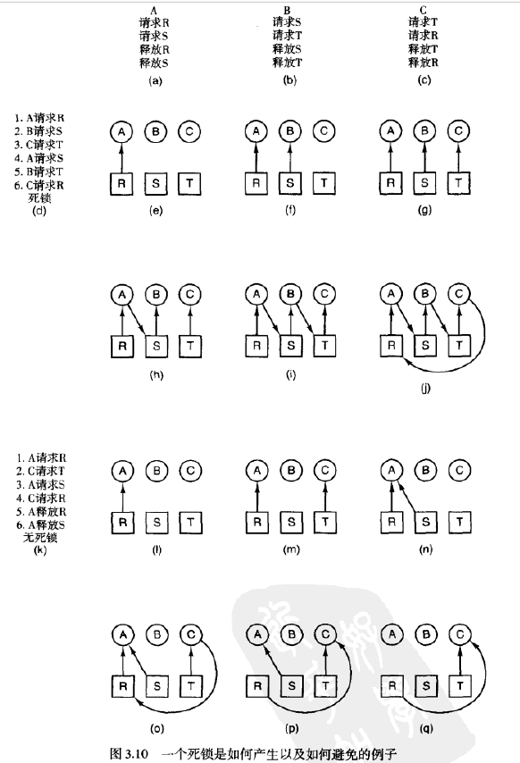
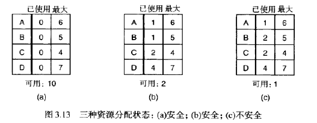
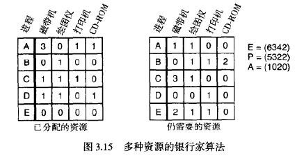

## 操作系统 作业三

*10215501412 彭一珅*

**3.什么是存储器映射I/O？为什么在一些情况下要使用它？**

存储器映射I/O是指使I/O寄存器是内存地址空间的一部分，每个控制寄存器被分配唯一的一个内存地址，并且不会有内存分配这一地址。通常分配给控制寄存器的地址位于地址空间的顶端。

内存映射I/O的优点是

1. 可以避免在访问I/O寄存器时使用汇编代码，减少I/O开销
2. 对于内存映射 I/O ，不需要特殊的保护机制就能够阻止用户进程执行 I/O 操作。操作系统需要保证的是禁止把控制寄存器的地址空间放在用户的虚拟地址中就可以了。
3. 可以引用内存的每一条指令也可以引用控制寄存器，便于引用。

**4.尝试解释什么是DMA。为什么要使用它？**

DMA是直接内存访问，也就是使用DMA控制器，独立于CPU直接访问系统总线，读取磁盘数据。

DMA可以节省CPU时间。在DMA读取磁盘数据的时候，CPU可以去做其他事情。

**11.以下的工作各在4个I/O软件层的哪一层完成？**

**(a)为一个磁盘读操作计算磁道、扇区、磁头。**

设备驱动程序

**(b)维护一个最近使用的块的缓冲。**

与设备无关的I/O软件

**(c)向设备寄存器写命令。**

设备驱动程序

**(d)检查用户是否有权使用设备。**

与设备无关的I/O软件

**(e)将二进制整数转换成ASCII码以便迅速打印。**

用户级I/O软件

**12.为什么打印的输出文件在打印前通常都假脱机输出在磁盘上？**

因为打印机是专用I/O设备，假脱机机制使一个进程打开它，即使很长时间不使用，其他进程也不能打印任何东西，因此进程将需要打印的文件放在假脱机目录里，守护进程作为唯一可以使用打印机的进程，来打印这些文件。

**14.考虑图3.10。假设在步骤(o)中C需要S而不是R，这将会导致死锁吗？如果既需要S又需要R呢？**

因为进程A已经运行完毕，所以请求A占用的资源R和S都不会导致死锁。

**15.仔细观察图3.13(b)。如果D再多请求一个单位，将会导致一个安全的状态还是不安全的状态？如果请求来自C而不是D呢？**

D多请求一个单位，状态是不安全的，此时只剩下一个资源，无法满足ABCD任何一个而引起释放资源。

C多请求一个单位，状态是安全的，因为如果收到其他请求，剩下的一个资源可以分配给C使C释放4个资源。

**17.假设图3.15中的进程A请求最后一台磁带驱动器。这会导致死锁吗？**

不会导致死锁，因为此时满足A的要求后，剩下两个打印机资源，可以将一个打印机资源分配给D，D就可以完成工作，释放所占用的资源。

**22.银行家算法在一个有m个资源类和n个进程的系统中运行。在m和n都很大的情况下，为检查状态是否稳定而进行的操作次数正比于$m^an^b$。a和b的值为多少？**

需要比较每个进程所需要的资源数量与可用资源向量，每个向量共有m位，需要比较n个进程，从而找到可以结束的一个进程，因此需要mn次。再对n个进程重复这个过程以让所有进程结束，需要n次，所以a=1，b=2

**28.磁盘请求以10，22，20，2，40，6，38柱面的次序到达磁盘驱动器。寻道时每个柱面移动需要6ms，计算以下寻道时间：（所有情况下磁头臂起始都位于柱面20。）**

**(a)先到先服务。**

10+12+2+18+38+34+32=146

146*6=876ms

**(b)下一个最邻近柱面。**

0+2+12+4+4+36+2=60

60*6=360ms

**(c)电梯算法（起始移动向上）。**

0+2+16+2+30+4+4=58

58*6=348ms