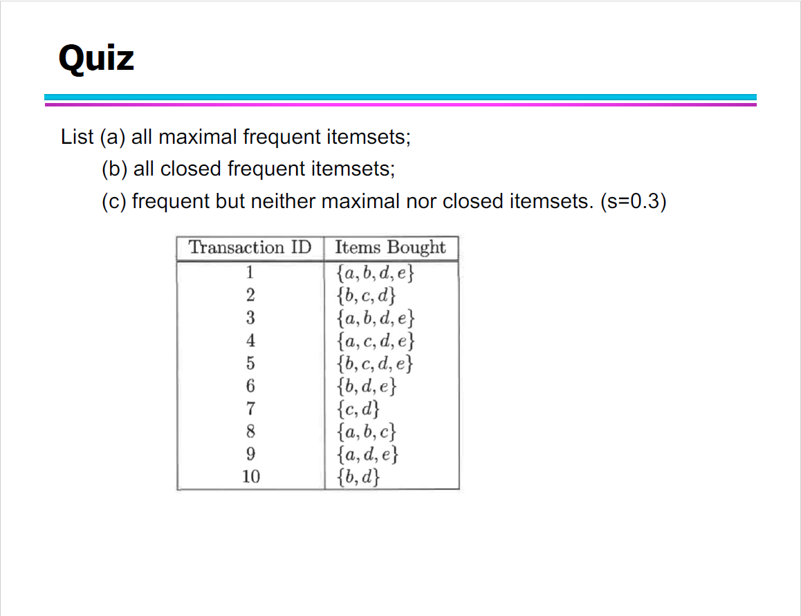

quiz

10215501412\_彭一珅\_quiz

(a) 要找到交易{1,3,4,5,8}的候选3项集，需要使用交易中的项来遍历哈希树。从根开始，你需要哈希项集{1,3,4,5,8}以找到通过树的路径。在每个级别，你使用交易的相应元素来决定应该跟随哪个分支。

本题目的哈希函数是`h(x) = x mod 3`，用于一个3项集。因此算法的步骤是：

1. 从根开始。
2. 使用哈希函数对第一个项进行操作。例如，`h(1)`，`h(3)`，`h(4)`，`h(5)` 和 `h(8)` 来确定要跟随的分支。
3. 继续下一级，使用剩余的项。

首先，对于{1, 3, 4, 5, 8}，取出1进行哈希，走1,4,7的通路。然后对于{3,4,5,8}取出3进行哈希，走3,6,9的通路到达L5节点，没有匹配的项。然后对于{4,5,8}取出4进行哈希，走1,4,7的通路，到达L1,节点，匹配的项是{1,4,5}。然后对于{5,8}，走2,5,8的通路，对于{8}，再走5,8,的通路到达L3，得到频繁项{1,5,8}{4,5,8}。

然后，对于{3, 4, 5, 8}，取出3进行哈希，走3,6,9的通路。然后对于{4,5,8}取出4进行哈希，走1,4,7的通路到达L9，没有匹配的项。然后对于{5,8}取出5进行哈希，到达L11，没有匹配的项。

然后，对于{4, 5, 8}，取出4进行哈希，走1,4,7的通路。再走2,5,8的通路，到达L3，得到频繁项{1,5,8}{4,5,8}.

(b) 根据项集和哈希函数遍历树之后，你会最终访问某些叶节点。这些叶节点包含候选3项集。你需要检查每个候选项，看它是否包含在交易{1,3,4,5,8}中。

{1,3,4,5,8}包含的三项集分别是{1,3,4}{1,3,5}{1,3,8}{1,4,5}{1,4,8}{1,5,8}{3,4,5}{3,4,8}{3,5,8}{4,5,8}，其中是频繁项的有{1,5,8}{4,5,8}{1,4,5}，可以看到，使用哈希树可以很迅速的得到结果，而不用与叶子结点的集合一一匹配。

在这个问题中，我们需要找到最大频繁项集（maximal frequent itemsets）、闭频繁项集（closed frequent itemsets）以及频繁但不是最大也不是闭的项集（frequent but neither maximal nor closed itemsets）。在给定的交易数据集中，每个交易都有一个事务ID和一组购买的商品。

在这个特定的案例中，最小支持度阈值（s）被设定为0.3，意味着频繁项集必须要出现在30%以上，也就是3个以上的事务中。

1. **最大频繁项集**：是频繁的，且没有任何频繁超集。
2. **闭频繁项集**：是频繁的，且没有任何同样频率的频繁超集。
3. **既不是最大也不是闭的频繁项集**：是频繁的，但是有频繁的超集，或者它的超集有相同的支持计数。

首先，我们需要计算每个商品组合的频率计数，然后基于这个信息来识别上述的项集。

.png)

现在我们已经计算出了每个项集的支持计数，并筛选出了那些满足最小支持度（0.3）的频繁项集。下一步，我们需要根据这些频繁项集来确定最大频繁项集和闭频繁项集。

我们可以通过比较频繁项集之间的包含关系以及它们的支持计数来识别这些特殊的项集。让我们来做这个处理。

以下是根据给定数据集和最小支持度阈值s=0.3计算得出的结果：

(1)最大频繁项集（没有频繁超集的项集）:
 \- {a, d, e}
 \- {a, b}
 \- {b, c}
 \- {b, d}
 \- {b, e}
 \- {c, d}

(2)闭频繁项集（没有相同计数的频繁超集的项集）:
 \- {a}
 \- {b}
 \- {d}
 \- {c}
 \- {d, e}

(3)频繁但既不是最大也不是闭的项集（有频繁超集，或其超集有相同的支持计数）:
 \- {e}
 \- {a, d}
 \- {a, e}
