# 实验一 数据预处理

10215501412 彭一珅

### **数据质量问题**

#### 1.缺失值

较差的数据质量可能会对数据挖掘产生不利影响。常见的数据质量问题包括噪声、异常值、缺失值和重复数据。

数据：breast-cancer-wisconsin.data

- 缺失值在数据集中编码为“?”，将缺失值转换为NaN，并计算每列数据中缺失值的数量 data.replace('?',np.NaN)

  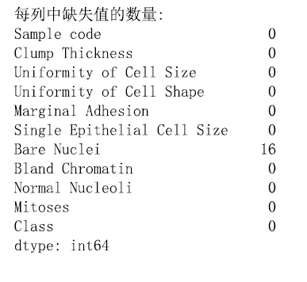

- 将缺失值替换为该列的中值：fillna()

  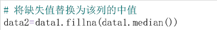

- 丢弃包含缺失值的数据点：dropna()

  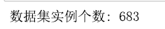

#### 2.异常值

- 通过绘制boxplot来识别数据中包含异常值的列：boxplot()

  由于“Bare Nuclei”列中的值存储为字符串对象，应该先将该列转换为数值：pandas.to_numeric

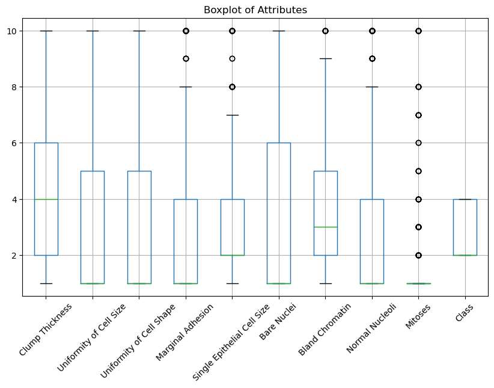

- 计算每个属性的Z分数，并删除那些包含Z分数异常高或异常低的属性的实例 (例如，if Z>3 or Z<=-3)

  Z = (data-data.mean())/data.std()

  Z 中筛选出每行恰好有9个（属性个数）元素大于 -3 且恰好有9个元素小于等于 3 的行

  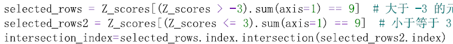

#### 3.重复数据

- 检查数据中的重复样本：duplicated()

  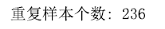

- 删除重复行：drop_duplicates()

  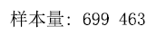

### **数据聚合**

目的：

- 减小要处理的数据的大小；
- 改变分析的粒度（从细粒度到粗粒度）；
- 提高数据的稳定性

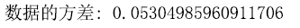

- 绘制其每日时间序列的折线图

- 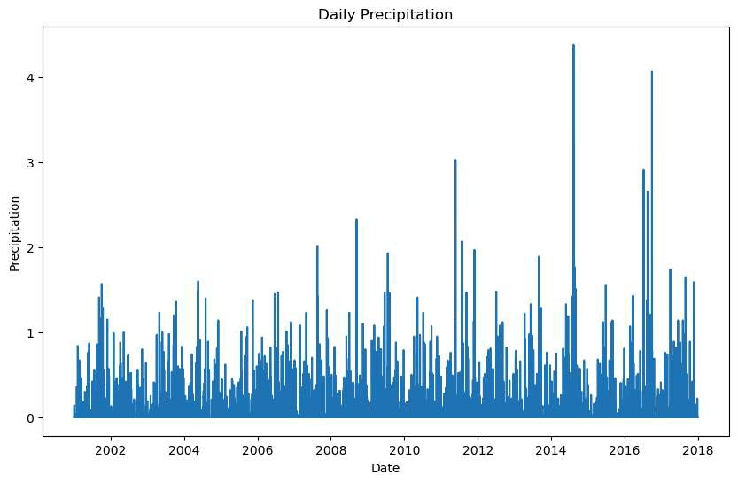

- 绘制其每月时间序列的折线图

  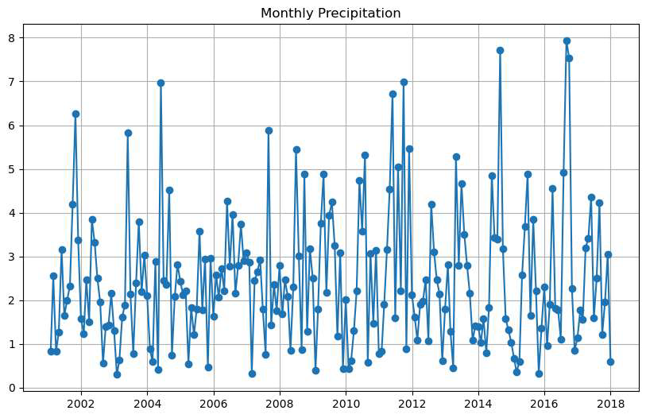

     pandas.Grouper

     DataFrame.groupby()

- 绘制其每年时间序列的折线图

  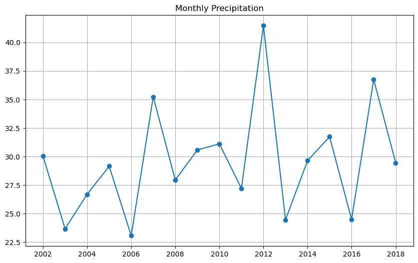

### **采样**

- 从原始数据中随机选择（不替换）大小为3的样本
- 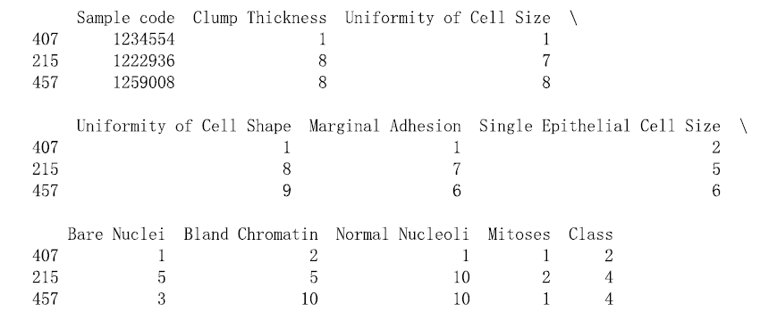

- 随机选择1%的数据（不替换）并显示所选样本
- 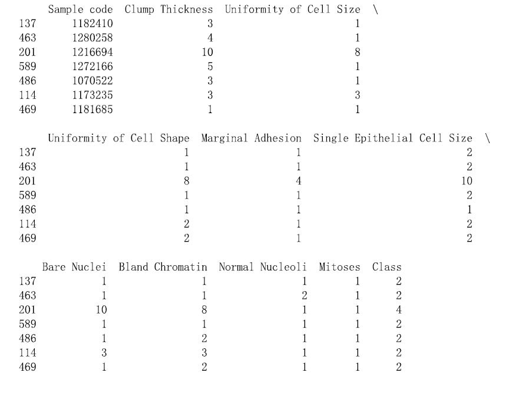

- （替换）采样1%的数据

  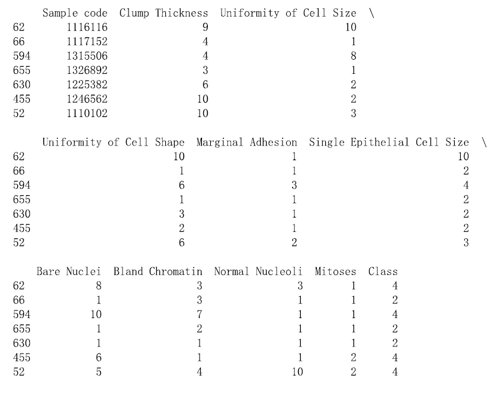

### 离散化

- 使用Counter()对Clump Thickness属性的取值进行计数
- 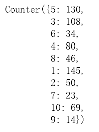

- 绘制直方图，显示属性值的分布
- 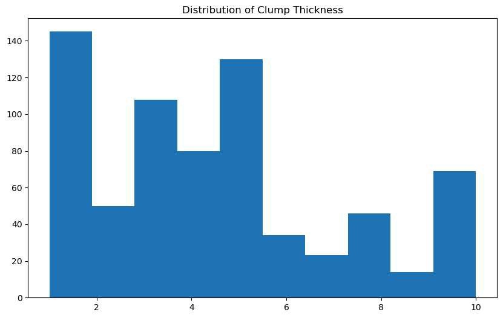

- equal width：应用pandas.cut将属性离散为4个间隔宽度相似的bin，value_counts()用于确定每个bin中的实例数
- 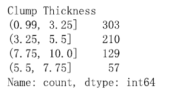

**为什么第一个bin区间的左端点是0.991？如果想要将左端点变成0.99，怎么改？**

因为pd.cut的作用是获取左开右闭区间，而最小值是否包含在区间内由选项include_lowest决定。

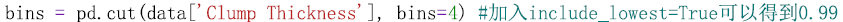

- equal frequency：qcut()函数可用于将值划分为4个bin，以便每个bin具有几乎相同数量的实例

  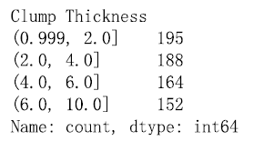

### 主成分分析（PCA）

PCA是一种通过将数据从其原始高维空间投影到低维空间来减少数据中属性数量的经典方法。

PCA创建的新属性具有以下特点：

- 它们是原始属性的线性组合；

- 它们彼此正交（垂直）；

- 它们捕获数据中的最大变化量。

数据：pics文件夹下包含16个RGB图像文件，每个文件的大小为111×111像素

- 读取图像数据，将RGB图像转换为111×111×3=36963个特征值，最终得到一个16×36963的矩阵

  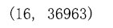

- 使用主成分分析，将数据矩阵投影到其前两个主成分。无需编写PCA代码，直接导入sklearn.decomposition中的PCA类

- 绘制散点图来显示投影值

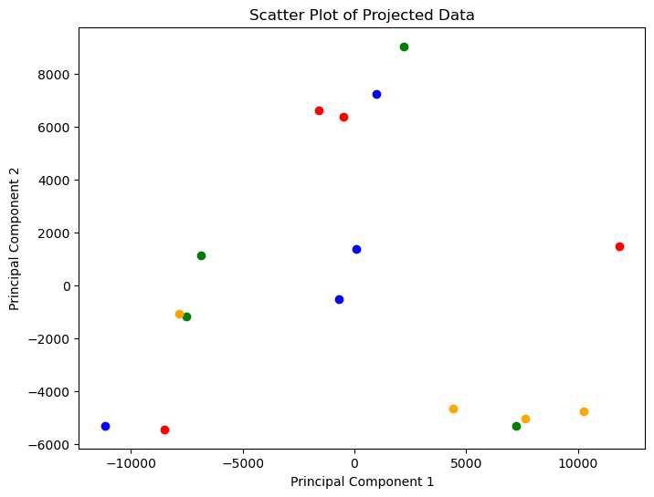

其中红、蓝、绿、黄这四种颜色分别对应汉堡、可乐、面、鸡腿的图片。