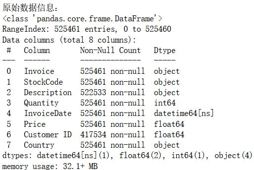
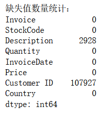
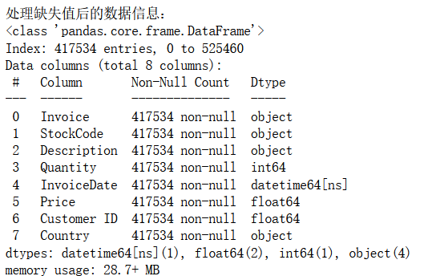
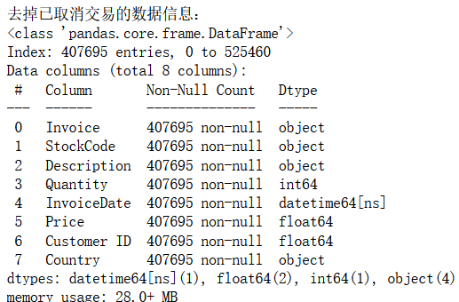
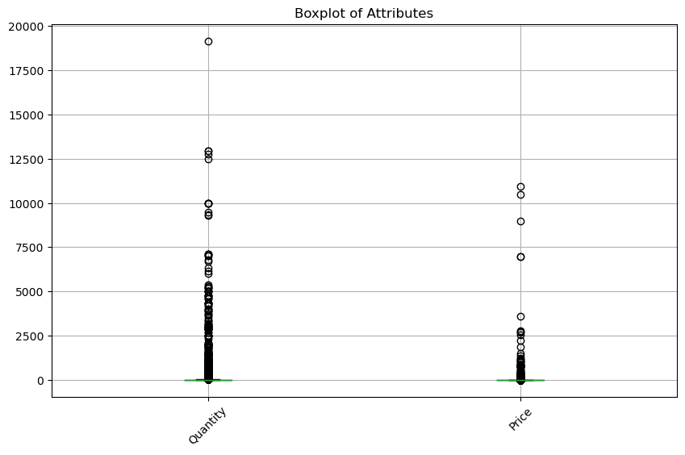
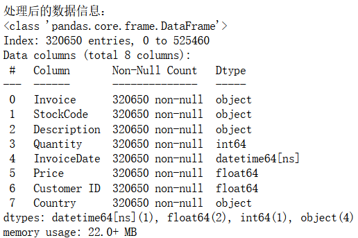
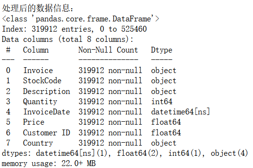
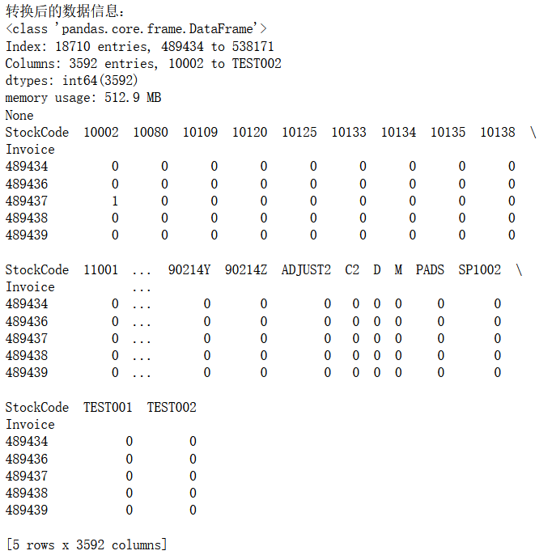
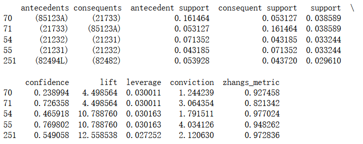

## 基于Apriori算法完成Market Basket分析实验

10215501412 彭一珅

### 1 Import Data & Data Preprocessing

- 导入并查看数据信息（retail.xlsx），统计每个属性缺失值数量，处理缺失值（丢弃）；

  原始数据信息包含多个列，每行信息表示一次交易，一次交易具有发票编号、产品代码、产品名称、产品数、量、发票日期、统一价格、唯一的客户编号、国家等内容。

  

  通过`isnull().sum()`函数统计每个属性中缺失值的个数：

  

  dataframe的`dropna()`方法可以删除存在缺失值的行。

  

  可以看到相比之前的525461行，去掉缺失值之后，数据直接缩减到417534行。

- 确定已取消的交易并删除；

  已取消的交易Invoice开头字符为`C`，而没有取消的交易，类型应该是一串数字，需要转换为字符串处理。因此使用`data2[~data2['Invoice'].astype(str).str.startswith('C')]`来去掉已经取消的交易。

  

- 异常值处理；（举例：可以将异常值定义为位于1% 和 99% 分位数之外的值，并使用阈值来代替数据中的异常值）

  首先画出用数字表示的两列，数据分布的箱线图：

  

  然后将数据列series中所有小于1%分位数Q1的值替换为Q1，将大于99%分位数Q3的值替换为Q3。

  ```py
  def replace_outliers(series):
      Q1 = series.quantile(0.01)
      Q3 = series.quantile(0.99)
      series = series.where(series >= Q1, Q1)
      series = series.where(series <= Q3, Q3)
      return series
  ```

- 因为每个stock code代表一种产品，所以Description和StockCode的唯一值应该相等，删除代表多种产品stock codes；

  首先检查每个StockCode对应的Description的唯一数量，然后找出需要删除的StockCode，最后删除含有重复StockCode的行。

  可以看到经过上述规则处理，又删除了100000左右条数据

  

- stock code中的POST表示邮费，并不代表产品，将其删除；

  使用判断条件`data5['StockCode'] != 'POST'`删除后的结果：

  

### 2 Preparing Invoice-Product Matrix for ARL Data Structure

- 将原始数据转换为适合进行关联规则分析的格式，例如：其中每一行代表一笔交易，每一列代表一个产品，单元格的值表示该产品在该笔交易中是否存在（1 表示存在，0 表示不存在）。

  

  可以看到这样得到的稀疏矩阵占有的空间非常大，有512mb

### 3 Determination of Association Rules

- 使用Apriori计算support values，min_support设置为0.01；
- 从频繁项集中生成关联规则，评估关联规则的指标为support，最小支持度阈值为 0.01；
- 查看支持度最高的前五个关联规则。



分析以上输出结果，其中每一列的含义是：

- antecedents：关联规则的前件，即条件部分。例如，(85123A)表示商品代码为85123A的商品。
- consequents：关联规则的后件，即结论部分。例如，(21733)表示商品代码为21733的商品。
- antecedent support：前件的支持度。支持度是指包含前件的交易数量与总交易数量的比例。
- consequent support：后件的支持度。支持度是指包含后件的交易数量与总交易数量的比例。
- support：关联规则的支持度。支持度是指同时包含前件和后件的交易数量与总交易数量的比例。
- confidence：关联规则的置信度。置信度是指在前件出现的情况下，后件也出现的概率。
- lift：关联规则的提升度。提升度是指两个商品一起出现的概率与各自独立出现的概率之比。提升度大于1表示两个商品之间存在正向关联，提升度小于1表示两个商品之间存在负向关联。
- leverage：关联规则的杠杆率。杠杆率是支持度与前件支持度和后件支持度的乘积之差。
- conviction：关联规则的确信度。确信度指当前件出现而后件没有出现时，观察到的结果与预期结果之间的差距。确信度大于1表示两个商品之间存在正向关联。
- zhangs_metric：这是一个衡量关联规则质量的指标，取值范围在0和1之间。数值越接近1，关联规则的质量越好。

