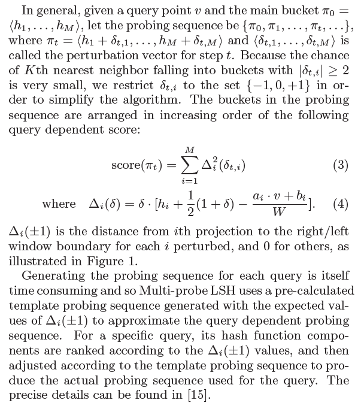
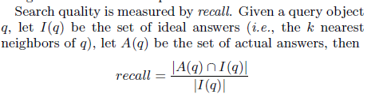
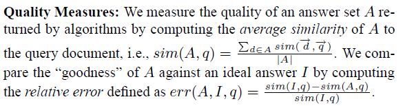

## A Survey on Locality Sensitive Hashing Algorithms and their Applications

介绍了如何在不同应用领域中使用LSH

keywords：局部敏感哈希、近似最近邻搜索、高维相似度搜索、索引

### 1. Introduction

对于低维最近邻，流行基于树的索引结构 **KD-tree** **SR-tree** ，但是对于高维，需要解决维度灾难，不搜索精确结果而是用近似结果代替

#### 1.1 LSH

将高维数据映射到低维，用随机哈希函数表示，数据点被分配到每个哈希桶中

#### 1.2 Motivation

使用LSH：

亚线性查询性能和查询精度的理论保证。随机散列函数与数据无关，不需要因为数据而改变。最先进的LSH使用碰撞计数等高级方法，减小了*索引大小*

我们的研究与其他不同之处：

在多个应用领域中，LSH基于原始的欧式距离

只关注LSH的技术来解决ANN问题，回顾LSH的最新进展

#### 1.3 Contribtions

+ 根据使用的哈希系列对其进行分类
+ 不同的分布式框架来提高处理速度
+ 不同应用领域进行了分类

#### 1.4 Paper Organization

2. LSH背景信息
3. LSH算法改进们
4. 基于LSH的分布式框架
5. LSH不同应用领域
6. 总结

### 2. Background & Key Concepts

近似最近邻ANN搜索的关键概念，针对LSH

给给出一个数据集，有n个点，d个维度，c-ANN查询点q，dist(o,q) <= c\*dist($o^*$,q)  $o^*$ 是实际上q最近的邻居。c-k-ANN返回top-k

当两个点x，y在一个d维数据集D中时，一个哈希函数H是 (R,cR,$p_1$,$p_2$)-sensitive 当它满足以下公式：

+ if |x-y| <= R  , P[H(x)=H(y)] >= $p_1$
+ if |x-y| > cR  , P[H(x)=H(y)] <= $p_2$

对于Hamming矩阵（两个向量对应的不同位置数）

对于Minkowski矩阵（p范数）

对于Angular矩阵（角距离）

对于Jaccard矩阵，H(x) = $min\{\pi(x_i)\}$ 其中$x_i$ 是向量x的一个值为1的分量的index（也就是集合中的随机一个元素），$\pi$ 表示随机重排，因此H(x)=H(y)的概率为 J

好哥哥，这不就是最小签名矩阵，

### 3. Review of LSH

对基于不同距离的LSH技术分类

#### 3.1 Hamming-based LSH Techniques

#### 3.2 Minkowski-based LSH Techniques

E2LSH是第一个针对欧氏距离提出的LSH，使用多个哈希表和复合哈希函数来增加相邻两个点的碰撞机会，为每个桶分配一个距离分数，按照递增顺序访问这些桶，

#### 3.3 Angular-based LSH Techniques

#### 3.4 Jaccard-based LSH Techniques

LSHForest在每个哈希表上创建一个前缀树，将复合哈希键存储在前缀树上。查询时找到与查询的point具有最大前缀匹配的点

#### 3.5 Other LSH Techniques

##### 3.5.1 Combination of hash function families:

贝叶斯LSH是为了解决E2LSH误报去除需要计算欧氏距离的时间消耗。贝叶斯LSH可以应用于Euclidean、Angular和Jaccard度量。点的散列值称为签名，投影桶为签名区域，指向大的签名区域不是好的候选者，因为可能他们离彼此很远，因此S2LSH尝试区分签名区域，仅使用由两个标准定义的区域1.较小的、2.查询靠近中心的。它可以应用于Euclidean、Angular。

查询处理加速：QALSH的优化版本，使用复合哈希密钥和R树

##### 3.5.2 Kernelized hash function families:

K-BayesLSH

##### 3.5.3 Application-specific hash function families:

### 4. Distributed Frameworks

分布式框架，有几个独立的任务发生在LSH技术中，因此使用Multi-Probe LSH分布式实现。

使用主从架构开发系统，从节点负责进行计算任务，创建维护哈希表、查询搜索、查询排名，与主节点通讯。主节点负责拆分和分配大数据集，将查询发送到节点，聚合排名结果。

本文采用主从架构（master-slave）来搜索LSH桶。

为了将LSH桶映射到分布式系统的对等店，使用双层映射策略。

1. 持有相似数据的LSH桶被映射到相同的对等点
2. 对等点之间的负载平衡公平

并行LSH（PLSH）流数据缓存、插入优化的增量表。

基于位图的策略用于消除从不同哈希表中获取的重复数据

一种框架利用Map-Reduce范式并使用LSH查找Minhash签名，将签名边骂道Bloom过滤器中，将Bloom过滤器分发在reduce任务。

CLSH使用K-Means聚类算法将原始数据集拆分成多个集群，将这些集群分布在不同的计算节点上，每个节点都在其中创建自己的本地索引。在查询阶段，将给定的查询与集群中心和最近的计算节点比较，最后合并中间结果。

Apache Spark-> SLSH 在索引阶段，每个工作节点加载数据集的一个子集并计算该子集中的点的哈希值。在查询阶段，所有工作节点加载哈希函数和哈希表，将查询发送给所有工作节点进行查询处理。SES-LSH使用哈希方案对数据进行分区，使得相同的哈希表中的点被分渠道相同的工作节点。

**一个通用的分布式平台，LoSHa，**轻松实现不同距离不同LSH方法的分布式版本指标。使用Map-Reduce范例，提供多个用户友好的API。

桶压缩、重复数据删除

C2Net关注C2LSH等LSH方法的碰撞计数操作，与哈希值计算和误报去除相比，计数是最耗时的操作。C2Net 利用最小生成树和谱聚类来划分 LSH 桶并分发它们在 Map-Reduce 框架中完成映射器任务。此外，C2Net 通过运行两轮map-reduce来支持虚拟重新散列

基于分布式LSH方法的索引阶段的负载平衡，提出了两个理论模型，随后利用这两种理论模型以及基于CDF和虚拟节点的方法，提出**动态负载均衡策略**。

RDH的分布式方法，提高对图像执行相似性搜索的速度

### 5. Applications

#### 5.1 Audio Processing

#### 5.2 Image/Video Processing

#### 5.3 Security/Privacy Related

#### 5.4 Blockchain

#### 5.5 Data Mining Approaches

#### 5.6 Text/Document Processing

#### 5.7 Biological Sciences

#### 5.8 Geological Sciences

#### 5.9 Graph Processing

作者提出了一种向量表示方法，用于将图转换到高维向量。最后，Multi-Probe LSH 和欧几里德距离用于查询生成的高维向量。

**Basic Weighted Graph Summarization (BWGS) **是一种用于压缩图形的方法，用于在图形中找到相似的节点。

#### 5.10 Machine Learning

#### 5.11 Healthcare

#### 5.12 Plagiarism/Near-Duplicate Detection

#### 5.13 Networks

#### 5.14 Software Testing

#### 5.15 Ontology Matching

#### 5.16 Social Media and Community Detection

#### 5.17 Time Series

#### 5.18 Robotics

### 6. Conclusions

在这篇调查论文中，我们回顾了局部敏感哈希 (LSH) 技术的最新进展，并根据它们使用的哈希函数对它们进行了分类。 此外，我们回顾了为 LSH 技术提出的分布式框架并解释了它们的架构。 最后，我们对不同的应用论文进行了分类，并介绍了如何在每篇论文中使用局部敏感哈希。

## Modeling LSH for Performance Tuning

LSH缺点是需要调整参数适应数据本身。

为了解决这个问题，我们提出了多探针 LSH 的统计性能模型，这是 LSH 的最新变体。 我们的模型可以准确预测给定小样本数据集的平均搜索质量和延迟。

除了使用模型自动调整参数外，我们还使用该模型设计自适应 LSH 搜索算法，为每个查询动态确定探测参数。

### 1. Introduction

K-NN问题-维数灾难，基于树的索引方法会退化为高维度线性扫描。

LSH有两个缺点：

1. 很大的空间，数百个哈希函数。 Multi-probe LSH 算法解决了这个问题，它探测同一个哈希表中的多个桶——额外探测的桶是地址接近本应查询的桶
2. 对参数敏感。LSH Forest

### 2. Background

#### 2.1 Basic LSH

K-NN问题给出一个矩阵空间，然后一个数据集，给每个点一个索引，找到最近的。在本文中D维欧式空间。

$L_2$距离，哈希函数族：

$H(v)=<h_1(v), h_2(v), ..., h_M(v)>$

$h_i(v)=\lfloor \frac{a_iv+b_i}{W} \rfloor , i=1,2,...,M$

**a是向量，每个条目在高斯分布N(0,1)中随机选取，b在U[0,W)**

Multi-probe LSH 减小了所需hash table的大小

####  2.2 Multi-Probe LSH

查询靠近主桶的其他桶。

要调整的参数：W 

M：

L：哈希表的个数，也就是最小签名矩阵分割出的组数 

T：探测序列的长度

LSH forest 数据流

### 3. Analytical model

模型拟合一系列特定于数据集的分布，使用gamma分布

#### 3.1 Modeling Multi-Probe LSH

## MultiProbe LSH: Efficient Indexing for High-Dimensional Similarity Search
更少的查询时间和哈希表

高维空间中的相似性搜索在数据库、数据挖掘和搜索引擎中变得越来越重要，特别是对于基于内容的特征丰富的数据搜索，如录音、数码照片、数字视频和其他传感器数据。 由于特征丰富的数据对象通常表示为高维特征向量，因此相似性搜索通常在高维特征向量空间中实现为 K 最近邻 (KNN) 或近似最近邻 (ANN) 搜索。

另外，索引数据结构的构建应该是快速的，能够方便地处理各种序列的插入和删除。 当前的方法不能满足所有这些要求。 之前提出的用于 KNN 搜索的基于树的索引方法，如 R-tree [14]、K-D tree [4]、SR-tree [18]、navigating-nets [19] 和 cover-tree [5] 返回准确的结果，但是 对于具有高（固有）维度的数据，它们的时间效率不高。 [27] 表明，当维数超过 10 时，现有的基于空间分区的索引数据结构比蛮力、线性扫描方法慢。 对于高维相似性搜索，最著名的索引方法是局部敏感哈希（LSH）[17]。 基本方法使用一系列局部敏感散列函数将高维空间中附近的对象散列到同一个桶中。 为了进行相似性搜索，索引方法将查询对象散列到一个桶中，将桶中的数据对象作为结果的候选集，然后使用相似性搜索的距离度量对候选对象进行排序。 为了达到较高的搜索精度，LSH 方法需要使用多个哈希表来产生一个好的候选集。 实验研究表明，这种基本的 LSH 方法需要一百多个 [13]，有时甚至是数百个哈希表 [6]，才能在高维数据集上实现良好的搜索精度。 由于每个哈希表的大小与数据对象的数量成正比，因此基本方法不满足空间效率要求。

我们开发并分析了两种方案来计算探测序列：逐步探测和查询导向探测。 通过探测每个哈希表中的多个桶，该方法比以前提出的 LSH 方法需要更少的哈希表。 通过仔细选择探测序列，它还需要检查比基于熵的 LSH 少得多的桶。

## LSH Forest: Self-Tuning Indexes for Similarity Search
我们考虑索引高维数据以回答（近似）相似性搜索查询的问题。 事实证明，相似性索引在各种设置中都很重要：Web 搜索引擎需要快速、并行、基于主内存的索引来对文本数据进行相似性搜索； 数据库系统需要基于磁盘的高维数据相似性索引，包括文本和图像； 点对点系统需要具有低通信成本的分布式相似性索引。 我们提出了一种名为 LSH Forest 的索引方案，它适用于上述所有情况。 我们的索引使用众所周知的局部敏感哈希 (LSH) 技术，但通过以下方式改进了以前的设计：(a) 消除了必须不断手动调整 LSH 的不同数据相关参数，以及 (b) 改进了 LSH 为倾斜数据分布提供性能保证，同时保留相同的存储和查询开销。 我们展示了如何在主内存、磁盘、并行系统和对等系统中构造此索引。 我们通过对多个文本语料库进行实验来评估设计，并展示 LSH 森林的自调整特性和卓越性能。

### introduction

**Each bucket stores an inverted list**