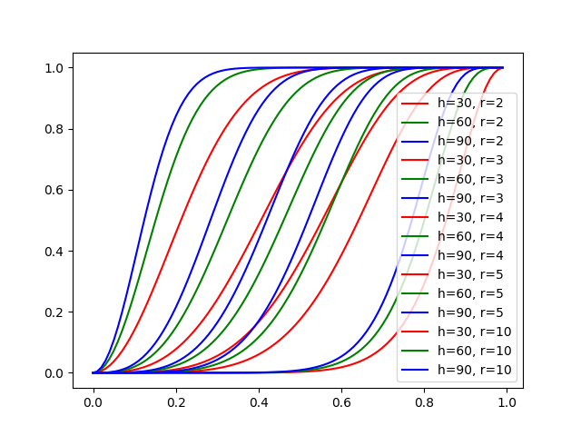
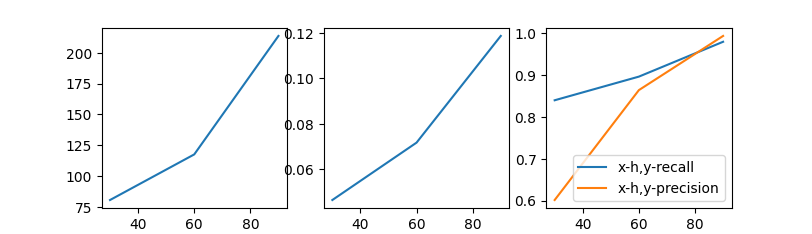

<div style="font-size: 30px;text-align:center;font-family:SimSun;font-weight:bolder;margin-top:25%">《数据科学与工程算法》项目报告</div>

<div style="font-size: 18px;text-align:center;font-family:SimSun;margin-top:57%">
  <div style="margin-left:10%;margin-right:10%">
    <div style="float:left;width:20%;text-align:justify;text-align-last: justify;">
      <div style="margin-bottom:20px">
        报告题目
      </div>
      <div style="margin-bottom:20px">
        姓名
      </div>
      <div style="margin-bottom:20px">
        学号
      </div>
      <div style="margin-bottom:20px">
        完成日期
      </div>
    </div>
    <div style="float:left;width:1%;text-align:justify;text-align-last: justify;">
      <div style="margin-bottom:20px">
        :
      </div>
      <div style="margin-bottom:20px">
        :
      </div>
      <div style="margin-bottom:20px">
        :
      </div>
      <div style="margin-bottom:20px">
        :
      </div>
    </div>
    <div style="float:right;width:79%;">
      <div style="margin-bottom:20px">
        使用局部敏感哈希进行相似性搜索
      </div>
      <div style="margin-bottom:20px">
        彭一珅
      </div>
      <div style="margin-bottom:20px">
        10215501412
      </div>
      <div style="margin-bottom:20px">
        2023.4.11
      </div>
    </div>
  </div>
</div>


<div STYLE="page-break-after: always;"></div>


**摘要[中文]:** 为了高效准确地查询到论文著作者之间共同作者的关系，本项目用无向图表示共同作者关系，采用局部敏感散列(LSH)方法，对图中的节点进行近似最近邻查找。这种方法有一个显著缺点是为了达到较高的准确率，需要创建较多哈希表，空间利用率较低。因此本项目采用多探头LSH，探测可能包含查询结果的多个桶。评估表明，多探针LSH方法改进了普通LSH方法的缺点，具有较高的准确率和时间空间利用率。

**Abstract [English]:** In order to efficiently and accurately query the co-author relationship between the authors of the paper, this project uses an undirected graph to represent the co-author relationship, and uses the Local Sensitive Hashing (LSH) method to perform an approximate nearest neighbor search on the nodes in the graph. A significant disadvantage of this method is that in order to achieve higher accuracy, more hash tables need to be created, and the space utilization rate is low. Therefore, this project uses multi-probe LSH to detect multiple buckets that may contain query results. The evaluation shows that the multi-probe LSH method improves the shortcomings of the common LSH method, and has higher accuracy and time-space utilization.

<div STYLE="page-break-after: always;"></div>

## 一、项目概述

高维空间中的相似性搜索，在多个研究领域中都是重要的问题。在低维数据应用场景下，通过线性查找或树索引可以解决，但是对于高维的数据集，可能会产生维度灾难等问题，基于树的索引方法会退化成高维度线性扫描，降低查找的效率。为解决这一问题，学术界与工业界提出了一系列类似索引的技术加速查找过程，分为**最近邻**(NN)查找和**近似最近邻**(ANN)查找。其中，**局部敏感哈希**(LSH)技术是采用哈希技术实现对海量高维数据中的近似最近邻快速查找的方法。其中基于Jaccard集合相似度的LSH技术，在文本冗余检测、查找镜像网站等问题中有着广泛的应用。

在文献搜索、相似推荐等应用场景下，找到研究人员之间的共同作者关系是非常重要的步骤。为此，本项目将研究人员抽象成无向图上的点，他们之间的共同作者关系抽象成边，此时，每个节点都具有一个以0、1组成的布尔特征向量，表示与向量分量序号所代表的节点之间是否相连。然而，用无向图表示的共同作者关系，其邻接矩阵具有维度高、占用冗余空间大等特点，同时，为了查询一个节点的相关节点，待比较的节点数量太多，查找耗时长。

因此，本项目考虑使用近似最近邻搜索技术来快速找到与查询节点邻居集合相似度最高的节点集，通过构建基于Jaccard距离的LSH方案，实现了快速搜索研究人员之间共同作者关系的功能。


## 二、问题定义

#### 2.1 LSH方法概述

给出一个数据集$D$，其中包含$n$个点，维度为$d$，一个查询点$q$与数据集在同一向量空间中。c-ANN搜索的目标是返回点$o \in D$，其中 $dist(o,q) \leq c \times dist(o^*,q)$， $o^*$表示$q$在$D$中的最近邻点。与之相似，c-k-ANN的搜索目标是返回top-k个点，其中$dist(o_i,q) \leq c \times dist(o^*_i,q)$，$1 \leq i \leq k$。

对于两个$d$维空间中的点$x$和$y$，和一个数据集$D \subset \mathbb{R}^d$，我们将一个哈希函数$H$叫做$(R,cR,p_1,p_2)$-敏感的，当其满足以下两个条件：

+ if $|x-y| \leq R$, then $Pr[H(x)=H(y)] \geq p_1$, and
+ if $|x-y| > cR$, then $Pr[H(x)=H(y)] \leq p_2$

其中，$c$是近似率，$p_1$和$p_2$是概率。$c > 1$，$p_1>p_2$ 这个定义说明当两个点相似度很高的时候，他们会被以大于$p_1$的概率哈希到同一个桶里，如果它们不相似，那么就会以小于$p_2$的概率哈希到同一个桶里。

#### 2.2 基于Jaccard距离的LSH方法

两个集合的Jaccard相似度可以表示为：

$Jaccard(A,B)=\frac{|A\cap B|}{|A\cup B|}$

基于以上相似性度量，可以很好地比较出在本实例中两个研究人员之间的相关性。

Min-Hashing是一种特殊的哈希函数，是基于Jaccard距离的局部敏感哈希函数。给定布尔向量$x$和随机排列$\pi$，$\pi(x)$为随机排列后的向量，$min{\{\pi(x_i)}\}$是此向量从0开始数第一个不为0的分量的行号。此时$H(x)=min{\{\pi(x_i)}\}$为Min-Hashing函数，$Pr[H(x)=H(y)]=Jaccard(x,y)$

证明：

两个向量相互比较，每行的结果只有三种情况：两行均为0，两行有且仅有一个值是1，两行均为1。假设属于第一类的有a行，属于第二类有b行，则Jaccard相似度为$\frac{a}{a+b}$。对两个向量进行随机重排后，如果$H(x)=H(y)$，说明在遇到第一种情况之前没有遇到第二种情况，所以其概率等于在所有a+b行中遇到a行的概率，为$\frac{a}{a+b}$。

#### 2.3 基于Min-Hashing的LSH过程

将以上理论应用到求向量相似度上，可以分成两步：

##### 2.3.1 最小哈希签名矩阵

对向量进行数次哈希重排，取其Min-Hashing值，构建最小哈希签名向量。将每个向量的最小哈希签名向量组合起来得到最小哈希签名矩阵，列代表每一个节点，每行代表一个重排序列生成的Min-Hashing值。

##### 2.3.2 基于最小哈希签名矩阵的相似度

一旦得到最小哈希签名矩阵，可以运用条块法实现LSH。将最小哈希签名矩阵划分为b组，每组由r行组成，以这个r维列向量为索引，将节点映射到桶中，将此过程重复b次。最终，任意两个节点只要至少有一次被映射到同一个桶中，就说明这是一堆候选相似集合。

设两个向量的Jaccard相似度为s，则：

在某个组中，两个向量被映射到一个桶内的概率为$s^r$

在某个组中，至少一个位置的最小哈希值不同的概率为$1-s^r$

在所有组中，都没有被映射到一个桶中的概率为$(1-s^r)^b$

在所有组中，至少被映射到一个桶中一次的概率为$1-(1-s^r)^b$


## 三、方法

#### 3.1 普通Min-Hashing

##### 3.1.1 数据预处理

本实验的数据集是若干对点的形式，表示两个序号的研究人员之间有共同作者关系。首先需要对数据集进行预处理，转换成每个点的特征向量形式。

```python
# 读取数据，给每个节点对应特征向量
def preprocess(self):
  edge_list = []
  with open('ca-AstroPh.txt', 'r', encoding='utf-8') as fp:
    s_list = fp.read().split('\n')[:-1]
    self.row = int(s_list[0].split(' ')[1])

    for s in s_list[1:]:
      edge = s.split(' ')
      edge_list.append(edge)
      # 创建空的矩阵用来存放特征向量
      for i in range(self.row):
        self.node_mat.append([0] * self.row)

        for edge in edge_list:
          self.node_mat[int(edge[1]) - 1][int(edge[0]) - 1] = 1
          self.node_mat[int(edge[0]) - 1][int(edge[1]) - 1] = 1
```

初始化矩阵保存每个节点的特征向量，每个向量分量代表两点之间是否有连线，此特征矩阵是对称矩阵，并且元素全为0或1。

##### 3.1.2 构建最小哈希签名矩阵

Min-Hashing方法的基本思路是定义一个MinHash哈希函数族，每个哈希函数是一个随机置换，对所有特征向量进行相同的重排，然后再找到每个向量第一个为1的分量的行号，作为哈希签名向量的一个分量。

```python
# 通过特征矩阵构建最小哈希签名矩阵
def min_hash(self):
    for hash_num in range(0, self.h):
        ordered_index = [x for x in range(0, self.row)]
        random.shuffle(ordered_index)
        cnt = 0
        min_hash_vector = []
        for vector in self.node_mat:  # 访问每个特征向量
            for i in range(0, self.row):  # 按照哈希函数所指的顺序访问向量的每个分量，得到第一个1所循环的次数是这个向量的哈希签名(从0开始)
                if vector[ordered_index[i]] == 1:
                    cnt = i
                    break
            min_hash_vector.append(cnt)

        self.min_hash_mat.append(min_hash_vector)
```

在代码实现中，ordered_index记录重排的方式，然后按照随机的顺序访问特征向量的分量，得到第一个1的时候，记录访问的分量次数，退出循环。min_hash_mat矩阵的每一列是一个最小哈希特征向量，每一行由一个哈希函数生成。

此处除了使用python random模块自带的shuffle重排方法，还尝试了其他方法生成随机重排哈希函数，将在3.4节中详细叙述。

##### 3.1.3 映射入桶

在得到最小哈希签名矩阵后，如果对其中的每一行进行比较，需要太多次投射入桶的操作，同时，用于每一组的映射都会创建一个哈希表，这也会非常占用空间。因此，将最小哈希签名矩阵条块化，每r行作为一组，将r维向量作为字典的key，而字典的value是一个列表，向里面append相应的节点序号。

```python
# 将min_hash_mat分为b组，每组r行，只要两个node在任何一组有相同的向量表示，则放入同一bucket中
def put_into_bucket(self):
    min_hash_mat_copy = self.min_hash_mat
    # 将最小哈希签名矩阵分割成待处理部分和剩余部分，每次切除r行
    while len(min_hash_mat_copy) > self.r:
        hashBuckets = {}
        r_row_mat = min_hash_mat_copy[:self.r]
        min_hash_mat_copy = min_hash_mat_copy[self.r + 1:]
        # 处理每一列（每个节点），得到映射进的桶
        for node in range(0, self.row):
            new_list = []
            # 将每一行的对应签名插入
            for i in range(0, self.r):
                new_list.append(r_row_mat[i][node])
            tag=str(new_list)
            if tag not in hashBuckets:
                hashBuckets[tag] = [node]
            elif node not in hashBuckets[tag]:
                hashBuckets[tag].append(node)
        # 每一组操作完毕后，忽略列表长度为1的，记录共同出现的节点
        for key, value in hashBuckets.items():
            if len(value) >= 2:
                # 将节点之间的相关度关系存储在query_dict中
                for i in value:  # key值
                    for j in value:  # 将要加入列表的value值
                        if i not in self.query_dict:
                            self.query_dict[i] = [j]
                        elif j not in self.query_dict[i]:
                            self.query_dict[i].append(j)
```

在此选用了转换为字符串的方法，以使得每组的最小签名向量可以唯一地代表一个桶。在3.4节中将会详细讲述这个哈希函数的其他实现方式。

在每个哈希表中的桶映射完成后，查找其中列表长度大于等于2的。query_dict字典中每个节点是一个key值，而value值记录与它相关度高的节点列表。除了query_dict这种记录方式，我还尝试了在查询阶段进入每个哈希表中查找的方法，将在3.2节中详述。

##### 3.1.4 查询

根据上一节生成的query_dict表，查询部分只需要按照用户的输入key，遍历value的列表，比较查询点q与候选点的Jaccard距离，按照相似度排序，输出相似度最高的top-K即可。

```python
# 按照用户要求输出top k
def query(self, query_node):
    ans = {}
    node = query_node - 1
    try:
        for similar_node in self.query_dict[node]:
            if similar_node != node:
                ans[similar_node + 1] = (jcd(self.node_mat[node], self.node_mat[similar_node]))
        ans = sorted(ans.items(), key=lambda x: -x[1])
        if len(ans) > self.k:
            print(ans[:self.k])
            self.ans = ans[:self.k]
        else:
            print(ans)
            self.ans = ans
    except KeyError:
        print("查询失败，没有找到该节点的相似节点集")
```

其中，Jaccard距离的计算函数如下所示：

```python
def jcd(vec1, vec2):
    intersection = 0
    union = 0
    for i in range(0, len(vec1)):
        if (vec1[i] == 1) & (vec2[i] == 1):
            intersection += 1
            union += 1
        elif (vec1[i] == 1) | (vec2[i] == 1):
            union += 1
    return intersection / (union * 1.0)
```

以上Min-Hashing过程，作为本次项目的基本实现，复现了课本中的内容，尽量避免了使用python包（仅使用一次random包）。

#### 3.2 基于前缀树的多探头查找

在普通LSH方法中，只有在最小哈希签名向量的值完全相同的情况下，两个节点才会被映射到一个桶内，而在查询相应节点的过程中，每个哈希表最多只有一个桶发挥其作用，将桶中的节点加入到候选集里。因此，为了达到较高的搜索精度，普通LSH方法需要创建尽可能多的哈希表，来产生一个好的候选集，但是由于每个哈希表的大小与节点数量成正比，这种方法的空间利用率不够高。

多探头(Multi-probe) LSH的基本思想是通过探测每个哈希表中的多个桶，来获取没有被投射到相同桶中的临近节点，从而扩大候选集，解决了上述问题。但是，大多数多探头LSH都是针对欧氏距离的向量相似度查找，使用的哈希函数族

$H(v)=\langle h_1(v), h_2(v), ..., h_M(v)\rangle$

$h_i(v)=\lfloor \frac{a_iv+b_i}{W} \rfloor , i=1,2,...,M$

也与基于Jaccard距离的Min-Hashing不同。其中，如果主桶的向量为 $\pi_0=\langle h_1,...,h_M\rangle$，那么查询序列是 $\{\pi_0,\pi_1,...,\pi_t,...\}$，而$\pi_t=\langle h_1+\delta_{t,1},...,h_M+\delta_{t,M}\rangle$，其中 $\langle \delta_{t,1},...,\delta_{t,M}\rangle$是第$t$步的扰动向量。算法限制$\delta_{t,i}$的取值只能为-1,0,1，但是这不符合Min-Hashing的特征，例如，两个点的最小哈希签名为3和4，这无法判断两者的相似关系，只能看出在随机扫描特征向量的过程中，首先扫描到了(a+b)中的b行(见2.2)。

然而，阅读论文[3]可知，LSH Forest的目标是使用较少的存储空间，建立高效的索引。LSH Forest将点p的最小哈希签名向量转为只含0和1的label，然后构造成前缀树，在查询时，从树的根节点开始，寻找与查询节点q的label最长前缀匹配的叶子节点，然后对forest中所有的树进行自底向上搜索，最后返回K个点。然而，python中实现该论文内容的datasketch包源码，没有使用树状结构，而是将生成的最小哈希签名向量转换成字节形式，通过python的字符串比较规则，找到相同比特位最多的字符串。

但是这种LSH Forest的实现方法，与本项目有两大重要的不同。第一，datasketch主要针对文本词向量的查询，第二，datasketch查找的词向量并没有被事先加入到Forest中，因此需要在query时计算出MinHash向量，然后将前缀比对，找到最相似的key值。而本项目由于查询的节点都在建立索引时已经构建了MinHash向量，可以直接取用；同时，每个哈希表中有一个与查询节点完全相同的key值存在，因此不需要遍历（源码中使用的二叉搜索）树中的每个key值。

本项目通过以上方法对算法进行改进，修改了映射入桶和查询两部分代码。

##### 3.2.1 映射入桶

映射入桶部分，与普通LSH相比，去掉了构建query_dict部分，另外对字典中的key排序，使查询点所在桶的两侧大概率是与其最小哈希签名向量相差不大的桶。例如，如果将列表的字符串作为key，那么查询点所在的桶的key值为"5 2 3"，而根据python字符串的排序规律，两侧的桶可能是"5 2 1"与"5 2 4"。当然，这种方法不能保证两侧一定是相似值，例如"5 0 1"就有两个值与key不同，但也有可能作为相邻桶出现。但是，扫描比对每个向量时间开销太大，因而采用选取临近桶的策略。

```python
def put_into_bucket(self):
    min_hash_mat_copy = self.min_hash_mat
    # 将最小哈希签名矩阵分割成待处理部分和剩余部分，每次切除r行，处理每一组放到前缀树里
    for prefix_tree_num in range(0, self.p):
        r_row_mat = min_hash_mat_copy[prefix_tree_num * self.r:prefix_tree_num * self.r + self.r]
        # 处理每一列（每个节点），映射到h/r个前缀树
        for node in range(0, self.row):
            new_list = []
            # 获取签名
            for i in range(0, self.r):
                new_list.append(r_row_mat[i][node])
            # 签名变作tag
            tag = _H(new_list)
            if tag not in self.prefix_forest[prefix_tree_num]:
                self.prefix_forest[prefix_tree_num][tag] = [node]
            elif node not in self.prefix_forest[prefix_tree_num][tag]:
                self.prefix_forest[prefix_tree_num][tag].append(node)
        self.prefix_forest[prefix_tree_num] = dict(
            sorted(self.prefix_forest[prefix_tree_num].items(), key=lambda x: x[0]))
    # 以上，构建出排好序的前缀树森林，从而可以根据多探针的原理，将两侧的数据也加入到查询集中
```

其中，生成tag的\_H函数放在3.4节讲解。

##### 3.2.2 查询

查询部分，重写了\_query函数，而对query函数没有大的改变，只是将遍query_dict改为遍历\_query函数的返回列表。

在\_query函数中，先提取出待查询节点的最小签名，然后获取对应的桶中以及两侧的内容。

```python
def _query(self, node):
    # 先提取出要查询节点的最小签名
    new_list = []
    for i in range(self.h):
        new_list.append(self.min_hash_mat[i][node])
    hps = [_H(new_list[start * self.r:start * self.r + self.r]) for start in range(self.p)]
    node_list = []
    for hp, pf in zip(hps, self.prefix_forest):
        num = 0
        for j, key in enumerate(pf.keys()):
            if key == hp:
                num = j
                break
        l = pf[hp]
        if num != 0:
            v_list_before = list(pf.values())[num - 1]
            for n in v_list_before:
                if n not in node_list:
                    node_list.append(n)
        if num != self.row:
            v_list_after = list(pf.values())[num + 1]
            for n in v_list_after:
                if n not in node_list:
                    node_list.append(n)
        if len(l) > 1:
            for n in l:
                if n not in node_list:
                    node_list.append(n)
    node_list.remove(node)
    return node_list
```

#### 3.3 LSH Forest

本节仿照datasketch 中 MinHashLSHForest的代码实现，在本项目针对的问题上进行了应用，在三个阶段对代码进行大幅度的修改，完整地实现了LSH Forest。

##### 3.3.1 数据预处理

由于LSH Forest是根据词向量生成的最小哈希签名，因此在数据预处理时不再使用多维矩阵，而是用键值对的方式，将每个节点所连接的节点存在value列表中。这可以使value以词向量的形式出现，也降低了空间复杂度。

```python
def preprocessing():
    edge_list = []
    with open('ca-AstroPh.txt', 'r', encoding='utf-8') as fp:
        s_list = fp.read().split('\n')[1:-1]

    for s in s_list:
        edge = s.split(' ')
        edge_list.append(edge)
    # 创建空的字典用来存放特征向量
    node_mat = {}
    for edge in edge_list:
        if edge[1] not in node_mat:
            node_mat[edge[1]] = [edge[0]]
        else:
            node_mat[edge[1]].append(edge[0])
        if edge[0] not in node_mat:
            node_mat[edge[0]] = [edge[1]]
        else:
            node_mat[edge[0]].append(edge[1])
    return node_mat
```

##### 3.3.2 构建最小哈希签名矩阵

在构建最小哈希签名矩阵的过程中，LSH Forest的策略也与以往有所不同。固定选取了哈希函数数目为128，将对每个向量独立构建最小哈希签名，而非每次操作都针对整个矩阵。为了保证每行所应用的哈希重排函数是相同的，LSH Forest使用了相同的种子seed，随机生成128组重排。

```python
class MinHash:
    def __init__(self, num_perm=128, seed=1, hashfunc=sha1_hash32):
        self.seed = seed # 生成哈希函数族的种子
        self.num_perm = num_perm # 最小签名向量的长度
        self.hashfunc = hashfunc 
        gen = np.random.RandomState(self.seed) # 用于生成随机数的类。它具有相同的方法和功能，但是通过使用相同的种子来生成的随机数序列是相同的。
        self.permutations = np.array([
            (gen.randint(1, _mersenne_prime, dtype=np.uint64), gen.randint(0, _mersenne_prime, dtype=np.uint64)) for _
            in range(num_perm)
        ], dtype=np.uint64).T # 生成两个随机数，范围是[1,_mersenne_prime]，作为随机化处理向量的系数
        self.hashvalues = np.ones(num_perm, dtype=np.uint64) * _max_hash # 原始的hash向量，长度为128（num_perm）

    def update(self, b):
        hv = self.hashfunc(b) # 使用特定哈希函数处理词向量
        a, b = self.permutations
        phv = np.bitwise_and((a * hv + b) % _mersenne_prime, _max_hash)
        self.hashvalues = np.minimum(phv, self.hashvalues) # 生成最小哈希向量

    def jaccard(self, other): # 用最小签名向量估计jaccard距离
        return float(np.count_nonzero(self.hashvalues == other.hashvalues)) / float(len(self.hashvalues))
```

其中，特定的哈希函数实现如下。这个函数将词向量中单个的词，以小端法、unsigned int 方式对加密后的词进行解压，sha1和md5相同，也是对字符串的加密方式。最终返回一个小于_max_hash的整数。

```python
def sha1_hash32(data):
    return struct.unpack('<I', hashlib.sha1(data).digest()[:4])[0]
```

##### 3.3.3 构建LSH Forest

这一部分包含了普通LSH的映射入桶和查询两部分。

对于数据预处理时得到的key-value对，先将value处理成MinHash对象，而在调用LSH Forest时又将处理好的MinHash对象和key一并传入。将传入的MinHash对象中的hashvalues，也就是最小签名向量，经过\_H函数处理后切割成8段tag，存入到key所对应的value列表里。

然后对于key和value中的每个tag，建立起倒排索引，存入到hashtables字典列表里。

```python
def add(self, key, minhash):  # 传入一个MinHash变量
    self.keys[key] = [_H(minhash.hashvalues[start:end])
                      for start, end in self.hashranges]  # 长度为8，把最小签名向量切成了8段
    for H, hashtable in zip(self.keys[key], self.hashtables):
        if H not in hashtable:
            hashtable[H] = [key]
        else:
            hashtable[H].append(key)
```

在所有key都add进入Forest中之后，调用index函数，建立一个sorted_hashtables列表集，每个列表代表一个前缀树，在这个列表中存储着排序后的tag。

```python
def index(self):
    for i, hashtable in enumerate(self.hashtables):
        self.sorted_hashtables[i] = [H for H in hashtable.keys()]
        self.sorted_hashtables[i].sort()
```

接下来传入要查询的MinHash对象，以及相应的key（node），tag集中的每个tag都是128字节的，而传入\_query函数的r值影响每次切割最小哈希签名向量所得到的前缀长度，这实现了在使用空间一定情况下，多次遍历同一个哈希表，用二分搜索快速匹配前缀相同的tag，扩大了查找集。

```python
def _query(self, minhash, r):
    hps = [_H(minhash.hashvalues[start:start + r])
           for start, _ in self.hashranges] # 重复add时的操作，将最小签名向量处理后切成8段
    prefix_size = len(hps[0])
    for ht, hp, hashtable in zip(self.sorted_hashtables, hps, self.hashtables): # ht表示一个排序过的tag集，对应于普通LSH中由桶组成的哈希表，hp表示要查询的tag，hashtable是通过tag查找key的倒排索引
        i = _binary_search(len(ht), lambda x: ht[x][:prefix_size] >= hp)
        # 在排序过的tag集中查找前缀最匹配的tag
        if i < len(ht) and ht[i][:prefix_size] == hp:
            j = i
            while j < len(ht) and ht[j][:prefix_size] == hp:
                for key in hashtable[ht[j]]: # 将tag查找到列表中的key输出
                    yield key
                j += 1

def query(self, node, minhash, k):
    results = set()
    r = self.k
    while r > 0:
        for key in self._query(minhash, r):
            results.add(key)
            if len(results) >= k + 1:
                result = list(results)
                result.remove(node) # 将被查询的node从查询集里去除
                return result # 生成用户指定top-K个数的key后返回
        r -= 1
    result = list(results)
    result.remove(node)
    return result
```

##### 3.3.4 最终实现

但是按照datasketch包中的实现，把MinHash和Forest当做两个对象来实现，需要存储的共同变量在查询时放在了类外面，这会拖慢程序的运行速度。

因此本项目按照普通LSH的实现方法，再次修改了代码实现，下面是LSH类修改后的完整代码。

```python
def __init__(self):
    self.h = 128
    self.node_mat = {}
    self.min_hash_list = {}
    self.l = 8
    gen = np.random.RandomState(1)
    self.permutations = np.array([
        (gen.randint(1, _mersenne_prime, dtype=np.uint64), gen.randint(0, _mersenne_prime, dtype=np.uint64)) for _
        in range(self.h)
    ], dtype=np.uint64).T
    self.k = 0
    self.hashtables = []
    for _ in range(self.l):
        self.hashtables.append({})
    self.hashranges=[]
    self.keys = dict()
    self.sorted_hashtables = [[] for _ in range(self.l)]

def jaccard(self,m1, m2):
    v1 = self.min_hash_list[m1]
    v2 = self.min_hash_list[m2]
    return float(np.count_nonzero(v1 == v2)) / float(len(v1))

def preprocessing(self):
    edge_list = []
    with open('ca-AstroPh.txt', 'r', encoding='utf-8') as fp:
        s_list = fp.read().split('\n')[1:-1]

    for s in s_list:
        edge = s.split(' ')
        edge_list.append(edge)
    # 创建空的字典用来存放特征向量
    node_mat = {}
    for edge in edge_list:
        if edge[1] not in node_mat:
            node_mat[edge[1]] = [edge[0]]
        else:
            node_mat[edge[1]].append(edge[0])
        if edge[0] not in node_mat:
            node_mat[edge[0]] = [edge[1]]
        else:
            node_mat[edge[0]].append(edge[1])
    self.node_mat = node_mat

def min_hash(self):
    for key, value in self.node_mat.items():
        hashvalues = np.ones(self.h, dtype=np.uint64) * _max_hash
        for b in value:
            hv = hashfunc(b.encode('utf-8'))
            a, b = self.permutations
            phv = np.bitwise_and((a * hv + b) % _mersenne_prime, _max_hash)
            hashvalues = np.minimum(phv, hashvalues)

        self.min_hash_list[key]=hashvalues

def forest(self):
    self.k = int(self.h / self.l)
    self.hashranges = [(i * self.k, (i + 1) * self.k) for i in range(self.l)]
    for key, hashvalues in self.min_hash_list.items():
        self.keys[key] = [_H(hashvalues[start:end])
                          for start, end in self.hashranges]
        for H, hashtable in zip(self.keys[key], self.hashtables):
            if H not in hashtable:
                hashtable[H] = [key]
            else:
                hashtable[H].append(key)
    for i, hashtable in enumerate(self.hashtables):
        self.sorted_hashtables[i] = [H for H in hashtable.keys()]
        self.sorted_hashtables[i].sort()

def _query(self, node, r):
    hashvalues = self.min_hash_list[node]
    hps = [_H(hashvalues[start:start + r])
           for start, _ in self.hashranges]
    prefix_size = len(hps[0])
    for ht, hp, hashtable in zip(self.sorted_hashtables, hps, self.hashtables):
        i = _binary_search(len(ht), lambda x: ht[x][:prefix_size] >= hp)
        if i < len(ht) and ht[i][:prefix_size] == hp:
            j = i
            while j < len(ht) and ht[j][:prefix_size] == hp:
                for key in hashtable[ht[j]]:
                    yield key
                j += 1

def query(self, node, k):
    results = set()
    r = self.k
    while r > 0: # 查询r棵树
        for key in self._query(node, r):
            results.add(key)
            if len(results) >= k + 1:
                result = list(results)
                result.remove(node)
                jcd_list=[]
                for n in result:
                    jcd_list.append(self.jaccard(node,n))
                _result=list(zip(result,jcd_list))
                _result.sort(key=lambda x:x[1],reverse=True)
                return _result
        r -= 1
    result = list(results)
    result.remove(node)
    jcd_list = []
    for n in result:
        jcd_list.append(self.jaccard(node, n))
    _result = list(zip(result, jcd_list))
    _result.sort(key=lambda x: x[1], reverse=True)
    return _result
```

经过同一对象化的改进，算法的性能提升如下。

| 单位：秒       | datasketch | 改进后 |
| -------------- | ---------- | ------ |
| 数据预处理时间 | 0.217      | 0.220  |
| 索引构建时间   | 26.15      | 5.28   |
| 查询时间       | 0.001      | 0.001  |


#### 3.4 其他尝试

为了更优化算法的时间和空间性能，本项目做了一些新的尝试，给算法的每部分设计了一些”可替换部件”。另外，尝试根据相似度对节点进行聚类，再对每个类分别计算，降低需要构建索引的节点个数。

##### 3.4.1 哈希重排函数的生成

首先，借用课本上的例子，我采用了随机生成取余哈希函数的方式，对特征向量进行重排。但是这种方法不够严谨，每种重排出现不是等概率的。

```python
# 每次循环生成一个哈希重排函数
a = random.randint(1, 100)
b = random.randint(1, self.row - 1)
for vector in self.node_mat:  # 访问每个特征向量
    for i in range(0, self.row):  # 按照哈希函数所指的顺序访问向量的每个分量，得到第一个1所循环的次数是这个向量的哈希签名(从0开始)
        if vector[(i * a + b) % self.row] == 1:
            cnt = i
            break
    min_hash_vector.append(cnt)
```

然后尝试了运用洗牌算法生成随机序列。首先，用random包中randint在序列中随机选择一个下标，然后将这个下标与列表中最后一个数交换位置（下标为num_max），然后给num_max-1，再次循环，直到减为0。

这种算法虽然仍然无法避免使用random包，但是可以证明，对于序列中的任一数字，最后出现在n个不同下标的概率都是$\frac{1}{n}$ 

证明：

在第1次操作时，数字k被选中，并被交换到第n-1位的概率为$\frac{1}{n}$ ，未被选中的概率为$\frac{n-1}{n}$ ；

在第2次操作时，数字k被交换到第n-2位的概率为$\frac{1}{n-1}$ ,因此，数字k最终出现在第n-2位的概率为$\frac{1}{n-1} \times \frac{n-1}{n} = \frac{1}{n}$ 

以此类推，在第i次操作时，数字k最终出现在第n-i位的概率为 $\frac{1}{n-i+1} \times ... \times \frac{n-1}{n} = \frac{1}{n}$ 

```python
# 重排规则是洗牌算法生成的序列
for num_max in reversed(range(0, self.row)):
    num_chose = random.randint(0, num_max)
    tmp = ordered_index[num_chose]
    ordered_index[num_chose] = ordered_index[num_max]
    ordered_index[num_max] = tmp
```

另外还尝试了random.shuffle重排函数。

##### 3.4.2 映射入桶哈希函数的选择

首先选用了自带的hashlib包中的md5编码方式，使每个最小签名向量都能有独一无二的key值。经过考虑，去掉了转换的字符串两侧的[]符号，用join函数实现。

```python
hashObj = hashlib.md5()
# band = str(new_list)
band = " ".join(map(str, new_list))
hashObj.update(band.encode())
tag = hashObj.hexdigest()
```

然后参考前缀树的实现，运用大小端字节交换的方法，处理每个字符串，得到01组成的字节序列。

```python
def _H(l):
    return bytes(np.array(l).byteswap().data)
```

以上两种方法都要调用外部包，因此主要还是选择了直接使用字符串作为key。

##### 3.4.3 多线程生成最小哈希签名矩阵

这里可以设定线程数量thread_num，这些线程并发地处理特征向量，生成不同的最小签名，然后随机地放入最小签名矩阵当中。

```python
def min_hash(self, thread_num):
    hash_list_all = range(0, self.h)
    thread_list = []
    step = int(self.h / thread_num)
    for t in range(thread_num):
        thread_list.append(threading.Thread(target=_min_hash, args=(self, hash_list_all[t * step:t * step + step])))

    for t in thread_list:
        t.start()
    for t in thread_list:
        t.join()
```

##### 3.4.4 节点聚类

仿照最简单的聚类方法，按照jaccard距离对节点聚类。

```python
def calcDis(dataSet, centroids, k):
    clalist = []
    for data in dataSet:
        distance = []
        for i in range(k):
            distance.append(jcd(data, centroids[i]))
        clalist.append(distance)
    clalist = np.array(clalist)  # 返回一个每个点到质点的距离len(dateSet)*k的数组
    return clalist
```

这个函数计算了每个点与候选的质心点之间的jaccard距离，对任一点，找出对于每个质心距离的最小值，将其分到这个质心所代表的类。

```python
def classify(dataSet, centroids, k):
    cluster = []
    clalist = calcDis(dataSet, centroids, k)  # 计算距离
    minDistIndices = np.argmin(clalist, axis=1) # 算出最小值
    for i in range(k):
        cluster.append([]) # 将节点按照最小值分类
    for i, j in enumerate(minDistIndices):
        cluster[j].append(dataSet[i])
    newCentroids = []
    changed = 0
    for i in range(k):
        c = cluster[i]
        if len(c) == 0:
            while 1:
                choose = random.sample(dataSet, 1)[0]
                if choose not in newCentroids:
                    newCentroids.append(choose)  # 随机选取一个不是其他质心的点作为质心
                    break
        else:
            newCentroids.append(random.sample(c, 1)[0])
        changed += jcd(newCentroids[i], centroids[i])

    return changed, newCentroids
```

这个函数计算了样本到质心的距离，并在相应的类中随机选取新的质心。这种随机选取的方法导致收敛比较慢，在后续工作中也许可以选取在该类中距离原质心最近的点。最后计算新的质心与旧的质心的变化量，当达到一定阈值时停止迭代。

将待计算的节点聚类，再将分属于每个类的节点放到分布式系统的每台机器上进行计算，对于大规模的数据，可以减少计算量，增加计算速度。


## 四、实验结果

#### 4.1 时间复杂度分析

下面我将梳理普通LSH算法的整体流程，计算每一环节的时间复杂度。

首先，数据预处理创建了一个n*n的矩阵， 并且遍历了边E的列表，时间复杂度$O(n^2+E)$ 

构建最小哈希矩阵的速度与哈希函数的个数h有关，时间复杂度为$O(hn)$ 同时考虑到局部性的问题，尽量顺序访问矩阵的行，而不是跳跃着访问列，可以降低用时。

映射入桶的部分，总共处理了b组，每一组都需要遍历node列表，按照最小哈希签名key值映射到桶里，时间复杂度为$O(brn)=O(hn)$ 

可见，由于节点数量n无法改变，对索引时间影响最大的是哈希函数的个数h

对于普通LSH过程，查询过程的时间复杂度与查询集的大小有关，一般来说，分组越细（r值小），组数越多（b值大），被加入查询集的节点越多。然而，查询集的大小还与查询的节点、原始数据的分布有关。

#### 4.2 空间复杂度分析

在数据预处理部分，使用了n*n大小的矩阵来存储特征向量。同时也可以通过邻接列表来保存边的信息，避免存储稀疏矩阵浪费空间。

在构建最小哈希矩阵过程中，最小哈希签名矩阵的大小为n*h。

在映射入桶部分，可以看出，哈希表的多少取决于组数b。

#### 4.3 查询准确率分析

##### 4.3.1 参数分析

按照2.3.2节分析所得的式子，画出映射入桶的概率(y轴)与Jaccard相似度(x轴)的S曲线，其中蓝色为哈希函数个数h=90时的曲线，而红色为哈希函数个数h=30时的曲线。可以很明显看出，h越大，曲线越陡峭，由于程序需要那些Jaccard相似度较大的节点被以很高概率映射到桶中，而Jaccard较小的节点需要以尽可能小的概率投射到桶中，因此h值越大，算法准确率越高，但是根据4.1 4.2的分析，时间复杂度和空间复杂度也越高。

此外，r值越大，曲线的阈值在x轴方向上越偏右。这是很好理解的：每组的行数越多，说明这两个最小签名向量完全相同的概率越小，那么被映射入同一个桶所需要的相似度阈值就越高。



##### 4.3.2 查询结果统计

对于普通LSH，第一张图是哈希函数数目与构建索引时间（单位：秒）的相关关系，第二张图是哈希函数数目与查询时间（单位：秒）的相关关系。第三张图是recall召回率与precision准确率与哈希函数数目的关系。



其中，召回率的计算公式为

$ recall=\frac{|A(q) \cap I(q)|}{|I(q)|}$

准确率的计算公式为

$ sim(A,q)=\frac{\sum_{d \in A}{sim(d,q)}}{|A|}$

$ err(A,I,q) = \frac{sim(I,q)-sim(A,q)}{sim(I,q)}$

$ precision=1-err(A,I,q)$

可以看到，增加准确率与召回率的同时，代价是时间成本的线性增加。


对比普通LSH和LSH Forest的性能，公平起见，哈希函数的数目h均为30，哈希表（树）个数为2

| 单位：秒              | LSH    | LSH Forest |
| --------------------- | ------ | ---------- |
| 数据预处理时间        | 3.77   | 0.24       |
| Min-Hashing时间       | 134.37 | 4.28       |
| 映射入桶/构建森林时间 | 1.52   | 0.12       |
| 查询时间              | 0.026  | 0.001      |
| precision             | 0.71   | 0.53       |
| recall                | 0.50   | 0.30       |

可见，LSH Forest在舍弃了一定准确率的情况下，每阶段的时间复杂度都大大降低。在数据预处理阶段，避免了遍历n*n大矩阵，在Min-Hashing过程中，分别处理每个字典中的value，有较好的局部性，在构建森林过程中，用较少的循环次数实现了tag-key的倒排索引，在查询过程中，仅yield k个点就返回，是非常优秀的算法。


## 五、结论

本次实验基于Jaccard距离使用min-hashing实现了LSH算法，并且通过实验验证了其有效性。LSH算法是一种常用的相似性搜索算法，它可以高效地在大规模数据集中查找和目标数据相似的数据点，因此在信息检索、推荐系统等领域得到广泛应用。

在本次实验中，我首先学习了Jaccard距离的概念，并通过计算两个集合之间的Jaccard距离来确定它们之间的相似度。然后，我使用min-hashing技术将每个数据点表示为一个签名矩阵，从而能够更高效地进行相似性搜索。在实现过程中，使用了Python语言，并利用NumPy库来处理大规模数据集。本实验还实现了一个简单的LSH算法，并通过调整参数来比较不同结果的差异。

接下来，我学习了如何使用LSH Forest算法来优化LSH算法。LSH Forest算法是一种增强版的LSH算法，它使用前缀树来组织相似的数据点，以便更快地查询相似数据点。通过与普通LSH算法的比较，可以发现优化后的算法能够显著提升查询效率，从而更快地找到与目标数据点相似的数据集合。

通过实验，我深入理解了LSH算法并掌握了一些常用的优化技巧。这些技术可以在实际应用中更加高效地进行相似性搜索，并且可以适用于不同领域的问题，并学习了如何使用Python语言和NumPy库来实现它们。因此，本次实验对数据分析和机器学习技能提升具有重要意义。

虽然LSH Forest的时空性能已经趋于最优，但是面对更大规模的数据，构建索引的时间仍旧以线性增长。因此，在改进LSH Forest时，可以考虑将节点聚类，进行分布式计算等，从而进一步提高算法的效率。

此外，还可以考虑开发新的相似度度量方法，特别是针对稀疏数据集的相似度度量方法；研究如何自适应地选择hash函数数量以及其他参数。在未来的研究中，可以探索基于深度学习的相似性搜索方法，如使用卷积神经网络或循环神经网络来建模数据点之间的关系。


**参考文献**

[1] Broder A Z. Identifying and filtering near-duplicate  documents[C]//Combinatorial Pattern Matching: 11th Annual Symposium, CPM 2000 Montreal, Canada, June 21–23, 2000 Proceedings 11. Springer Berlin Heidelberg, 2000: 1-10.

[2] Lv Q, Josephson W, Wang Z, et al. Multi-probe LSH: efficient indexing  for high-dimensional similarity search[C]//Proceedings of the 33rd  international conference on Very large data bases. 2007: 950-961.

[3] Bawa M, Condie T, Ganesan P. LSH forest: self-tuning indexes for  similarity search[C]//Proceedings of the 14th international conference  on World Wide Web. 2005: 651-660.

