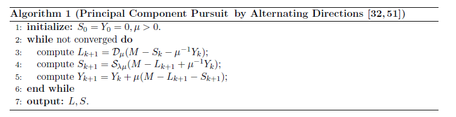
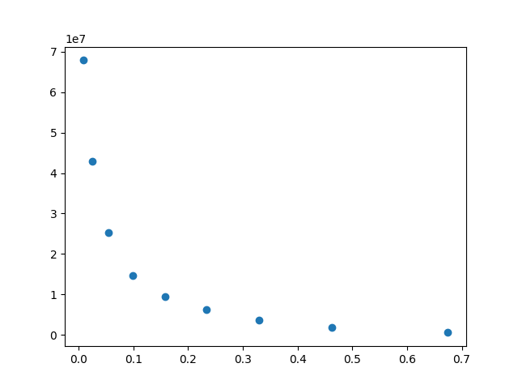
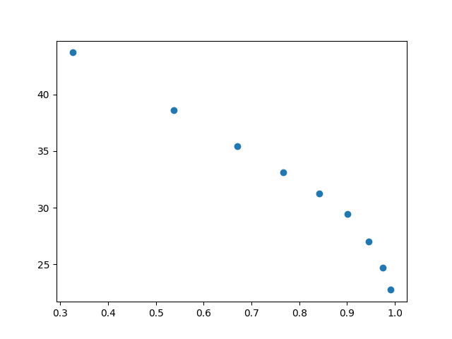
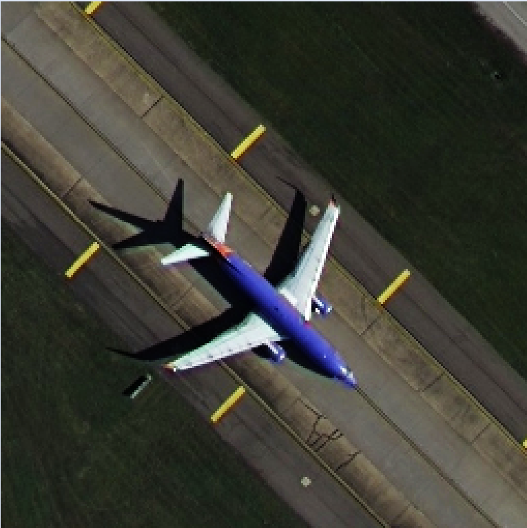
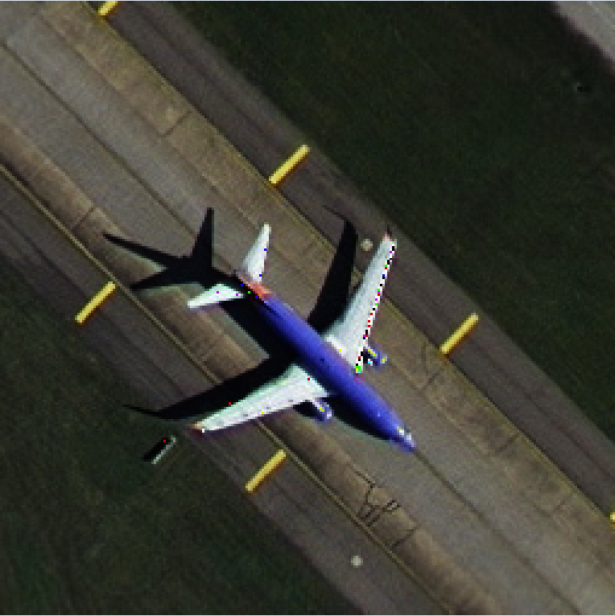
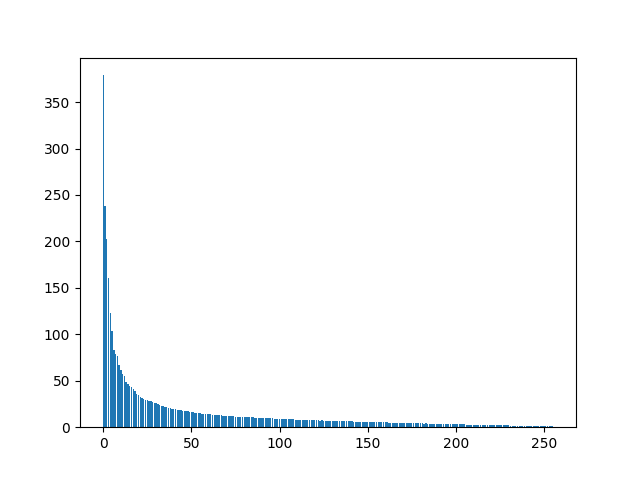
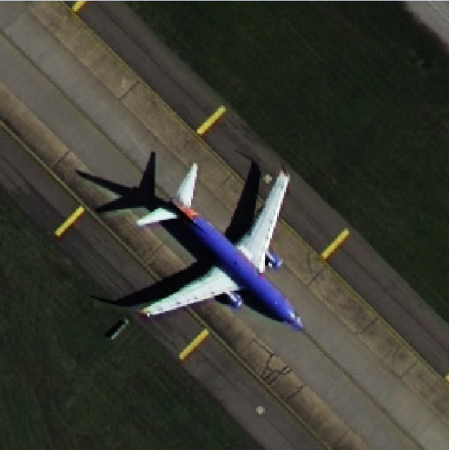
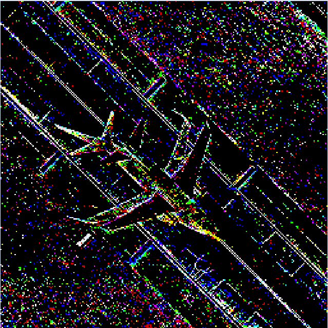

<div style="font-size: 30px;text-align:center;font-family:SimSun;font-weight:bolder;margin-top:25%">《数据科学与工程算法》项目报告</div>

<div style="font-size: 18px;text-align:center;font-family:SimSun;margin-top:57%">
  <div style="margin-left:10%;margin-right:10%">
    <div style="float:left;width:20%;text-align:justify;text-align-last: justify;">
      <div style="margin-bottom:20px">
        报告题目
      </div>
      <div style="margin-bottom:20px">
        姓名
      </div>
      <div style="margin-bottom:20px">
        学号
      </div>
      <div style="margin-bottom:20px">
        完成日期
      </div>
    </div>
    <div style="float:left;width:1%;text-align:justify;text-align-last: justify;">
      <div style="margin-bottom:20px">
        :
      </div>
      <div style="margin-bottom:20px">
        :
      </div>
      <div style="margin-bottom:20px">
        :
      </div>
      <div style="margin-bottom:20px">
        :
      </div>
    </div>
    <div style="float:right;width:79%;">
      <div style="margin-bottom:20px">
        利用PCA进行图片压缩
      </div>
      <div style="margin-bottom:20px">
        彭一珅
      </div>
      <div style="margin-bottom:20px">
        10215501412
      </div>
      <div style="margin-bottom:20px">
        2023.5.13
      </div>
    </div>
  </div>
</div>


<div STYLE="page-break-after: always;"></div>


**摘要[中文]:** PCA（Principal Component Analysis）是一种广泛使用的数据分析处理技术，可以找到数据集中方差最大的方向作为主成分，将高维数据映射成低维数据，从而实现数据降维。这在大规模数据处理中非常有用，能够节省计算时间和空间开销。本文将该技术应用在图片压缩中，将较大规模的图片矩阵降维存储，在尽可能保存图片主要特征的前提下节省了存储空间。本文还尝试了Robust PCA技术来处理图片，从而实现图片降噪的功能。

**Abstract [English]:** PCA (Principal Component Analysis) is a widely used data analysis and processing technology. It can find the direction with the largest variance in the data set as the principal component, and map high-dimensional data into low-dimensional data, thereby achieving data dimensionality reduction. This is very useful in large-scale data processing, saving computational time and space overhead. In this paper, this technology is applied to image compression, and the large-scale image matrix is reduced in dimensionality and stored, saving storage space while preserving the main features of the image as much as possible. We also tried Robust PCA technology to process pictures, so as to realize the function of picture noise reduction.

<div STYLE="page-break-after: always;"></div>

## 一、项目概述

在批量存储图片的过程中，逐个像素地存储要耗费大量的内存；在图像识别领域，需要将图片的像素点转换成矩阵来处理，如果矩阵维数过大，可能会有较大的时间空间开销。因此，PCA（Principal Component Analysis）方法被提出，用于压缩图片、特征提取、去除噪声等。

本项目旨在探究PCA技术在图片压缩中的应用，通过对图片进行降维和特征提取，实现对图片的压缩，并保持压缩后图像的质量。项目将利用Python的NumPy和PIL等库实现PCA算法，并将其应用于不同分辨率、不同类型的图片数据集中进行测试和验证。

项目主要包括以下步骤：

1. 原始图像数据的处理：使用PIL.Image包读入不同分辨率、不同类型的图片数据集。
2. PCA算法的实现：编写PCA算法的代码，并将其应用于图像数据的降维和特征提取。
3. 压缩后图像的重建：通过已选取的主成分对图像数据进行压缩，并运用PCA算法的逆变换，实现对压缩后图像的重建。
4. 压缩效果的评估：使用MSE（Mean Squared Error）、PSNR（Peak Signal-to-Noise Ratio）等指标对压缩后图像与原始图像之间的相似度进行量化评估。
5. 实验结果的分析和总结。

本项目的目标是实现对图像数据的高效压缩，并保持压缩后图像的质量。这将有助于减少存储空间和传输带宽的开销，并为后续图像处理和分析任务提供更好的输入。

此外，本项目也尝试了Robust PCA技术，编写Robust PCA算法的代码，将图像数据分解得到得到低秩成分和稀疏成分，利用低秩成分进行图像降噪、去雾、图像增强等处理任务，提高图像处理的准确性和鲁棒性。


## 二、问题定义

#### 2.1 PCA

##### 2.1.1 算法目标

主成分分析的目标是找到一个线性变换，将高维数据变换到一个新的坐标系统中，使得高维空间中的数据点分别投影到第一大方差所在的坐标方向（称为第一主成分）、第二大方差所在的坐标方向（称为第二主成分），以此类推。

给定一组经过中心化的m条样本数据$D=(x_1,x_2,...,x_m)$ ，其中$x_i \in R^n$ ，$\sum _{i=1}^{m}{x_i}=0$ ，假设经过投影变换后的新坐标系$W=(w_1,w_2,...,w_k)$ ，其中$w_i \in R^n$ 为标准正交基，即$||w_i||_2=1$ 且 $w_i^Tw_j = 0\ (i \ne j)$ 。那么样本点$x_i$ 在新坐标系下的坐标是$z_i=W^Tx_i$ ，最终可基于$z_i$ 来重构原始数据$x_i$ ，其重构数据$\hat{x_i}=Wz_i$ 。算法的目标就是找到新坐标系$W$。

##### 2.1.2 算法证明

寻找新坐标系的方式是使数据重构误差最小。利用欧氏距离计算平方误差：

$\sum_{i=1}^m{||\hat{x_i}-x_i||_2^2}=\sum_{i=1}^m{||Wz_i-x_i||_2^2}$

​								$=\sum_{i=1}^m((Wz_i)^T(Wz_i)-2(Wz_i)^Tx_i+x_i^Tx_i)$

​								$=\sum_{i=1}^m(z_i^TW^TWz_i-2z_i^TW^Tx_i+x_i^Tx_i)$

​								$=\sum_{i=1}^m(z_i^Tz_i-2z_i^Tz_i+x_i^Tx_i)$

​								$=\sum_{i=1}^m(-z_i^Tz_i+x_i^Tx_i)$ 

​								$=-tr(ZZ^T)+const$

​								$=-tr(W^TXX^TW)+const$ 

因此，最小化重构误差的目标函数为：

$\underset{W}{min}\ -tr(W^TXX^TW)$

$s.t. W^TW = 1$

运用拉格朗日乘子法求得最优解$W$满足：

$XX^TW=\lambda W$ 

由于$X$每行均值都为0，因此$\frac{XX^T}{m-1}$是协方差矩阵，$\lambda$ 是协方差矩阵的特征值。

因此$W$由协方差矩阵前k个特征值所对应的特征向量组成。

##### 2.1.3 算法步骤

1. 样本点去中心化

   为了使要求特征值的方阵正好是协方差矩阵，将样本$X$进行预处理，每行的均值为0

   $y_i=x_i-\overline{x},i=1,2,...,m$

   此处y和x都为列向量

2. 协方差矩阵的特征值分解

   特征值分解运用幂法进行迭代，得到矩阵中最大特征值后，减去秩一矩阵：

   $A_1=A-\lambda_1u_1u_1^T$ 

   再次迭代得到第二大的特征值，以此类推可以按特征值大小顺序进行特征值分解

   $\frac{YY^T}{m-1}=U\Sigma U^T$

   矩阵U的列向量可组成W

3. 主成分选取

   $k=\underset{l}{argmin} \frac{\sum_{i-1}^l{\lambda_i}}{\sum_{i=1}^{rank(A)}{\lambda_i}}\ge\alpha$ 

   由前k个特征值所对应的特征向量组成矩阵：

   $W=(w_1,w_2,...,w_k)$

4. 降维投影

   新样本矩阵$Z=W^Tx_i$

#### 2.2 Robust PCA

PCA和RPCA的共同任务都是将目标矩阵M分解成一个稀疏矩阵和一个低秩矩阵的和：

$M=L_0+S_0$ 

而PCA使用的方法是求解最小化问题

$ min||M-L_0||_2 \ s.t. rank(L_0)\leq k$

RPCA使用主成分追踪法（PCP），最小化低秩矩阵的核范数和稀疏矩阵的1范数的加权和

$min||L||_*+\lambda ||S||_1 \ s.t. L+S=M$ 

 该问题结合损失函数，用增广拉格朗日函数计算：

$l(L,S,Y)=||L||_*+\lambda ||S||_1+<Y,M-L-S>+\frac{\mu}{2}||M-L-S||_F$

其中矩阵Y是拉格朗日系数。

初始化时先设定S=0，Y=0，然后在每次迭代中，先固定S，关于L最小化$l$，然后固定L，关于S最小化$l$，最后基于残差更新拉格朗日乘子矩阵Y。得到如下算法：



其中$D_\mu$和$S_{\lambda \mu}$ 表示函数，是对矩阵求导得到的最小化公式：

$S_\tau[x]=sgn(x)max(|x|-\tau,0)$

$D_\tau(X)=US_\tau(\Sigma)V^* \ , where\  X=U\Sigma V^*$ 

经过多次迭代可以得到残差最小的L和S。


## 三、方法

#### 3.1 PCA

##### 3.1.1 数据预处理

首先，根据函数的参数num，判断对哪张图进行降维，读取路径存入变量path。

然后用PIL中的Image包获取图片数据，用numpy包中的asarray函数将图片的像素信息转换成一个三维矩阵（包含RGB信息）。

最后，根据第三个维度（RGB信息）将三个向量拼接在一起，对于本次实验给出的图像数据像素均为256x256来讲，拼接完的矩阵data_x维度为（256,768）

```python
path = ''
if num in range(0, 10):
    path = "./airplane/airplane0" + str(num) + ".tif"
if num in range(10, 100):
    path = "./agricultural/agricultural" + str(num) + ".tif"
img = Image.open(path)
data = np.asarray(img)
data_x = np.hstack((data[:, :, 0], data[:, :, 1], data[:, :, 2]))  # 将三个颜色的向量按照列合并在一起
```

##### 3.1.2 PCA算法实现

1. 样本点去中心化

   按照行获取均值向量，每行768个数字加起来得到一个分量，然后重复768列。对样本去中心化得到data_y。

   ```python
   data_mean = np.repeat(np.mean(data_x, axis=1).reshape((1,256)),768,axis=0).T  # 每列的均值，每列表示一个样本点
   data_y = data_x - data_mean  # 1.样本点去中心化
   ```

2. 协方差矩阵的特征值分解

   矩阵U保存特征向量，eigValues数组保存特征向量。

   从全1的向量开始迭代，最大迭代次数此处设为100，最小误差设为0.001，是偏差向量的二范数。

   每次迭代过程中，向量x_old与要求特征向量的矩阵S相乘，用2范数对向量标准化，求出偏差，然后进行下一轮迭代。

   最终得到特征向量eigVec，通过特征向量和矩阵算出特征值，如果特征值过小（通常是矩阵最后一个特征值，或减去秩一矩阵留下的误差形成的多余特征值）就跳出循环。

   通过奇异值或特征值确定k本质上是一样的，但是会对相同的$\alpha$值得到不同的k值，奇异值得到的k值会更大。

   ```python
   # 对协方差矩阵进行特征值分解
   U = None
   eigValues = []
   while 1:
       itrs_num = 0
       delta = float('inf')
       N = np.shape(S)[0]
       x_old = np.ones(shape=(N, 1))
       x_new = np.ones(shape=(N, 1))
       while itrs_num < 100 and delta > 0.001:
           itrs_num += 1
           y = np.dot(S, x_old)
           x_new = y / np.linalg.norm(y)
           delta = np.linalg.norm(x_new - x_old)
           x_old = x_new
       eigVec = x_new  # 特征向量（竖版）
       eigValue = np.dot(eigVec.T, np.dot(S, eigVec))[0][0]  # 特征值
       if eigValue < 0.01:
           break
       S = S - eigValue * np.dot(eigVec, eigVec.T)  # 减去秩一矩阵
       # eigValue = np.sqrt(eigValue)  # 奇异值
       if U is None:
           U = eigVec.T
       else:
           U = np.append(U, eigVec.T, axis=0)  # 特征向量（横版）
       eigValues.append(eigValue)
   ```

3. 主成分选取

   遍历特征值数组，将前k个特征值加起来，与特征值总和求比值，找到使这个比值大于alpha值所需的最小k值。

   ```python
   sum_all = np.sum(eigValues)
   sum_k = 0
   alpha = 0.9
   k = 0
   for i in range(len(eigValues)):
       sum_k += eigValues[i]
       if sum_k / sum_all >= alpha:
           k = i
           break
   ```

4. 降维投影

   将正交矩阵$W^T$=U[:k]与标准化的数据data_y相乘,，此时U[:k]维度是（k, 256），data_y维度是（256,768）

   ```python
   np.dot(U[:k], data_y)
   ```

##### 3.1.3 图像重建

将数据左乘W，加上均值，重构降维为k的数据矩阵。

将矩阵分为RGB三个方阵，并转换成三维矩阵，转换成图片并保存。

```python
data_z = np.dot(U[:k].T, np.dot(U[:k], data_y)) + data_mean
im1_channels = np.hsplit(data_z, 3)
im2 = np.zeros((im1_channels[0].shape[0], im1_channels[0].shape[0], 3))
for i in range(3):
  im2[:, :, i] = im1_channels[i]

im2 = im2.astype('uint8')
im3 = Image.fromarray(im2)
im3.save("./plane_out/" + str(num) + '.tif')
```

#### 3.2 Robust PCA

算法的主体部分如下所示，接收参数为迭代次数，初始化目前迭代次数num、目前误差err，以及初始迭代的三个矩阵S、Y、L，形状与传入的矩阵D相同，元素均为0.

根据论文中的建议，当$||M-L-S||_F \leq \delta||M||_F \ , with\ \delta=10^{-7}$ 时，循环终止。

然后在循环中实现算法的3个步骤，依次更新L、S、Y即可。

```python
def fit(self, max_iter=1000):
    num = 0
    err = float('inf')
    Sk = self.S
    Yk = self.Y
    Lk = self.L
    _tol = 1E-7 * frobenius_norm(self.D)

    while (err > _tol) and num < max_iter:
        Lk = svd_threshold(
            self.D - Sk + self.mu_inv * Yk, self.mu_inv)  # step 3
        Sk = shrink(
            self.D - Lk + (self.mu_inv * Yk), self.mu_inv * self.lmbda)  # step 4
        Yk = Yk + self.mu * (self.D - Lk - Sk)  # step 5
        err = frobenius_norm(self.D - Lk - Sk)  # F范数损失
        num += 1

    print('iteration: {0}, error: {1}'.format(num, err))
    return Lk, Sk
```

算法初始化时，根据论文中的建议，$\mu=n_1n_2/4||M||_1$，$\lambda = 1/\sqrt{max(n_1,n_2)}$ 

```python
def __init__(self, D):

    self.D = D  # 传入的矩阵
    self.S = np.zeros(self.D.shape)
    self.Y = np.zeros(self.D.shape)
    self.L = np.zeros(self.D.shape)

    self.mu = np.prod(self.D.shape) / (4 * np.linalg.norm(self.D, ord=1))

    self.mu_inv = 1 / self.mu

    self.lmbda = 1 / np.sqrt(np.max(self.D.shape))
```

另外，算法还包含三个特殊函数，为了简化公式长度，将它们放在类外面作为静态方法。

frobenius求F范数，shrink对应算法中的函数$S_\tau[x]$，svd对应算法中的函数$D_\tau[x]$ 

```python
def frobenius_norm(M):
    return np.linalg.norm(M, ord='fro')


def shrink(M, tau):
    return np.sign(M) * np.maximum((np.abs(M) - tau), np.zeros(M.shape))


def svd_threshold(M, tau):
    U, S, V = np.linalg.svd(M, full_matrices=False)
    return np.dot(U, np.dot(np.diag(shrink(S, tau)), V))
```


## 四、实验结果

#### 3.1 PCA

实验测试选用airplane图片。自行修改了少数像素为256x253的图片。

##### 3.1.1 选取合适的$\alpha$ 值

首先，选取了不同的$\alpha$值，用散点图保证等距，画出平方损失与压缩率的关系。

其中，平方损失的计算方式如下：

```python
np.sum((data_z - data_x) ** 2) # 平方损失
```

由于图片矩阵（256x768）实际上压缩成了降维矩阵（kx768）和正交基特征矩阵$W^T$（256xk），因此压缩后占用的空间/压缩前占用的空间得到：

$\frac{k\times 768+k \times 256}{256\times 768}=k/192$



通过上图可以看出，平方损失的对数值和压缩率基本成反比，在压缩率取到0.1时接近最优，此时$\alpha$ 值取到0.4，也就是取出的k个特征向量中，特征值加和占总特征值加和的40%。

使用更科学的度量方式，测量压缩掉的空间占比1-压缩率与图像峰值信噪比PSNR的关系，如图所示：



得到更直观的结果：在压缩率取到0.1的时候函数曲线有凸起。

##### 3.1.2 平均耗时、压缩率、重构误差

选取$\alpha=0.8$ ，对100张图片进行压缩，算法效果如下：

| 平均耗时（s） | 平均压缩率 | 平均重构误差（平方损失） |
| ------------- | ---------- | ------------------------ |
| 4.70          | 0.35       | 6230120                  |

##### 3.1.3 图片对比

选取编号为31的图片进行详细分析。

压缩前：



压缩后：



（由于无法载入tif图片，以上图片通过截图得到）

| 压缩耗时（s） | 压缩率 | 重构误差（平方损失） |
| ------------- | ------ | -------------------- |
| 3.19          | 0.46   | 3745822              |

观察两张图片，可以看到飞机的关键信息都被保留，损失的信息可能是机翼上的噪点和由平滑变粗糙的地面。

压缩耗时主要决定于幂法迭代的效率，不同特征向量需要逼近的迭代次数不同。

压缩率和重构误差取决于选取的主成分个数k，压缩这张图时，k=89。



上图画出了图片的特征值分布情况，可见前几个特征值非常大，而后面的特征值都很小，只包含少量图片信息。

使用最佳压缩率0.1来压缩这张图片，k=20，只保留了前20个较大的特征：


可以看到飞机和跑道的形状仍然非常清晰。

#### 3.2 Robust PCA

##### 3.2.1 性能说明

| 迭代次数 | F损失 | 时间（s） |
| -------- | ----- | --------- |
| 50       | 0.019 | 13.81     |
| 100      | 0.023 | 27.87     |
| 150      | 0.030 | 54.19     |
| 200      | 0.032 | 79.14     |
| 250      | 0.039 | 101.80    |
| 300      | 0.041 | 124.25    |

##### 3.2.2 图片对比

L矩阵，与原图基本相似，柔化了原图的边缘线，如跑道的中线、飞机的外轮廓。



S矩阵，由于是稀疏矩阵，大部分元素为0，也就是纯黑色。并且较好地识别出了图片的边缘线。



## 五、结论

本项目运用python的PIL和numpy库，实现PCA技术进行图像压缩，实现Robust PCA进行图片处理，并测试了其效果。通过实验结果的分析，我们发现这两种方法在图像处理中都具有很好的应用潜力，但也存在一些不足和改进的空间。

首先是PCA进行图像压缩的方法。本文对不同分辨率、类型的测试数据集进行了压缩，并使用PSNR作为评价指标进行了量化分析。实验结果表明，PCA算法能够有效地将高维数据降到低维，从而实现对图像的压缩，同时保持了压缩后图像的质量。然而，PCA算法也存在一些局限性，需要选取合适的主成分数目，否则可能会导致图像信息丢失；同时，在某些情况下，PCA并不能充分利用图像的局部特征，导致图像失真。未来可以通过探索新的降维技术，如Autoencoder等技术，进一步提高图像的压缩效果。

其次是Robust PCA进行图片处理的方法。我们使用了带有噪声的图像数据集进行了实验，并对比了传统PCA和Robust PCA的效果。实验结果表明，Robust PCA能够有效去除图像中的异常值和噪声干扰，提高图像处理的准确性和鲁棒性。然而，Robust PCA算法的计算复杂度较高，在大规模数据处理中可能不够实用。未来可以通过精细化算法设计和优化，如使用分布式计算等技术，提高Robust PCA算法的效率。

总之，本次实验中使用PCA进行图像压缩和使用Robust PCA进行图片处理都取得了较好的效果。但同时也存在一些局限性和不足，需要进一步探索和改进。在未来的研究中，我们可以通过结合其他机器学习算法、优化算法设计和利用分布式计算等技术，进一步提高这两种方法在图像处理中的应用价值，以满足更加严苛的实际应用需求。


**参考文献**

[1] Candès, E.J., Li, X., Ma, Y., and Wright, J.: ‘Robust principal component analysis?’, J. ACM, 2011, 58, (3), pp. 11

