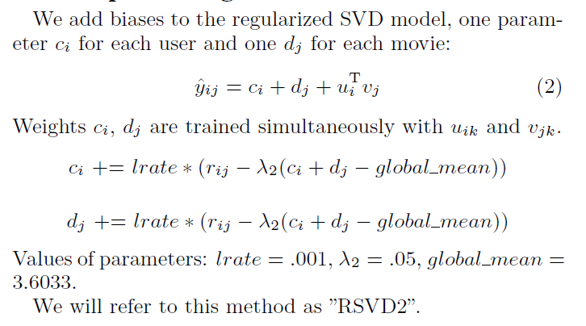
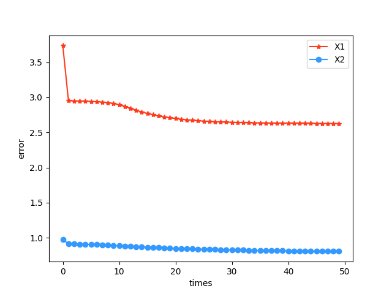
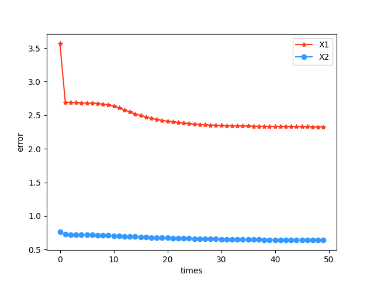
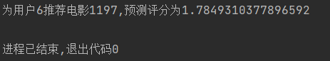

<div style="font-size: 30px;text-align:center;font-family:SimSun;font-weight:bolder;margin-top:25%">《数据科学与工程算法》项目报告</div>

<div style="font-size: 18px;text-align:center;font-family:SimSun;margin-top:57%">
  <div style="margin-left:10%;margin-right:10%">
    <div style="float:left;width:20%;text-align:justify;text-align-last: justify;">
      <div style="margin-bottom:20px">
        报告题目
      </div>
      <div style="margin-bottom:20px">
        姓名
      </div>
      <div style="margin-bottom:20px">
        学号
      </div>
      <div style="margin-bottom:20px">
        完成日期
      </div>
    </div>
    <div style="float:left;width:1%;text-align:justify;text-align-last: justify;">
      <div style="margin-bottom:20px">
        :
      </div>
      <div style="margin-bottom:20px">
        :
      </div>
      <div style="margin-bottom:20px">
        :
      </div>
      <div style="margin-bottom:20px">
        :
      </div>
    </div>
    <div style="float:right;width:79%;">
      <div style="margin-bottom:20px">
        使用矩阵分解进行推荐
      </div>
      <div style="margin-bottom:20px">
        彭一珅
      </div>
      <div style="margin-bottom:20px">
        10215501412
      </div>
      <div style="margin-bottom:20px">
        2023.7.4
      </div>
    </div>
  </div>
</div>


<div STYLE="page-break-after: always;"></div>


**摘要[中文]:** 本实验报告旨在通过矩阵分解算法解决推荐算法中面临的数据稀疏问题，具体而言是非负矩阵分解（NMF）方法。NMF将非负矩阵分解为两个非负矩阵，常用于特征提取和数据降维等领域。本实验选择了Movielens数据集，并对给定的用户-电影评分矩阵进行分解，以找到用户和电影之间的潜在关系。通过这种方式，我们可以为具有相似偏好的用户推荐他们未曾见过的电影，从而构建一个简单的电影推荐系统。在实现NMF过程中，我们采用了梯度下降法作为优化算法，通过迭代更新参数来最小化目标函数。在NMF中，我们需要寻找两个非负矩阵W和H，使得原始矩阵V≈WH。其中，W表示基础特征矩阵，H表示表示系数矩阵。我们的目标是找到W和H的最优值，使得近似误差达到最小。通过该实验，我们成功地解决了推荐算法中的数据稀疏问题，并实现了一个简单而可靠的电影推荐系统。未来，我们可以进一步改进算法，提高推荐准确性和用户满意度。

**Abstract [English]:** This lab report aims to solve the data sparsity problem faced in recommendation algorithms. To recommend items to users that they have not seen before, we employ a matrix factorization method, specifically a non-negative matrix factorization (NMF) method. NMF decomposes a non-negative matrix into two non-negative matrices, which are often used in fields such as feature extraction and data dimensionality reduction. This experiment chooses the Movielens dataset and decomposes the given user-movie rating matrix to find potential relationships between users and movies. In this way, we can recommend unseen movies to users with similar preferences, thus building a simple movie recommendation system. In the process of implementing NMF, we use the gradient descent method as an optimization algorithm to minimize the objective function by iteratively updating parameters. In NMF, we need to find two non-negative matrices W and H such that the original matrix V ≈ WH. Among them, W represents the basic feature matrix, and H represents the coefficient matrix. Our goal is to find the optimal values of W and H such that the approximation error is minimized. Through this experiment, we successfully solved the data sparsity problem in the recommendation algorithm and realized a simple and reliable movie recommendation system. In the future, we can further improve the algorithm to improve recommendation accuracy and user satisfaction.

<div STYLE="page-break-after: always;"></div>

## 一、项目概述

在我们的生活中，存在着许多具有用户评分数据的商品信息。为了给用户推荐他没有见过的商品，我们需要对用户-商品的评分矩阵进行数据分析。然而，数据稀疏成为推荐算法的一大挑战：用户-商品评分矩阵可能维度很大，但是用户往往只见过少量商品，对于大量商品的评分是空缺的。

为了解决这一问题，实现可靠的推荐算法，我们使用矩阵分解的方法来补全用户-商品评分，由于用户评分是正数，因此，选用NMF（非负矩阵分解）方法。MNF是一种将非负矩阵分解为两个非负矩阵的技术，通常应用于特征提取和数据降维等领域。本实验在此基础上还做了一些改进，以更好地完成实验目标。

我们选取Movielens数据集，分解给出的用户-电影评分矩阵，找到用户和电影之间的隐含关系，为爱好相似的用户推荐没见过的电影，从而实现一个简单的电影推荐系统。

梯度下降法是一种常用的优化算法，可用于实现非负矩阵分解，核心思想是通过迭代更新参数来最小化目标函数。在 NMF 中，我们需要找到两个非负矩阵 W 和 H，使得原始矩阵 V ≈ WH。其中，W 表示基础特征矩阵，H 表示表示系数矩阵。目标是找到 W 和 H 的最优值，使得近似误差最小化。

具体实施时，可以采用以下步骤：

1. 初始化 W 和 H 为非负随机值。
2. 计算当前近似误差 $E = ||V - WH||$，其中 || || 表示矩阵的范数。
3. 计算 W 和 H 参数的偏导数，并根据梯度下降法更新它们。对于 W，更新公式为：W = W - α * dW，其中 α 是学习率，dW 是关于 W 的偏导数。对于 H，更新公式为：H = H - α * dH。
4. 重复步骤 2 和 3，直到达到预设的迭代次数或者近似误差满足某个阈值。

上述方法是传统的 NMF 梯度下降实现。然而，该方法在处理大规模数据集时可能会面临一些挑战，例如收敛速度慢、易于陷入局部最优等问题。为了改进这些问题，可以采取以下改进方案：

1. 加入偏置项：通过引入偏置项b和d，我们可以更好地建模数据中的偏移情况，从而提高 NMF 的拟合能力。
2. 正则化：添加正则化项来控制模型的复杂度，避免过拟合。可以引入L1范数或L2范数作为正则化项，并通过调节正则化参数来平衡拟合程度和模型复杂度。
3. 批量梯度下降法：传统的梯度下降法每次更新都使用整个数据集，但对于大规模数据集来说可能过于耗时。可以采用随机梯度下降法（SGD）或者小批量梯度下降法（mini-batch GD），每次只使用一部分样本进行参数更新。

## 二、问题定义

非负矩阵分解的目标是给定矩阵$V \in \mathbb{R}_+^{n \times m}$，寻找非负矩阵$W\in \mathbb{R}_+^{n\times K}$和$H\in \mathbb{R}_+^{m\times K}$ ，使得

$$
\underset{W,H}{min}||V-WH^T||_2^2
$$
为了避免过拟合，在优化问题中加入关于参数$W$和$H$的正则项，得到目标函数：

$$
\underset{W^*,H^*}{min}J(V;W,H)=\frac{1}{2}||V-WH^T||_2^2+\frac{\lambda_1}{2}||W||_2^2+\frac{\lambda_2}{2}||H||_2^2
$$

$$
s.t. W\geq0,H\geq0.
$$

为了让目标函数最小化，根据梯度下降法，矩阵$W$和$H$的更新公式为

$$
p^{(t+1)}_{uj}=p^{(t)}_{uj}+\epsilon(\underset{i:(u,i)\in \mathbb{K}}{\sum}e^{(t)}_{ui}q^{(t)}_{ji}-\lambda p^{(t)}_{uj})
$$

$$
q^{(t+1)}_{ji}=q^{(t)}_{ji}+\epsilon(\underset{u:(u,i)\in \mathbb{K}}{\sum}e^{(t)}_{ui}p^{(t)}_{uj}-\lambda q^{(t)}_{ji})
$$

其中，$e^{(t)}_{ui}=r_{ui}-\sum^{K}_{j=1}p^{(t)}_{uj}q^{(t)}_{ji}$

此外，Daniel D.Lee 和H. Sebastian Seung提出一种收敛速度更快的更新算法，正则化非负矩阵分解参数$w_{ik}\in W$和$h_{jk}\in H$第t+1轮次的更新规则为：

$$
w^{(t+1)}_{ik}=max\{{\lceil \frac{(VH^{(t)})_{ik}-\lambda_1w_{ik}^{(t)}}{(W^{(t)}H^{(t)^T}H^{(t)})_{ij}+\epsilon} \rceil w_{ik}^{(t)},0\}}
$$

$$
h^{(t+1)}_{jk}=max\{{\lceil \frac{(V^TW^{(t)})_{jk}-\lambda_2h_{jk}^{(t)}}{(H^{(t)}W^{(t)^T}W^{(t)})_{ij}+\epsilon} \rceil h_{jk}^{(t)},0\}}
$$

对于一个评分系统来说，除了整体性的评分偏差，每个用户或者每个物品的评分都存在着偏差，因此，对用户和物品的偏置部分加以约束，可以显著提高推荐算法的性能。

论文Improving regularized singular value decomposition for collaborative filtering提出一种对于原始RSVD非负矩阵分解的方法，给每个用户和电影加入一个偏置项，并给出了参数的参考数值，其中，global_mean表示所有评分的均值。在本实验中，我们采取了这种方法。



根据论文中的改进，对原始目标函数加入偏置项，可以得到如下最终的目标函数：
$$
\underset{W^*,H^*,b^*,d^*}{min}J(V;W,H,b,d)=\frac{1}{2}[\underset{(u,i)\in \mathbb{K}}{\sum}e^2_{ui}+\lambda(||W||_F^2+||H||_F^2+||b||_2^2+||d||_2^2)]
$$

## 三、方法

### 1. 带有正则化项的NMF

在实验中，我们选取Movielens数据集的ml-1m规模进行训练，这个数据集包含了一系列匿名用户对电影的评分信息，评分可以是0.5-5分，而评分为0表示用户没有给这部电影评过分。其中收录了用户6000位左右，电影4000部左右。为了读取以“::”为分隔符的.dat数据，并将其转化为稀疏矩阵的形式，我们首先打开rating数据，其中每一列分别是用户id、电影id、用户对电影的评分。

```python
def parse_rating(line):
    rating_data = line.strip().split("::")
    return [int(rating_data[0]), int(rating_data[1]), float(rating_data[2])]

with open("./ml-1m/ratings.dat", 'r') as file:
    data = [parse_rating(line) for line in file]
max_list = list(np.max(data, axis=0))
n = int(max_list[0])
m = int(max_list[1])
shape = (n, m)
```

将稀疏矩阵的表示data转换成$n\times m$矩阵的形式：

```python
V = np.zeros((int(n), int(m)))
for row in data:
    V[row[0] - 1][row[1] - 1] = row[2]
```
将原始矩阵V作为参数传进函数中进行处理。分解后矩阵的维数K作为超参数，此时设定为10；迭代次数times设定为100。在每次迭代中，遍历矩阵V的每一个用户i和每一个电影j，如果元素=0，表示评分数据缺失；如果元素>0，可以计算出当前原评分和预测评分之间的误差eij。然后通过带正则化项的梯度公式，对矩阵W和H的相应值更新。

```python
def NMF(V,K=10, times=100, alpha=0.005, beta=0.05):
    shape=V.shape
    W = np.random.rand(shape[0], K)//通过numpy库函数随机生成矩阵W和H，这种生成方式可以让它们相乘得到的矩阵值在0~4左右，符合评分矩阵的需要
    H = np.random.rand(shape[1], K).T
    for t in range(times):
        print('-----------------------------')
        print('开始第', t, '次迭代')
        for i in range(shape[0]):
            for j in range(shape[1]):
                if V[i][j] > 0:
                    eij = V[i][j] - np.dot(W[i], H[:, j])//通过WxH计算出预测评分，与原始评分相减得到误差eij
                    for k in range(K):
                        W[i][k] = W[i][k] + alpha * (eij * H[k][j] - beta * W[i][k])//alpha表示学习率，beta表示正则化项系数
                        H[k][j] = H[k][j] + alpha * (eij * W[i][k] - beta * H[k][j])
```

在梯度下降迭代的每一步中，计算预测矩阵V_new，然后对每个值计算出累计的误差平方和绝对值和，最后再除以原始评分数cnt，得到均方根误差RMSE和绝对值误差MAE，这两个值用来反映预测评分值和原始评分值之间的偏差，可以实时检测梯度下降的速度，有利于算法的及时调整。

```python
V_new = np.dot(W, H)
rmse = 0
mae = 0
cnt = 0
for i in range(shape[0]):
    for j in range(shape[1]):
        if V[i][j] > 0:
            rmse += pow((V[i][j] - V_new[i][j]), 2)
            mae += abs(V[i][j] - V_new[i][j])
            cnt += 1
rmse = np.sqrt(rmse / cnt)
mae = mae / cnt
print(' rmse=' + str(rmse)+' mae='+str(mae))
```

最后，为了将算法的结果投入实践，给用户推荐相对应的电影，通过以下代码来完成。这段代码通过遍历编号为query_num的用户的所有实际和预测评分，找到实际评分缺失而预测评分较高的电影编号，给这个用户推荐。

```python
V_new = NMF(V)
old_list = list(V[query_num])
new_list = list(V_new[query_num])
max = 0
index = 0
for i in range(len(old_list)):
  if old_list[i] == 0 and new_list[i] > max:
    max = new_list[i]
    index = i
print("为用户" + str(query_num) + '推荐电影' + str(index) + ',预测评分为' + str(max))
```

然而，由于稀疏矩阵大量0元素占用额外的内存空间，不能够很好地利用缓存的空间局部性，因此尝试使用原始的稀疏矩阵表示方法来实现梯度下降的更新。直接将稀疏矩阵data传入函数中，优化了空间复杂度，可以实现更快速的梯度下降更新。

```python
W = np.random.rand(shape[0], K)
H = np.random.rand(shape[1], K).T
for t in range(times):
    print('-----------------------------')
    print('开始第', t, '次迭代')
    for data in Data:
        i = data[0] - 1
        j = data[1] - 1
        eij = data[2] - np.dot(W[i], H[:, j])
        for k in range(K):
            W[i][k] = W[i][k] + alpha * (eij * H[k][j] - beta * W[i][k])
            H[k][j] = H[k][j] + alpha * (eij * W[i][k] - beta * H[k][j])
```

### 2. 更快速的参数更新公式

这种更新方式参考了Daniel D.Lee 和H. Sebastian Seung的论文内容，通过矩阵乘法来实现参数更新，比单独更新每个矩阵元素要更简洁，梯度下降的速度也更快。

```python
for t in range(times):
    print('-----------------------------')
    print('开始第', t, '次迭代')
    # update W
    XH = np.dot(V, H)
    WHH = np.dot(W, np.dot(H.T, H))
    W = (W * (XH / np.maximum(WHH, 1e-10)))//1e-10项是为了保证除法运算的正确性
    # update H
    XW = np.dot(V.T, W)
    HWW = np.dot(H, np.dot(H.T, H))
    H = (H * (XW / np.maximum(HWW, 1e-10)))
    d = np.diag(1 / np.maximum(np.sqrt(np.sum(H * H, 0)), 1e-10))
    H = np.dot(H, d)
```

### 3. 加入偏置项的NMF

加入了偏置项，可以更好地拟合部分用户给所有物品评分都高、部分物品普遍评分较高等偏差，能显著降低推荐系统的误差。

```python
W = np.random.rand(shape[0], K)
H = np.random.rand(shape[1], K).T
b = 5 * np.random.rand(shape[0])
d = 5 * np.random.rand(shape[1])
for t in range(times):
    print('-----------------------------')
    print('开始第', t, '次迭代')
    for data in Data:
        i = data[0]-1
        j = data[1]-1
        eij = data[2] - np.dot(W[i], H[:, j]) - mu - b[i] - d[j]
        for k in range(K):
            W[i][k] = W[i][k] + alpha * (eij * H[k][j] - beta * W[i][k])
            H[k][j] = H[k][j] + alpha * (eij * W[i][k] - beta * H[k][j])
            b[i] = b[i] + alpha * (eij - beta * b[i])
            d[j] = d[j] + alpha * (eij - beta * d[j])
```

## 四、实验结果

### 1. RMSE

下图显示了NMF算法每次迭代的RMSE变化，此外，不同超参数值（特征个数k、学习率alpha、正则化系数beta、以及初始化方式）得到的结果不同。其中红色为更快的梯度下降法，蓝色为带正则化项的NMF。

RMSE不仅显示了原始与预测数据之间的偏差，也显示了偏差之间的离散程度。可以看到，虽然更快的梯度下降公式运行和下降速度都更快，但是迭代相同次数获得的性能不如普通NMF。



### 2. MAE

下图显示了两种NMF算法每次迭代的MAE变化。



### 3. 运行时间

|             | 带有正则化项的NMF | 更快速的参数更新公式 | 加入偏置项的NMF |
| ----------- | ----------------- | -------------------- | --------------- |
| 迭代时间/秒 | 29.4171           | 0.0662               | 50.9511         |

可以看到，更快的参数更新公式由于只需要矩阵乘法，所以运行非常快，可以迭代更多次数以获得更高的精准度，而加入偏置项的NMF，由于偏置项也需要更新，所以速度较慢。此外，加入偏置项的NMF，最终预测矩阵与原始矩阵之间的偏差可能会越来越大，而预测是通过该用户所有评分排序来决定的，MAE和RMSE没有比较的意义。

### 4. 推荐实例

打开数据集，看到用户6评分为5的电影分别有：589、733、1610、2028、2353、2916

这几部电影的信息如下：

| 电影信息                                                     |
| ------------------------------------------------------------ |
| 589::Terminator 2: Judgment Day (1991)::Action\|Sci-Fi\|Thriller |
| 733::Rock, The (1996)::Action\|Adventure\|Thriller           |
| 1610::Hunt for Red October, The (1990)::Action\|Thriller     |
| 2028::Saving Private Ryan (1998)::Action\|Drama\|War         |
| 2353::Enemy of the State (1998)::Action\|Thriller            |
| 2916::Total Recall (1990)::Action\|Adventure\|Sci-Fi\|Thriller |

我们可以直观地看到，这些电影的类别全部都有Action，此外，大部分有Thriller，可见这个用户喜欢惊险刺激的动作电影。

我们的算法对用户6的爱好给出了预测：



我们观察电影1197的信息：

| 电影信息                                                     |
| ------------------------------------------------------------ |
| 1197::Star Wars: Episode V - The Empire Strikes Back (1980)::Action |

从类别可以看出，这部电影很适合这名用户。

## 五、结论

在本次实验中，我通过基于梯度下降法的非负矩阵分解NMF，实现了一个简单的电影推荐系统。我使用python的numpy库构造矩阵类，通过分解稀疏矩阵V，得到用户和电影的信息W和H，节省了存储空间。然后将W和H相乘得到预测矩阵，预测了用户对于未见过电影的评分，从而可以给用户推荐相应的电影。

在此过程中，我更加熟悉了梯度下降法相关的公式与参数，并通过阅读论文，学习了正则化项、偏置项对目标函数的优化，以及小批量梯度下降法对于时间复杂度的优化。通过阅读课外资料，我对于NMF矩阵分解法有了更深刻的理解，并且学习了RSVD方法，RSVD是一种基于随机采样的奇异值分解方法，用于高效地计算矩阵的低秩近似。它通过对原始矩阵进行随机列采样，得到一个子矩阵，并对该子矩阵进行奇异值分解，得到低秩近似矩阵。RSVD能够在保持较高精度的同时显著减少计算复杂度。NMF和RSVD在某种程度上可以看作是相互补充的方法。NMF适用于非负数据的分解，而RSVD则适用于一般情况下的矩阵分解。

**参考文献**

[1]Paterek A. Improving regularized singular value decomposition for collaborative filtering[C]//Proceedings of KDD cup and workshop. 2007,  2007: 5-8.