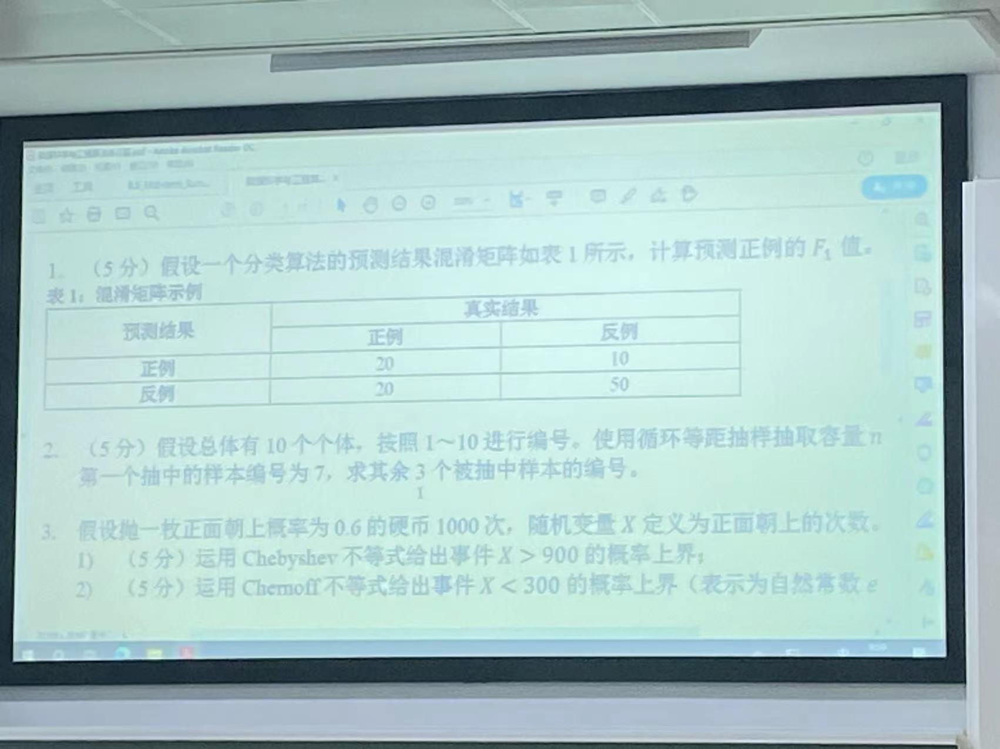

### 1. 绪论

分类问题算法评价指标——召回率，准确率，

*应该不会出题*

R=0.5

P=2/3

F1=4/7

### 2. 抽样算法

系统抽样——直线，圆形

分层抽样——等额，等比例

水库抽样+分布式扩展

非等概率抽样：反例

等概率：直接计算每个个体被抽样概率；数学归纳法

1 2 3 4 5 6 7 8 9 10

10/4 = 2.5->3

(7+3)=10 3 6

### 3. 尾概率不等式

Markov

Chebyshev

Chernoff

Morris

计算概率上界——本身、适用条件

证明——课后练习3

3. 1) X的期望是600

      P(X>900)=P(X-600>300)<P(|X-600|>300)<=240/90000=1/375

      不能默认两侧尾概率相等（严格对称）

   2. P(X<300)=P(X<(1-1/2)*600)<exp(-600\*(1/4)/2)=e^{-75}

上界/3的版本只在（0,1）

$\delta$>1,使用/(2+$\delta$)

通常使用简化后的版本

### 4. 哈希技术

布隆过滤器：当某个元素在的时候总是返回在，也会被误判为在。只有假阳性，没有假阴性

LSH

容量m=10000 元素n=2000 n/m=0.2

1. (1-e^-0.4^)^2^

2. 

### 5. 数据流中频繁项挖掘

相对误差、绝对误差

确定的Misra Gries

基于哈希Sketch

找一个很像的，认出是Count （MIN） Sketch

使⽤指数直⽅图进⾏滑动窗⼝0-1统计

使用FM Sketch统计不同元素个数的方法

*mod4

123021

(1,3)-2 (1,0)+2 (1,)

(2,3)-2 (2,1)+2

(3,0)-2  (3,3)-2

取中位数，给出计算过程，第二组哈希函数有冲突

count-min sketch只要有一组没有哈希冲突，就能得到正确结果

### 7.随机游走

