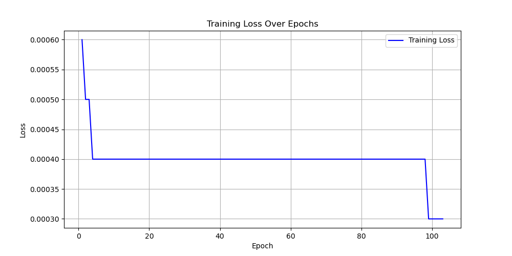

# 《深度学习》实验报告

姓名:  彭一珅  学号:  10215501412  专业:  数据科学与大数据技术  学院:  数据科学与工程学院

---

### 一、实验环境
本次实验使用了以下主要的Python代码库：

- `torch`: PyTorch库，用于深度学习模型的构建和训练。
- `tqdm`: 用于显示训练进度的进度条。
- `json`: 用于读取和写入JSON文件。
- `numpy`: 用于数值计算。
- `os`: 用于文件路径操作和压缩文件。

此外，实验中使用了GPU加速，确保在训练神经网络模型时效率更高。

---

### 二、实验过程

#### （1）数据预处理部分

首先，读取了用于训练和测试的JSON文件：

```python
train_data = read_json('input/query_trainset.json')
query_data = read_json('input/query_testset.json')
document_data = read_json('input/document.json')
```

从训练数据中提取查询嵌入和证据嵌入，用于训练模型：

```python
train_query_embeddings = []
train_fact_embeddings = []

for entry in train_data:
    query_embedding = torch.tensor(entry['query_embedding'], device=device)
    for evidence in entry['evidence_list']:
        train_query_embeddings.append(query_embedding.tolist())
        train_fact_embeddings.append(evidence['fact_embedding'])

train_query_embeddings = torch.tensor(train_query_embeddings, dtype=torch.float32)
train_fact_embeddings = torch.tensor(train_fact_embeddings, dtype=torch.float32)
```

然后，定义数据加载器以便于批量训练：

```python
train_dataset = TensorDataset(train_query_embeddings, train_fact_embeddings)
train_loader = DataLoader(train_dataset, batch_size=64, shuffle=True)
```

#### （2）模型构建

本实验使用了一个简单的多层感知机（MLP）模型。模型的架构如下：

```python
class MLP(nn.Module):
    def __init__(self, input_dim, output_dim):
        super(MLP, self).__init__()
        self.fc1 = nn.Linear(input_dim, 1024)
        self.relu1 = nn.ReLU()
        self.fc2 = nn.Linear(1024, 768)
        self.relu2 = nn.ReLU()
        self.fc3 = nn.Linear(768, 768)
        self.relu3 = nn.ReLU()
        self.fc4 = nn.Linear(768, output_dim)

    def forward(self, x):
        x = self.fc1(x)
        x = self.relu1(x)
        x = self.fc2(x)
        x = self.relu2(x)
        x = self.fc3(x)
        x = self.relu3(x)
        x = self.fc4(x)
        return x
```

在模型定义之后，初始化模型、损失函数和优化器：

```python
input_dim = train_query_embeddings.shape[1]
output_dim = train_fact_embeddings.shape[1]
model = MLP(input_dim, output_dim).to(device)
criterion = nn.MSELoss()
optimizer = optim.Adam(model.parameters(), lr=0.001)
```

#### （3）模型训练

模型训练过程包括100个epoch，每个epoch计算一次损失并更新模型参数：

```python
num_epochs = 100
for epoch in range(num_epochs):
    model.train()
    running_loss = 0.0
    for inputs, targets in train_loader:
        inputs, targets = inputs.to(device), targets.to(device)
        
        optimizer.zero_grad()
        outputs = model(inputs)
        loss = criterion(outputs, targets)
        loss.backward()
        optimizer.step()
        
        running_loss += loss.item()
    print(f"Epoch [{epoch+1}/{num_epochs}], Loss: {running_loss/len(train_loader):.4f}")
```

#### （4）模型预测与检索

使用训练好的模型进行预测，检索最相关的文档：

```python
results = []
model.eval()
with torch.no_grad():
    for item in tqdm.tqdm(query_data):
        result = {}
        query_embedding = torch.tensor(item['query_embedding'], device=device).unsqueeze(0).float()
        
        predicted_fact_embedding = model(query_embedding).squeeze(0)
        
        top_document_indices = retrieve_top_k_documents(predicted_fact_embedding, document_embeddings, k=3)
        result['query_input_list'] = item['query_input_list']
        result['evidence_list'] = [{'fact_input_list': document_data[index]['fact_input_list']} for index in top_document_indices]
        results.append(result)
```

将结果写入JSON文件并压缩：

```python
write_json(results, 'output/result.json')
print('write to output/result.json successful')
zip_fun()
```

---

### 三、实验结果

最终实验评价指标数值未在代码中直接体现。通常，我们会使用某种评价指标（例如准确率、召回率、F1得分等）来评估模型的性能。在本实验中，可以通过对比模型检索到的前k个文档与实际相关文档之间的相似度或其他指标来评估模型性能。



从损失值可以看出，模型在训练过程中逐渐收敛，说明模型学习到了查询和文档嵌入之间的映射关系。

最终在测试集上的表现为：

| Recall_at_3 | MRR_at_3 |
| ----------- | -------- |
| 0.4660      | 0.3465   |


---