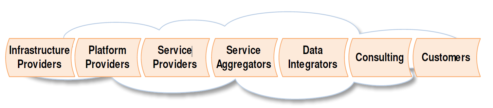
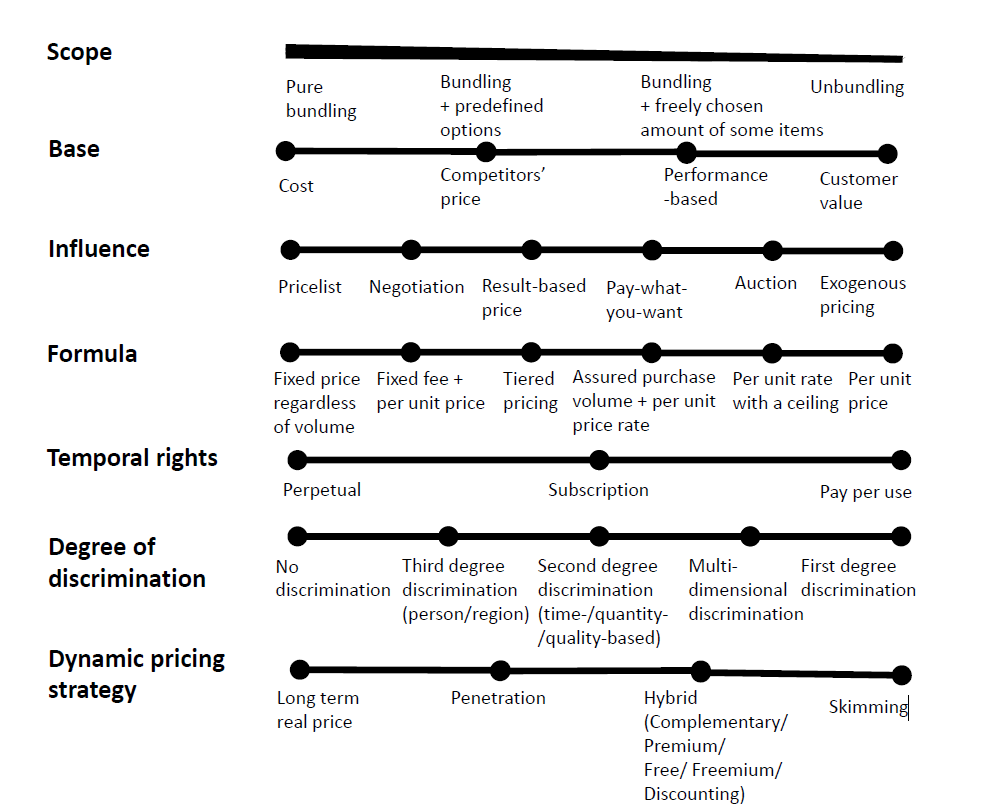

# 云服务的数据定价模型分析

数据科学课程 社会计算期中作业

10215501412 彭一珅

## 一、引言

云服务是近年来发展迅速的技术之一，受到工业与学术各界的广泛关注。云计算服务是指通过互联网，以按需、易扩展的方式给用户分配计算资源的服务。云计算提供商向其客户提供多种类型的服务，包括基础设施即服务（IaaS）、平台即服务（PaaS）、软件即服务（SaaS）、存储即服务（STaaS）、安全即服务（SECaaS）、测试环境即服务（TEaaS），凡是用户无需下载其他软件，而直接通过互联网就能访问的所有基础架构、平台、软件或技术都可以视为云计算服务。这些服务在如今的社会中，正在给越来越多的个人和组织提供资源，而诸如阿里云、腾讯云等大规模云计算平台越来越多的兴起，云计算资源交易活动催生出复杂的产业链，其中的主体包括基础设施提供者、平台提供者、服务提供者，服务聚合器、数据集成商、顾问、客户[1]。在这一背景下，云计算资源的各个服务层互相之间的供给关系，以及全球贸易的需求，要求云服务具有相对稳定可靠的定价方式。规则明确的定价策略可以对用户的消费行为产生积极影响，也可以成为各大云平台竞争的战略工具。

云计算服务的定价是数据定价问题的一部分。数据有许多不同的方面，因此数据的价格也有着不同的含义。对于数据传输，用户针对传输的质量、数据的存储方式、传输的数据量等进行支付；对于数字化产品，用户对购买的数据内容进行支付；对于数据产品，用户对基于海量数据实现的功能进行支付。其中，云资源的使用涉及到数据的存储、处理和传输，因此可以根据数据定价的基本方法来研究云服务的定价模式[2]。

数据定价的准则包括以下几个方面[3]：

- 收入最大化

  在云计算的定价活动中，卖家的目标是将自己的收入最大化，而买家倾向于以较低的价格买入数据商品。对于传统产品而言，当每新增一单位的产品，所带来的总成本的增量是边际成本，传统产品在边际成本等于边际收益时达到卖家收入最大化，而数据产品的边际成本几乎为0，因此该规则不适用于数据产品。

  数据产品的收入最大化通常是通过最优化问题的思路来解决的。

- 真实性

  在数据交易过程中通常假设交易双方都是利己的，对于买家和卖家来说，他们虚报价格和需求都不会产生更多的收益，在此前提下，可以制定拍卖模型来解决数据定价的问题。

- 公平性

  在云资源的出售过程中，云资源通常来自不同贡献者，为了确保卖家出售数据的积极性, 云交易平台需要保证总收入在所有数据贡献者中按其贡献公平分布，这样数据市场对于贡献硬件资源的service providers才是公平的。

- 无套利

  套利就是买家通过某种手段，按照低于标价的价格获取数据产品。这要求云计算资源提供者提供多个版本的产品时，需要合理设置标价，防止用户通过购买总价便宜的产品，实现购买较贵产品的同等效果。

- 隐私保护

  在数据交易中，交易链条上提供资源和购买资源的各方隐私保护性都较为脆弱，因此在提供云服务的过程中，需要将用户上传的数据进行严格的隔离，在用户不再使用云资源时对敏感的数据集内容进行清除或注入噪声，降低隐私泄露的风险。此外，对于容易泄露隐私的产品，需要在价格上作出补偿。

- 计算高效

  云服务通常涉及大量的参与者和商品。为了有效管理这些参与者和商品之间的定价关系，需要使用计算高效的方法来确保定价模型的可行性和可扩展性。定价模型应该能够在多项式时间内计算价格，以确保在实践中能够应对大规模的参与者和商品。如果定价函数的计算时间是指数级的，那么在处理大规模数据时会面临严重的效率问题。

本文对当前云服务定价模型的设计进行了广泛的探讨和研究，并尝试对现有的定价策略归类整理，评估它们与数据定价基本原则的契合度，并对云计算定价的研究前景进行展望，为未来云计算服务运营商选择合适的定价模式提供理论依据。

## 二、云服务定价模型

目前学术界根据各大企业在发展初期就制定的定价策略，对云服务定价的模型进行了深入研究。云计算服务的定价机制可以分为固定定价和动态定价两种。固定定价主要包括按使用量定价和认购定价两种，其次还有每单位定价策略和分级定价。动态定价机制包括拍卖(auction)式动态定价、议价(haggle)式动态定价、比价(bidding)交易式动态定价和交换(exchange)式动态定价。

李玥等人[8]比较了IaaS云服务的固定定价、动态定价两种方式，通过仿真实验研究得出，动态定价机制更能为IaaS 云服务提供商带来更多收益，同时IaaS 云服务提供商可以通过改变服务等级和资源价格等相关参数，改变顾客行为，使顾客数量增加，从而提高收益。

### 固定定价

云服务的定价起初采用的更多是固定定价策略，固定定价策略是指云服务价格计算是固定不变的，例如徐亮等人[5]提出依据云服务提供者购买的内存、硬盘等设备的成本进行定价。这类定价策略简单直观，易于理解，但未考虑资源的占比问题，不能通过价格调节市场需求。

按使用量定价也被称为“按需定价”或“付费即用”。在这种定价模式下，客户只需支付实际使用的资源量，而不需要提前支付固定费用或签订长期合约。按使用量定价通常以时间单位（如小时、分钟）计量客户对资源的使用，并根据实际消耗的资源量计算费用。

认购定价也称为“预留实例”或“预付费定价”。在认购定价模式下，客户可以提前向云服务提供商支付一定金额，以换取未来一段时间内的资源使用权。客户可以选择购买一定数量或类型的资源，并在预付费的基础上获得一定的折扣或优惠。

吴良刚等人[6]对比研究了以上这两种常见的定价机制，发现在同质消费者情况下，云服务商更倾向于选择认购定价以获得更多利润。对于异质消费者，包括高端、低端和高需求、低需求消费者，认购定价通常优于按使用量定价，但取决于具体情况。

### 动态定价

与之相对应的，动态定价策略是指商品或者服务的价格会随着用户的需求而变化的定价机制。影响价格变化的因素包括用户的价格预期，以及用户对服务质量的要求。云服务提供者根据客户的各种信息综合来进行定价，在供需双方之间找到一个利益的平衡点。动态定价策略能够调动云服务交易链条上各方的积极性，优化资源获得更高的利润。

#### 拍卖式动态定价

拍卖(auction)的基本过程是云服务提供者向潜在的买方提供数据产品和服务，而多个买方在一定时间内出价，由拍卖方从所有出价中选取最高价。这是一种基于经济学的定价策略，依靠市场如供需关系、市场类型等经济学方法来确定数据价格，主要考虑市场类型和参与人行为对价格产生的影响。

拍卖定价机制通过竞争性竞拍确定价格，可以使卖方在潜在用户中取得最高价格，从而实现数据定价的收入最大化原则。此外，通过博弈论等理论方法的支持，可以使参与者在不进行欺骗的情况下才能获取最大利益，从而保证了数据定价的真实性。

张俊[7]等人将竞争环境中的定价问题建模为Stackelberg博弈模型，设置了多个领导者和追随者，并尝试求解纳什均衡解，然后利用马尔科夫模型预测下一时刻云服务商采取特定决策的概率。在Stackelberg博弈模型中，拍卖师（领导者）首先确定定价策略，而追随者（竞拍者）则根据这个定价策略来做出决策。这种模型类似于拍卖中拍卖师根据竞拍者的反应来调整价格的过程。

马小龙[12]等人研究基于组合双向拍卖和信任的多云计算资源分配与定价算法，从价格和信任两方面来衡量云计算资源提供商的“综合竞争力“，激励综合竞争力高的云资源提供商获得更多的效用。

#### 议价式动态定价

议价(haggle)由买方和卖方直接谈判，根据用户的需求进行数据服务的提供。议价式动态定价通常发生在面对特殊要求或定制产品时，这些产品的价值和条件会因买方的需求而异。议价机制可以建立更紧密的买卖关系，并且更灵活地适应各种情况，但也可能导致较长的谈判过程。

议价定价机制可以一定程度上保证双方的利益最大化，而谈判的过程中双方可以提出对价值和需求的真实评估。这种方法最需要解决的问题是议价不够高效的问题。

Gabriella Laatikainen, Arto Ojala, and Oleksiy Mazhelis等人评估了SBIFT在云服务定价上的表现，提出了一种基于SBIFT模型的云服务定价方案[4]，在SBIFT模型的基础上加入了Degree of discrimination和Dynamic pricing strategy两个维度，这个定价框架帮助云服务提供商明晰他们的定价策略，并使有关云服务价格的谈判更加高效。

殷秀叶[9]等人提出了一种基于刺激措施的定价方法，通过历史资源使用情况预测资源用量，从而制定一个预定价格，并通过盈利计算来决定是否对客户进行资源空闲时段的免费赠送，一方面激励了客户使用供应商的资源，增强供应商的市场竞争力，另一方面避免了资源的浪费。殷秀叶[10]等人还建立了针对云服务提供方和消费方的服务定价模型CSP、CSC，和动态价格效应函数．通过构建云计算仿真平台进行验证，证实了在云服务预定协商机制中运用该模型和效应函数可以产生较快的协商速度，并取得较高的效应值。

#### 比价交易式动态定价

比价(bidding)交易指的是买方在市场上发布对产品和服务的需求，而云平台根据这些需求提供自己的报价。比价式动态定价允许卖方根据买方的需求提交报价，这符合收入最大化的目标。报价过程是公开的，买方可以看到所有卖方的报价，确保了交易的真实性和透明度。此外，为保证公平性，所有卖方有机会提交报价，买方可以从多个选择中选择最优的报价。

李琪[11]等人基于双边市场理论探究了在竞争性云服务市场中，平台采用两部收费的定价方式下的定价策略。陈冰清[13]等人考虑了网络带宽的影响，并在不同的用户服务质量需求下，建立动态定价模型。章瑞[14]等人通过研究云计算服务市场的特征和使用Hotelling模型，探讨了云计算服务市场中不同定价方式的运营商在两阶段竞争中应该采取的定价策略。他们设计了一种竞争性的比价机制，即运营商根据市场特征和Hotelling模型来确定报价，从而最终确定定价策略。

#### 交换式动态定价

交换(exchange)机制允许双方直接进行产品和服务的交换。由于是直接交换产品或服务，很难进行套利操作。这种交换机制也可以很好地保证云服务供给者和购买者双方的隐私。交换式动态定价通常是相对高效的，因为双方直接交换产品或服务，不需要涉及货币交易和定价谈判。

## 三、结论和未来方向

在对云服务定价模型进行深入研究后，本文得出一些关键结论和未来研究方向的展望。技术进步，尤其是自动化和人工智能技术的应用，在未来可能会对云服务定价模型产生显著影响。这些技术能够提高定价策略的效率和准确性，使定价模型更加智能化和个性化，更好地满足用户需求。 市场的变化，包括新兴市场的崛起和竞争者的加入，将为云服务定价模型带来新的挑战和机遇。这要求定价模型能够灵活调整，适应市场动态和用户需求的变化，同时保持开放和透明的定价机制。 

云服务定价模型的研究能帮助服务提供商更有效地制定定价策略，提升市场竞争力和盈利能力。同时，用户更深入地理解定价模型，可以指导其在购买云产品时做出更明智的选择。

## 四、参考文献

[1]Mazrekaj A, Shabani I, Sejdiu B. Pricing schemes in cloud computing: an  overview[J]. International Journal of Advanced Computer Science and  Applications, 2016, 7(2): 80-86.

[2]Pei J. A survey on data pricing: from economics to data science[J]. IEEE Transactions on knowledge and Data Engineering, 2020, 34(10):  4586-4608.

[3]蔡莉,黄振弘,梁宇,等.数据定价研究综述[J].计算机科学与探索,2021,15(09):1595-1606.

[4]Laatikainen G, Ojala A, Mazhelis O. Cloud services pricing  models[C]//Software Business. From Physical Products to Software  Services and Solutions: 4th International Conference, ICSOB 2013,  Potsdam, Germany, June 11-14, 2013. Proceedings 4. Springer Berlin  Heidelberg, 2013: 117-129.

[5]徐亮,郑鹏思.基于成本模型的云服务定价体系研究[J].有线电视技术,2018,25(07):81-83.DOI:10.16045/j.cnki.catvtec.2018.07.023.

[6]吴良刚,周赛军.两种常见的云计算服务定价机制的对比研究[J].计算机应用研究,2016,33(01):122-125.

[7]张俊,王杨.基于马尔科夫和Stackelberg博弈的云服务竞价策略[J].长春师范大学学报,2021,40(06):16-24.

[8]李玥,王念新,葛世伦.IaaS云服务定价机制的仿真研究[J].计算机与现代化,2014,(11):20-26.

[9]殷秀叶,韩秋英.基于刺激机制的云服务定价策略[J].信息技术与信息化,2014,(06):102+101.

[10]殷秀叶,王健,张宏.云服务定价模型与动态价格效应函数[J].周口师范学院学报,2014,31(05):124-127.DOI:10.13450/j.cnki.jzknu.2014.05.042.

[11]李琪,郭树行,戴荣竹.竞争性趋势下云服务动态定价模型[J].科技资讯,2017,15(31):20-22.DOI:10.16661/j.cnki.1672-3791.2017.31.020.

[12]马小龙,刘兰娟.基于组合双向拍卖与信任的多云计算资源分配与定价研究[J].科学技术与工程,2015,15(01):100-105.

[13]陈冰清,郭树行.网络外部性下基于服务质量要求的云服务定价[J].科技资讯,2018,16(03):28-29.DOI:10.16661/j.cnki.1672-3791.2018.03.028.

[14]章瑞,汤兵勇.基于Hotelling模型的云计算服务两期动态定价研究[J].东华大学学报(自然科学版),2015,41(03):392-397.