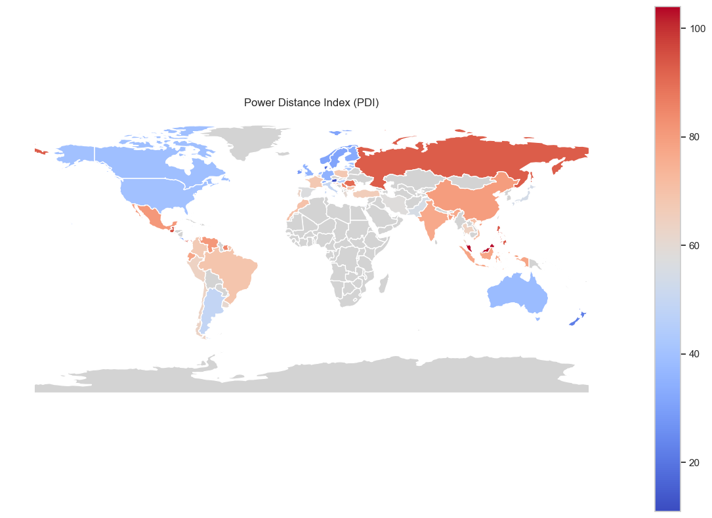
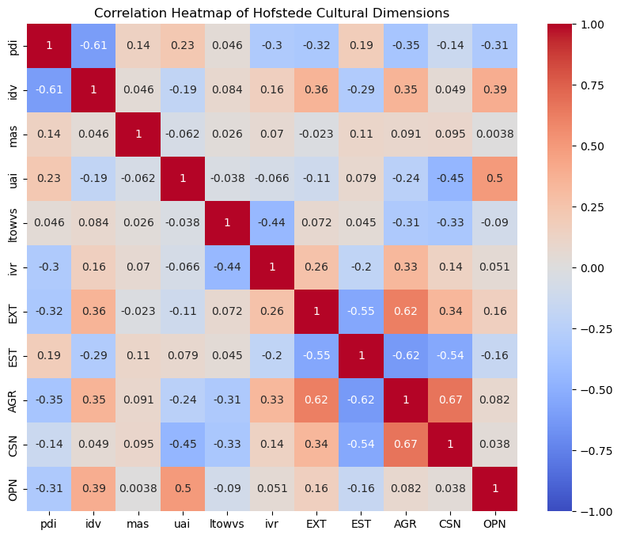
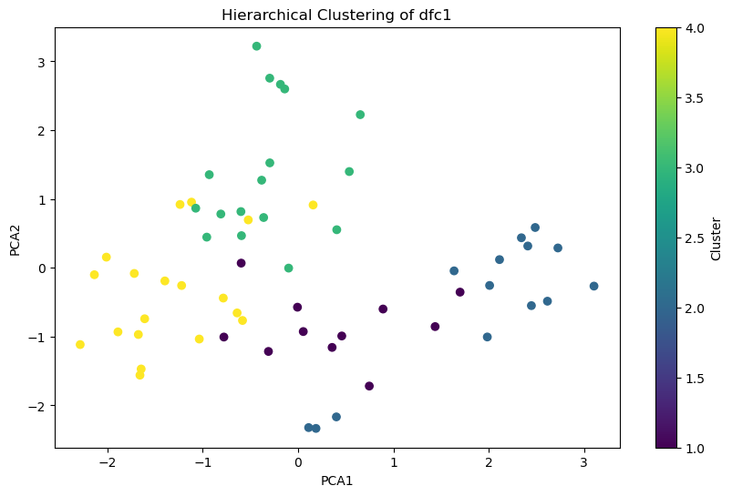
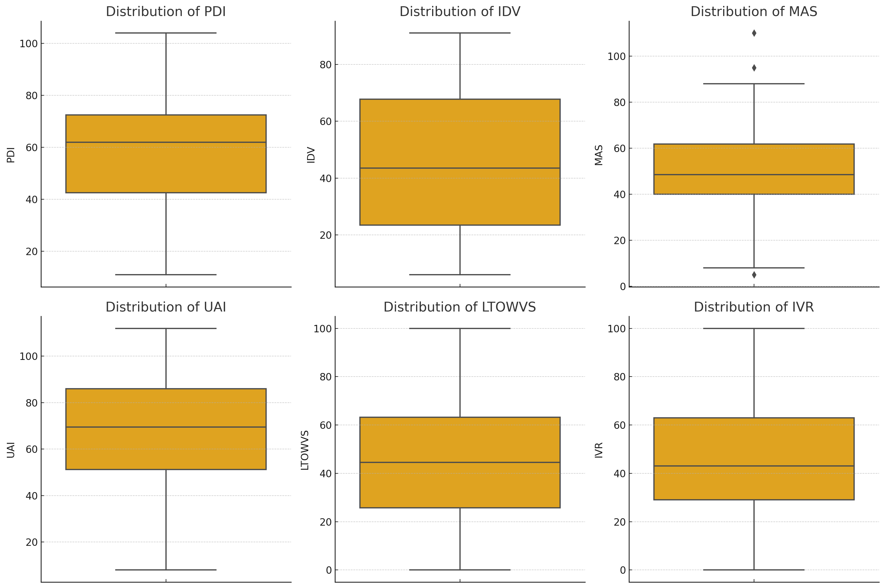

霍夫斯泰德的研究基于民族文化偏好，而不是个人文化偏好。霍夫斯泰德（Hofstede）包括民族文化国家比较量表的六个关键方面，包括：

（问题：文化数据集是如何得到的？霍夫斯泰德文化维度分数是通过对大量跨文化调查数据进行分析得出的。这些调查通常由国际企业的员工、大学生或其他跨文化群体完成。数据收集后，霍夫斯泰德团队使用统计方法对数据进行处理和分析，以得出每个国家在六个文化维度（权力距离、不确定性规避、个人主义与集体主义、男性化与女性化、长期导向与短期导向、放任与克制）上的分数。这些分数帮助比较和理解不同国家文化之间的差异。）

大五人格特质的社会因素亲和性分析

（开头）

有一句名言说的好，人是其社会关系的总和。个体与社会的关系，就如同一幅错综复杂的织锦，正所谓“一方水土养一方人”，包括文化、经济、人口等方面的社会生态影响着我们的性格形成，而性格各不相同的人，也在不同的角度塑造着集体形象。而分析微观人格特质与社会宏观因素的相互关系，挖掘人格与社会的潜在关联，正是社会计算的重要分支。因此，我们的研究项目致力于探讨人群的人格特征与社会文化特征、经济发展、人口数量等宏观指标的关联关系，简而言之，**就是解答了以下问题：什么样的人在什么样的环境下能获得幸福的感受？**这个问题。

（概述我们做了什么）

我们收集并整理了各国用户的大五人格测试结果数据，各国的gdp、人口、文化特征、人民幸福指数等宏观指标数据，并对其进行降维简化处理。根据这些数据，我们深入分析了特定的亲和-匹配适应性模式，归纳总结了其理论内涵。为了直观呈现关键的分析过程和结果，我们还进行了详尽的可视化展示。下面我们将介绍各个指标呈现的历史-社会生态，与大五人格数据的相关性和大五人格对幸福感的影响。

（大五人格数据集介绍）

首先，我们选择了kaggle上的大五人格测试数据集，该数据集是一百万名被试者对于一套有50道选择题的大五人格测试的作答结果。此外，该数据集还记录了被试者答题时所在的国家、被试时间等。大五人格测试包括对被试者

（人口、经济数据集介绍，与大五人格的结合）

人口增长速度快导致：外向性（EXT）高，因为人口增长快的地区通常有更多的社交机会和活动。

经济发展速度快导致：开放性高，经济发展快的地区会迅速且不断地出现新思想和创新活动，因此人们往往更容易接受这些。

尽责性高促进经济发展。高尽责性的人更可能在工作和生活中表现出组织性和自律性，从而提高生产效率和经济表现。

外向性高促进人口增长速度快，外向的人可能更倾向于社交和建立家庭，并在一定程度上影响人口增长速度。

（文化数据集介绍，与大五人格的结合）

为了探究不同国家的文化特点，我们根据霍夫斯泰德文化维度理论，将群体的文化属性归纳为6个指标，并用0-100之间的数值描述民族或国家的文化特征。我们的数据集是从文化维度官网上获取到的。

例如权力距离指数PDI，描述了群体接受和遵从权威的程度。将数据集中国家的PDI指数画在地图上，可以很明显地发现，农耕文明较为发达的地区，如中国、印度、法国等国家，由于有着中央集权的历史传统，普遍有较高的PDI，在这些文化背景下，人们倾向于敬畏权威，相信着上级的领导能力。对于传统的海权文明，如英国及其前殖民地，往往有着较低的PDI，倾向于积极质疑权威。

个人主义指数IDV往往与刚刚介绍的权力指数有较高的负相关性，因为权力集中的社会结构往往会促使个体不仅服从领导者的指示，也会更加服从群体的意见。西方国家受启蒙思想影响，强调个人权利和自由，相反，东方和拉美国家受传统文化影响，会更重视家庭和社区的团结。

MAS表示一个文化的竞争精神和野心。正如我们认知中那样，日本是一个具有强烈进取心的文化，此外，经济发展较快的地区，如中国、美国都有着积极的竞争精神，而以社会福利高、生活“佛系”的北欧国家在这张图上呈现冷色调。

UAI描述了规避不确定性的程度。高UAI国家的法律和规章制度往往更为严格，或者社会处在动荡不安中，因此人们会更加寻求稳定，相反，低UAI国家的人更加灵活变通。UAI使人联想到大五人格中的开放性，事实上它们的相关度也是最高的，低UAI国家的被试者往往有较高的开放性得分。

长期导向动力LTO，描述了人们长远规划的倾向。儒家文化影响较重的地区，通常相当务实、节俭、注重储蓄，对于其他历史悠久的文化，如大部分欧洲国家也是如此。然而，对于建立文明国家历史较短的美洲、大洋洲，或动荡不安的中东、非洲等地区，人们倾向于以短期利益为目标努力。

放纵与克制指数IVR，指社会成员多大程度上愿意控制自身的欲望，这与刚才的长远规划指数也是成反比。放纵指数较高的这些国家耽于享乐，可能会有较高的毒瘾率，较低的国家通常受传统、宗教影响较深，如儒家文化圈和传统天主教国家，会习惯克制自己的欲望。

综合分析6项文化属性与5项人格属性的相关度，可以看到文化属性中的两对负相关（idv与pdi、ivr和lto）是很明显的。而与大五人格相结合，最明显的是外向性人格与不规避风险uai文化特征有较强的相关性。此外，具有规避风险特征的国家（uai），往往会有着高度可靠负责的国民（CSN），他们尽力履行自己的义务，坚守社会规则，意图维持社会稳定；为了适应注重集体主义的国家（idv），人们往往会被塑造出容易相处的合群性格（AGR），同时有较高的开放性和较低的神经质特征，因为集体主义总是需要他们适应与他人密切相处带来的生活变化和情绪波动；放纵的文化属性较高的国家（ivr），相比于严肃、冷漠的禁欲主义，培养出的国民性也是比较友善的（AGR）

接下来我们按照国家的文化特征进行聚类分析，并使用主成分分析降维成二维向量，可视化出来是这样的。四类国家有着较为明显的区分度。具体到6项文化属性，也可以看出每一类国家的得分具有内在的联系。（折线图、散点图）

  
  
  
  

根据文化特征对国家的分类是符合我们的宏观认知的。第一类，包括大多信奉天主教的欧陆文明国家，如法国、意大利等。第二类，包括盎-撒文明的代表：英国及其前殖民地、荷兰、北欧国家等。第三类，包括地中海国家如西班牙、葡萄牙以及受它们殖民统治影响的拉丁美洲国家。第四类，包括中国等东亚、东南亚国家、前苏联成员国、南斯拉夫成员国等。

然后，我们按照这样的宏观分类，对大五人格的测试结果数据进行更深入的分析。（分布密度图）

普遍而言，欧美国家的国民有较强的外向性，因为……，正如拉美国家迭起的军事政变和游行示威活动，他们的激情或许是由神经质的性格（EST）所引发。

（幸福感数据集介绍，与大五人格的结合）

（从心理学和历史社会学角度论证结论产生的原因）

对数据的可靠分析，验证了我们经验性的结论。我们可以很笃定地说出性格形成与社会发展之间密切的内在联系。

权力距离指数（PDI），PDI描述了接受和遵循权威的程度。

日耳曼文化区特别是盎格鲁-萨克森人普遍有着较低的PDI，而发展较为落后的地区有着较高的该指数

个人主义与集体主义（IDV），IDV 衡量人们作为一个团队相互照顾或作为个人照顾自己的程度。

与PDI有较高的负相关性，PDI较高的地区普遍集体主义盛行

可以结合e和i，大五人格的外倾性指标

成就和成功的动机（MAS，以前称为男性气质与女性气质），MAS代表了社会重视的特定价值观，越高越注重完成成就。男性化社会指人们（不论男女）注重成就与完成任务，更富有竞争精神，自信与野心，注重财富和社会资源的积累，而女性化社会则注重人际关系，重视合作，照顾弱者和生活的品质。

发展迅速的地区拥有较高的MAS，同时也与传统历史文化相关

大五人格的宜人性

不确定性规避指数（UAI），UAI描述了各国在多大程度上避免未知。指社会能在多大程度上容忍未来的不确定性。对不确定性规避指数高的社会，会更努力想控制未来的不确定性，习惯照章办事，对非正规的行为诸多限制，在宗教与哲学上倾向相信绝对真理与完整理论；而规避指数低的社会则对变化更顺其自然，习惯变通办事，对非正规的行为不多加限制，在宗教与哲学上倾向相信真理是相对的与经验主义。

传统、保守主义占主流地位的国家有着较高的UAI，通常是一些天主教国家、教权传统浓重的国家。

大五人格的开放性

长期取向与短期规范取向（LTO）最初名为“儒家动力“（Confucian dynamism）。长期导向指生命中的大事发生在未来而不是正在或已经发生，好人善于适应环境，善恶视环境而定而非有普世标准，传统可以随环境改变而非神圣不可更动，重视勤俭储蓄，以及有羞耻心。

中国和天主教国家较高。

放纵与克制（IVR）。IVR指数是一个国家愿意通过推迟即时满足来等待长期利益，或者对享受当下生活没有限制的偏好之间的比较。

可以结合Si和Se的分析

上面的箱线图展示了每个文化维度（PDI、IDV、MAS、UAI、LTO、IVR）的分布情况。通过这些图表，我们可以观察到：

1. **PDI（权力距离指数）**：分布相对广泛，存在一些异常值，表明不同国家的权力距离感受差异较大。
2. **IDV（个人主义指数）**：分布较为集中，大多数国家的IDV值较低，表明更多国家倾向于集体主义。
3. **MAS（男性气质指数）**：分布较为集中，存在一些异常值。
4. **UAI（不确定性规避指数）**：分布相对广泛，存在一些异常值，表明不同国家对于不确定性的规避态度差异较大。
5. **LTO（长期导向）**：分布相对广泛，存在一些异常值。
6. **IVR（享乐主义指数）**：分布相对广泛，存在一些异常值，表明不同国家对于享乐的态度差异较大。

1 蓝色：传统天主教国家，中欧国家

2 绿色：日耳曼蛮子、昂撒人

3 黄色：拉丁美洲国家、西班牙、葡萄牙

4 红色：中国、苏联、越南、社会主义国家

切入角度：各数据集介绍
大五人格特质介绍

方向三
人格特质的社会生态因素亲和性分析
任务描述：
本项任务旨在探讨大五人格等个性心理特征，与自尊、生活满意度、主观幸福感、身体健康等生存发展适应性指标之间的历史-社会生态因素动态关联性。既有研究发现，在不同的微观和中观情境下，人格与适应性指标间关系呈现出不同程度的波动性，这表明人格特征的适应性功能并不发生在“真空”中。人格的各个维度与其所处的微观或中观情境之间存在着特定的匹配适应模式。亲和性假说进一步拓展了这一分析框架，将研究视野扩展到更宏观、更广泛的历史-社会生态因素中，如经济、政治、社会、文化、气候、人口和卫生等；并初步发现，在宏观层面上，人群的人格特征与贫富差距、集体主义-个人主义文化等社会生态因素间存在显著的交互效应，影响宏观人群的整体适应性水平，如国民幸福感、人均寿命等区域健康指标。
本项任务要求利用中国或美国或全球的人格数据集，以及较为典型的历史-社会生态宏观指标数据，分析个体或区域群体水平上的人格维度，与不同历史-社会生态环境因素的匹配适应性模式（选择一种或几种适应性指标皆可），并对其进行可能的理论提炼，以形成关于人格-宏观环境-适应性的综合考察。
任务与测评目标：
(a) 提供基于传统心理测量法或大数据分析所得关键研究指标的信效度信息。
(b)收集和整理典型的历史-社会生态宏观指标数据，并对其进行必要的降维简化处理。
(c) 对特定的亲和-匹配适应性模式进行较深入分析，并做出归纳总结。
(d)对关键的分析过程或结果的模式，进行直观可视化展示。

什么样的人在什么样的环境下会有多高的幸福度？提出假设并验证结论

帮助自我探索

3. 答辩 （不申请优秀可不参加答辩）
    答辩要求：每组12分钟讲述，5分钟老师提问+答辩PPT （答辩后助教收集）
    3000+

什么是共享繁荣？
共享繁荣是一个国家底层40%人口的收入或消费的年均增长率
共享繁荣溢价是最贫穷的40%人口的增长率与整个人口的增长率之间的差额
共享繁荣和共享繁荣溢价是包容和福祉的重要指标，与减少贫困和不平等相关
共享繁荣通过关注最贫困人口相对于整体人口的家庭消费或收入增长来衡量经济增长的包容性程度。它是一个国家最贫穷的40%（底层40%）人口的人均消费或收入的年化增长率。 促进共享繁荣是世界银行集团的目标之一，同时也是消除极端贫困的目标之一。由于该指标监测收入最低的40个国家的进展情况，以及较不富裕的人如何从经济增长中受益，因此即使在极端贫困率低得多的高收入国家，该指标也具有现实意义。[1]新的全球共享繁荣差距也监测着最贫困人口的增长情况。

幸福有多种途径。其预测变量在不同文化中可能存在着效应量上的差异，这体现了文化价值观的作用[27]。西方个人主义文化倡导个人思想和情感的独立，强调自我意识；而在东方文化中，社会规范和集体的需求往往优先于个人[15]。积极的自我(如自尊、自我一致性)与个人主义文化中的幸福更相关（相对于集体主义文化)[15]。而 Schimmack 等人进步通过实证研究发现个人主义-集体主义文化调节了人格(外倾性和神经质)对生活满意度的影响[28]。具体而言，在个人主义文化中外倾性和神经质更能预测生活满意度，本研究结果与其一致。此外，SWB的概念结构和测量工具大多发源于西方个人主义文化背景，可能不完全适合评量集体主义文化中个体的幸福感[16]。未来研究应考虑开发更加适合集体主义文化的幸福感测量工具

经验开放性被认为是一种与想象力、创造性和好奇心密切联系的人格特质[29]。但在中国背景下，开放性的含义与西方个人主义文化既有共通性，也有文化特异性[30]。开放性在中国文化中还包含了社会和人际的含义[30]。根据文化适应假说，当个人特征(个性、价值观、情感)与所处文化所主导的价值观相似时，其幸福感就更容易实现[31]。因此，在强调人际关系和社会交往的中国社会[32]，经验开放性与主观幸福感的联系要比西方个人主义文化更加紧密。此外，中国传统文化特别重视对美(自然风光、诗词艺术等)的欣赏，这是获得SWB的重要来源[1]。而经验开放性被认为与对美的欣赏有着强相关[33，这也可能是中国人的经验开放性与生活满意度相关更高的原因之一。

乱七八糟的，我先在这边写一段。

请以历史事件作为例子，揭示性格和社会之间的内在逻辑关系

EXT外向性：中国和拉美少一些，美国和欧洲多一些

EST神经质：拉美最多，中国次之

AGR容易相处：最高的是英美文化

CSN尽责性：美国人和中国很高，发展慢的地方低

OPN开放性：农耕文化低

人口密度高通常意味着一个地区或城市的居民数量较多，人与人之间的互动更为频繁。以下是对人口密度高可能导致的人格特质变化的逻辑解释：

1. **外向性高**：在人口密集的环境中，人们更有可能参与社交活动和公共生活。社交机会的增多可能促使个体发展出更加外向的性格特征，如更加活跃、乐观和社交性。此外，为了在竞争激烈的社会环境中生存和成功，人们可能需要更加开放和主动，这也与外向性特质相符。
2. **神经质低**：这里的“神经质低”可能指的是在高人口密度地区，人们可能更习惯于应对压力和不确定性，从而表现出较低的焦虑和情绪波动。然而，这并不是一个普遍现象，因为高人口密度也可能带来更高的生活压力，这可能会增加个体的神经质水平。因此，这一点可能需要更多的情境分析和研究支持。
3. **容易相处高**（宜人性高）：在人口密集的环境中，为了维持和谐的社会关系，人们可能更倾向于发展出更高的宜人性，包括合作性、信任和谦逊。在紧密的社会网络中，良好的人际关系对于个人的社会地位和资源获取至关重要，因此，个体可能会更加重视与他人的和谐相处。

