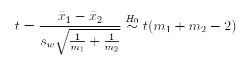

# 第一章 方差分析

## 单因子方差分析

作用：在假设**多组数据**的方差相同的情况下，同时检验这多组数据的均值是否相等

### 二样本独立t检验

假设检验：H0 : μ1 = μ2 vs H1 : μ1 ≠ μ2.

t检验，$s_w^2$合方差估计两组样本相同的方差，符合卡方分布

检验方法：

+ 拒绝域

  在t分布的1-α/2分位数的外面

+ p值

  统计量t的值往两侧这块的概率密度，小于某种概率了已经

### 模型及假设

响应变量：随机变量y

因子：A有几种不同的取值，分别代表每个组 

重复次数：每个组的随机变量个数m

单因子方差分析模型：

+ 前提条件：
  1. 随机误差独立同分布，是均值为0，方差为$\sigma^2$的正态分布
  1. 观测到的所有数据独立并符合正态分布，$y_{ij}\sim N(\mu+\alpha_i,\sigma^2)$
  1. $\sum\alpha_i=0$

+ 均值模型
+ 效应模型

### 检验

平方和分解公式：SST=SSA+SSE

SST是所有的响应变量对于所有的均值的偏差平方和

SSA是组间偏差平方和，如果各组均值相等，那么SSA应该比较小，只受到随机误差的影响

SSE是组内偏差平方和

检验统计量：$F_A=\frac{SS_A/(a-1)}{SS_E/(n-a)}$服从F(a-1,n-a)

### 参数估计

极大似然估计

区间估计

## 多重比较

需要知道哪些水平的均值是不相等的

### 水平均值差的置信区间

### 多重比较问题

### Tukey方法

要解决这个假设检验问题，我们可以使用单因子方差分析模型来建立统计检验。在这种情况下，我们有两组独立的数据，分别为第一组 $x_1, x_2, \ldots, x_m$ 和第二组 $y_1, y_2, \ldots, y_m$。

首先，让我们建立单因子方差分析模型。在这个模型中，我们假设两组数据都来自正态分布，其均值和方差如下：

第一组：$x_i \sim \text{N}(\mu_1, \sigma^2)$，其中 $i = 1, 2, \ldots, m$

第二组：$y_i \sim \text{N}(\mu_2, \sigma^2)$，其中 $i = 1, 2, \ldots, m$

现在，我们要检验的假设是 $H_0: \mu_1 = \mu_2$，即两组数据的均值相等。

接下来，我们构建两个检验统计量分别用于单因子方差分析和二样本独立 t 检验。

**单因子方差分析的检验统计量：** 在单因子方差分析中，我们计算组内和组间的方差，然后比较它们的比率。

- 组内方差（Within-group variance）：$s_w^2 = \frac{1}{2m-2}\left[\sum_{i=1}^m(x_i-\bar{x})^2 + \sum_{i=1}^m(y_i-\bar{y})^2\right]$
- 组间方差（Between-group variance）：$s_b^2 = \frac{m}{2m}\left(\bar{x}-\bar{y}\right)^2$

其中，$\bar{x}$ 和 $\bar{y}$ 分别是两组数据的样本均值。

单因子方差分析的检验统计量 $F$ 定义为组间方差与组内方差的比值：

$F = \frac{s_b^2}{s_w^2}$

**二样本独立 t 检验的检验统计量：** 对于二样本独立 t 检验，我们计算两组数据的均值差，并考虑它们相对于总体方差的标准误差。

检验统计量 $t$ 定义为：

$t = \frac{\bar{x} - \bar{y}}{s_p \sqrt{\frac{2}{m}}}$

其中，$s_p$ 是两组数据的合并标准差：

$s_p = \sqrt{\frac{(m-1)s_x^2 + (m-1)s_y^2}{2m-2}}$

现在，我们来证明单因子方差分析模型与二样本独立 t 检验是等价的。

考虑两个检验统计量之间的关系：

$F = \frac{s_b^2}{s_w^2} = \frac{\frac{m}{2m}\left(\bar{x}-\bar{y}\right)^2}{\frac{1}{2m-2}\left[\sum_{i=1}^m(x_i-\bar{x})^2 + \sum_{i=1}^m(y_i-\bar{y})^2\right]}$

现在，我们将 $\bar{x}-\bar{y}$ 提取出来，并且注意到 $\sum_{i=1}^m(x_i-\bar{x})^2$ 和 $\sum_{i=1}^m(y_i-\bar{y})^2$ 都是两组数据的方差，即 $s_x^2$ 和 $s_y^2$：

$F = \frac{\frac{m}{2m}\left(\bar{x}-\bar{y}\right)^2}{\frac{1}{2m-2}\left[s_x^2 + s_y^2\right]}$

接下来，我们将 $m$ 和 $2m-2$ 因子移到右边：

$F = \frac{1}{\frac{2m-2}{m}} \cdot \frac{\left(\bar{x}-\bar{y}\right)^2}{\frac{s_x^2 + s_y^2}{2}}$

注意到 $\frac{2m-2}{m} = 2$，且 $\frac{s_x^2 + s_y^2}{2} = s_p^2$，其中 $s_p$ 是两组数据的合并标准差。因此：

$F = 2 \cdot \frac{\left(\bar{x}-\bar{y}\right)^2}{s_p^2}$

现在，我们可以看到 $F$ 统计量的形式与二样本独立 t 检验的 $t$ 统计量完全相同：

$F = 2 \cdot \frac{\left(\bar{x}-\bar{y}\right)^2}{s_p^2} = t^2$

因此，我们证明了在这种情况下，单因子方差分析模型与二样本独立 t 检验是等价的。在检验 $H_0: \mu_1 = \mu_2$ 时，两种方法都可以得到相同的结论。

对于给定的数据集，符合不同组重复次数不相等的情况，单因子方差分析模型可以表示为：

**单因子方差分析模型：**
$$
y_{ij} = \mu_i + \epsilon_{ij}
$$
其中，
- $y_{ij}$ 表示第i组的第j个观测值。
- $\mu_i$ 表示第i组的总体均值。
- $\epsilon_{ij}$ 表示第i组的第j个观测值与该组的总体均值之间的随机误差，通常假设满足独立同分布的正态分布，即$\epsilon_{ij} \sim \text{N}(0, \sigma^2)$。

**原假设与备择假设：**
原假设（null hypothesis, H0）和备择假设（alternative hypothesis, Ha）可以表示为：

- 原假设（H0）：各组的总体均值相等，即$\mu_1 = \mu_2 = \cdots = \mu_a$。
- 备择假设（Ha）：至少有一组的总体均值与其他组不同，即$\mu_1 \neq \mu_2 \neq \cdots \neq \mu_a$。

**检验统计量：**
在单因子方差分析中，检验统计量是F统计量，用于比较组间的方差与组内的方差。

F统计量定义为组间均方与组内均方的比值：

$$
F = \frac{MSB}{MSE}
$$
其中，
- $MSB$（Mean Square Between）是组间平方和除以组间自由度：$MSB = \frac{SSB}{DFB}$
- $MSE$（Mean Square Error）是组内平方和除以组内自由度：$MSE = \frac{SSE}{DFE}$
- $SSB$（Sum of Squares Between）是组间的平方和。
- $DFB$（Degrees of Freedom Between）是组间的自由度。
- $SSE$（Sum of Squares Error）是组内的平方和。
- $DFE$（Degrees of Freedom Error）是组内的自由度。

**方差分析表：**
方差分析表包括了计算F统计量所需的各种统计量，它的一般形式如下：

| 来源           | 平方和 (SS) | 自由度 (DF) | 均方 (MS) | F 统计量      |
| -------------- | ----------- | ----------- | --------- | ------------- |
| 组间 (Between) | SSB         | DFB         | MSB       | F = MSB / MSE |
| 组内 (Within)  | SSE         | DFE         | MSE       |               |
| 总 (Total)     | SST         | DFT         |           |               |

在这个表格中，你需要计算每个来源的平方和、自由度和均方。然后，计算F统计量，并使用F分布的临界值来进行假设检验，以确定原假设是否被拒绝。如果F统计量显著，表示至少有一组的均值与其他组不同，即备择假设成立。

在不等重复次数的情况下，平方和分解公式（Sum of Squares Decomposition）与等重复次数的情况有所不同，因为需要考虑到各组的重复次数不同。以下是不等重复次数的平方和分解公式：

1. **总平方和（Total Sum of Squares, SST）**：
   $$
   SST = \sum_{i=1}^{a} \sum_{j=1}^{n_i} (y_{ij} - \bar{y})^2
   $$
   其中，$a$ 是组数，$n_i$ 是第 $i$ 组的观测值数量，$\bar{y}$ 是所有观测值的总体均值。

2. **组间平方和（Sum of Squares Between, SSB）**：
   $$
   SSB = \sum_{i=1}^{a} n_i (\bar{y}_i - \bar{y})^2
   $$
   其中，$n_i$ 是第 $i$ 组的观测值数量，$\bar{y}_i$ 是第 $i$ 组的样本均值，$\bar{y}$ 是所有观测值的总体均值。

3. **组内平方和（Sum of Squares Within, SSE）**：
   $$
   SSE = \sum_{i=1}^{a} \sum_{j=1}^{n_i} (y_{ij} - \bar{y}_i)^2
   $$
   其中，$n_i$ 是第 $i$ 组的观测值数量，$\bar{y}_i$ 是第 $i$ 组的样本均值。

这些平方和分解公式反映了总平方和（SST）是由组间平方和（SSB）和组内平方和（SSE）两部分组成的。组间平方和表示不同组之间的差异，组内平方和表示组内的随机变异。

这些平方和用于计算均方差（MSB和MSE），进而用于计算F统计量来检验各组均值是否显著不同。请注意，不等重复次数的设计需要在计算平方和和自由度时分别考虑每个组的观测值数量不同的情况。