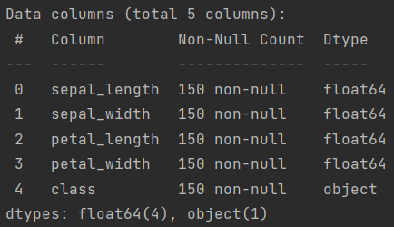
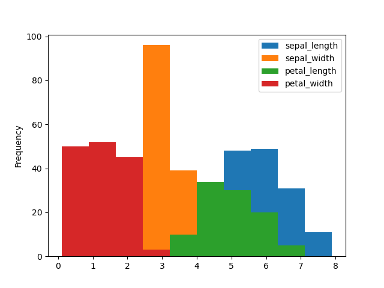
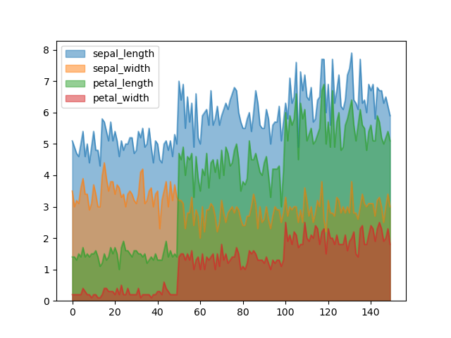
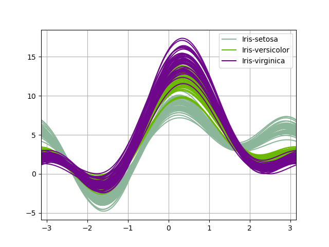
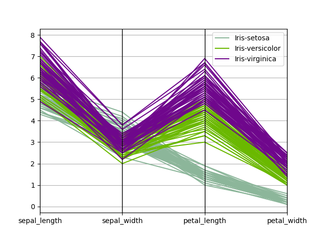

# 实验一 基于UCI数据集练习分类算法的使用

10215501412 彭一珅

### 实验说明：

实验数据：UCI数据集上的分类任务数据

实验任务：任选一种分类算法（逻辑回归、决策树、神经网络、SVM等），采用交叉验证法获得预测准确率

知识点：分类、性能评估、模型选择和评估

### 实验内容：

#### 数据预处理

首先，我选择了UCI数据集上的鸢尾花数据集（iris），这个数据集有4个特征（'sepal_length', 'sepal_width', 'petal_length', 'petal_width'）和3个类别。

首先，读取数据为dataframe格式：

```py
column_names = ['sepal_length', 'sepal_width', 'petal_length', 'petal_width', 'class']

iris_data = pd.read_csv('iris/bezdekIris.data', header=None, names=column_names)
```

然后，使用dataframe的数据分析方法和可视化方法，对数据集的结构有一个宏观的了解：

```py
print(iris_data.shape)
print(iris_data.describe())
print(iris_data.info())
iris_data.plot(kind="hist")
plt.show()
iris_data.plot.area(stacked=False)
plt.show()
from pandas.plotting import andrews_curves
andrews_curves(iris_data,"class")
plt.show()
from pandas.plotting import parallel_coordinates
parallel_coordinates(iris_data,"class")
plt.show()
```

数据集的格式为：`(150, 5)`这说明一共有150条鸢尾花的数据，每条数据有4个维度，剩下1个维度是标签。



可以看到数据中没有空值存在。

然后画出图像：



这里绘制的直方图表示特征列，可以直观看出每一列特征的大致分布。



根据这张图，可以直观看出三种鸢尾花在四种特征上的分层差异，例如，第一种就有长度介于1-2之间的花瓣，而第二种的花瓣长度介于4-5之间（绿色区域）。



以上是安德鲁斯曲线，将每个样本的属性值转化为傅里叶序列的系数来绘制曲线，每一条线表示一朵鸢尾花，鸢尾花的类别用颜色区别。



平行坐标图将鸢尾花各类别在特征上产生的区别直观地表现了出来，可以看到在第一、二个特征上，三种鸢尾花的区别较小，而在三、四特征上，setosa鸢尾花与另外两种的区别很明显。

#### 模型选择

本实验选用线性回归模型来进行鸢尾花数据的分类。

逻辑回归（Logistic Regression）是一种用于二分类问题的统计学习方法。

逻辑回归通过 logistic 函数（也就是 sigmoid 函数）将线性组合的特征映射到[0, 1]的范围内，用于表示观测结果的概率。该函数的公式如下：

$$
P(Y=1) = \frac{1}{1 + e^{-(\beta_0 + \beta_1 X_1 + \beta_2 X_2 + \ldots + \beta_n X_n)}}
$$
其中：
- P(Y=1)是观测结果属于类别 1 的概率。
- e  是自然对数的底。
- \( $\beta_0$, $\beta_1$, $\ldots$, $\beta_n$ \) 是模型的参数。
- \( $X_1, X_2, \ldots, X_n$ \) 是输入特征。

逻辑回归使用交叉熵作为损失函数。模型的参数（权重）通常通过最大似然估计或梯度下降等优化算法进行训练.

在二分类问题中，逻辑回归模型可以根据一个阈值来判断观测结果属于哪一类。当 P(Y=1) 时，预测为类别 1，否则预测为类别 0。

逻辑回归可以扩展到处理多类别分类问题，这时称为多项逻辑回归（Multinomial Logistic Regression）或 Softmax 回归。在这种情况下，模型的输出是多个类别的概率。

#### 模型训练

模型的训练过程如下：

首先，取出特征和标签两个部分：

```py
X = iris_data.drop('class', axis=1)  # 特征(4个维度)
y = iris_data['class']  # 标签
```

将数据集按照2:8的比例，划分成测试集和训练集。

```py
X_train, X_test, y_train, y_test = train_test_split(X, y, test_size=0.2, random_state=42)
```

实例化逻辑回归模型，并使用5折交叉验证进行训练，这种验证方法将数据集分成5个相等大小的折叠（folds），评估每一轮验证的结果，通常使用一些指标如准确率、精确度、召回率、F1分数等。 对5轮的性能指标取平均值，得到最终的性能评估。

```py
# 实例化逻辑回归模型
logistic_model = LogisticRegression(max_iter=1000)
# 交叉验证
cross_val_scores = cross_val_score(logistic_model, X_train, y_train, cv=5, scoring='accuracy')
```

5折交叉验证的结果如下：

> Fold 1: Accuracy = 1.0
> Fold 2: Accuracy = 1.0
> Fold 3: Accuracy = 0.875
> Fold 4: Accuracy = 1.0
> Fold 5: Accuracy = 0.9583333333333334
> Mean Accuracy: 0.9666666666666666

可见逻辑回归在鸢尾花数据集的表现非常好，可以得到高于95%的准确率。5折交叉验证能够充分利用有限的数据，提供对模型性能的更稳健估计。每个样本都在验证集中出现一次，减小了数据分布不均匀引起的评估偏差。

最终，将训练集和验证集放在一起训练模型，然后在测试集上进行预测：

```py
logistic_model.fit(X_train, y_train)
y_pred = logistic_model.predict(X_test)
```

#### 结果评估

模型在测试集上达到了100%的准确率。

> Test Accuracy: 1.0
> Confusion Matrix:
>  [[10  0  0]
>  [ 0  9  0]
>  [ 0  0 11]]
> Classification Report:
>                   precision    recall  f1-score   support
>
>   Iris-setosa           1.00      1.00      1.00        10
> Iris-versicolor     1.00      1.00      1.00         9
>  Iris-virginica        1.00      1.00      1.00        11
>
>      accuracy                                       1.00        30
>       macro avg        1.00      1.00      1.00        30
>    weighted avg      1.00      1.00      1.00        30

### 参考：

https://blog.csdn.net/2302_76305195/article/details/132143794?ops_request_misc=&request_id=&biz_id=102&utm_term=iris%E6%95%B0%E6%8D%AE%E9%9B%86%E7%94%BB%E5%9B%BE&utm_medium=distribute.pc_search_result.none-task-blog-2~all~sobaiduweb~default-7-132143794.142\^v96\^pc_search_result_base6&spm=1018.2226.3001.4187