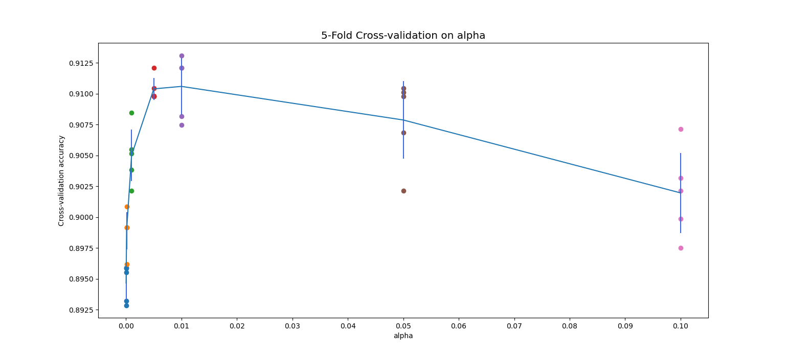
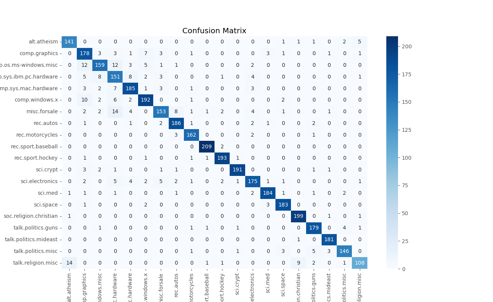

# 实验二 文本分类

10215501412 彭一珅

### 实验要求：

数据：Twenty Newgroups数据

任务：20000个文档分成20类，五重交叉验证结果，不要使用网站上的代码

### 实验内容：

#### 数据预处理

首先，通过sklearn自带的datasets，导入20newsgroups数据集。

```py
news = fetch_20newsgroups(subset="all")
```

然后，根据8:2的比例将数据集划分为训练集和测试集：

```py
x_train, x_test, y_train, y_test = train_test_split(news.data,
                                                    news.target,
                                                    test_size=0.2,
                                                    random_state=42)
```

由于下载的新闻数据是英文文本，因此需要将文本处理成模型训练需要的向量形式。这里采用TfidfVectorizer提取文本特征向量，并在此过程中去除掉停用词。

这段代码将文本数据转换为TF-IDF特征矩阵，其中每一行代表一个文档，每一列代表一个单词，矩阵中的元素表示该单词在文档中的TF-IDF值。TF-IDF（Term Frequency-Inverse Document  Frequency）是一种衡量单词在文档中重要性的方法，它考虑了一个单词在当前文档中的频率以及在整个语料库中的逆文档频率，比起CountVectorizer，TF-IDF能够削减高频却没有意义的词汇的影响。

```py
# 采用TfidfVectorizer提取文本特征向量
# 去除停用词
vec = TfidfVectorizer(analyzer='word', stop_words='english')
x_train_vec = vec.fit_transform(x_train)
x_test_vec = vec.transform(x_test)
```

#### 算法选择

本实验选用朴素贝叶斯进行文本分类任务。朴素贝叶斯法师基于贝叶斯定理和特征条件独立假设的分类方法。对于给定的训练数据集，首先基于特征条件独立的假设，学习输入输出的联合概率分布，然后基于此模型，对于给定输入x，利用贝叶斯定理求出后验概率最大的输出y。

**先验概率 ：**

- 先验概率是指在没有任何观测信息的情况下，某个事件发生的概率。在文本分类中，先验概率即每个类别的文档出现的概率。
- 先验概率的计算公式为：P(Ci)=文档属于类别 Ci 的文档数总文档数P(Ci)=总文档数文档属于类别Ci的文档数
- 在训练过程中，统计每个类别的文档数，然后除以总文档数，得到每个类别的先验概率。

**条件概率 ：**

- 条件概率是指在某个条件下，另一个事件发生的概率。在文本分类中，条件概率即给定一个类别，某个特征（单词）出现的概率。
- 条件概率的计算公式为：P(Fj∣Ci)=类别 Ci 中包含特征 Fj 的文档数类别 Ci 的文档总数P(Fj∣Ci)=类别Ci的文档总数类别Ci中包含特征Fj的文档数
- 在训练过程中，统计每个类别下每个特征的文档数，然后除以该类别的文档总数，得到每个特征在每个类别下的条件概率。

#### 模型训练

在sklearn的朴素贝叶斯估计模型中带有一个参数alpha，alpha表示平滑参数，为了解决概率为0的问题。当某个特征在某个类别下没有出现的情况下，传统的频率计算会导致条件概率为0，此时如果测试数据包含了这个特征，整个文档的后验概率都会为0，影响分类的效果。为了得到更加准确的参数估计结果，alpha应该设置为一个较小的正数。

```py
alpha_list=[1e-5, 1e-4, 1e-3,5e-3,1e-2,5e-2,1e-1]
```

为了验证每一个参数的效果，选出最优参数，需要使用多折交叉验证的方式，将训练集划分为5部分，每一部分轮流做为验证集，验证模型的准确率。

```py
kf = KFold(n_splits=5, shuffle=True, random_state=42)
```

然后就可以开始训练模型了。

```py
for alpha in alpha_list:
    mnb_tfid_stop = MultinomialNB(alpha=alpha)
    accuracies = cross_val_score(mnb_tfid_stop, x_train_vec, y_train, cv=kf)
    accuracies_list.append(accuracies)
    mean_accuracy = accuracies.mean()
    mean_accuracy_list.append(mean_accuracy)

    if mean_accuracy > best_accuracy:
        best_accuracy = mean_accuracy
        best_params['alpha'] = alpha

# 输出最优参数
print("Best Parameters:", best_params)
```

得到最优参数（此时为0.01）之后，使用最优参数和整个训练集重新训练模型，然后在测试集上进行预测：

```py
# 使用最优参数在整个训练集上进行训练
mnb_tfid_stop_best = MultinomialNB(alpha=best_params['alpha'])
mnb_tfid_stop_best.fit(x_train_vec, y_train)

# 在测试集上进行测试
mnb_tfid_stop_y_predict = mnb_tfid_stop_best.predict(x_test_vec)

# 输出分类报告
print("Classification Report:\n", classification_report(y_test, mnb_tfid_stop_y_predict))
```

#### 结果评估

以下是打印出的分类报告，表格的每一行表示一个类别，其中包含该类别的精确率、召回率、F1值和支持数。最后的几行（Accuracy、Macro Avg、Weighted Avg）提供了整体性能的指标。

可以看出，该模型在测试集上表现良好，整体准确率为0.92，各类别的性能指标也相对均衡。

|              | Precision | Recall | F1-Score | Support |
| ------------ | --------- | ------ | -------- | ------- |
| 0            | 0.90      | 0.93   | 0.92     | 151     |
| 1            | 0.81      | 0.88   | 0.85     | 202     |
| 2            | 0.89      | 0.82   | 0.85     | 195     |
| 3            | 0.76      | 0.83   | 0.79     | 183     |
| 4            | 0.89      | 0.90   | 0.90     | 205     |
| 5            | 0.91      | 0.89   | 0.90     | 215     |
| 6            | 0.89      | 0.79   | 0.84     | 193     |
| 7            | 0.92      | 0.95   | 0.93     | 196     |
| 8            | 0.95      | 0.96   | 0.96     | 168     |
| 9            | 0.98      | 0.99   | 0.99     | 211     |
| 10           | 0.96      | 0.97   | 0.97     | 198     |
| 11           | 0.98      | 0.95   | 0.96     | 201     |
| 12           | 0.90      | 0.87   | 0.88     | 202     |
| 13           | 0.96      | 0.95   | 0.95     | 194     |
| 14           | 0.95      | 0.97   | 0.96     | 189     |
| 15           | 0.95      | 0.99   | 0.97     | 202     |
| 16           | 0.93      | 0.95   | 0.94     | 188     |
| 17           | 0.96      | 0.99   | 0.98     | 182     |
| 18           | 0.94      | 0.92   | 0.93     | 159     |
| 19           | 0.92      | 0.79   | 0.85     | 136     |
| Accuracy     |           |        | 0.92     | 3770    |
| Macro Avg    | 0.92      | 0.91   | 0.92     | 3770    |
| Weighted Avg | 0.92      | 0.92   | 0.92     | 3770    |

此外，可以将参数选择的过程进行可视化：

```py
# 参数选择可视化
plt.rcParams['figure.figsize'] = (16.0, 7.0)
for index,k in enumerate(alpha_list):
    accuracies = accuracies_list[index]
    plt.scatter([k] * len(accuracies), accuracies)
plt.style.use('ggplot')
# plot the trend line with error bars that correspond to standard deviation
accuracies_mean = np.array([np.mean(v) for v in accuracies_list])
accuracies_std = np.array([np.std(v) for v in accuracies_list])
plt.errorbar(alpha_list, accuracies_mean, yerr=accuracies_std,ecolor='royalblue')
my_x_ticks = np.arange(0,0.11,0.01)
plt.xticks(my_x_ticks)
plt.title('5-Fold Cross-validation on alpha')
plt.xlabel('alpha')
plt.ylabel('Cross-validation accuracy')
plt.show()
```

从以下图片可以明显看出，取值为0.01的时候，具有最高的平均性能。



并输出混淆矩阵的可视化图片：

```py
conf_matrix = confusion_matrix(y_test, mnb_tfid_stop_y_predict)

# 输出混淆矩阵
print("Confusion Matrix:\n", conf_matrix)

# 使用热图可视化混淆矩阵
plt.figure(figsize=(10, 8))
sns.heatmap(conf_matrix, annot=True, fmt='d', cmap='Blues', xticklabels=news.target_names, yticklabels=news.target_names)
plt.title('Confusion Matrix')
plt.xlabel('Predicted Label')
plt.ylabel('True Label')
plt.show()
```

可以看到模型在测试集的各类别上表现良好，分类错误的现象最高不超过14.




### 实验总结：

在本次实验中，我使用了MultinomialNB朴素贝叶斯分类器对新闻数据进行20个类别的文本分类。通过TfidfVectorizer进行特征提取，并在测试集上评估了模型性能。

实验结果表明模型整体准确率为92%，各个类别的性能指标相对均衡，模型在处理文本数据上表现良好。通过交叉验证选择了合适的平滑参数，提高了模型的泛化能力。

通过本次实验，我对MultinomialNB模型在文本分类中的应用有更深入的理解，以及熟悉了分类报告中的评估指标。未来的改进方向可以尝试其他文本特征提取方法，比如词嵌入，以及进一步优化模型的超参数。这次实验为理解文本分类任务和朴素贝叶斯分类器在其中的应用提供了实践机会，同时也为后续的文本挖掘和分类任务提供了经验积累。