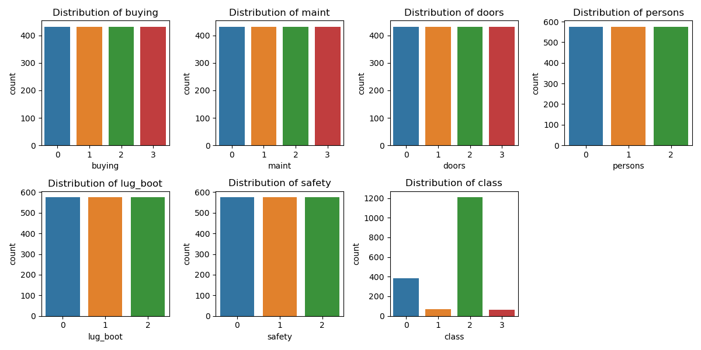
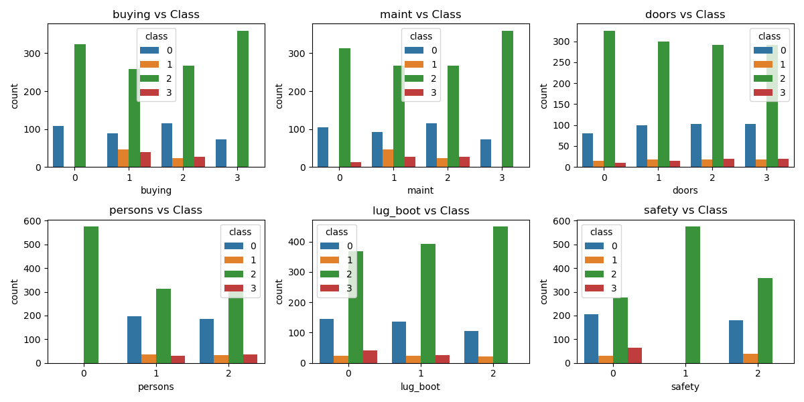
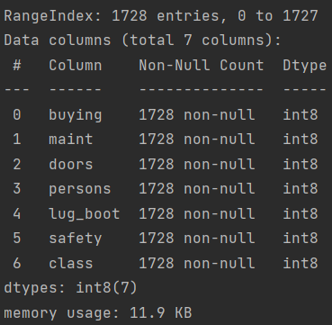
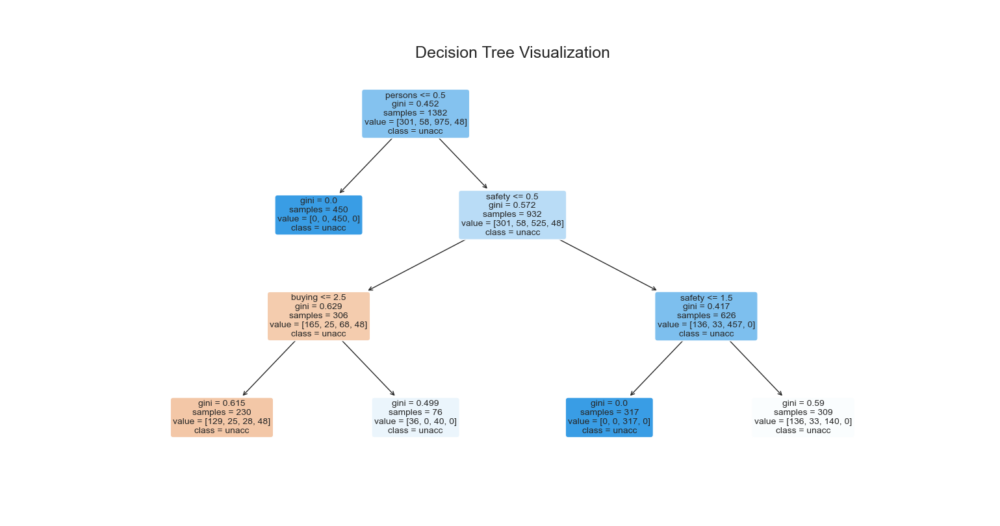
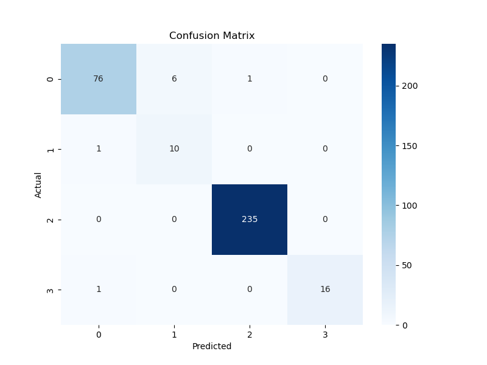
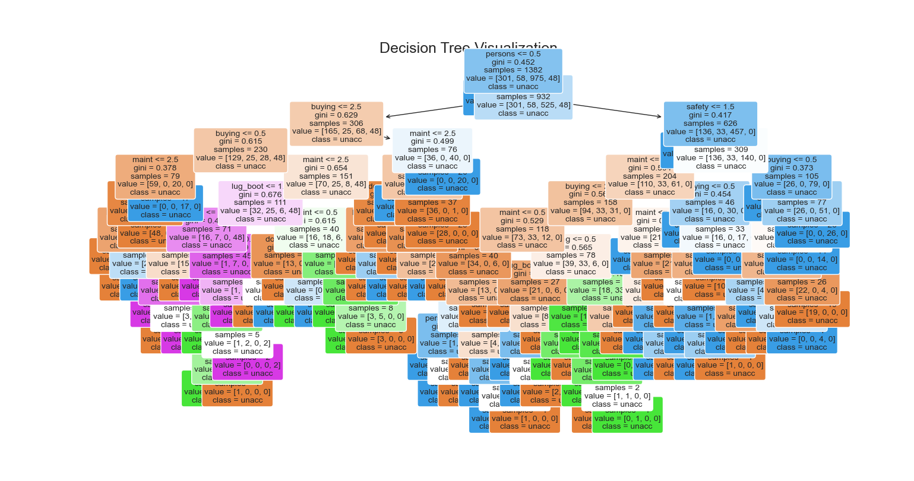

# 实验一 基于UCI数据集练习分类算法的使用

针对UCI数据集上的分类任务数据，任选一种分类算法（逻辑回归、决策树、神经网络、SVM等），采用交叉验证法获得预测准确率。

### 实验过程

#### 1.数据预处理

首先选择UCI数据集中的Car Evaluation 数据集，这是一个用于汽车评估的数据集，包括买家对汽车的评估和购买决策。

这个数据集中的每条数据包含6个特征（"buying", "maint", "doors", "persons", "lug_boot", "safety"）和4个类别。

读取数据集，使用pd存储：

```py
# 读取数据集
url = "https://archive.ics.uci.edu/ml/machine-learning-databases/car/car.data"
columns = ["buying", "maint", "doors", "persons", "lug_boot", "safety", "class"]
data = pd.read_csv(url, names=columns)
```

使用数据可视化方法，更好地理解数据集的特征和分布。

```py
# 将类别型数据转换成数字
data = data.apply(lambda x: pd.Categorical(x).codes)

# 可视化类别分布
plt.figure(figsize=(12, 6))
for i, column in enumerate(data.columns):
    plt.subplot(2, 4, i + 1)
    sns.countplot(x=column, data=data)
    plt.title(f'Distribution of {column}')

plt.tight_layout()
plt.show()
```

画出如下图像：



根据图像可以得到，各特征的分布都很均匀，而分类比较不均匀，其中第1类和第3类数量较多，2和4类数量较少，具有类别间的不平衡问题。

```py
# 可视化类别与目标变量的关系
plt.figure(figsize=(12, 6))
for i, column in enumerate(data.columns[:-1]):
    plt.subplot(2, 3, i + 1)
    sns.countplot(x=column, hue='class', data=data)
    plt.title(f'{column} vs Class')

plt.tight_layout()
plt.show()
```

下图可以表明不同类别的数据在不同特征上的具体表现。但是由于类别间的不平衡，绿色的（第3类）非常凸出。



数据集包含1728行和7列，每列的数据类型为int8，表示8位整数，所有列均无缺失值，每列都有1728个非空值。各列分别代表购车价格、维护费用、车门数量、乘坐人数、行李箱大小、安全性以及车辆评估类别。可以看到数据中没有空值存在。



#### 2.算法选择

本实验选用决策树模型来进行汽车评估数据的分类。决策树是一种基于树状结构的监督学习算法，用于分类和回归任务。它通过对数据集进行递归划分，形成一个树状结构，其中每个内部节点表示一个属性上的测试，每个叶节点表示一个类别（或回归值）。

##### 训练过程：

1. **信息熵和信息增益（用于分类问题）：**
   - **信息熵（Entropy）：** 衡量数据的不确定性，即数据的杂乱程度。对于一个给定数据集D，其信息熵定义为：$$H(D) = - \sum_{i=1}^{c} P_i \log_2(P_i) $$ 其中，$$P_i $$ 是数据集中第i类别的概率。
   
   - **信息增益（Information Gain）：** 表示使用某个属性对数据集进行划分所获得的信息熵减少。决策树算法选择信息增益最大的属性进行划分。信息增益的计算公式为：$$\text{Information Gain}(D, A) = H(D) - \sum_{v=1}^{V} \frac{|D_v|}{|D|} H(D_v) $$其中，A是待评估的属性，V是属性A的取值个数，$$ D_v $$ 是数据集D中在属性A上取值为v的子集，|D| 是数据集D的大小。

2. **基尼不纯度和基尼指数（用于分类问题）：**
   - **基尼不纯度（Gini Impurity）：** 衡量从数据集中随机选择两个样本，其类别标签不一致的概率。对于一个给定的数据集D，其基尼不纯度定义为：$$ Gini(D) = 1 - \sum_{i=1}^{c} P_i^2 $$ 其中，$$ P_i $$ 是数据集中第i类别的概率。
   
   - **基尼指数（Gini Index）：** 表示使用某个属性对数据集进行划分所获得的基尼不纯度的减少。决策树算法选择基尼指数最小的属性进行划分。基尼指数的计算公式为：$$ \text{Gini Index}(D, A) = \sum_{v=1}^{V} \frac{|D_v|}{|D|} Gini(D_v) $$

3. **CART算法（用于分类和回归问题）：**
   - 对于分类问题，CART（Classification and Regression Trees）算法使用基尼指数进行属性划分。
   - 对于回归问题，CART算法使用平方误差最小化进行属性划分。

##### 剪枝：

决策树容易过拟合训练数据，因此需要进行剪枝。决策树的剪枝分为预剪枝和后剪枝两种：

1. **预剪枝：** 在树的构建过程中提前终止分裂过程，可以通过设置树的最大深度、节点包含的最小样本数等参数来控制。

2. **后剪枝：** 先构建完整的决策树，然后通过剪枝操作来减小树的复杂度。剪枝的条件可以是验证集上的性能，即去掉某个节点的子树后验证集上的性能不下降。

#### 3.模型训练

1. 数据预处理

   按照8比2的比例将数据集划分为训练集和测试集，测试集不参与训练，用于最终的模型效果检验。

   ```py
   # 分割数据集为训练集和测试集
   X = data.drop("class", axis=1)
   y = data["class"]
   X_train, X_test, y_train, y_test = train_test_split(X, y, test_size=0.2, random_state=42)
   ```

2. 模型训练

   创建决策树模型，并使用10折交叉验证，验证模型在训练集上的表现。先将max_depth设为较小的值，方便决策树模型的可视化。

   ```py
   # 创建决策树模型
   model = DecisionTreeClassifier(max_depth=3,random_state=42)
   
   # 使用10折交叉验证
   cv_scores = cross_val_score(model, X, y, cv=10)
   
   print(f"Cross-Validation Scores: {cv_scores}")
   print(f"Mean Accuracy: {cv_scores.mean()}")
   ```

   输出准确率：

   > Cross-Validation Scores: [0.63583815 0.6300578  0.8150289  0.6300578  0.75144509 0.72254335
   >  0.8150289  0.71676301 0.78488372 0.71511628]
   > Mean Accuracy: 0.7216763005780347

   在决策树深度不够的情况下，模型过于简单，无法很好地捕捉数据的复杂结构和模式，从而影响了模型的性能。

   可视化决策树代码：

   ```py
   # 可视化决策树
   plt.figure(figsize=(20, 12))
   sns.set(font_scale=1.5)
   plot_tree(model, feature_names=X.columns, class_names=class_list, filled=True, rounded=True, fontsize=10)
   plt.title("Decision Tree Visualization")
   plt.show()
   ```

   

   

   在较为简单的情况下，可以更好地看出决策树在每一步骤对特征作出的选择。其中，叶子节点的4种颜色表示4个分类。

3. 模型评估

   最终，使用没有深度限制的决策树，使用全部训练数据训练模型：

   ```py
   # 训练模型
   model.fit(X_train, y_train)
   
   # 在测试集上进行预测
   y_pred = model.predict(X_test)
   
   # 评估模型性能
   accuracy = accuracy_score(y_test, y_pred)
   conf_matrix = confusion_matrix(y_test, y_pred)
   classification_rep = classification_report(y_test, y_pred)
   ```
   在测试集上的表现如下：
   > Accuracy: 0.9739884393063584
   > Confusion Matrix:
   > [[ 76   6   1   0]
   >  [  1  10   0   0]
   >  [  0   0 235   0]
   >  [  1   0   0  16]]
   > Classification Report:
   >
   > |                  | Precision | Recall | F1-Score | Support |
   > | ---------------- | --------- | ------ | -------- | ------- |
   > | Class 0          | 0.97      | 0.92   | 0.94     | 83      |
   > | Class 1          | 0.62      | 0.91   | 0.74     | 11      |
   > | Class 2          | 1.00      | 1.00   | 1.00     | 235     |
   > | Class 3          | 1.00      | 0.94   | 0.97     | 17      |
   > | **Accuracy**     |           |        | 0.97     | 346     |
   > | **Macro Avg**    | 0.90      | 0.94   | 0.91     | 346     |
   > | **Weighted Avg** | 0.98      | 0.97   | 0.98     | 346     |

结果报告显示了精确度（Precision）、召回率（Recall）、F1分数（F1-Score）和支持量（Support）等评价指标。

模型整体准确率为 97%，在 Class 2 上表现非常好，而在 Class 1 上的表现相对较低，这可能是因为Class2（第三类）的数据量特别大。

以下是预测结果的混淆矩阵，可以看到模型的预测基本准确。



然后附上最优模型的决策树的可视化图片：



### 实验总结

本次实验中，我在Car Evaluation数据集上实现了决策树分类。

首先通过数据预处理和可视化分析了特征分布。随后，利用决策树模型进行分类，并通过10折交叉验证对模型性能进行了评估。在模型的可解释性方面，通过可视化展示了决策树的结构，并通过设置深度来控制模型的复杂度。最后，通过混淆矩阵的可视化对模型在不同类别上的性能进行了详细分析，结果表明决策树在该数据集上表现良好，成功避免了过拟合问题。