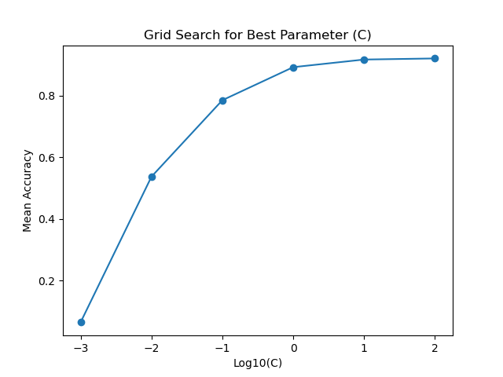

# Project2 文本分类

任务：Twenty Newgroups数据，20000个文档分成20类，五重交叉验证结果，不要使用网站上的代码。

## 1. 数据预处理

### 1.1 数据集加载

首先，我们使用`fetch_20newsgroups`函数加载了包含20个不同主题的新闻组数据集，并选择了其中的全部子集（`subset='all'`）。

```python
newsgroups = fetch_20newsgroups(subset='all')
```

### 1.2 数据集划分

使用`train_test_split`函数将数据集划分为训练集和测试集，其中80%的数据用于训练，20%用于测试。

```python
X_train, X_test, y_train, y_test = train_test_split(newsgroups.data, newsgroups.target, test_size=0.2, random_state=42)
```

### 1.3 文本转特征向量

利用`TfidfVectorizer`将文本数据转换为TF-IDF特征向量。

```python
vectorizer = TfidfVectorizer()
X_train_tfidf = vectorizer.fit_transform(X_train)
X_test_tfidf = vectorizer.transform(X_test)
```

## 2. 算法选择

### 2.1 逻辑回归原理

逻辑回归是一种二分类算法，常用于处理文本分类问题。其原理基于sigmoid函数，该函数将任意实数映射到一个范围在(0, 1)之间的值，用于表示样本属于正类别的概率。

sigmoid函数公式为：

$$ h(z) = \frac{1}{1 + e^{-z}} $$

其中，z为线性模型的输出，计算方式为特征向量与权重的内积加上偏置项。逻辑回归通过最大化似然函数或最小化交叉熵损失来学习模型参数。

### 2.2 参数网格搜索

在实验中，我们使用了网格搜索（Grid Search）结合交叉验证，通过调整逻辑回归模型的正则化参数\(C\)来找到最优参数。参数网格为\[0.001, 0.01, 0.1, 1, 10, 100\]。

## 3. 模型训练

### 3.1 网格搜索和交叉验证

```python
grid_search = GridSearchCV(logreg_model, param_grid, cv=5, scoring='accuracy', verbose=10)
grid_search.fit(X_train_tfidf, y_train)
```

通过`GridSearchCV`进行网格搜索，同时使用5折交叉验证来评估模型性能，5折交叉验证可以将数据集分成5部分，每一部分都作为验证集一次，最后对这5次运行的准确率取平均值，更好地反映每个参数下模型的性能。设置了`verbose=10`参数以显示搜索进度。其中，在C的大小超过1e-1之后，训练速度减慢，且常常超出迭代次数，这是因为正则化参数 C 控制模型的复杂度，较大的 C 值会导致模型更复杂。

### 3.2 最优参数选择

```python
best_C = grid_search.best_params_['C']
```

根据网格搜索的结果，选择得到的最优参数C=100。

### 3.3 模型训练

```python
logreg_model_best = LogisticRegression(C=best_C)
logreg_model_best.fit(X_train_tfidf, y_train)
```

使用最优参数训练最终的逻辑回归模型。

## 4. 结果评估

### 4.1 验证集准确率可视化

```python
plt.plot(np.log10(C_values), mean_scores, marker='o')
plt.xlabel('Log10(C)')
plt.ylabel('Mean Accuracy')
plt.title('Grid Search for Best Parameter (C)')
plt.show()
```

通过可视化每个参数得到的验证集准确率，可以清晰地了解模型在不同参数下的表现。通过下图可以看出，c=100时模型在训练集上预测效果最好。



### 4.2 测试集性能评估

```python
y_pred = logreg_model_best.predict(X_test_tfidf)

accuracy = accuracy_score(y_test, y_pred)
report = classification_report(y_test, y_pred, target_names=newsgroups.target_names)
```

在测试集上进行预测，并计算准确率和生成分类报告，提供了对模型整体性能和每个类别性能的详细评估。

> Best C: 100
> Accuracy: 0.92
>
> Classification Report:
>
> |                          | Precision | Recall | F1-Score | Support |
> | ------------------------ | --------- | ------ | -------- | ------- |
> | alt.atheism              | 0.92      | 0.93   | 0.92     | 151     |
> | comp.graphics            | 0.84      | 0.89   | 0.86     | 202     |
> | comp.os.ms-windows.misc  | 0.89      | 0.87   | 0.88     | 195     |
> | comp.sys.ibm.pc.hardware | 0.76      | 0.79   | 0.78     | 183     |
> | comp.sys.mac.hardware    | 0.91      | 0.90   | 0.90     | 205     |
> | comp.windows.x           | 0.89      | 0.91   | 0.90     | 215     |
> | misc.forsale             | 0.86      | 0.87   | 0.86     | 193     |
> | rec.autos                | 0.92      | 0.95   | 0.93     | 196     |
> | rec.motorcycles          | 0.99      | 0.95   | 0.97     | 168     |
> | rec.sport.baseball       | 0.96      | 0.99   | 0.97     | 211     |
> | rec.sport.hockey         | 0.97      | 0.97   | 0.97     | 198     |
> | sci.crypt                | 0.99      | 0.97   | 0.98     | 201     |
> | sci.electronics          | 0.93      | 0.87   | 0.90     | 202     |
> | sci.med                  | 0.95      | 0.95   | 0.95     | 194     |
> | sci.space                | 0.96      | 0.99   | 0.97     | 189     |
> | soc.religion.christian   | 0.97      | 0.97   | 0.97     | 202     |
> | talk.politics.guns       | 0.94      | 0.95   | 0.94     | 188     |
> | talk.politics.mideast    | 0.99      | 0.98   | 0.99     | 182     |
> | talk.politics.misc       | 0.93      | 0.91   | 0.92     | 159     |
> | talk.religion.misc       | 0.90      | 0.83   | 0.86     | 136     |
>
> Accuracy: 0.92
> Macro Avg: 0.92
> Weighted Avg: 0.92

**实验结果分析：**

1. **全局性能指标：**
   - **准确率 (Accuracy):** 实验得到的逻辑回归模型在测试集上的准确率为0.92，表明模型在对所有类别的分类中取得了较高的整体准确性。

2. **单个类别性能指标：**
   - 通过查看各类别的Precision、Recall、F1-Score等指标，可以更详细地了解模型在每个类别上的表现。
   - 例如，对于`rec.sport.baseball`类别，Precision为0.96，Recall为0.99，F1-Score为0.97，这表明模型在这一类别上有很好的分类性能。

3. **宏平均与加权平均：**
   - 宏平均（Macro Avg）和加权平均（Weighted Avg）提供了整体性能的综合指标。
   - 宏平均计算了每个类别的指标的平均值，不考虑类别的样本大小。
   - 加权平均考虑了每个类别的样本大小，因此更关注在数据集中更大类别的性能。
   - 在这里，宏平均和加权平均的值都是0.92，与整体准确率相匹配，说明模型在各类别上的表现相对均衡。

4. **个别类别分析：**
   - 一些类别（如`rec.sport.hockey`、`sci.crypt`、`talk.politics.mideast`等）的性能非常好，具有高的Precision、Recall和F1-Score。
   - 另一些类别（如`comp.sys.ibm.pc.hardware`、`talk.religion.misc`等）的性能相对较低，可能需要更多的数据或模型调整来改善。

5. **参数选择：**
   - 实验中选择的最优正则化参数 \(C\) 为100，这是通过网格搜索和交叉验证得到的结果。
   - \(C\) 的选择应在综合考虑模型复杂度和性能之间找到平衡。过大的 \(C\) 可能导致过拟合，而过小的 \(C\) 可能导致欠拟合。

## 实验总结

本次实验中，我应用逻辑回归模型进行文本分类。通过数据预处理，算法选择，模型训练和结果评估等步骤，得到最优的逻辑回归模型，并对其性能进行了详细评估。实验结果表明，在所选择的参数范围内，逻辑回归在文本分类任务上表现良好。同时，通过画图进行可视化能够直观地了解模型在不同正则化参数下的性能表现。

