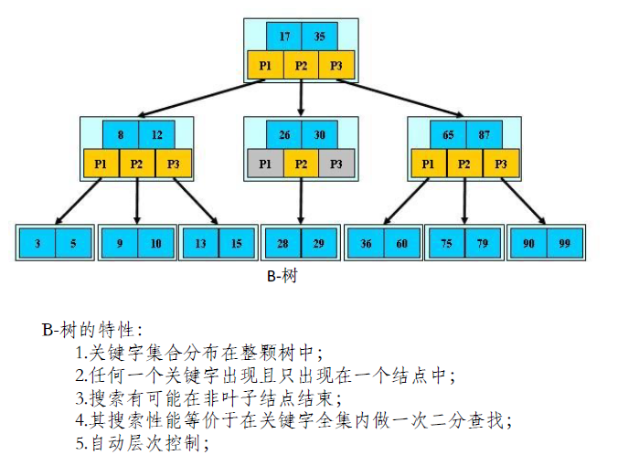
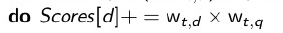

## 自然语言处理期末复习

此提纲要照着ppt看！ppt上讲到的所有内容都包括，但是要结合ppt才能理解一些表述！

自然语言处理是一门包含**计算机科学**、**人工智能**、**语言学**多个领域的交叉学科

自然语言处理的基本任务是**分词**和**标注**

### L3.DictIndex

#### 信息组织-词典及容错式检索

文档：索引的基本单位（与文件的差别：一个文档包含多个文件or一个文件包含多个文档，依赖于句子级检索、段落级检索）

词条：词项在文档中出现的具体实例。词条经过去除停用词，归一化（不同变形，大小写）后得到词项

位置信息索引：记录词所在的文档，以及在文档中的位置。能够处理短语查询和邻近式查询

eg：to这个词出现在第4篇文档的8、16、190、429、433这五个位置

##### 词典

词典：存储词项词汇表的数据结构

词项词汇表：实例化的词典

词项定位：哈希表、树

- 词项数目是否固定或者说词项数目是否持续增长？
  - 固定数目使用哈希表，持续增长使用树，因为哈希表需要**重新哈希分配空间**
- 词项的相对访问频率如何？
  - 高频访问使用哈希表（O(1)），有序访问使用树（O(logn)）n=词汇表大小
- 词项的数目有多少？
  - 哈希表少量数据会增大空间开销

重新哈希的原因：负载因子增大，哈希冲突增加

树的优点：支持前缀查询

##### 通配查询

mon*:b树可以按字母顺序返回mon<t<moo的词项

*mon:将所有词项倒转过来再重复上一步

m*nchen:轮排索引，将查询旋转成nchenm\*的形式，让\*出现在末尾

词汇表：在开头加上$

轮排索引4倍大小

k-gram索引：将词拆成k个字母的组合，对于每个字母组合再建立倒排索引（字母组合-词项）

查询方式：mon*=$m+mo+on，可能返回伪正例moon，然后过滤处理

##### 编辑距离

拼写校正

1. 词独立法
   - 只能检查每个单词
   - 如果拼写错误后变成另一个单词就无法查出来
2. 上下文敏感法
   - 没有以上问题

单词间距离计算

1. 编辑距离

   从s1转换成s2所需要的最少操作步数，操作包括插入，删除，替换，（交换）

2. 带权重的编辑距离

   对不同字符的操作权重不同，可以捕捉键盘输入m替换成n更容易，m替换成q不容易

3. k-gram重叠率

   查找较长公共子串

##### 拼写校正

k-gram索引：最多只有r个k-gram组合不同，判断两个单词为近似

对于一个词，有多个相似的候选词，搜索这些候选词上下文组合的词组，什么样的组合出现次数多就选用哪个

查询库中搜索

##### Soundex

发音相似的单词

基于4-字符缩减形式进行索引和搜索

### L4索引构建

基于排序的索引构建：在硬盘上存储中间结果

外部排序算法：对每个块: (i) 倒排记录累积到10,000,000条, (ii) 在内存中排序, (iii) 写回磁盘，最后将所有的块合并成一个大的有序的倒排索引

每条倒排记录需要12字节(4+4+4: termID, docID, df（文档频率）)

#### BSBI：基于块的排序索引

将文档集分割成几部分，将每部分按照词id-文档id（1.排序 2.全局统一各词的id 3.id化节省空间）的形式排序，将排序好的块写入磁盘，最后合并所有块（合并不占用内存）

全局词典：词id-词字符串，始终放在内存里

#### SPIMI：内存式单遍扫描

只需要扫描一遍所有文档，每个块的词典是独立的，倒排记录表按照词出现的顺序排序，合并时同时合并局部词典和倒排索引

可以压缩词项、倒排记录表

#### 分布式索引构建：mapreduce

倒排器：收集某一分区的所有term,docID对，写入倒排记录表

#### 动态索引构建：随着文档集变化更新索引

新文档有一个辅助索引，查询时搜索两个索引取并集，定期合并两个或多个索引O(T^2^)。删除时使用无效位向量过滤文档们。

对数合并：将最小索引放在内存，其他索引放在磁盘，索引大小分别是1 2 4 8...索引变得过大就放到磁盘并合并，查询（取并集）时间增大O(logT)，但是索引构建时间减少O(TlogT)

### L6文档评分向量空间模型

#### 对搜索结果排序

排序目标：相关性高的排在前面

计算匹配评分方法：jaccard系数（交集/并集）

#### 词项频率TF

词袋模型：不考虑词在文档中的顺序

对数词频

文档-词频的匹配得分是query中出现，且在文档中同时也出现的所有词的对数词频，求和

#### tf-idf计算方式

tf表示词项在文档中的重要程度，idf表示词在整个文档集中是否常见

idf对排序的影响：会将查询里比较常见的词项权重降低（会考）

文档集频率cf（在所有文档里出现t的次数）相差不大，文档频率df（出现的t文档数）相差大，是因为t集中出现在特定几篇文档中

df 和 idf（逆文档频率）比 cf 更适合权重计算，低df的词会更高权重

df：出现t的文档个数

cf：t在所有文档中的出现次数

tf：t在文档d中出现的次数

- df和cf有什么关系? cf大于df，因为词一般在一个文档中不止出现一次
- tf和cf有什么关系? cf是多个文档tf的总和
- tf和df有什么关系? 没关

#### 向量空间模型

每篇文档-词项赋予一个tf-idf权重或对数词频(1+logtf)，每篇文档拥有一个向量，将查询也处理成向量，然后计算相似度（**不建议使用欧氏距离**，是因为欧氏距离对向量长度很敏感，将文档按照其向量和查询向量的夹角大小来排序）

lnc.ltn计算方法：将查询表示为0 1.3 2 3，文档归一化表示为0.52 0 0.52 0.68

而最终余弦值为上述两个向量相乘的点积。

### L7评分计算-精确topK

#### 结果排序的动机

#### 回转长度归一化

余弦归一化倾向于短文档，因为在归一化的时候，文档除以向量范数，同样几个与query对应的词，在短文档中就会有更大的权重。

于是可以先找到一个支点(pivot，平衡点)，然后通过这个支点对余弦归一化操作进行线性调整

#### 结果排序的实现

在倒排索引表中存入tf df

存储是原始的整数词频，而不是对数：实数值不好压缩、一元码编码tf、使用位编码压缩方式，每条倒排记录增加不到一个字节的存储量

精确topk检索：从文档集中所有文档找出k个距离query最近的文档

1. 加速余弦：无权重查询：假设查询词项都只出现1次
2. 对所有文档评分后排序，选出前K个，使用最大堆法
3. 提前终止计算：文档按照pagerank排序，将PageRank和余弦相似度线性组合，检索算法按照pagerank值大小顺序计算，到一定阈值就停止

非精确topK

找一个**文档集合A**，K<|A|<<N，利用A中的top K结果代替整个文档集的top K结果

1. 索引去除

   只考虑那些包含**高idf**查询词项的文档（也就是on the这些都不算）/只考虑包含**多个**查询词项的文档（4个查询词至少包含3个）

2. 胜者表

   对于每个词项，挑出**tf**值最高的r篇文档，检索时，只从多个query词项的胜者表文档的并集中选出topK

3. 静态质量得分排序

   权威度与查询无关

   按照g(d)从高到低将倒排记录表进行排序

   该排序对所有词项的倒排记录表都是一致的

   并行遍历不同查询词项的倒排记录表来进行倒排记录表的合并和余弦相似度的计算

   高分文档更容易出现在前期，可以提前结束

   **g(d)排序结合胜者表**，胜者表中放置r篇g(d)+tfidf最高的文档

   高端表：先遍历高端表，如果达到K个文档直接返回，相当于将索引分层

4. 影响度排序

   对于多词项组成的查询，**按照idf从大到小扫描词项**，在此过程中，会不断更新文档的得分(即本词项的贡献)，如果文档得分基本不变的话，停止

5. 簇剪枝

   随机挑选根号N篇文档为先导者，其他文档依附于先导者，对于查询query先找到最近的先导者，然后从先导者集合中返回

   变形：1.每个追随者可以附着在b1 (比如3)个最近的先导者上 2.对于查询，可以寻找最近的b2 (比如4)个先导者及其追随者

倒排索引不按照docID排序的情形：可以在扫描倒排索引的时候提前结束计算

对每个查询词项，倒排索引中的docID进行累加，

对不包含查询词项的文档，余弦得分为0

可以进一步将文档限制在那些在包含高idf值的非零得分文档

#### 完整的搜索系统

### L9相关反馈

**交互式相关反馈**(Interactive relevance feedback): 在初始检索结果的基础上，通过用户交互指定哪些文档相关或不相关，然后改进检索的结果

显式相关反馈

隐式相关反馈

优点：

- 不需要用户显式参与，可以节省成本
- 可以反映用户兴趣

缺点：

- 准确度不好保证
- 外加设备
- 行为分析模型

伪相关反馈

优点：
• 不用考虑用户的因素，处理简单
• 很多实验也取得了较好效果
缺点：
• 没有通过用户判断，所以准确率难以保证
• 不是所有的查询都会提高效果

文档的质心：

rocchio算法：画一个圈囊括所有的相关文档 排除所有的不相关文档

指向圆心的向量=指向正例质心的向量+（指向正例质心的向量-指向负例质心的向量）

q0：原始查询

qm：修改后的查询

α vs. β/γ 设置中的折中: 如果判定的文档**数目很多**，那么**β/γ可以考虑设置得大**一些，如果计算得到的向量里产生负权重就设为0

相关反馈的假设：

1. 用户词汇表和文档集词汇表相似
2. 对于同一个查询，相关的文档之间内容互相相似，用词有显著的重合率

**查询扩展**(Query expansion): 通过在查询中加入同义或者相关的词项来提高检索结果

基于同(近)义词词典的查询扩展：通常会提高召回率，可能会显著降低正确率

自动构建同义词词典：

1. 上下文共现关系
2. 相同语法关系

### L11概率模型

#### 概率基础知识

乘法公式：P(AB)=P(A)P(B|A)

全概率公式：P(B)=sum(P(Ai)P(B|Ai))

贝叶斯公式：P(A|B)=P(B|A)P(A)/P(B)

#### logistic回归模型

看不懂

#### 二值独立概率模型BIM

——不考虑词项频率和文档长度

BIM的计算过程：

- 求出每个词在查询相关文档里出现的概率和在不相关文档里出现的概率
- 按照多元伯努利分布，求出P(D|R=1)/P(D|R=0)

多元伯努利分布不考虑单词出现的次数，只管出现与不出现。

P(D|R=1)、P(D|R=0)分别表示在相关和不相关情况下生成文档D的概率

出现在查询里就x，没出现在查询里就是(1-x)

#### BM25模型

——考虑词项频率和文档长度