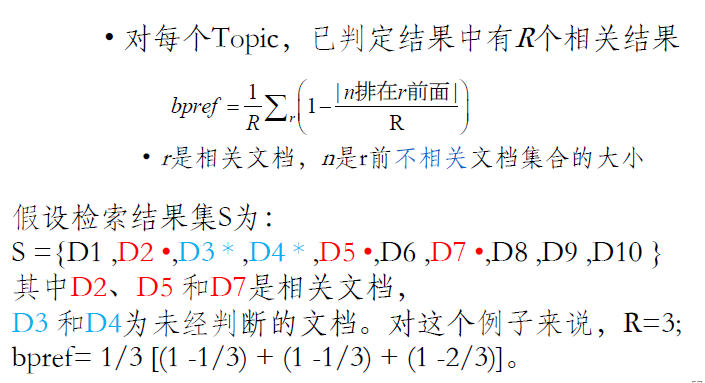

### 第一章 中文信息处理 汉字编码

### 第二章-max-match

GBK编码方式中文占两个字节，英文占一个字节

utf-8是不定长的，根据左侧位1的个数来决定占用了几个字节，中文一般占2-4个字节

| **utf-8可以根据字的第一个字节移位推出长度的** |
| --------------------------------------------- |
| 0xxxxxxx占1个字节                             |
| 110xxxxx 10xxxxxx占2个字节                    |
| 1110xxxx 10xxxxxx 10xxxxxx占3个字节           |
| 11110xxx 10xxxxxx 10xxxxxx  10xxxxxx占4个字节 |

### 第二次课程补充-马尔科夫过程

节点v1=对于节点每条出边，π*(动作带来的效益+v1)

解多元方程

### collins-lm-语言模型-1-32

三元模型

l=每个句子出现的概率log相加，除以总word数，2^-l^

一开始，N是词表大小（包括STOP），每个词出现的概率都是1/N，所以对于一个长度为l的句子，句子出现的概率是（1/N）^l^，因此最终ppl值是N

句子顺序为w2,w1,w3，而句子出现的概率p(s)=1x1/3x1/3x1/3（对于bigram）

### collins-lm-语言模型-补充第二章

### collins-loglinear

### 第三章 马尔科夫随机过程

### 第五章-概率上下文无关文法-collins课件

句法树

### 第五章-PCFG参数估计CKY算法-collins2

### 第五章-词汇化PCFGcollins3-additional material

### 检索-L1

倒排索引

- 词项文档关联矩阵0101，查询and可以对行向量进行按位与操作

布尔查询

- 每次从最小的两个表开始合并
- 

### 检索-L2

词汇表和倒排记录表

文档：待索引文档 词条流 修改后的词条 倒排索引

词项：词条归一化成词项，所有转换为小写

跳表指针

短语查询：

- 双词索引，将短语拆分成基于双词的布尔查询
- 带位置信息索引

### 检索-压缩

### 评价指标

##### 不考虑序（基于集合）

正确率precision

召回率recall：难以计算问题：对多个检索系统查询出的结果人工标注，标注出的相关文档集合作为整个相关文档集合

PR融合：

- F值：2/(1/P+1/R)
- Fβ：表示R的重要性是P的β倍，(1+β^2^)PR/(β^2^P+R)
- E值：E=1-Fβ
- Accuracy不用，因为总结果数目太多，什么也不返回也能得到很高的A

##### 考虑序

P-R曲线

- 计算有序的查询结果集
- 从第一个开始遍历，P的分母一个一个增大，R的分母不变，如果遇到正确结果，分子都+1
- 插值：在不存在10%, 20%,…,90%的Recall点时使用。
- 对于t%，如果不存在该Recall点，则定义t%的P为从t%到100%(>=t%)中最大的P值。

Break Point：P=R的点

11点平均正确率（插值AP）

Precision@N：在第N个位置上的正确率

未插值AP：对所有**应该的相关结果**求和（相关结果集合中位置/返回集合中位置）/相关结果个数

对多个查询评估指标：

宏平均Macro：对每个查询的指标算术平均

微平均Micro：将所有查询视为一个，将最终得到的文档数目求和

MAP：对所有查询的AP求宏平均

bpref=求和（1-前面不相关文档数/相关结果总数R）/R

GMAP：AP的几何平均值，对于那些只有少数查询很好，多数查询不好的时候（方差很大），GMAP会偏低

NDGG归一化折损累计增益：每个文档有相关级别0,1,2,3

对于只重点关注前b个结果的DCG来说，

NDCG=DCG/IDCG

- DCG=求和（reli/log(i+1)）
- IDCG：对于best vector的DCG

### 索引压缩

对每个块都产生独立的词典，倒排记录表不排序，mapreduce合并索引

新文档使用辅助索引

压缩

动机：能将词典放入内存中，倒排记录表减少磁盘存储空间

- 词典压缩
- 倒排记录表压缩

词项统计量：词典大小、词项分布等

词汇表大小是文档集大小的0.5次线性函数，文档集大小是所有文档的所有词的数目 

cfi=第i常见的词在所有文档中出现的次数

cf2=1/2（cf1）

词典压缩

词项长度定长，会造成空间的浪费

单一字符串方法：将整部词典看作单一字符串，这样词的长度不会受限制，然后再用指针指向字符串的位置

- 假设词项有400000个，最大长度为20，文档频率4字节，倒排记录表指针4字节
- 单一字符串长度为8*400000（平均一个词8字节长），指针大小为log(8\*400000)<24位，因此是3字节
- 按块存储：每4个词项用一个指针，然后记录每个词项的长度，4个词项长度用4个字节记录，指针大小3字节

- 前端编码：1e表示去掉一个a换成e，2ic表示去掉一个a换成长度为2的“ic”，3ion表示去掉一个a换成长度为3的“ion”

倒排记录表压缩

- 每个docID使用4字节表示

- 存储docID间隔 

- 可变字节VB码：每个字节高位作为延续位，如果为1说明这个字节是结束字节，不然的话0000...1表示前面这几个字节都是表示同一个数

- 基于位的变长编码γ编码：

  一元码：将n表示为n个1和最后加一个0

  偏移：数字的二进制编码，将首部的1去掉

  γ编码：（二进制编码的长度）和偏移连接起来

  γ编码的长度是2log2G+1位

  γ编码的长度均是奇数，前缀无关

在设计倒排索引时，通常会加入文档频率（Document Frequency，DF）这一指标，有两个主要原因：

1. **权重调整：** 文档频率可以用来调整搜索结果的相关性。通常，出现在更少文档中的词语可能更具有代表性和重要性，因此可以为这些词语分配更高的权重，以提高搜索结果的质量。
2. **优化检索效率：** 通过文档频率，可以提高搜索引擎的性能和效率。根据文档频率，搜索引擎可以优先处理那些包含较少常见词语的查询，因为这些查询可能更具有区分性。这样可以减少需要处理的文档数量，加快搜索速度。