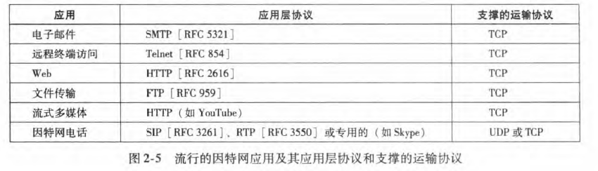
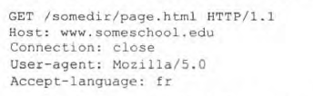
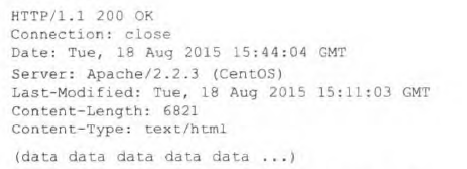
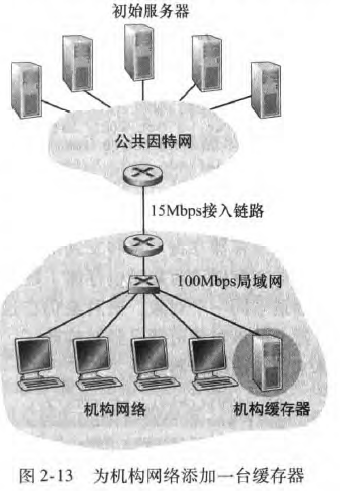
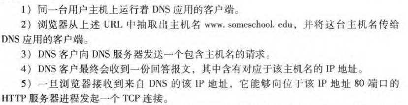
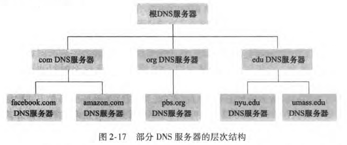
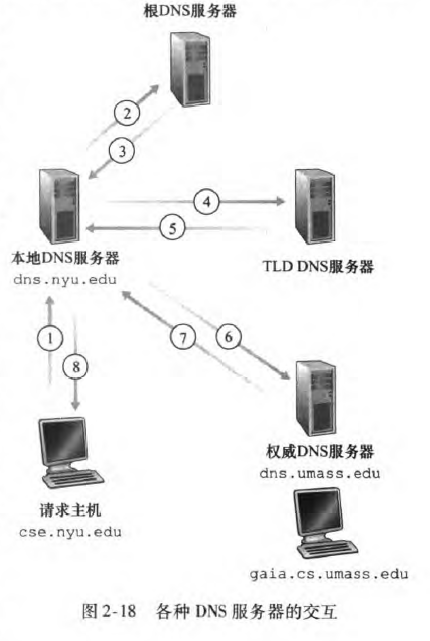
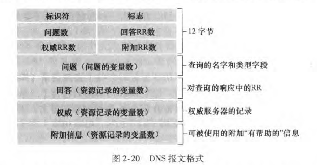

## 2. 应用层

*应用程序所需要的网络服务、客户和服务器、进程和运输层接口*

> web 电子邮件 DNS 对等文件分发和视频流
>
> TCP UDP网络应用程序

### 2.1 应用层协议原理

*运行在不同端系统，通过网络彼此通信的程序*

1. 用户主机
2. web服务器

3. P2P每台主机都有一个程序

#### 2.1.1 网络应用程序体系结构

1. 客户-服务器

   服务器总是打开，服务于来自浏览器（运行于客户主机）的请求。

   服务器具有固定的周知的地址：IP地址

   > Web FTP Telnet 电子邮件

   数据中心配备大量服务器（主机）

2. 对等P2P

   > 流量密集型BT 迅雷
   >
   > 即时通讯应用，服务器跟踪该用户IP地址，报文直接发送

   自扩展性

#### 2.1.2 进程通信

*在不同端系统*

浏览器：客户进程 

web服务器：服务器进程

下载文件：客户进程

上载文件：服务器

套接字软件接口：应用层与运输层接口

寻址：

1. 主机地址

   IP地址：32比特

2. 目的主机中指定接收进程的标识符（接收套接字）

   端口号

   > web服务器：80 SMTP：25

#### 2.1.3 可供应用程序使用的运输服务

运输层能提供的服务：可靠数据传输、吞吐量、定时（延时）、安全性

#### 2.1.4 运输服务

1. TCP

   面向连接，握手，交换运输层信息

   可靠，无差错，按顺序交付字节

   拥塞控制

   SSL：安全套接字层

   用SSL加强后的TCP提供加密，在SSL套接字之间传输的是加密数据，SSL传递给接收进程明文

2. UDP

   最小服务，无连接，没有拥塞控制，速度快

#### 2.1.5 应用层协议

1. 交换报文的类型（请求、相应
2. 报文字段语法
3. 字段语义
4. 一个进程何时以及如何发送报文，响应规则

区分网络应用和应用层协议：

> web是一种客户-服务器应用，允许客户从web服务器获得文档，有很多组成部分：
>
> 1. 文档标准HTML
> 2. web浏览器
> 3. web服务器
> 4. 应用层协议HTTP

> 邮件应用
>
> 1. 邮箱服务器
> 2. 邮件客户程序
> 3. 报文结构标准
> 4. 应用层协议SMTP
> 5. 如何对报文首部进行解释

#### 2.1.6 网络应用

1. web
2. 文件传输
3. 电子邮件
4. 目录服务（间接）
5. 流式视频
6. P2P

### 2.2 Web和HTTP

*WWW按需操作*

#### 2.2.1 HTTP概况

web的应用层协议：超文本传输协议HTTP

定义了报文结构，交换方式

**web页面**：由对象组成（一个HTML文件，一个JPEG图像）HTML基本文件通过对对象URL地址引用其他对象，URL地址=主机名+路径名

浏览器=客户

服务器发出对该页面中所包含对象的HTTP请求报文，服务器接收到请求并用包含对象的响应报文响应。

用户发送请求报文到套接字，TCP传输到服务器套接字，服务器收到

HTTP服务器**不保存关于客户的信息**——**无状态协议**

#### 2.2.2 非持续连接和持续连接

*一个客户和一个服务器之间多个请求，是建立多个还是一个TCP连接？*

**RTT：往返时间**

#### 2.2.3 HTTP报文格式

请求：

第一行：请求行=方法+URL+HTTP版本

其他行：首部行header

connection：close非持续连接

GET实体体为空，直接修改URL

POST实体体是用户在表单里输入的值

HEAD服务器不返回请求对象

PUT向web服务器上传对象

DELETE删除对象

响应：

第一行：状态行=协议版本+状态码+状态信息

六个：首部行

实体体——主要部分

#### 2.2.4 cookie

*用于识别用户*

1. 响应报文cookie首部行
2. 请求报文cookie首部行
3. 用户端系统cookie文件，由浏览器管理
4. web站点后端数据库

#### 2.2.5 web缓存

*代理服务器*

在存储空间中保存最近请求过对象的副本

1. 浏览器创建一个到web缓存器的TCP连接，发送HTTP请求
2. web缓存器检查是否存储了该对象副本
3. 如果没有就打开与初始服务器的TCP连接，发送HTTP请求，再响应给用户

减少响应时间

内容分发网络CDN

#### 2.2.6 条件GET方法

*请求报文中包含If-Modified-Since首部行*

响应：304 not modified

### 2.3 电子邮件

1. 用户代理
2. 邮件服务器
3. SMTP简单邮件传输协议

#### 2.3.1 SMTP

邮件不在某个中间服务器留存

客户SMTP在25端口建立一个到服务器SMTP的TCP连接

#### 2.3.2 与HTTP对比

1. HTTP是用户从web服务器上拉协议，SMTP发送邮件服务器把文件推向接收服务器
2. SMTP报文必须全是ASCII码格式
3. HTTP 把每个对象封装到它自己的每条HTTP 响应报文中，而SMTP 则把所有报文对象放在一个报文之中。

#### 2.3.3 邮件报文格式

#### 2.3.4 邮件访问协议

主要是因为不通过Alice 的邮件服务器进行中继， Alice 的用户代理将没有任何办法到达一个不可达的目的地接收服务器。通过首先将邮件存放在自己的邮件服务器中，Alice 的邮件服务器可以重复地尝试向Bob 的邮件服务器发送该报文， 如每30 分钟一次，直到Bob 的邮件服务器变得运行为止。

POP3 这样的邮件访问协议用来将邮件从接收方的邮件服务器传送到接收方的用户代理。110端口

IMAP 服务器把每个报文与一个文件夹联系起来，具有允许用户代理获取报文某些部分的命令（只读取报文首部

### 2.4 DNS: 目录服务

主机名——网址

IP地址——0~255

DNS——域名服务，基于UDP，端口53

主机别名、主机规范名

邮件服务器：MX允许一个公司的邮件服务器和web服务器有相同的主机名，但是ip不同

DNS 也用千在冗余的服务器（如冗余的Web 服务器等）之间进行负载分配。繁忙的站点（如cnn. com) 被冗余分布在多台服务器上，每台服务器均运行在不同的端系统上，每个都有着不同的IP 地址。由千这些冗余的Web 服务器， 一个IP 地址集合因此与同一个规范主机名相联系。

#### 2.4.2 DNS工作机理

用户主机>DNS客户端>发送DNS查询报文>请求和回答都用53端口>映射结果传递到应用程序

DNS分布式数据库

1. 根服务器——顶级域名

   有400 多个根名字服务器遍及全世界。这些根名字服务器由13个不同的组织管理。根名字服务器的全部清单连同管理它们的组织及其IP 地址可以在[ Root Servers 2016 ] 中找到。根名字服务器提供TLD 服务器的IP 地址。

2. TLD（顶级域）服务器——权威域名

   对于每个顶级域（如com 、org 、net 、edu 和gov) 和所有国家的顶级域（如uk 、fr 、ca 和jp)'都有TLD 服务器（或服务器集群） 。TLD 服务器提供了权威DNS 服务器的IP 地址。

3. 权威服务器

   在因特网上具有公共可访问主机（如Web 服务器和邮件服务器）的每个组织机构必须提供公共可访问的DNS 记录，这些记录将这些主机的名字映射为IP 地址。一个组织机构的权威DNS 服务器收藏了这些DNS 记录。

1递归 2 4 6 迭代

> 假定主机apricot. nyu. edu 向dns. nyu. edu 查询主机名cnn. com 的IP 地址。此后，假定过了几个小时，纽约大学的另外一台主机如kiwi. nyu. edu 也向dns.nyu. edu 查询相同的主机名。因为有了缓存，该本地DNS 服务器可以立即返回cnn. com 的lP 地址，而不必违t询任何其他DNS 服务器。本地DNS 服务器也能够缓存TLD 服务器的IP 地址，因而允许本地ONS 绕过查询链中的根DNS 服务器。事实上，因为缓存，除了少数DNS 查询以外，根服务器被绕过了。

#### 2.4.3 DNS记录和报文

所有DNS 存储了资源记录，（Name，Value，Type，TTL）

TTL是在缓存中存留的时间

Type：

1. A Name是主机名，Value是**IP地址**
2. NS Name是一个域名，Value是知道如何获得该域中主机IP地址的**权威DNS服务器**主机名
3. CNAME Value是别名为Name的主机的**规范主机名**
4. MX Value是别名为Name的**邮件服务器**的规范主机名

*一个主机名能够有多个IP 地址（例如，就像本节前面讨论的冗余Web 服务器）*

在调用nslookup 后，你能够向任何DNS 服务器（根、TLD 或权威）发送DNS 查询

### 2.5 P2P: 文件分发

*在P2P 文件分发中，每个对等方能够向任何其他对等方重新分发它已经收到的该文件的任何部分，从而在分发过程中协助该服务器*

1. 自扩展性

   

### 2.6 视频流和内容分发网

### 3.7 Socket编程: 生成网络应用

### 复习题

### 习题

