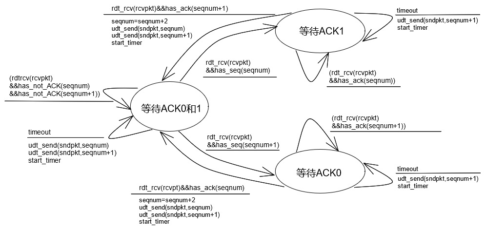
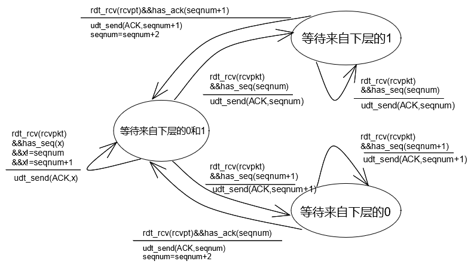
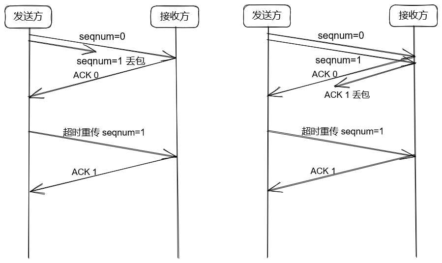
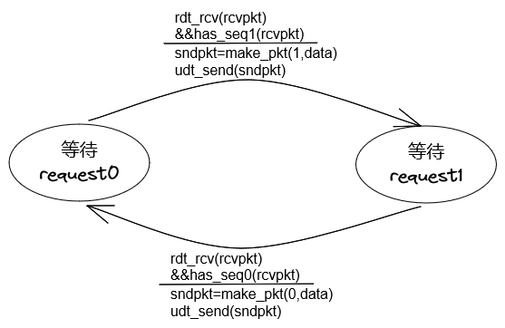
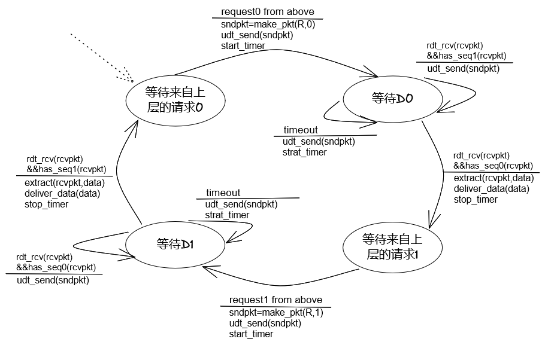

## 《计算机网络 自顶向下方法》第三次作业

10215501412 彭一珅

**P3. UDP 和TCP 使用反码来计算它们的检验和。假设你有下面3 个8 比特字节： 01010011, 01100110, 01110100 。这些8 比特字节和的反码是多少？（注意到尽管UDP 和TCP 使用16 比特的字来计算检验和，但对于这个问题，你应该考虑8 比特和。）写出所有工作过程。UDP 为什么要用该和的反码， 即为什么不直接使用该和呢？ 使用该反码方案，接收方如何检测出差错? 1 比特的差错将可能检测不出来吗? 2 比特的差错呢？**

将三个字节相加，得到 100101101 由于溢出1位，后8位取反码 11010010。

如果不使用反码而是直接使用该和，需要处理进位问题，计算比较复杂。

接收端将收到的包中的全部16比特字相加，包括检验和，如果该分组没有引入差错，那么结果应该全部是1，如果有任一位是0，那么说明传输过程中出现了差错。

1比特的差错一定能被检测出来。2比特的差错可能检测不出来，例如，如果题目中的三个字节在传输过程中变为01010010, 01100111, 01110100（前两个字节的最后一位都出现了差错）就无法检验出来。

**P11. 考虑在图3-14 中的rdt2.2 接收方，在状态"等待来自下层的O" 和状态"等待来自下层的1"中的自转换（ 即从某状态转换同自身）中生成一个新分组： sndpk = make_ pkt( ACK, 1,  checksum ) 和sndpk = make_ pkt( ACK, 0, checksum) .如果这个动作从状态"等待来自下层的1"中的自转换中删除，该协议将正确工作吗？ 评估你的答案。 在状态"等待来自下层的0"中的自转换中删除这个事件将会怎样？ ［ 提示： 在后一种情况下． 考虑如果第一个发送方到接收方的分组损坏的话， 将会发生什么情况？ ］**

第一种情况，不会影响正常工作，因为make_pkt动作在转移到状态"等待来自下层的1"时就已经生成了，可以把之前生成的包再发一遍。

第二种情况，如果是收到的第一个分组损坏了，那么此时还没有从状态1转换到0的动作发生过，必须要调用make_pkt生成一次ACK包才行。如果不给包赋值，那么可能生成随机值，导致死锁。

**P14.考虑一种仅使用否定确认的可靠数据传输协议。假定发送方只是偶尔发送数据。只用NAK 的协议是否会比使用ACK 的协议更好？为什么？ 现在我们假设发送方要发送大量的数据， 并且该端到端连接很少丢包。在第二种情况下， 只用NAK 的协议是否会比使用ACK 的协议更好？为什么？**

如果偶尔发送数据，那么只使用NAK的协议不如使用ACK的协议，因为NAK发送的条件是收到了一个序号不符的包，而由于发送方只是偶尔发送数据，可能丢包的情况需要很长时间才会被检查到，增加了网络延迟。

如果发送大量数据，端到端连接很少丢包，那么只用NAK的协议具有优势，因为大部分包不丢失的情况下，只有少量NAK需要发送，可以减小数据流量，防止网络拥塞，相反，每个正确取得的包都用ACK回答会使网络中出现很多ACK包，可能会造成网络拥塞。

**P18.在3.4.4 节我们学习的一般性SR 协议中，只要报文可用（如果报文在窗口中），发送方就会不等待确认而传输报文。假设现在我们要求一个SR 协议， 一次发出一对报文，而且只有在知道第一对报文中的两个报文都正确到达后才发送第二对报文。**
**假设该信道中可能会丢失报文，但报文不会发生损坏和失序。试为报文的单向可靠传输而设计一个差错控制协议。画出发送方和接收方的FSM 描述。描述在发送方和接收方之间两个方向发送的报文格式。如果你使用了不同于3.4 节（例如udt_send() 、start_timer ()、rdt _rcv ()等）中的任何其他过程调用，详细地阐述这些动作。举例说明（用发送方和接收方的时序踪迹图）你的协议是如何恢复报文丢失的。**

发送方：

接收方：

has_seq确定包的序列号，has_ack用于确定ACK的序列号

丢包处理：

**P21. 假定我们有两个网络实体A 和B。B有一些数据报文要通过下列规则传给A 。当A从其上层得到一个请求，就从B 获取下一个数据(D) 报文。A 必须通过A-B 信道向B 发送一个请求( R ) 报文。仅当B 收到一个R 报文后，它才会通过B-A 信道向A 发送一个数据( D ) 报文。A 应当准确地将每份D 报文的副本交付给上层。R 报文可能会在A-B 信道中丢失（但不会损坏） ； D 报文一旦发出总是能够正确交付。两个信道的时延未知且是变化的。**
**设计一个协议（给出FSM 描述），它能够综合适当的机制，以补偿会丢包的A-B 信道，并且实现在A 实体中向上层传递报文。只采用绝对必要的机制。**

B实体：

A实体：

**P22. 考虑一个GBN 协议，其发送方窗口为4, 序号范围为1024 。假设在时刻t接收方期待的下一个有序分组的序号是k。假设媒体不会对报文重新排序。回答以下问题：**
**a. 在t 时刻，发送方窗口内的报文序号可能是多少？论证你的回答。**
**b. 在t 时刻，在当前传播回发送方的所有可能报文中， ACK 字段的所有可能值是多少？论证你的回答。**
a.当ACK k-4未到达发送端时，发送方窗口内的报文序号是k-4,k-3,k-2,k-1。当ACK k-4到ACK k-1都已经传到发送端时，发送方窗口内的报文序号是k,k+1,k+2,k+3。因此序号可能是[k-4,k+3]

如果考虑超过1024的情况，则对1024取模。

b.因为接收方期待k，因此ACK k-1已被发送，因此包k-1已被发送，因为窗口大小是4，所以ACK k-5已经被接收。ACK序号可能是[k-4,k-1]

**P23.考虑GBN 协议和SR 协议， 假设序号空间的长度为k, 那么为了避免出现图3-27 中的问题，对于这两种协议中的每一种，允许的发送方窗口最大为多少？**

设序号是0,1,...,k-1,k，那么对于GBN协议，在发送方已经发送了[base,base+N-1]序号的数据包并且没有收到ACK时，如果窗口内的N个序号中有两个重复的序号，那么就会产生混淆，因此k>N.对于SR协议，在发送方已经发送了[base,base+N-1]序号的数据包并且没有收到ACK时，接收方可能已经接收到这些数据包，并已经发送过ACK，那么此时发送方的窗口是[base+N,base+2N-1]，此时如果这2N数字范围内的序号有重复就会发生混淆，因此k>2N。

窗口最大为k/2

**P26. 考虑从主机A 向主机B 传输L 字节的大文件，假设MSS 为536 字节。**
**a. 为了使得TCP 序号不至于用完， L 的最大值是多少？ 前面讲过TCP 的序号字段为4 字节。**
**b. 对于你在(a ) 中得到的L, 求出传输此文件要用多长时间？假定运输层、网络层和数据链路层首部总共为66 字节，并加在每个报文段上，然后经155Mbps 链路发送得到的分组。忽略流量控制和拥塞控制，使主机A 能够一个接一个和连续不断地发送这些报文段。**

a.TCP根据字节流编号，L最大值为$2^{(4\times 8)}=2^{32}$

b.报文数$N=2^{32}/536=8012999$

总头部长度$=N\times 66=528857934$

总字节数$=2^{32}+528857934=4.824*10^9$

传输用时=总字节数/155Mbps=249s

**P36. 在3.5.4 节中，我们看到TCP 直到收到3 个冗余ACK 才执行快速重传。你对TCP 设计者没有选择在收到对报文段的第一个冗余ACK 后就快速重传有何看法？**

假设包A B C被发送端发送，并且接收端期待接收到A。此时B到达接收端，接收端发送一个冗余ACK A，然后分组A到达接收端（即A和B到达顺序相反）。如果此时发送端收到这一个冗余ACK，就重传分组A，就会重复发送分组A，造成网络拥塞。

也就是说，1-2次冗余ACK很可能是乱序到达造成而不是丢包造成的，为了尽量少发送冗余分组，选择在3次冗余后再重传。

**P37. 比较GBN 、SR 和TCP (无延时的ACK) 。假设对所有3 个协议的超时值足够长，使得5 个连续的数据报文段及其对应的ACK 能够分别由接收主机（主机B) 和发送主机（主机A) 收到（如果在信道中无丢失） 。假设主机A 向主机B 发送5 个数据报文段，并且第二个报文段（从A 发送）丢失。最后，所有5 个数据报文段巳经被主机B 正确接收。**
**a. 主机A 总共发送了多少报文段和主机B 总共发送了多少ACK? 它们的序号是什么？对所有3 个协议回答这个问题。**
**b. 如果对所有3 个协议超时值比5RTT长得多，则哪个协议在最短的时间间隔中成功地交付所有5个数据报文段？**

a.

GBN

​	A：发送12345分组，重发2345，9个分组

​	B：发送ACK1111，收到重发的2之后发送ACK2345，8个ACK

SR

​	A：发送12345分组，重发2，6个分组

​	B：发送ACK1345，收到重发的2之后发送ACK2，5个ACK

TCP

​	A：发送12345分组，重发2，6个分组

​	B：发送ACK2222，收到重发的2之后发送ACK6，5个ACK

b.TCP协议，因为TCP协议重传的条件是快速重传，而另外两个必须等到超时才会重传。