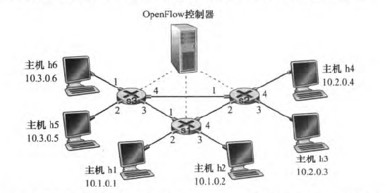

## 计算机网络自顶向下方法 第四章习题

10215501412 彭一珅

**P6.考虑使用8 比特主机地址的某数据报网络。假定一台路由器使用最长前缀匹配并具有下列转发表：**

****

**对这4 个接口中的每个，给出相应的目的主机地址的范围和在该范围中的地址数量。**

| 前缀匹配 | 接口 | 地址范围          | 地址数量 |
| -------- | ---- | ----------------- | -------- |
| 00       | 0    | 00000000~00111111 | 64       |
| 010      | 1    | 01000000~01011111 | 32       |
| 011      | 2    | 01100000~01111111 | 32       |
| 10       | 2    | 10000000~10111111 | 64       |
| 11       | 3    | 11000000~11111111 | 64       |

**P8.考虑互联3个子网（子网1 、子网2 和子网3) 的一台路由器。假定这3 个子网的所有接口要求具有前缀223.1.17/24 。还假定子网1 要求支持多达60 个接口，子网2 要求支持多达90 个接口，子网3要求支持多达12 个接口。提供3个满足这些限制的网络地址（形式为a. b. c. d/x）。**

首先确定每个子网所需的IP地址数量：

- 子网1：60个接口，需要最少6位二进制位来表示，即2^6=64个地址，减去网络地址和广播地址，剩余62个可用地址。
- 子网2：90个接口，需要最少7位二进制位来表示，即2^7=128个地址，减去网络地址和广播地址，剩余126个可用地址。
- 子网3：12个接口，需要最少4位二进制位来表示，即2^4=16个地址，减去网络地址和广播地址，剩余14个可用地址。

然后我们可以使用如下步骤来得到三个满足要求的网络地址：

1. 找到一个地址，其前缀为223.1.17/24，可以支持子网1的最大接口数62。这意味着我们需要至少6位二进制位来表示主机部分，即前缀长度为26。因此，第一个网络地址为223.1.17.0/26。
2. 找到另一个地址，其前缀为223.1.17/24，可以支持子网2的最大接口数126。这意味着我们需要至少7位二进制位来表示主机部分，即前缀长度为25。因此，第二个网络地址为223.1.17.0/25。
3. 找到第三个地址，其前缀为223.1.17/24，可以支持子网3的最大接口数14。这意味着我们需要至少4位二进制位来表示主机部分，即前缀长度为28。因此，第三个网络地址为223.1.17.0/28。

因此，三个满足要求的网络地址为：

- 223.1.17.0/26：可支持62个接口的子网
- 223.1.17.0/25：可支持126个接口的子网
- 223.1.17.0/28：可支持14个接口的子网

**P11.考虑一个具有前缀128.119.40.128/26 的子网。给出能被分配给该网络的一个IP 地址（形式为XXX. XXX. XXX. xxx ) 的例子。假定一个ISP 拥有形式为128.119.40.64/26 的地址块。假定它要从该地址块生成4 个子网，每块具有相同数量的IP 地址。这4 个子网（形式为a. b. c. d/x） 的前缀是什么？**

128.119.40.128~128.119.40.191

四个子网分别是：

128.119.40.64/28, 128.119.40.80/28, 128.119.40.96/28, 128.119.40.112/28

**P15.假定在源主机A 和目的主机B 之间的数据报被限制为1500 字节（包括首部） 。假设IP 首部为20 字节，要发送一个5 MB 的MP3 文件需要多少个数据报？解释你的答案是如何计算的。**

数据报中含有IP头和TCP头，IP头长度为20字节，TCP头长度为20字节。

需要发送的数据报数量为：5,000,000/(1500-20-20)=3425

**P17.假设你有兴趣检测NAT 后面的主机数量。你观察到在每个IP 分组上IP 层顺序地标出一个标识号。由一台主机生成的第一个IP 分组的标识号是一个随机数，后继IP 分组的标识号是顺序分配的。假设由NAT 后面主机产生的所有IP 分组都发往外部。**
**a. 基于这个观察，假定你能够俘获由NAT 向外部发送的所有分组、你能概要给出一种简单的技术来检测NAT 后面不同主机的数量吗？评估你的答案。**

如果能够俘获由NAT向外部发送的所有分组，可以通过IP分组头部标有的标识号来检测不同主机的数量。例如，如果收到的分组标识号分别为[100,301,405,101,406,102,302,303,407]，那么其中有三个连续的标识号序列分别是[100,101,102]、[301,302,303]、[405,406,407]，可以判断有三个主机。

**b. 如果标识号不是顺序分配而是随机分配的，这种技术还能正常工作吗？评估你的答案。**

如果标识号不是顺序分配而是随机分配的，这种技术就不能正常工作了，因为不会存在顺序发送的序列号了。

**P19.考虑显示在图4-30 中的SON Open Flow 网络。假定对于到达s2 的数据报的期望转发行为如下：**
**• 来自主机h5 或h6 并且发往主机h1 或h2 的任何数据报应当通过输出端口2 转发到输入端口1**
**• 来自主机h1 或h2 并且发往主机h5 或h6 的任何数据报应当通过输出端口1 转发到输入端口2** 
**• 任何在端口1 或2 到达并且发往主机h3 或h4 的数据报应当传递到特定的主机**
**• 主机h3 和h4 应当能够向彼此发送数据报**
**详述实现这种转发行为的s2 中的流表项。**

| 匹配                                                         | 动作                                                        |
| ------------------------------------------------------------ | ----------------------------------------------------------- |
| Ingress Port=1; IP Src=10.3.\*.\*; IP Dst=10.1.\*.\*         | Forward(2)                                                  |
| Ingress Port=2; IP Src=10.1.\*.\*; IP Dst=10.3.\*.\*         | Forward(1)                                                  |
| Ingress Port = 1; IP Dst = 10.2.0.3 Ingress Port = 2; IP Dst = 10.2.0.3 Ingress Port = 1; IP Dst = 10.2.0.4 Ingress Port = 2; IP Dst = 10.2.0.4 | Forward (3) Forward (3) Forward (4) Forward (4) |
| Ingress Port = 4 Ingress Port = 3                        | Forward (3) Forward (4)                                 |

**P20.再次考虑显示在图4-30 中的SDN OpenFlow 网络。假定在s2 对于来自主机h3 或h4 的数据报的期望转发行为如下：**
**• 任何来自主机h3 并且发往主机h1、h2 、h5 或h6 的数据报应当在网络中以顺时针方向转发。**
**• 任何来自主机h4 并且发往主机h1、h2 、h5 或h6 的数据报应当在网络中以逆时针方向转发。**
**详述实现这种转发行为的s2 中的流表项。**

| 匹配                                                         | 动作                      |
| ------------------------------------------------------------ | ------------------------- |
| Ingress Port = 3; IP Dst = 10.1.\*.\* Ingress Port = 3; IP Dst = 10.3.\*.\* | Forward(2) Forward(2) |
| Ingress Port = 4; IP Dst = 10.1.\*.\* Ingress Port = 4; IP Dst = 10.3.\*.\* | Forward(1) Forward(1) |