# 华东师范大学数据科学与工程学院期末项目报告

| 课程名称：计算机网络与编程 | 年级：21级 | 上机实践成绩： |
| -------------------------- | ------------------ | ------------------ |
| **指导教师**：张召         | **姓名**：彭一珅      | **学号：**10215501412 |
| **上机实践名称**：实现Web Server | **上机实践日期**：2023.6.14 |                    |
| **上机实践编号**：         | **组号**：     | **上机实践时间**： |

## 一、 **题目要求**

 **题目1.1:** 请使⽤Java语⾔开发⼀个简单的Web服务器，它能处理HTTP请求。具体⽽⾔，你的Web服务器将：
1. 当⼀个客户端（浏览器）联系时创建⼀个连接套接字
2. 从这个连接套接字接受HTTP请求
3. 解释该请求以确定所请求的特定⽂件
4. 从⽂件系统中获得请求的
5. 创建⼀个由请求的⽂件组成的HTTP响应报⽂
6. 经TCP连接向请求的浏览器返回响应。

**功能要求:**

+ 请使⽤ServerSocket和Socket进⾏代码实现；
+ 请使⽤多线程接管连接；
+ 在浏览器中输⼊localhost:8081/index.html能显示⾃⼰的学号信息（编写简单的index.html）；
+ 在浏览器中输⼊localhost:8081下其他⽆效路径，浏览器显示 404 not found；
+ 在浏览器中输⼊localhost:8081/shutdown能使服务器关闭；
+ 使⽤postman进⾏测试，测试get和post两种请求⽅法。

**题目1.2:** 在题⽬1.1的基础上实现代理服务器，让浏览器请求经过你的代理来请求Web对象。具体⽽⾔：

1. 当你的代理服务器从⼀个浏览器接收到对某个对象的HTTP请求时，它⽣成对相同对象的⼀个新的HTTP请求并向初始服务器发送；

2. 当该代理从初始服务器接收到具有该对象的HTTP相应时，它⽣成⼀个包括该对象的新的HTTP响应，并发送给该客户。

**功能要求:**

+ 请在题1.1的代码上进⾏修改，使⽤ServerSocket和Socket进⾏代码实现；
+ 请分别使⽤浏览器（可设置浏览器代理）和postman，并进⾏代理测试。

**性能测试**

使⽤JMeter进⾏压测，在保证功能完整的前提下测试每秒响应的请求数。

Bonos (optional)：分析当前能⽀持同时连接的最⼤数，使⽤学习过的NIO修改代码使服务器能同时⽀持并发的1000个连接。（注意JMeter中的集合点设置）

## 二、 **功能实现情况**

####  题目1.1 

首先，实现一个普通的服务器，可以解析HTTP请求。实现一个SimpleWebServer类，在循环中创建进程，接管客户端的连接。

```java
public class SimpleWebServer {
    private static final int PORT = 8081;
    private ServerSocket serverSocket;

    public static void main(String[] args) {
        SimpleWebServer server = new SimpleWebServer();
        server.start();
    }

    public void start() {
        try {
            serverSocket = new ServerSocket(PORT);//创建服务器套接字
            System.out.println("Server started. Listening at port " + PORT);
            while (true) {
                Socket clientSocket = serverSocket.accept();//处理客户端连接
                new Thread(new ClientHandler(clientSocket)).start();
            }
        } catch (IOException e) {
            e.printStackTrace();
        }
    }
}
```

为了处理客户端连接，定义ClientHandler类，实现Runnable接口，表示该类是可运行的，可以被放到新的线程中执行。在该类的构造函数中，会传入一个Socket对象，即当前客户端的套接字，用于之后与客户端进行通信。

在run()方法中，首先通过输入流读取从客户端发送过来的HTTP请求信息，并解析出请求方法、请求资源等相关参数。接着，判断请求方法为GET或POST时，根据请求资源的不同，返回相应的HTTP响应。

如果请求资源是/index.html，则读取本地文件index.html并返回给客户端；如果请求资源是/shutdown，则在页面中显示Server is shutting down...信息，并关闭客户端套接字和服务端程序；其他情况在页面中显示404 not found.信息。如果请求方法不是GET或POST，则返回405 Method Not Allowed信息。最后，关闭输入输出流和客户端套接字，并捕获可能出现的异常。

```java
class ClientHandler implements Runnable {
    private Socket clientSocket;

    public ClientHandler(Socket clientSocket) {
        this.clientSocket = clientSocket;
    }

    @Override
    public void run() {
        try {
          //解析客户端的请求行
            BufferedReader in = new BufferedReader(new InputStreamReader(clientSocket.getInputStream()));
            OutputStream out = clientSocket.getOutputStream();

            String requestLine = in.readLine();
            System.out.println(requestLine);

            String[] tokens = requestLine.split(" ");
            String method = tokens[0].toUpperCase();//方法名
            String resource = tokens[1];//请求的资源参数

            if (method.equals("GET")||method.equals("POST")) {
                if (resource.contains("/index.html")) {
                    File file = new File("D:/Javaprojects/networkFinal/src/index.html");
                    if (file.exists()) {
                      //文件路径正确，返回状态码200
                        out.write("HTTP/1.1 200 OK\r\n".getBytes());
                        out.write("Content-Type: text/html; charset=UTF-8\r\n".getBytes());
                        out.write("\r\n".getBytes());

                        FileInputStream fileInputStream = new FileInputStream(file);
                        byte[] buffer = new byte[1024];
                        int len;
                        while ((len = fileInputStream.read(buffer)) != -1) {
                            out.write(buffer, 0, len);
                        }
                        fileInputStream.close();
                    } else {
                      //没有找到文件路径
                        out.write("HTTP/1.1 404 Not Found\r\n".getBytes());
                        out.write("Content-Type: text/plain; charset=UTF-8\r\n".getBytes());
                        out.write("\r\n".getBytes());
                        out.write("File not found.".getBytes());
                    }
                } else if (resource.equals("/shutdown")) {
                  //关闭服务器
                    out.write("HTTP/1.1 200 OK\r\n".getBytes());
                    out.write("Content-Type: text/plain; charset=UTF-8\r\n".getBytes());
                    out.write("\r\n".getBytes());
                    out.write("Server is shutting down...".getBytes());
                    clientSocket.close();
                    System.exit(0);
                } else {//请求其他资源
                    out.write("HTTP/1.1 404 Not Found\r\n".getBytes());
                    out.write("Content-Type: text/plain; charset=UTF-8\r\n".getBytes());
                    out.write("\r\n".getBytes());
                    out.write("404 not found.".getBytes());
                }
            }
            else {//使用GET和POST以外的其他方法
                out.write("HTTP/1.1 405 Method Not Allowed\r\n".getBytes());
                out.write("Content-Type: text/plain; charset=UTF-8\r\n".getBytes());
                out.write("\r\n".getBytes());
                out.write("Method not allowed.".getBytes());
            }

            in.close();
            out.flush();
            out.close();
            clientSocket.close();

        } catch (IOException e) {
            e.printStackTrace();
        }
    }
}
```

使用postman测试得到如下结果：

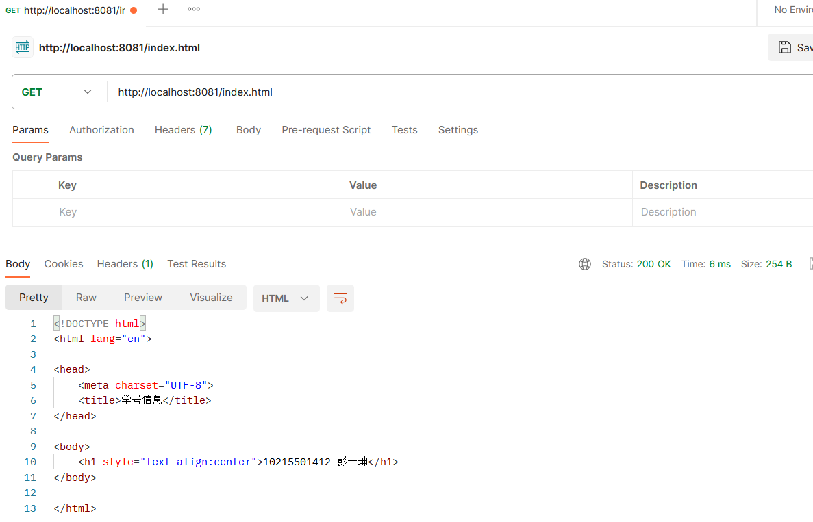

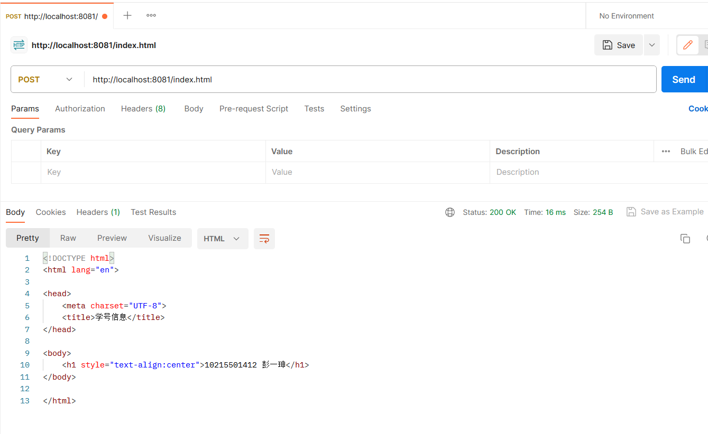

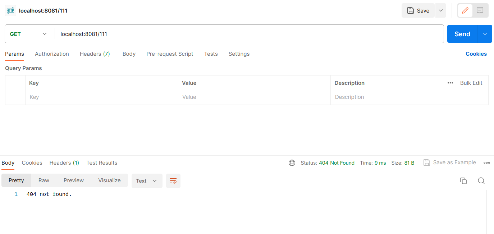

使用浏览器测试得到如下结果：

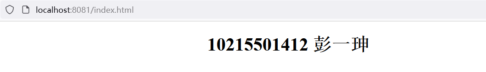

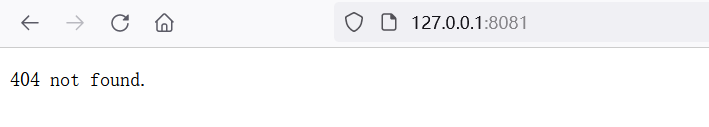

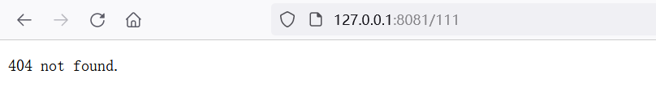

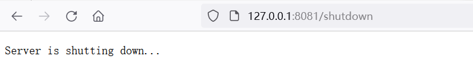

#### 题目1.2 

首先定义了一个名为`ProxyServer`的类，其中包含了一个私有常量`PORT`，表示代理服务器监听的端口号。还定义了一个私有成员变量`serverSocket`，表示服务器的套接字。

在`main`方法中，创建了一个`ProxyServer`实例`server`，并调用了其`start`方法。在`start`方法内部，通过`ServerSocket`类创建了一个服务器套接字，并将其绑定到指定的端口号上。然后通过一个无限循环来不断等待客户端连接，每当客户端连接时，就会创建一个新的线程`Thread`来处理该客户端请求，具体处理逻辑由`ProxyClientHandler`类实现。

异常处理代码`catch(IOException e)`会捕获可能抛出的`IOException`异常，并打印出错误信息。

```java
public class ProxyServer {
    private static final int PORT = 8082;
    private ServerSocket serverSocket;

    public static void main(String[] args) {
        ProxyServer server = new ProxyServer();
        server.start();
    }

    public void start() {
        try {
            serverSocket = new ServerSocket(PORT);
            System.out.println("Proxy server started. Listening at port " + PORT);
            while (true) {
                Socket clientSocket = serverSocket.accept();
                new Thread(new ProxyClientHandler(clientSocket)).start();
            }
        } catch (IOException e) {
            e.printStackTrace();
        }
    }
}
```

随后创建一个`ProxyClientHandler`类，通过 `clientSocket.getInputStream()` 获取到客户端发来的请求消息，将其封装为 `BufferedReader` 对象，以便逐行读取并进行解析。然后，通过 `clientSocket.getOutputStream()` 获取客户端的输出流，以便向客户端发送响应消息。创建一些局部变量用于记录请求的内容。

```java
public void run() {
    try {
        InputStream clientIn =clientSocket.getInputStream();
        BufferedReader in = new BufferedReader(new InputStreamReader(clientIn));
        OutputStream out = clientSocket.getOutputStream();
        StringBuilder head = new StringBuilder();
        String requestLine;
        String host = null;
        String method="";
        int len;
        int port = 80;
```

接着，在循环中逐行读取客户端发来的消息，并且检查是否包含请求头 "Host"，如果有，则提取出其中的主机名和端口号，并将其存储在变量 `host` 和 `port` 中。同时，将请求消息头存储在 `head` 变量中，直到读取到空行表示消息头结束。

```java
while ((requestLine = in.readLine()) != null) {
    head.append(requestLine).append("\r\n");
    if (requestLine.length() == 0) {
        break;
    }
    else {
        String[] temp = requestLine.split(" ");
        if (temp[0].contains("host") || temp[0].contains("Host")) {
            host = temp[1];
            if (host.contains(":")){
                String[] tmp=host.split(":");
                host=tmp[0];
                port= Integer.parseInt(tmp[1]);
            }
        }
    }
    if (requestLine.trim().isEmpty()) {
        break;
    }
}
head.append("\r\n");
try{
  method = head.substring(0, head.indexOf(" "));
}
catch(StringIndexOutOfBoundsException e){
  System.out.println("requestLine=NULL");
}
```

然后，根据请求方式判断是否需要建立与目标服务器的连接。如果是 "CONNECT" 方式，则向客户端发送握手成功的消息，此时客户端会发来新的请求，因此调用`request_handler`方法，在新线程中处理客户端和目标服务器之间的数据传输。否则，直接将收到的完整请求消息转发到目标服务器。

```java
Socket serverSocket = new Socket(host, port);
System.out.println("连接到服务器：" + serverSocket.getInetAddress() + ":" + serverSocket.getPort());
OutputStream serverOut = serverSocket.getOutputStream();
InputStream serverIn = serverSocket.getInputStream();
if (method.equals("CONNECT")) {
    out.write("HTTP/1.1 200 ConnectionEstablished\r\n\r\n".getBytes());
    out.flush();
    new request_handler(clientIn, serverOut).start();
} else {
    serverOut.write(head.toString().getBytes());
}
```

最后，从目标服务器读取响应消息，并将其写入客户端的输出流中。在整个过程结束后，关闭相关的流和套接字。

```java
byte[] returnBuffer = new byte[102400];
while ((len = serverIn.read(returnBuffer)) != -1) {
    out.write(returnBuffer, 0, len);
}
in.close();
out.flush();
out.close();
serverIn.close();
serverOut.flush();
serverOut.close();
serverSocket.close();
clientSocket.close();
```

然后测试代理服务器的功能。首先开启postman的代理服务，转接实现的web服务器，端口号是8082：

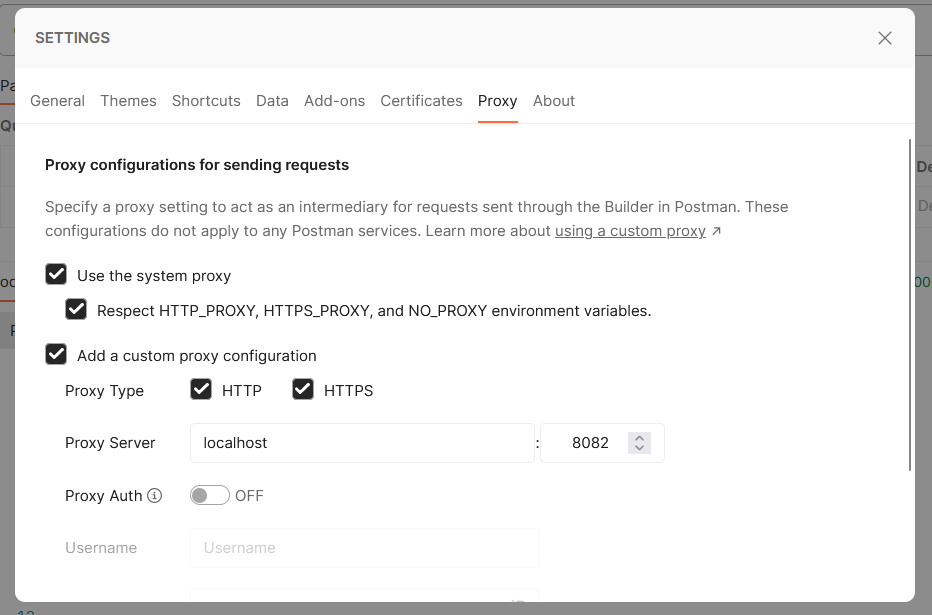

然后打开SimpleWebServer和ProxyServer，对地址index.html进行访问：

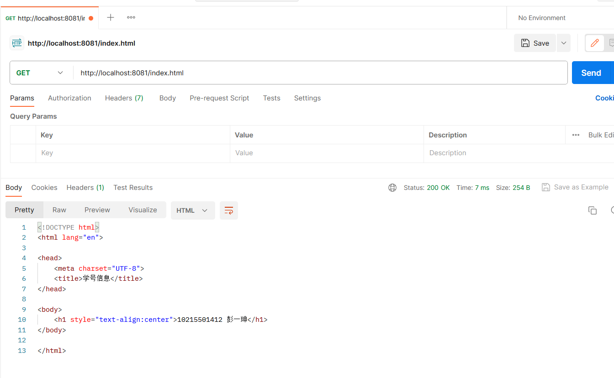

访问题目给出的网址：

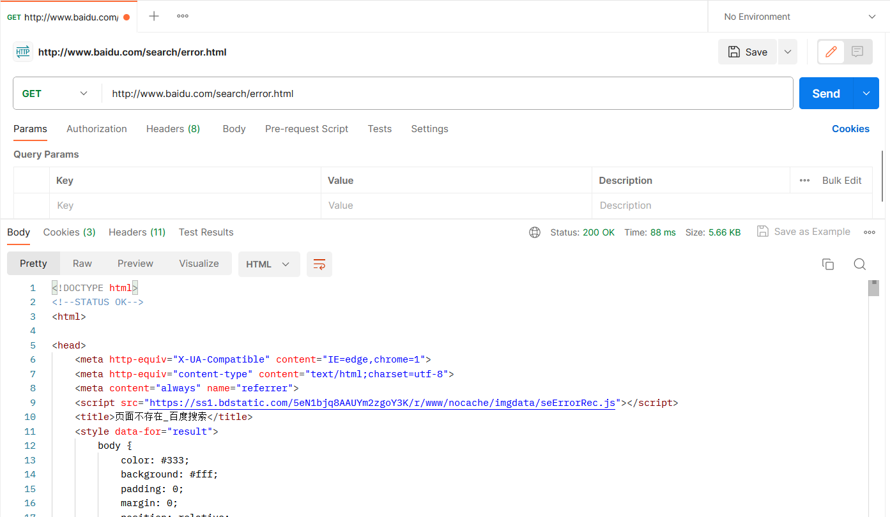

然后设置系统代理进行测试：

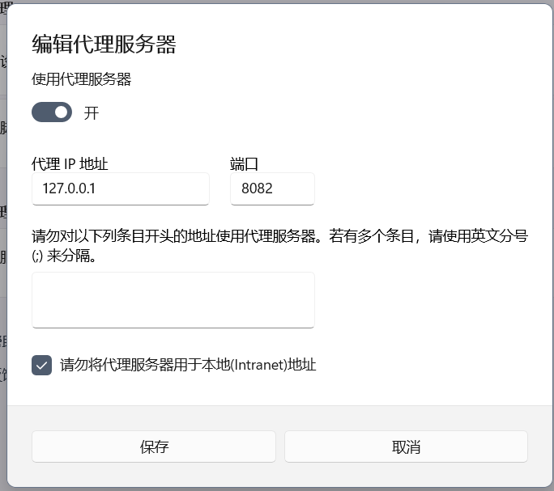

连接代理服务器后，可以正常访问所有网站，

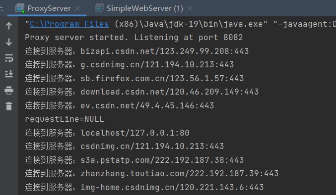

## 三、 **性能测试情况**

首先，设置参数为Number of Threads (users)=1000, Ramp-up period=10，访问localhost:8081，得到如下运行结果，可见错误率为0.00%，吞吐率是100.1/sec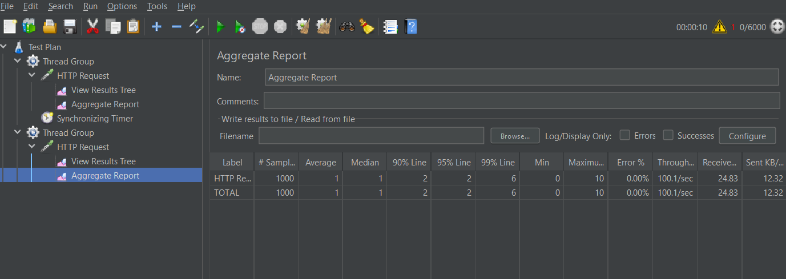

## 四、 **总结**

 本次实验旨在通过使用Java语言开发一个简单的Web服务器和代理服务器，来实现处理HTTP请求并进行响应的功能。

在实现过程中，我按照题目要求使用了Socket来处理连接，并通过解析HTTP请求的方式来确定所请求的特定文件。我进一步熟悉了HTTP请求和响应的报文格式，练习了输入输出流读写的编程方式，对java网络编程有了更深刻的理解。

在实现代理服务器部分，我利用了与Web服务器相似的技术来实现代理服务器。当代理服务器接收到客户端请求时，它首先解析请求的头信息，获取到初始服务器的ip地址和端口号，然后使用Socket连接这个服务器。代理服务器需要生成一个相同对象的新的HTTP请求并发送给初始服务器。然后代理服务器再将从初始服务器接收到的HTTP响应返回给客户端。通过这种方式，我实现了代理服务器与Web服务器之间的连接和数据交换，进一步深入了解了代理服务器的工作原理。另外，由于HTTPS协议需要先建立CONNECTION再发送请求，因此代理服务器建立好连接后，要给客户端发送回连接建立成功的回复报文，然后重新接收GET或POST等请求才行。

总之，本次实验不仅让我更加深入地了解了Web服务器和代理服务器的实现原理和工作方式，同时也帮助我提升了Java编程和性能优化的技能，对计算机网络的学习有了更加深入的探索。