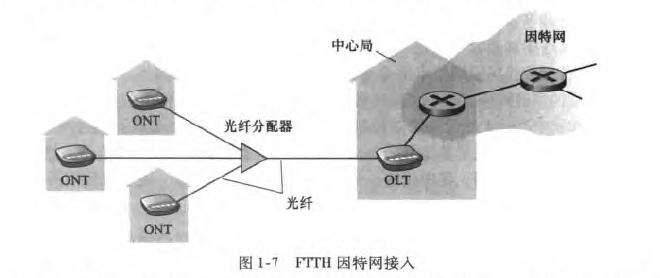

## 计算机网络：自顶向下方法

### 一、计算机网络和因特网

与因特网相连的设备称作**主机**或**端系统**

端系统通过**通信链路**和**分组交换机**连接到一起

**通信链路**的物理媒体：同轴电缆，铜线，光纤，无线电频谱

**通信链路**的传输速率：比特/秒

**分组**：发送端将数据分段，并为每段加上首部字节，形成的信息包叫做分组

**分组交换机**：路由器（网络核心）、链路层交换机（接入网）

端系统通过**因特网服务提供商（ISP）**接入因特网

ISP自身：一个由多台分组交换机和多段通信链路组成的网络

ISP的网络接入类型：线缆调制解调器/DSL住宅宽带接入、高速局域网接入、移动无线接入

*为端系统提供接入的ISP也必须互联*

与因特网相连的端系统提供了**套接字接口**

**协议**：通信实体之间交换报文格式和顺序，报文发送和接收时采取的动作

**端系统**：桌面计算机、服务器、移动计算机

**接入网**：将端系统物理连接到边缘路由器（端系统到任何远程端系统路径上的第一台路由器）的网络

1. 家庭接入

   1. 数字用户线（DSL）

      ISP：提供本地电话接入的本地电话公司

      调制解调器：现有的电话线（双绞铜线）与电话公司交换数据

      分频，3根，电话和因特网共享DSL链路

   2. 电缆

      ISP：有线电视公司

      光缆将电缆头连接到地区枢纽，使用同轴电缆连到各家各户和公寓：**混合光纤同轴技术（HFC）**

      电缆调制解调器，下行高于上行

   3. 光纤（FTTH）

      直接光纤——从中心局出来的每根光纤实际上由许多家庭共享，直到接近那些家庭的位置，才分成每户一根光纤

      AON主动光纤网络、PON被动光纤网络

      

   4. 卫星链路

   5. 拨号

2. 企业（和家庭）接入（局域网技术）

   1. 以太网

      用户使用双绞铜线与以太网交换机相连

   2. WiFi（无线LAN）

3. 广域无线接入

   1. 3G
   2. LTE

---

物理媒介：

1. 双绞铜线

   电话

   速率低，便宜

2. 同轴电缆

   两个同心铜导体

3. 光纤

   光脉冲，每个脉冲一个比特

4. 陆地无线电信道

5. 卫星无线电信道

---

通过网络链路和交换机移动数据的两种基本方法：**分组交换**、**电路交换**

1. 分组交换

   1. 存储转发传输

      指**在交换机能够开始向输出链路传输该分组的第一个比特之前，必须接收到整个分组**

      2L/R L比特，R传输速度

   2. 排队时延和分组丢失

      **输出缓存（队列）**中等待，排队时延。如果队列太长，就丢包

   3. 转发表和路由选择协议

      通过分组信息获得目的端IP地址；IP地址索引转发表，确定输出链路

2. 电路交换

   预留缓存、链路传输速率。

   沿着发送方和接收方之间路径上的交换机都为该连接维护连接状态，形成一条电路

   1. 电路交换网络中的复用

      频分复用FDM

      时分复用TDM

   2. 分组交换与电路交换的对比

      分组交换提供了带宽共享，实现成本低

      分组交换传输速率与网络的使用情况有关

      电路交换保证了端到端传输速率

      电路交换存在静默期，建立连接复杂

---

**时延**

1. 处理时延

   解析分组信息，映射转发表

2. 排队时延

   前面有分组正在传输，在缓冲队列里等待。流量强度的函数。

   流量强度=分组到达的速度/传输速率R ，<1

   L比特一分组，a分组每秒，因此La比特每秒，

3. 传输时延

   将所有比特从路由器推向链路的时间。分组长度和链路传输速率的函数

   L/R

4. 传播时延

   比特从链路起点传输到链路终点所用的时间。两台路由器间距离的函数

**吞吐量**

接收数据的速度与发送数据的速度中，较小的一个

服务器和客户端之间，传输速率最小的链路（瓶颈链路）。干扰流量

**协议栈**

应用层：分布在多个端系统，分组称为报文

传输层：在应用程序端点之间传递报文，分组称为报文段

网络层：将分组从一台主机移动到另一台主机，分组称为数据报

链路层：帧

物理层：帧中的比特

### 三、传输层

传输层协议在端系统中实现，为不同端系统的应用进程提供逻辑通信功能

网络层：主机之间

传输层：端系统定位到进程，将主机间交付服务扩展到进程，多路分解复用

UDP 数据交付、差错检查

TCP 序号、确认、定时器、流量控制

**多路复用**：从同一台主机的不同套接字接收数据

**多路分解**：向同一台主机不同套接字传输数据

每个套接字ID为端口号。0-65535

无连接：

套接字是二元组（目的IP，目的端口号）

面向连接：

一个套接字关联一个应用进程，一个应用进程关联多个套接字。四元组（源IP地址，源端口号，目的IP地址，目的端口号）